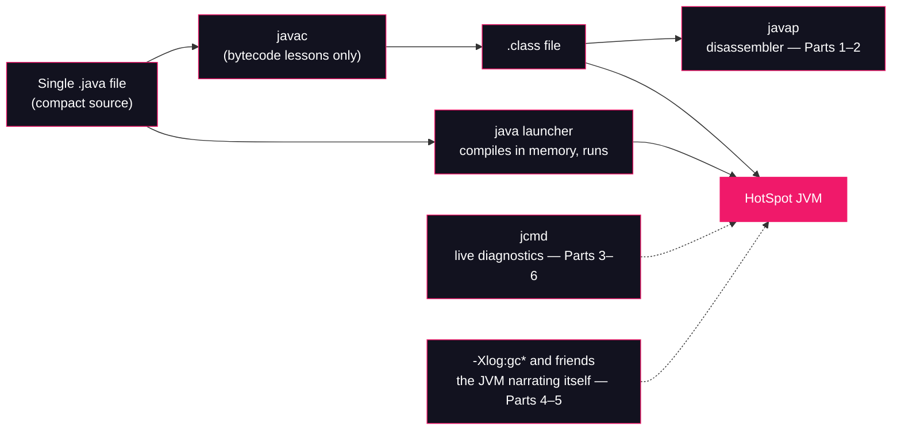

# Lesson 00: Setup & Toolchain

## What you'll learn

- How to verify your JDK 25 install, and how to read what `java -version` tells you
- The three instruments this whole course is built on: `javap`, `jcmd` and the `-Xlog` flags
- How every sample in the course runs: one file, one command
- The convention this course uses for JVM flags: explained at first use, referenced afterwards

---

## Why this matters

This course is *run, don't read*. We disassemble class files, watch the JIT compile hot methods, fill the heap on purpose and interrogate a live JVM while it struggles. All of that happens with tools that ship inside the JDK you already have. No Maven, no IDE, no third-party installs — but only if the toolchain actually works on your machine. This lesson proves it does, and puts names on the instruments you'll see in all 33 lessons.

It is the sequel to [Java Concurrency & Multithreading](https://github.com/Dancan254/concurreny-multithreading). You are assumed to be comfortable with everything in it — including running single-file Java 25 samples, which its [Lesson 00](https://github.com/Dancan254/concurreny-multithreading) covers in detail. We recap the one command here and then move on to the new tools.

---

## The concept

### The one assumption: OpenJDK / HotSpot

> **Everything in this course assumes an OpenJDK build of JDK 25 running the HotSpot JVM.** The examples were captured on an Azul Zulu 25.28 build; Temurin, Oracle, Corretto and other OpenJDK builds of JDK 25 behave the same way, with at most cosmetic differences in version strings.

Why the assumption? The Java Virtual Machine is a **specification** (the JVMS) with several implementations: HotSpot is the one OpenJDK ships and the one nearly every production JVM runs, but OpenJ9, GraalVM and others exist. Much of this course — class file format, bytecode, classloading, the runtime data areas — is spec-mandated and identical everywhere. Much of the rest — JIT compilation logs, GC log lines, `jcmd` commands, safepoint behaviour — is HotSpot *implementation detail*, and it is exactly the detail this course is about. If you run the samples on a non-HotSpot JVM, the spec-level lessons still hold; the HotSpot-level lessons will not reproduce.

### The toolchain map



| Tool | What it is | Where this course uses it |
|---|---|---|
| `java -version` | Install check and identity card of your JVM | This lesson |
| `java File.java` | Single-file source launcher: compiles in memory, runs | Every lesson |
| `javap` | Class-file disassembler: constant pool, bytecode, flags | Parts 1–2, constantly |
| `jcmd` | Diagnostic command tool for a *running* JVM | Parts 3–6, especially Lesson 29 |
| `-Xlog:gc` flags | Unified logging: the JVM reporting on itself | Part 5, starting with `-Xlog:gc` here |

---

## Hands-on

### 1. Check the JDK

```bash
java -version
```

Captured on the machine this course was written on:

```
openjdk version "25" 2025-09-16 LTS
OpenJDK Runtime Environment Zulu25.28+85-CA (build 25+36-LTS)
OpenJDK 64-Bit Server VM Zulu25.28+85-CA (build 25+36-LTS, mixed mode, sharing)
```

| Line | What it tells you |
|---|---|
| `openjdk version "25"` | The Java spec version. You need **25**. |
| `OpenJDK Runtime Environment Zulu25.28+85-CA` | Which OpenJDK **distribution** this is (Zulu here; yours may say Temurin, Oracle, Corretto). |
| `OpenJDK 64-Bit Server VM ...` | The VM implementation — this is **HotSpot** in server mode. This line is the course's one assumption, confirmed. |
| `mixed mode, sharing` | Interpreted + JIT-compiled execution (`mixed mode`), with a Class Data Sharing archive loaded (`sharing`). Part 4 explains the first; Lesson 28 touches the second. |

**Now run it on your machine and write your three lines down.** Your distribution and build numbers will differ; that's fine and expected. What must match is `25` and `OpenJDK 64-Bit Server VM`. If `java -version` shows 24 or lower, install any OpenJDK 25 build — [SDKMAN!](https://sdkman.io) (`sdk install java 25-zulu`) is the easy route on Linux and macOS.

### 2. Run the first sample

Every sample in this course is one self-contained Java 25 compact source file (JEP 512: no `class` declaration, instance `void main()`, `IO.println` from `java.lang`, automatic `java.base` imports). Create `HelloJvm.java`:

```java
void main() {
    IO.println("Hello, JVM internals!");
    IO.println("JVM:     " + System.getProperty("java.vm.name"));
    IO.println("Version: " + System.getProperty("java.version"));
    IO.println("Vendor:  " + System.getProperty("java.vendor"));
}
```

Run it:

```bash
java HelloJvm.java
```

```
Hello, JVM internals!
JVM:     OpenJDK 64-Bit Server VM
Version: 25
Vendor:  Azul Systems, Inc.
```

Your vendor line will differ unless you're also on Zulu. Notice that `java.vm.name` reports the same HotSpot server VM from *inside* the program that `java -version` reported from the outside — the assumption from the previous section, confirmed programmatically. If you ever need to assert it in code, that's the property to check.

### 3. Look inside a class file with `javap`

**`javap`** is the JDK's class-file disassembler. Given a compiled class, it shows you what's actually inside: the methods, the bytecode instructions, and (with `-v`) the constant pool and metadata. Part 1 lives in `javap` output — reading it fluently is the first big skill this course builds. Check that it's there:

```bash
javap -version
```

```
25
```

The source launcher runs programs without leaving a `.class` file behind, so for this one demo we compile explicitly with `javac` (the compiler — used in Parts 1–2 wherever we need a class file to dissect):

```bash
javac HelloJvm.java
javap -c HelloJvm
```

`javap -c` prints the **bytecode** of every method:

```
Compiled from "HelloJvm.java"
final class HelloJvm {
  HelloJvm();
    Code:
         0: aload_0
         1: invokespecial #1                  // Method java/lang/Object."<init>":()V
         4: return

  void main();
    Code:
         0: ldc           #7                  // String Hello, JVM internals!
         2: invokestatic  #9                  // Method java/lang/IO.println:(Ljava/lang/Object;)V
         5: ldc           #15                 // String java.vm.name
         7: invokestatic  #17                 // Method java/lang/System.getProperty:(Ljava/lang/String;)Ljava/lang/String;
        10: invokedynamic #23,  0             // InvokeDynamic #0:makeConcatWithConstants:(Ljava/lang/String;)Ljava/lang/String;
        15: invokestatic  #9                  // Method java/lang/IO.println:(Ljava/lang/Object;)V
        18: ldc           #26                 // String java.version
        20: invokestatic  #17                 // Method java/lang/System.getProperty:(Ljava/lang/String;)Ljava/lang/String;
        23: invokedynamic #28,  0             // InvokeDynamic #1:makeConcatWithConstants:(Ljava/lang/String;)Ljava/lang/String;
        28: invokestatic  #9                  // Method java/lang/IO.println:(Ljava/lang/Object;)V
        31: ldc           #29                 // String java.vendor
        33: invokestatic  #17                 // Method java/lang/System.getProperty:(Ljava/lang/String;)Ljava/lang/String;
        36: invokedynamic #31,  0             // InvokeDynamic #2:makeConcatWithConstants:(Ljava/lang/String;)Ljava/lang/String;
        41: invokestatic  #9                  // Method java/lang/IO.println:(Ljava/lang/Object;)V
        44: return
}
```

(Constant-pool indexes like `#7` and `#23` may differ slightly on your build.) Three things to notice now, all of which get their own lesson:

- Your "classless" file became `final class HelloJvm` with a generated constructor — compact source is sugar, the class file is real. (Lesson 02.)
- `"Hello" + property` concatenation compiled to `invokedynamic` calling `makeConcatWithConstants`, not to a `StringBuilder` chain. (Lesson 05.)
- Every `IO.println` is an `invokestatic` against a constant-pool entry. (Lessons 03–04.)

You don't need to understand a single opcode yet. You just proved your disassembler works.

### 4. Interrogate a running JVM with `jcmd`

**`jcmd`** is the diagnostic socket into a *live* JVM. Where `javap` reads dead class files, `jcmd` talks to a running process: thread dumps, heap dumps, class histograms, GC on demand, JFR recordings, VM flags — all through one tool. Parts 3–6 use it constantly, and Lesson 29 is a full deep dive. Create `Sleeper.java`:

```java
void main() throws InterruptedException {
    IO.println("Sleeping for 60 seconds. Inspect me with jcmd.");
    Thread.sleep(60_000);
}
```

Run it in one terminal — it will sit there for a minute:

```bash
java Sleeper.java
```

In a second terminal, list the JVMs on the machine:

```bash
jcmd -l
```

```
72804 jdk.jcmd/sun.tools.jcmd.JCmd -l
72751 jdk.compiler/com.sun.tools.javac.launcher.SourceLauncher Sleeper.java
```

PIDs and entry order vary, and `jcmd` always lists **itself** (here, the first line). The second line is your program. Note its name: a single-file run goes through the **source launcher** (`SourceLauncher`), which is why the process isn't called `Sleeper`. Now ask that JVM to identify itself:

```bash
jcmd 72751 VM.version
```

```
72751:
OpenJDK 64-Bit Server VM version 25+36-LTS
JDK 25.0.0
```

(Use your own PID from `jcmd -l` — `72751` was this machine's.) Same VM, third confirmation: `java -version` from outside, `java.vm.name` from inside, `jcmd ... VM.version` from the diagnostic interface. And here is everything else you could have asked:

```bash
jcmd 72751 help
```

```
72751:
The following commands are available:
Compiler.CodeHeap_Analytics
Compiler.codecache
Compiler.codelist
Compiler.directives_add
Compiler.directives_clear
Compiler.directives_print
Compiler.directives_remove
Compiler.memory
Compiler.perfmap
Compiler.queue
GC.class_histogram
GC.finalizer_info
GC.heap_dump
GC.heap_info
GC.run
GC.run_finalization
JFR.check
JFR.configure
JFR.dump
JFR.start
JFR.stop
JFR.view
JVMTI.agent_load
JVMTI.data_dump
ManagementAgent.start
ManagementAgent.start_local
ManagementAgent.status
ManagementAgent.stop
System.dump_map
System.map
System.native_heap_info
System.trim_native_heap
Thread.dump_to_file
Thread.print
Thread.vthread_pollers
Thread.vthread_scheduler
VM.cds
VM.class_hierarchy
VM.classes
VM.classloader_stats
VM.classloaders
VM.command_line
VM.dynlibs
VM.events
VM.flags
VM.info
VM.log
VM.metaspace
VM.native_memory
VM.set_flag
VM.stringtable
VM.symboltable
VM.system_properties
VM.systemdictionary
VM.uptime
VM.version
help

For more information about a specific command use 'help <command>'.
```

That list is a map of the back half of this course: `Compiler.*` is Part 4, `GC.*` is Part 5, `JFR.*` is Lesson 28, `VM.metaspace` / `VM.native_memory` are Part 3, `VM.classloaders` is Part 2. You already know `Thread.print` from the concurrency course. Nothing here is magic you have to install — it's one binary, already on your `PATH`.

### 5. Make the JVM narrate itself: `-Xlog:gc`

The last instrument is not a binary but a flag family. Since JDK 9, the JVM has a **unified logging framework**: one flag, `-Xlog`, selects which subsystems log, at what level, and where. The selection syntax is `-Xlog:<tags>` — for example `-Xlog:gc` selects every log line tagged `gc`, and `-Xlog:gc*` selects lines tagged `gc` *in any combination* (`gc,init`, `gc,heap`, ...). Run the allocator with GC logging on. Create `Allocations.java`:

```java
void main() {
    for (int i = 0; i < 1_000_000; i++) {
        byte[] garbage = new byte[1024];
    }
    IO.println("done allocating 1 GB of short-lived garbage");
}
```

```bash
java -Xlog:gc Allocations.java
```

```
[0.005s][info][gc] Using G1
[2.272s][info][gc] GC(0) Pause Young (Normal) (G1 Evacuation Pause) 49M->3M(632M) 10.091ms
done allocating 1 GB of short-lived garbage
```

Timestamps, sizes and the number of collections vary by machine and run — that's the point, you're watching a live system. Reading the GC line: uptime `[2.272s]`, level `info`, tag `gc`, collection number `GC(0)`, a **young-generation pause** by **G1** (the default collector), heap went `49M->3M` out of `632M` committed, and the pause took ~10 ms. Part 5 (Lessons 23–27) teaches you to read every word of lines like this for G1 and ZGC; Lesson 24 uses the wider `-Xlog:gc*` form. For now, the takeaway is: the JVM will tell you what it's doing, in detail, for the price of one flag.

### The flag convention

You'll meet dozens of JVM flags in this course. The convention everywhere, starting now:

> **A flag is fully explained at its first use, and only referenced afterwards.** When Lesson 24 says "run it with `-Xlog:gc*`," it won't re-explain unified logging — this section did that.

If you jump into the course mid-way and a flag looks unfamiliar, search the earlier lessons; its first mention carries the full explanation.

---

## Try it yourself

1. Run `java -version` and write down your spec version, distribution and VM line. Compare with the Zulu build shown above — which parts differ, and does any difference break the HotSpot assumption?
2. Run `jcmd <pid> GC.class_histogram` against your running `Sleeper` (use `jcmd <pid> help GC.class_histogram` first to see its options). What are the three most common classes by instance count? Part 3 explains what you're looking at.
3. Run `Allocations` with `-Xlog:gc*` instead of `-Xlog:gc`. What extra tags appear, and why does the `*` form produce so much more?
4. Send the GC log to a file: `java -Xlog:gc:file=gc.log Allocations.java`. Where did the console output go? When would you want this in production?
5. Delete `HelloJvm.class`, run `java HelloJvm.java` again, and check the directory: no `.class` file appears. Where do you think the compiled bytecode lives during a source-launcher run? (Lesson 02 answers this properly.)

---

## Common mistakes

- **Running on JDK 24 or earlier.** Compact source files (`void main()`, `IO.println`) became final in 25; older compilers reject them with errors like `class, interface, enum, or record expected`. Check `java -version` first — every sample assumes it.
- **Copying flags from old blog posts.** Pre-JDK-9 GC flags are dead or deprecated. `-XX:+PrintGCDetails` on JDK 25 prints `-XX:+PrintGCDetails is deprecated. Will use -Xlog:gc* instead.` and `-XX:+PrintGCTimeStamps` no longer exists at all. If a post uses them, it's describing a different era; translate to `-Xlog`.
- **Feeding `javap` a source file.** `javap` takes a *class name*, not a path: `javap HelloJvm.java` fails with `Error: class not found: HelloJvm.java`. Compile first (`javac`), then disassemble (`javap -c HelloJvm`).
- **Thinking `jcmd` didn't find your program.** `jcmd -l` always lists the `jcmd` process itself, and single-file runs appear as `SourceLauncher File.java`, not as your class name. Look for the file name, not the class name.

---

## Check your understanding

**1. This course pins itself to OpenJDK/HotSpot, yet the JVM is a specification with several implementations. Which parts of the course would still be accurate on a non-HotSpot JVM, and which would not?**

<details>
<summary>Reveal answer</summary>

Spec-mandated parts survive: class file format, bytecode semantics, classloading delegation, runtime data areas (Parts 1–2 and the map of Part 3). Implementation details don't: JIT log formats, GC log lines and algorithms, `jcmd` command names, safepoint mechanics (Parts 4–6). Those describe HotSpot specifically.

</details>

**2. `java HelloJvm.java` runs your program but leaves no `.class` file. `javac HelloJvm.java && java HelloJvm` also runs it. Why does this course use the first form everywhere except the bytecode lessons?**

<details>
<summary>Reveal answer</summary>

The source launcher keeps the edit-run loop at one command and one file, which is what a run-don't-read course needs. The bytecode lessons (Part 1) compile explicitly with `javac` because their subject *is* the `.class` file — they need it on disk to feed to `javap` and to read its structure.

</details>

**3. In the `javap -c` output of `HelloJvm`, string concatenation compiled to `invokedynamic ... makeConcatWithConstants` rather than a chain of `StringBuilder.append` calls. Why might the JVM prefer delegating concatenation to a runtime-generated method?**

<details>
<summary>Reveal answer</summary>

Because the *strategy* is chosen at runtime, once, by a bootstrap method — and can improve in future JDKs without recompiling your code. The bytecode just says "concatenate these"; how (array sizing, direct byte writes, compact-string encoding) is decided when the call site first runs. Lesson 05 takes this apart fully.

</details>

**4. `jcmd -l` on your machine shows two entries while only one Java program is running. What is the other one?**

<details>
<summary>Reveal answer</summary>

`jcmd` itself — it's a Java program, so it appears in its own listing as `jdk.jcmd/sun.tools.jcmd.JCmd`. Any other Java processes on the machine (IDEs, build daemons) show up too, which is why you match on the file/class name, not on "the only entry".

</details>

**5. What does `-Xlog:gc` select, and what does the `*` add in `-Xlog:gc*`?**

<details>
<summary>Reveal answer</summary>

`-Xlog:gc` selects log lines whose tag set is exactly `gc`. `-Xlog:gc*` selects lines tagged `gc` in any combination — `gc,init`, `gc,heap`, `gc,metaspace` and so on — which is the verbose form Lesson 24 uses to watch generations, regions and promotion in detail.

</details>

---

## Recap

- One assumption for the whole course: **OpenJDK build of JDK 25, HotSpot VM**. Verify with `java -version`; confirm from inside with `java.vm.name`.
- Every sample runs as `java File.java` — compact source, no build tool. Bytecode lessons use `javac` because they need the `.class` file.
- `javap` disassembles class files (Parts 1–2). `jcmd` interrogates a running JVM (Parts 3–6). `-Xlog` makes the JVM narrate itself (Parts 4–5).
- Flags are **explained at first use, referenced afterwards** — `-Xlog:gc` was this lesson's.
- `jcmd -l` includes `jcmd` itself; single-file runs appear as `SourceLauncher`.

**Next: [Lesson 01, JVM, JRE, JDK & the big picture](01-jvm-jre-jdk.md)**
