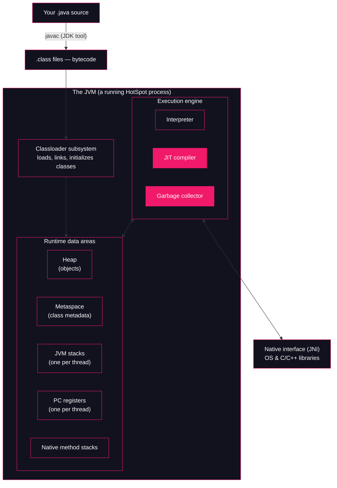

# Lesson 01: JVM, JRE, JDK & the Big Picture

## What you'll learn

- The difference between the **JVM**, the **JRE** and the **JDK**, and which one you actually installed
- Why "the JVM" is a *specification*, and what HotSpot has to do with it
- The architecture map of the JVM — classloader subsystem, runtime data areas, execution engine — that every later lesson hangs off
- How to make the JVM show you its own configuration and its classloading in real time

---

## Why this matters

Read these production error messages:

```
java.lang.OutOfMemoryError: Metaspace
java.lang.StackOverflowError
java.lang.NoClassDefFoundError: com/acme/PaymentService
"the app is slow for the first two minutes, then fine"
```

Each one names a *part of the machine*. `Metaspace` is a runtime data area. `StackOverflowError` is a per-thread stack running out of room. `NoClassDefFoundError` is the classloader subsystem failing to find bytes it found earlier. "Slow, then fine" is the execution engine's JIT compiler warming up. If you don't have the map, these messages are noise. If you have the map, each one tells you exactly where to look — and which part of this course explains it.

There is also a more mundane confusion that bites teams regularly: deploying an image that can *run* Java but not *diagnose* it, or mixing up "Java 25" with "class file version 69". Ten minutes on the big picture saves you from all of that.

---

## The concept

### JVM, JRE, JDK

The three terms are nested boxes:

| Term | What it is | Contains |
|---|---|---|
| **JVM** (Java Virtual Machine) | The engine that executes bytecode | The machine this course is about |
| **JRE** (Java Runtime Environment) | Everything needed to *run* a Java program | JVM + the standard class library (`java.base` and friends) |
| **JDK** (Java Development Kit) | Everything needed to *develop* Java programs | JRE + tools: `javac`, `javap`, `jcmd`, `jfr`, `jlink`, ... |

You installed a JDK in [lesson 00](00-setup-and-toolchain.md). When you ran `java -version`, the `java` launcher started a JVM, which used the class library from the same installation. When you run `javap` or `jcmd` in later lessons, you are using the tools that only the JDK ships.

One historical note: before JDK 9 you could download a standalone JRE. Since modules arrived in JDK 9 there is no separate JRE distribution — instead you build a *custom runtime image* with `jlink`, containing exactly the modules your application needs. That is why modern container images either carry a full JDK or a `jlink`-produced runtime.

### Spec vs implementation: what "the JVM" actually is

Here is the subtle part. **The JVM is a specification, not a program.** The [Java Virtual Machine Specification](https://docs.oracle.com/javase/specs/jvms/se25/html/) defines what a JVM must do: the `.class` file format, the bytecode instruction set, the runtime data areas, the initialization rules. Anyone can write a program that fulfils it.

**HotSpot** is the implementation you are almost certainly running. It is the JVM inside OpenJDK, written mostly in C++, and its name comes from its signature trick: detect the "hot spots" in running code and compile them to native machine code on the fly (Part 4 of this course). When `java -version` prints `OpenJDK 64-Bit Server VM`, that *is* HotSpot.

Other implementations exist and run real workloads. **Eclipse OpenJ9** (originally IBM's J9) is the best known — a completely independent codebase that passes the same specification's test suites. GraalVM is another, with an ahead-of-time compiler alongside. They all agree on what the spec pins down, and they differ wildly on everything the spec leaves open: GC algorithms, JIT strategy, internal flags.

This distinction is not trivia, and it has a practical consequence you will use from the next section onward: **flags starting with `-X` and `-XX:` are not part of the specification.** They are HotSpot-specific knobs, not guaranteed to exist or behave identically on OpenJ9 or on a future JDK. The spec guarantees behaviour; `-X` flags are one implementation's dials.

You can see all three layers — spec, implementation, vendor build — in one command, which is exactly what the first hands-on demo does.

### The map

This is the diagram the whole course references. Lessons 02–31 will say "the map from lesson 01" and mean this:



One sentence per subsystem, and where this course dissects it:

| Subsystem | What it does | Covered in |
|---|---|---|
| **Classloader subsystem** | Finds `.class` bytes, verifies them, links them and initializes the classes the program uses | **Part 2** (lessons 07–11), fed by the bytecode you learn to read in **Part 1** (lessons 02–06) |
| **Runtime data areas** | The memory the JVM carves out: the shared heap and Metaspace, plus per-thread stacks and PC registers | **Part 3** (lessons 12–17) |
| **Execution engine** | Actually runs the bytecode: interprets it first, JIT-compiles hot code to native, and reclaims dead objects with the garbage collector | **Part 4** (interpreter + JIT, lessons 18–22) and **Part 5** (GC, lessons 23–27) |
| **Native interface** | The bridge out to C/C++ libraries and the operating system | Touched in lessons 17 and 31; not a part of its own |

Part 6 (lessons 28–32) is the observability layer: JFR, `jcmd` and agents are how you watch every box on this map in a live process.

Notice the per-thread areas on the map. From the [concurrency course](https://github.com/Dancan254/concurreny-multithreading) you know threads as an API; here you can see what a thread *is* to the JVM: a private stack and a private PC register, sharing one heap with every other thread. That sharing is precisely why races exist, and why the heap gets four lessons here.

---

## Hands-on

### 1. The JVM surfacing its own configuration

The JVM knows exactly what it is, where it lives, and which build produced it. Ask it:

```bash
java -XshowSettings:properties -version 2>&1 | head -30
```

Flag by flag (first use, so full explanation):

- `-XshowSettings:properties` — a HotSpot-specific `-X` flag (see "Spec vs implementation" above; `-X` marks non-standard, implementation-specific options). It prints the JVM's *system properties* at startup: the configuration surface `System.getProperty()` reads from.
- `-version` — print version information and exit without running a program.
- `2>&1 | head -30` — `java` writes settings and version output to **stderr**, so redirect stderr into stdout (`2>&1`) before piping, then keep the first 30 lines.

Real output on the course machine (Azul Zulu 25.28, Linux — your vendor, paths and values will differ):

```
Property settings:
    file.encoding = UTF-8
    file.separator = /
    java.class.path = 
    java.class.version = 69.0
    java.home = /home/champez/.sdkman/candidates/java/25-zulu
    java.io.tmpdir = /tmp
    java.library.path = /usr/java/packages/lib
        /usr/lib64
        /lib64
        /lib
        /usr/lib
    java.runtime.name = OpenJDK Runtime Environment
    java.runtime.version = 25+36-LTS
    java.specification.name = Java Platform API Specification
    java.specification.vendor = Oracle Corporation
    java.specification.version = 25
    java.vendor = Azul Systems, Inc.
    java.vendor.url = http://www.azul.com/
    java.vendor.url.bug = http://www.azul.com/support/
    java.vendor.version = Zulu25.28+85-CA
    java.version = 25
    java.version.date = 2025-09-16
    java.vm.compressedOopsMode = Zero based
    java.vm.info = mixed mode, sharing
    java.vm.name = OpenJDK 64-Bit Server VM
    java.vm.specification.name = Java Virtual Machine Specification
    java.vm.specification.vendor = Oracle Corporation
    java.vm.specification.version = 25
    java.vm.vendor = Azul Systems, Inc.
```

The spec-vs-implementation story from this lesson is sitting right there in three lines:

- `java.vm.specification.name = Java Virtual Machine Specification` — the contract.
- `java.vm.name = OpenJDK 64-Bit Server VM` — HotSpot, the implementation fulfilling it.
- `java.vendor = Azul Systems, Inc.` — the vendor build of OpenJDK. Azul Zulu, Eclipse Temurin, Amazon Corretto and Oracle JDK are all HotSpot, packaged and supported differently.

Two more lines worth bookmarking for later lessons:

- `java.class.version = 69.0` — the `.class` file format version this JVM accepts. Major version 69 means Java 25 (52 was Java 8; add one per release). Lesson 02 opens a class file and reads this number from its first bytes.
- `java.vm.compressedOopsMode = Zero based` — compressed ordinary object pointers, the trick that keeps references 32 bits wide on a 64-bit JVM. Lesson 14 is devoted to it.

### 2. Watching the classloader subsystem wake up

Time for the teaser that Part 2 will fully answer. Run the `HelloJvm.java` sample from [lesson 00](00-setup-and-toolchain.md) (recreate it in an empty directory if you no longer have it — it is one `IO.println` in a compact `void main()`) with classloading logging switched on:

```bash
java -verbose:class HelloJvm.java 2>&1 | head -15
```

- `-verbose:class` — the legacy flag for "log every class as it is loaded". Since JDK 9 it is an alias for the unified-logging option `-Xlog:class+load`, which is why the output arrives in the `[time][level][tags]` format. (Lesson 00 introduced the `-Xlog` family; Part 2 uses `class+load` constantly.)
- `2>&1 | head -15` — same redirect as before; keep the first 15 lines only. *First ~15 lines of a run:*

```
[0.029s][info][class,load] java.lang.Object source: shared objects file
[0.030s][info][class,load] java.io.Serializable source: shared objects file
[0.030s][info][class,load] java.lang.Comparable source: shared objects file
[0.030s][info][class,load] java.lang.CharSequence source: shared objects file
[0.030s][info][class,load] java.lang.constant.Constable source: shared objects file
[0.030s][info][class,load] java.lang.constant.ConstantDesc source: shared objects file
[0.030s][info][class,load] java.lang.String source: shared objects file
[0.030s][info][class,load] java.lang.reflect.AnnotatedElement source: shared objects file
[0.030s][info][class,load] java.lang.reflect.GenericDeclaration source: shared objects file
[0.030s][info][class,load] java.lang.reflect.Type source: shared objects file
[0.030s][info][class,load] java.lang.invoke.TypeDescriptor source: shared objects file
[0.030s][info][class,load] java.lang.invoke.TypeDescriptor$OfField source: shared objects file
[0.030s][info][class,load] java.lang.Class source: shared objects file
[0.030s][info][class,load] java.lang.Cloneable source: shared objects file
[0.030s][info][class,load] java.lang.ClassLoader source: shared objects file
```

*(Timestamps, ordering and exact set vary between runs and machines.)*

Your program is one line long, yet the classloader subsystem is already busy before `main` exists. How busy? Count the whole run:

```bash
java -verbose:class HelloJvm.java 2>&1 | grep -c "class,load"
```

```
2518
```

Roughly **2,500 classes loaded** to print one line of text. And your own class is last, long after the JDK's:

```bash
java -verbose:class HelloJvm.java 2>&1 | grep "HelloJvm"
```

```
[2.114s][info][class,load] HelloJvm source: file:/tmp/jvm-internals-task-3/HelloJvm.java
```

*(Timestamp and path vary.)*

Two observations to file away:

1. **`source: shared objects file`.** Those first thousands of classes did not come from `.class` files on disk. The JDK ships a **Class Data Sharing (CDS)** archive — core classes pre-loaded and pre-linked into a memory-mappable file at build time — so startup skips most of the loading work. Lesson 07 looks inside it.
2. **The gap in timestamps.** Everything from the CDS archive lands by ~0.03s, but `HelloJvm` shows up at ~2.1s. The space between is the source-file launcher (`java File.java`, lesson 00) invoking the compiler in memory before the JVM ever sees your class. `javac` is a JDK tool doing its work inside the same process.

Where do all these classes come from, who decides the search order, and what exactly happens between "bytes found" and "class ready"? That is the classloader subsystem on the map — **Part 2 answers it.** For now, the point is that it exists, it runs before your code, and you can watch it.

---

## Try it yourself

1. Run `java -XshowSettings:properties -version` without the `| head -30`. Find `user.dir`, `user.name` and `jdk.module.path`. Which properties here would change if you ran the same command from another directory or as another user?
2. Run `java -XshowSettings:vm -version`. What extra information does the `vm` category show that `properties` doesn't?
3. Run the `-verbose:class` experiment twice: once on `HelloJvm.java` source, once after compiling it with `javac HelloJvm.java` and running `java -verbose:class HelloJvm`. Compare the timestamp at which `HelloJvm` loads. What does the difference tell you about the source-file launcher?
4. Pipe the full `-verbose:class` output to `grep -c ArrayList`. How many `ArrayList`-related classes does a one-line program load, and why do you think they're there at all?
5. List the `bin/` directory of your JDK installation (`ls "$JAVA_HOME/bin"`). Mark which tools you have already used in lessons 00–01, and find `jlink` — the tool that replaced the standalone JRE.

---

## Common mistakes

- **"The JVM is the program Oracle wrote."** The JVM is a specification. HotSpot is the implementation inside OpenJDK; Eclipse OpenJ9 is another. Vendor builds (Zulu, Temurin, Corretto, Oracle JDK) are the same HotSpot with different packaging and support.
- **"I only need the JRE to run my app, so a JRE download must exist."** Not since JDK 9. You either ship a JDK or build a trimmed runtime with `jlink`. Many "JRE" Docker tags are exactly that under the hood.
- **Assuming `-X` and `-XX:` flags are portable.** They are HotSpot dials, not spec. `-XshowSettings`, `-verbose:class`, `-Xlog` may not exist or may differ on other implementations or future versions. Fine for exploration; never bake them into scripts that must run on any JVM.
- **Reading "Java 25" and "class version 69" as a contradiction.** Language/runtime versions and class-file major versions are different counters. 69 *is* 25.
- **Treating a small program as a small workload for the JVM.** One `IO.println` loads ~2,500 classes. "Startup cost" is mostly the machine on the map waking up, which is why CDS exists and why Part 2 matters for real applications.

---

## Check your understanding

**1. You are building a Docker image that must *compile* and *run* a Java app. Do you need a JVM, a JRE or a JDK? What if it only needs to *run* a pre-built jar?**

<details>
<summary>Reveal answer</summary>

To compile you need the **JDK**, because `javac` and the other development tools ship only there. To run a pre-built jar you need a runtime: a JVM plus the standard class library — historically the JRE, today either a full JDK or a custom runtime image built with `jlink`.

</details>

**2. What does it mean that "the JVM is a specification"? Name the implementation you are running and one other.**

<details>
<summary>Reveal answer</summary>

It means the Java Virtual Machine Specification defines the required behaviour — class file format, bytecode semantics, initialization rules — and any program that fulfils it is a JVM. You are running **HotSpot** (inside OpenJDK; `java.vm.name = OpenJDK 64-Bit Server VM`). Another independent implementation is **Eclipse OpenJ9**.

</details>

**3. In the `-verbose:class` output, where did the first ~2,500 classes come from, given that your program never mentions them?**

<details>
<summary>Reveal answer</summary>

From the JDK itself — specifically the **Class Data Sharing archive** (`source: shared objects file`), a pre-built snapshot of core classes the JVM maps into memory at startup. The classloader subsystem loads them before your class because your code (and the launcher itself) depends on `java.lang.Object`, `java.lang.String` and the rest of `java.base`.

</details>

**4. `java.lang.OutOfMemoryError: Metaspace` — which subsystem on the map does this implicate, and which course parts cover it?**

<details>
<summary>Reveal answer</summary>

Metaspace is one of the **runtime data areas** — the one holding class metadata. It sits at the intersection of the classloader subsystem (every loaded class puts metadata there) and memory management, so **Part 2** (classloading, especially lesson 10 on classloader leaks) and **Part 3** (lesson 12 on the runtime data areas) cover it.

</details>

**5. Why should you be careful relying on `-XshowSettings` or `-XX:` flags in cross-JVM tooling?**

<details>
<summary>Reveal answer</summary>

`-X` and `-XX:` flags are **not part of the JVM specification** — they are HotSpot-specific extensions. Another implementation (OpenJ9) or a future JDK is free to not support them or to change their behaviour. Standard flags like `-version` are specified; `-X` flags are one implementation's dials.

</details>

---

## Recap

- **JDK ⊃ JRE ⊃ JVM**: the JDK adds tools (`javac`, `javap`, `jcmd`, `jlink`) to the runtime; the runtime is the JVM plus the standard library. Since JDK 9 there is no standalone JRE — `jlink` builds custom runtimes.
- The JVM is a **specification**; **HotSpot** is the OpenJDK implementation you run; **OpenJ9** is another. `-X`/`-XX:` flags are HotSpot dials, not spec.
- The map: **classloader subsystem** (Part 2, fed by Part 1's bytecode) → **runtime data areas** (Part 3) → **execution engine** (interpreter + JIT in Part 4, GC in Part 5). Part 6 watches all of it.
- The JVM will show you itself: `-XshowSettings:properties` for its configuration surface, `-verbose:class` for the classloader subsystem in action.
- A one-line program loads ~2,500 classes, mostly from the CDS archive. The machine is big; now you have its map.

**Next: [Lesson 02, Anatomy of a `.class` file](../part-1-bytecode/02-anatomy-of-a-class-file.md)**
