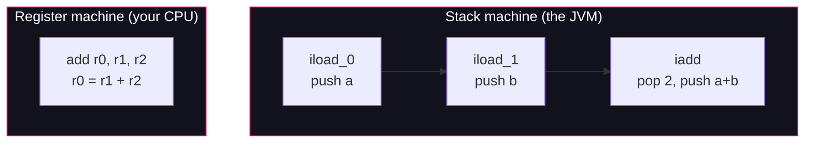

# Lesson 03: The Operand Stack

## What you'll learn

- Why the JVM is a **stack machine**, and how that differs from the register machine your CPU is
- The three instruction families: **loads**, **stores** and **operators** (`iload`, `istore`, `iadd` and friends)
- How to trace bytecode by hand, one slot at a time
- Why every `.class` file declares `max_stack` and `max_locals`, and who checks them

---

## Why this matters

Every method you have ever written runs the same way underneath: a small workspace of numbered **local variable slots**, and a scratch **operand stack** that every instruction pushes to and pops from. Once you can see that machinery, `javap -c` output stops being noise and starts being a story you can read. That skill is the foundation for the rest of Part 1: invocation opcodes ([Lesson 04](04-invocation-opcodes.md)), `invokedynamic` ([Lesson 05](05-invokedynamic.md)) and generating bytecode with ASM ([Lesson 06](06-generating-bytecode-with-asm.md)) all assume you can trace the stack. It also pays off in production: the "frames" in a `StackOverflowError`, the slot numbering in a debugger, and the verifier errors you get from a badly woven agent are all this same model.

---

## The concept

### Two ways to build a machine

Your physical CPU is a **register machine**. To add two numbers it executes something like `add r0, r1, r2` — one instruction that names *where* each operand lives. Registers are fast, but they are a hardware detail: an ARM chip and an x86 chip have different registers, different counts, different rules.

The JVM chose the opposite design. It is a **stack machine**: instructions (mostly) take no operands. Instead, each instruction pops its inputs off an **operand stack**, computes, and pushes the result back. `iadd` doesn't say where its operands are — they are simply the top two values on the stack.



The trade-off is deliberate. Operand-less instructions are tiny (one byte each, no operand encoding), and the bytecode stays identical on every processor on Earth. The JIT compiler later maps that portable stack code onto real registers for your specific CPU — you get portability at the language level and register speed at runtime. The stack is a *specification* convenience, not how the machine ultimately executes your code.

### The frame: two workspaces per call

Every method call gets a **frame** pushed onto the calling thread's JVM stack. A frame contains, among other things, the two workspaces this lesson is about:

- **The local variable array** — numbered slots holding the parameters first, then the method's locals. For an instance method, slot 0 is `this`, so the first declared parameter is slot 1. `long` and `double` values are wide and each occupy **two** slots.
- **The operand stack** — a last-in-first-out stack used for intermediate results. It is empty when the method starts, and a non-`void` method must have exactly its return value on top when it executes its `return` instruction.

These are per-thread and per-call. No other thread can touch a frame's locals or stack — the same isolation the concurrency course relies on for local variables in [race conditions](https://github.com/Dancan254/concurreny-multithreading/blob/master/lessons/part-2-shared-state/05-race-conditions.md).

### The instruction families

Bytecode mnemonics follow a naming pattern, and once you see the pattern you can guess instructions you have never met:

```
<type letter><verb>[_<slot or value>]
```

The type letter tells you what kind of value the instruction works on:

| Letter | Type | Letter | Type |
|---|---|---|---|
| `i` | `int` | `f` | `float` |
| `l` | `long` | `d` | `double` |
| `a` | reference ("address") | `b` / `s` / `c` | `byte` / `short` / `char` (rare; usually handled as `int`) |

The three families you will see constantly:

| Family | Examples | What they do |
|---|---|---|
| **Loads** | `iload_0`, `aload_2`, `iconst_1`, `ldc #5` | Push a value onto the stack: from a local slot, a baked-in constant, or the constant pool |
| **Stores** | `istore_3`, `astore_1` | Pop the top of the stack into a local slot |
| **Operators** | `iadd`, `isub`, `imul`, `lcmp` | Pop operand(s), compute, push the result |

Two shorthands worth knowing:

- `iload_0` … `iload_3` are one-byte special cases of the general `iload <slot>`. Slot numbers 0–3 are so common they got their own opcodes. The same pattern exists for the other load and store types.
- `iconst_m1` … `iconst_5` push the `int` constants −1 through 5 without touching the constant pool. That is why `javap` shows `iconst_1` and not `ldc #<something>` for the `- 1` in the hands-on sample.

### `max_stack` and `max_locals`: the contract in the class file

Here is the question that makes this more than trivia: when the JVM creates a frame for a method call, **how big should the local array and operand stack be?** The answer must be known *before* the method runs — the frame is allocated up front, not grown as instructions execute.

So `javac` computes both numbers at compile time and writes them into the method's `Code` attribute:

- **`max_locals`** — the number of local variable slots the method needs (parameters plus declared locals, counting `long`/`double` as two).
- **`max_stack`** — the deepest the operand stack ever gets at any point in the method.

`javac` derives `max_stack` by simulating exactly the trace you will do by hand below: walk the instructions, track the stack depth, remember the maximum. The JVM's **bytecode verifier** then re-checks these claims when the class is loaded, along with type correctness of every slot and stack entry. A class file that lies about `max_stack`, or that feeds an `int` to a reference-expecting instruction, is rejected before a single instruction executes. This is what lets the JVM run untrusted bytecode without trusting the compiler that produced it — a property languages like Kotlin, Scala and ASM-generated code ([Lesson 06](06-generating-bytecode-with-asm.md)) all lean on.

---

## Hands-on

Part 1 uses explicitly declared classes compiled with `javac`, because compact source files (`void main()`) hide the class declaration we want to dissect ([Lesson 02](02-anatomy-of-a-class-file.md)). Every command below is run from the directory containing the file.

### 1. Write, compile, run

`StackMath.java` — a method computing `(a + b) * c - 1` from parameters and a local:

```java
public class StackMath {

    static int compute(int a, int b, int c) {
        int sum = a + b;
        return sum * c - 1;
    }

    public static void main(String[] args) {
        System.out.println(compute(2, 3, 4));
    }
}
```

```bash
javac StackMath.java
java StackMath
```

```
19
```

### 2. Disassemble it

`javap` was introduced in [Lesson 00](../part-0-the-machine/00-setup-and-toolchain.md). The `-c` flag disassembles: it prints the bytecode of every method instead of just their signatures.

```bash
javap -c StackMath
```

```
Compiled from "StackMath.java"
public class StackMath {
  public StackMath();
    Code:
         0: aload_0
         1: invokespecial #1                  // Method java/lang/Object."<init>":()V
         4: return

  static int compute(int, int, int);
    Code:
         0: iload_0
         1: iload_1
         2: iadd
         3: istore_3
         4: iload_3
         5: iload_2
         6: imul
         7: iconst_1
         8: isub
         9: ireturn

  public static void main(java.lang.String[]);
    Code:
         0: getstatic     #7                  // Field java/lang/System.out:Ljava/io/PrintStream;
         3: iconst_2
         4: iconst_3
         5: iconst_4
         6: invokestatic  #13                 // Method compute:(III)I
         9: invokevirtual #19                 // Method java/io/PrintStream.println:(I)V
        12: return
}
```

Three methods, and you never wrote one of them. `javac` always emits a constructor (here the default one, calling `Object.<init>` via `invokespecial` — an invocation opcode you'll dissect in [Lesson 04](04-invocation-opcodes.md)). The `#1`, `#7`, `#13`, `#19` numbers are indexes into the **constant pool** from [Lesson 02](02-anatomy-of-a-class-file.md); the `//` comments are `javap` resolving them for you.

The numbers on the left (`0:`, `1:`, `3:` …) are **byte offsets** into the method's bytecode array, not line numbers. They skip values because instructions have different lengths: `iload_0` is one byte, but `getstatic #7` is three (one opcode byte plus a two-byte constant-pool index), which is why `main` jumps from `0:` to `3:`.

### 3. Trace `compute` line by line

`compute` is `static`, so there is no `this`. The local array starts as: slot 0 = `a`, slot 1 = `b`, slot 2 = `c`. `javac` assigned `sum` to slot 3. Now execute it mentally, with `a=2, b=3, c=4`:

| Offset | Instruction | What it does | Stack after (top on the right) |
|---:|---|---|---|
| 0 | `iload_0` | Push slot 0 (`a` = 2) | `2` |
| 1 | `iload_1` | Push slot 1 (`b` = 3) | `2  3` |
| 2 | `iadd` | Pop two, push their sum | `5` |
| 3 | `istore_3` | Pop into slot 3 (`sum` = 5) | *(empty)* |
| 4 | `iload_3` | Push slot 3 (`sum` = 5) | `5` |
| 5 | `iload_2` | Push slot 2 (`c` = 4) | `5  4` |
| 6 | `imul` | Pop two, push the product | `20` |
| 7 | `iconst_1` | Push the constant 1 | `20  1` |
| 8 | `isub` | Pop two, push the difference | `19` |
| 9 | `ireturn` | Pop and return to caller | *(empty)* |

That is the whole method. Read the Java and the bytecode side by side: `int sum = a + b;` is offsets 0–3, and `return sum * c - 1;` is offsets 4–9. One source line is several instructions; nothing here is atomic in the threading sense, and nothing needs to be — this stack belongs to one thread.

### 4. Predict, then verify `max_stack`

Before looking any further: **what is the maximum depth the operand stack reaches in `compute`?** Scan the trace table above and commit to a number.

Now check your answer. The `-v` (verbose) flag makes `javap` print the `Code` attribute's metadata, including the numbers `javac` computed:

```bash
javap -v StackMath
```

The full output repeats the constant pool from [Lesson 02](02-anatomy-of-a-class-file.md); here is the section for `compute`:

```
  static int compute(int, int, int);
    descriptor: (III)I
    flags: (0x0008) ACC_STATIC
    Code:
      stack=2, locals=4, args_size=3
         0: iload_0
         1: iload_1
         2: iadd
         3: istore_3
         4: iload_3
         5: iload_2
         6: imul
         7: iconst_1
         8: isub
         9: ireturn
      LineNumberTable:
        line 4: 0
        line 5: 4
```

`stack=2` — the stack never gets deeper than two values (after offsets 1, 5 and 7 in the trace). `locals=4` — three `int` parameters plus `sum`, one slot each. `args_size=3` is the parameter count, so `locals − args_size` tells you the method declared exactly one local.

The `descriptor: (III)I` is the method's type signature in class-file encoding: three `int`s in (`I` per parameter), one `int` out. You will meet descriptors again with every `Methodref` in the constant pool.

For contrast, look at `main` in the same output: `stack=4`. Its deepest point is after `iconst_4`, when the stack holds `System.out`, `2`, `3`, `4` — four entries waiting for `invokestatic` to consume three of them.

---

## Try it yourself

1. Change the expression to `(a + b) * (c + 2)`. Before running `javap -v`, predict the new `stack=` value. Were you right?
2. Change `sum * c - 1` to `sum * c - 300`. What instruction replaces `iconst_1`, and why? (Try 300, then 40000, and watch where the constant comes from.)
3. Add a `long` parameter to `compute`. How do `locals=` and the slot numbers of the later parameters change? (A `long` takes two slots — confirm it in the output.)
4. Make `compute` an instance method (drop `static`) and call it on a `new StackMath()`. What occupies local slot 0 now, and what did that do to every other slot number?
5. Trace `main`'s bytecode by hand the way we traced `compute`, drawing the stack after each of its seven instructions. What is on the stack when `invokestatic` runs, and what is on it after?

---

## Common mistakes

- **Reading offsets as line numbers.** `0:` to `9:` are byte positions in the bytecode array. The `LineNumberTable` is what maps them back to source lines — that mapping is how your debugger and stack traces know where you were.
- **Forgetting slot 0 is `this`.** In an instance method, the first declared parameter is slot 1, and `aload_0` at the top of a constructor or method is loading the receiver, not a parameter.
- **Forgetting `long` and `double` are two slots.** A `long` parameter silently shifts every subsequent slot number by one and inflates `max_locals`. This bites when reading bytecode and when writing ASM by hand.
- **Assuming the operand stack exists at runtime as a real stack data structure.** It is a specification model. The interpreter maintains one, but JIT-compiled code maps the whole thing onto registers and often eliminates it entirely. `max_stack` constrains the *bytecode*, not the optimized machine code.
- **Thinking `javac` invents `stack=`/`locals=` as hints.** They are load-bearing claims stored in the class file. The verifier rejects classes whose declared `max_stack` is too small for the actual instruction stream — hand-edited or badly instrumented bytecode fails here first.

---

## Check your understanding

**1. Why does the JVM use a stack-based instruction set when no physical CPU works that way?**

<details>
<summary>Reveal answer</summary>

Portability and compactness. Stack-machine instructions need no operand encoding, so most are a single byte, and the same bytecode runs on any CPU. The JIT compiler maps the stack operations onto the host CPU's real registers at runtime, recovering the speed. The stack is the portable *specification*; registers are the *implementation*.

</details>

**2. In `static int compute(int a, int b, int c)`, `sum` compiles to slot 3. If you make the method non-static, which slot does `sum` get, and why?**

<details>
<summary>Reveal answer</summary>

Slot 4. Instance methods reserve slot 0 for `this`, so `a`, `b`, `c` move to slots 1–3 and `sum` moves to 4. `max_locals` grows from 4 to 5.

</details>

**3. A method's deepest operand-stack moment is three values, but its class file declares `stack=2`. What happens?**

<details>
<summary>Reveal answer</summary>

The class fails verification at load time and is never executed. `javac` computes `max_stack` correctly from the instruction stream, so you only see this with hand-written or instrumented bytecode — and the verifier exists precisely to catch it before any instruction runs.

</details>

**4. What is the difference between `iload_1` and `iconst_1`?**

<details>
<summary>Reveal answer</summary>

`iload_1` pushes the current *value of local variable slot 1* — different every call. `iconst_1` pushes the fixed constant 1, baked into the instruction itself. Both leave one `int` on the stack, which is why they can look interchangeable in a trace while meaning completely different things.

</details>

**5. `javap -c` shows `main` jumping from offset `0:` to `3:`. Are instructions 1 and 2 missing?**

<details>
<summary>Reveal answer</summary>

No. Offsets are byte positions, not instruction counters. The instruction at offset 0 (`getstatic #7`) is three bytes long — one opcode byte plus a two-byte constant-pool index — so the next instruction starts at byte 3. One-byte instructions like `iload_0` advance the offset by exactly 1.

</details>

---

## Recap

- The JVM is a **stack machine**: instructions pop operands from and push results to an **operand stack**, unlike the register machine your CPU is.
- Each method call gets a **frame** with a numbered **local variable array** (parameters, then locals; slot 0 is `this` for instance methods; `long`/`double` take two slots) and an operand stack.
- Instruction names follow a pattern: type letter + verb, with one-byte shorthands like `iload_0` and `iconst_1` for the most common cases.
- `javac` computes **`max_stack`** and **`max_locals`** at compile time and stores them in the class file; the **verifier** re-checks them at load time.
- Byte offsets on the left of `javap -c` output are positions in the bytecode array — the `LineNumberTable` is what connects them to source lines.
- You can now trace any straight-line bytecode by hand: that is the skill lessons 04–06 build on.

**Previous:** [Lesson 02 — Anatomy of a `.class` file](02-anatomy-of-a-class-file.md) · **Next:** [Lesson 04 — The invocation opcodes](04-invocation-opcodes.md)
