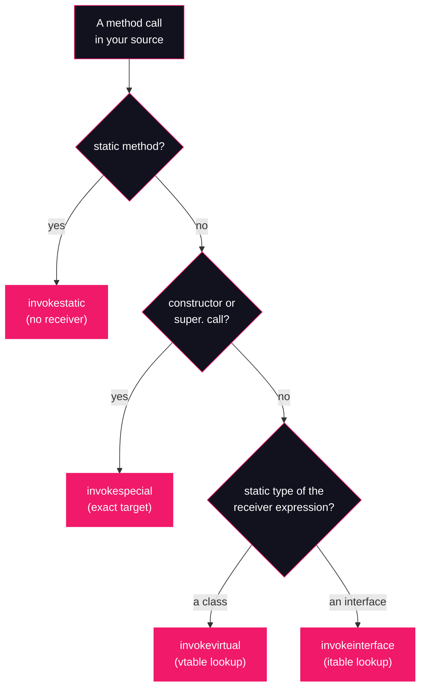

# Lesson 04: The Invocation Opcodes

## What you'll learn

- The four method-invocation opcodes: `invokestatic`, `invokespecial`, `invokevirtual`, `invokeinterface`
- Which one `javac` emits for each kind of call, and why the choice depends on the *compile-time type* of the receiver, not the runtime object
- Static vs dynamic dispatch, and why `invokevirtual` needs the receiver's runtime class (the vtable, in one paragraph)
- How invocation instructions appear in `javap` output, and what they point at in the constant pool

---

## Why this matters

Every method call you have ever written compiles to one of four opcodes. That is not trivia. It is the difference between a call whose exact target is fixed in the class file, and a call whose target is only known when the instruction runs, because it depends on which object is sitting on the operand stack. Once you can look at a line of source and name its opcode, overriding stops being magic, stack traces read differently, and the JIT optimizations in Part 4 (inlining, devirtualization, deoptimization) have something to hang on. This lesson is also the setup for the next one: there is a *fifth* invocation opcode, `invokedynamic`, and it only makes sense as a contrast to the four you learn here.

---

## The concept

### Static vs dynamic dispatch

A method call has two questions attached to it: *which code runs*, and *when is that decided*.

**Static dispatch** means the exact target method is fixed at compile time. The bytecode names one method, and that is the method that runs, always. No lookup happens at runtime.

**Dynamic dispatch** means the bytecode names a method *signature*, and the JVM picks the actual implementation at runtime based on the class of the receiver object. This is how overriding works: you call `greet("jvm")` on a reference, and whether you get `FriendlyGreeter.greet` or `LoudGreeter.greet` depends on the object, not the reference type.

The four opcodes split across these two families:

| Opcode | Emitted for | Dispatch |
|---|---|---|
| `invokestatic` | `static` methods | static — one exact target, and there is **no receiver object** at all |
| `invokespecial` | constructors (`<init>`) and `super.` calls | static — has a receiver, but the exact target is still fixed |
| `invokevirtual` | instance methods called through a **class-typed** reference | dynamic |
| `invokeinterface` | instance methods called through an **interface-typed** reference | dynamic |

The crucial rule: **`javac` chooses the opcode from the static type of the expression you call on, and from the kind of method — never from the object that shows up at runtime.** The same `LoudGreeter` object called through a `Greeter` reference produces `invokeinterface`; through a `LoudGreeter` reference, `invokevirtual`.

### Why `invokevirtual` needs the receiver's runtime class

For `invokestatic` and `invokespecial` the class file already names the winning method, so the JVM can jump straight to it. `invokevirtual` cannot do that: the constant pool only says "a method named `greet` taking a `String`, declared in `FriendlyGreeter` or somewhere above it". To find the code, the JVM uses the runtime class of the receiver object. In HotSpot, every class carries a **vtable** — a table with one slot per overridable method, laid out identically for a class and its subclasses, each slot pointing at the implementation that class actually runs. `LoudGreeter`'s vtable has the same slots as `FriendlyGreeter`'s, but its `greet` slot points at `LoudGreeter.greet`. Dispatch is: take the receiver from the operand stack, read its class pointer, index the vtable at the slot for `greet`, jump. Overriding is nothing more than a subclass writing a different address into an inherited slot.

`invokeinterface` is the same idea with a harder layout problem. `Greeter.greet` cannot get one fixed vtable slot shared by every implementer, because two unrelated classes can implement `Greeter` at completely different positions in their own hierarchies, and a class can implement many interfaces. HotSpot therefore keeps a separate **interface method table** (itable) per class per interface, and `invokeinterface` searches there instead. Same dynamic-dispatch semantics, a slightly longer lookup.

### How `javac` picks the opcode



### What the invoke instructions point at

Invocation instructions do not embed method names. Their operand is an index into the **constant pool** ([Lesson 02](02-anatomy-of-a-class-file.md)), where the method is described symbolically: the class or interface, the name, and the descriptor. Class methods are stored as `Methodref` entries, interface methods as `InterfaceMethodref` entries — and `invokeinterface` will only accept the latter. (One exception to that split: since JDK 8, `invokespecial` may also name an `InterfaceMethodref`, which is how `I.super.m()` calls to a default method are encoded.) At runtime, the first execution of the instruction *resolves* that symbolic reference into a real target (Lesson 08 covers resolution in detail).

On the operand stack ([Lesson 03](03-the-operand-stack.md)), all four instructions work the same way: the receiver (for everything except `invokestatic`) and then the arguments are pushed in order, and the instruction pops them all, runs the method, and pushes the return value if there is one.

---

## Hands-on

All four opcodes in one class hierarchy: an interface, an implementation, and a subclass that overrides. This is a Part 1 lesson, so the class is declared explicitly and compiled with `javac` — compact source files hide the class declaration we are dissecting.

Run commands:

```bash
javac Dispatch.java
java Dispatch
javap -c Dispatch
javap -c LoudGreeter
javap -v Dispatch | grep 'Methodref'
```

### 1. The program

`Dispatch.java`:

```java
interface Greeter {
    String greet(String name);
}

class FriendlyGreeter implements Greeter {
    @Override
    public String greet(String name) {
        return "Hello, " + name;
    }
}

class LoudGreeter extends FriendlyGreeter {
    @Override
    public String greet(String name) {
        return super.greet(name).toUpperCase();
    }
}

public class Dispatch {
    static String banner() {
        return "== dispatch ==";
    }

    public static void main(String[] args) {
        System.out.println(banner());

        Greeter viaInterface = new LoudGreeter();
        System.out.println(viaInterface.greet("jvm"));

        FriendlyGreeter viaClass = new FriendlyGreeter();
        System.out.println(viaClass.greet("jvm"));
    }
}
```

Every call shape is here: a static call (`banner()`), two constructor calls, a `super.` call, an overridden method called through the interface type, and the same method called through the class type.

### 2. Compile and run it

```bash
javac Dispatch.java
java Dispatch
```

```
== dispatch ==
HELLO, JVM
Hello, jvm
```

`javac` emits one `.class` file per top-level type: `Dispatch.class`, `Greeter.class`, `FriendlyGreeter.class`, `LoudGreeter.class`.

### 3. Disassemble `Dispatch`

```bash
javap -c Dispatch
```

```
Compiled from "Dispatch.java"
public class Dispatch {
  public Dispatch();
    Code:
         0: aload_0
         1: invokespecial #1                  // Method java/lang/Object."<init>":()V
         4: return

  static java.lang.String banner();
    Code:
         0: ldc           #7                  // String == dispatch ==
         2: areturn

  public static void main(java.lang.String[]);
    Code:
         0: getstatic     #9                  // Field java/lang/System.out:Ljava/io/PrintStream;
         3: invokestatic  #15                 // Method banner:()Ljava/lang/String;
         6: invokevirtual #21                 // Method java/io/PrintStream.println:(Ljava/lang/String;)V
         9: new           #27                 // class LoudGreeter
        12: dup
        13: invokespecial #29                 // Method LoudGreeter."<init>":()V
        16: astore_1
        17: getstatic     #9                  // Field java/lang/System.out:Ljava/io/PrintStream;
        20: aload_1
        21: ldc           #30                 // String jvm
        23: invokeinterface #32,  2           // InterfaceMethod Greeter.greet:(Ljava/lang/String;)Ljava/lang/String;
        28: invokevirtual #21                 // Method java/io/PrintStream.println:(Ljava/lang/String;)V
        31: new           #38                 // class FriendlyGreeter
        34: dup
        35: invokespecial #40                 // Method FriendlyGreeter."<init>":()V
        38: astore_2
        39: getstatic     #9                  // Field java/lang/System.out:Ljava/io/PrintStream;
        42: aload_2
        43: ldc           #30                 // String jvm
        45: invokevirtual #41                 // Method FriendlyGreeter.greet:(Ljava/lang/String;)Ljava/lang/String;
        48: invokevirtual #21                 // Method java/io/PrintStream.println:(Ljava/lang/String;)V
        51: return
}
```

(Constant-pool indices like `#15` depend on the exact `javac` build, so yours may be numbered differently. The opcodes and targets will match.)

Reading the interesting lines of `main`:

- **Offset 3 — `invokestatic`.** `banner()` is static. There is no receiver on the stack (compare offset 20, where `aload_1` pushes one), and the target is fixed forever.
- **Offset 13 — `invokespecial`.** The `new LoudGreeter()` construction. Notice `new` is its own instruction (offset 9): it allocates the object, `dup` copies the reference, and `invokespecial <init>` initializes it. Object creation in bytecode is two steps.
- **Offset 23 — `invokeinterface`.** `viaInterface` is declared as `Greeter`, an interface, so the call goes through the itable — even though the object on the stack is a `LoudGreeter`. The extra `, 2` after the pool index is a count byte: the number of argument slots the call pops, receiver included (the receiver plus one `String` = 2). The trailing zero byte you would see in the raw bytes is a historical leftover the JVM ignores.
- **Offset 45 — `invokevirtual`.** `viaClass` is declared as `FriendlyGreeter`, a class. Same overridden method, same runtime behavior, different opcode — chosen purely from the declared type of the variable.

And `println` (offsets 6, 28, 48) is a plain instance method on the class `PrintStream`: `invokevirtual`.

### 4. Disassemble `LoudGreeter` for the `super.` call

```bash
javap -c LoudGreeter
```

```
Compiled from "Dispatch.java"
class LoudGreeter extends FriendlyGreeter {
  LoudGreeter();
    Code:
         0: aload_0
         1: invokespecial #1                  // Method FriendlyGreeter."<init>":()V
         4: return

  public java.lang.String greet(java.lang.String);
    Code:
         0: aload_0
         1: aload_1
         2: invokespecial #7                  // Method FriendlyGreeter.greet:(Ljava/lang/String;)Ljava/lang/String;
         5: invokevirtual #11                 // Method java/lang/String.toUpperCase:()Ljava/lang/String;
         8: areturn
}
```

Two `invokespecial` uses here, and they are the entire reason the opcode exists:

- **Offset 1 of the constructor:** every constructor (except `Object`'s own, which has no superclass) must call a superclass constructor first, and that target must be exact — you do not want dynamic dispatch deciding which `<init>` runs while the object is still half-built.
- **Offset 2 of `greet`:** `super.greet(name)` means "the parent's implementation, specifically", bypassing the override. If this compiled to `invokevirtual`, the vtable lookup would find `LoudGreeter.greet` again — the very method that is running — and the call would recurse forever. `invokespecial` is what makes `super.` semantics possible.

### 5. What the instructions point at in the constant pool

```bash
javap -v Dispatch | grep 'Methodref'
```

```
   #1 = Methodref          #2.#3          // java/lang/Object."<init>":()V
  #15 = Methodref          #16.#17        // Dispatch.banner:()Ljava/lang/String;
  #21 = Methodref          #22.#23        // java/io/PrintStream.println:(Ljava/lang/String;)V
  #29 = Methodref          #27.#3         // LoudGreeter."<init>":()V
  #32 = InterfaceMethodref #33.#34        // Greeter.greet:(Ljava/lang/String;)Ljava/lang/String;
  #40 = Methodref          #38.#3         // FriendlyGreeter."<init>":()V
  #41 = Methodref          #38.#34        // FriendlyGreeter.greet:(Ljava/lang/String;)Ljava/lang/String;
```

The pool entries mirror the opcodes: everything is a `Methodref` except entry `#32`, an `InterfaceMethodref` — the exact entry `invokeinterface` at offset 23 names. The opcode and the pool entry type have to agree; the verifier (Lesson 08) rejects a class where they do not.

---

## Try it yourself

1. In `main`, change the declaration `Greeter viaInterface` to `LoudGreeter viaInterface`. Predict the opcode of the `greet` call before you recompile, then check with `javap -c Dispatch`. Did the runtime output change? Did anything else in the disassembly change?
2. Add a private instance method to `Dispatch` (say, `private String whisper()`) and call it from `main`. Disassemble. Which opcode did you get — and is it the one the table in this lesson led you to expect?
3. Mark `FriendlyGreeter.greet` as `final`. Recompile and disassemble. Did the opcode at the call site change? Explain why `final` is a promise to the *human* reader and the *compiler*, not a different dispatch mechanism.
4. In `LoudGreeter.greet`, replace `super.greet(name)` with `this.greet(name)`. Predict the opcode, verify with `javap -c LoudGreeter`, then run the program. What error do you get, and why does that error make sense given what you know about dispatch? (Lesson 12 explains exactly where that error comes from.)

---

## Common mistakes

- **"The opcode depends on the object at runtime."** It depends on the *compile-time type* of the receiver expression. One `LoudGreeter` object, two reference types, two different opcodes — the Hands-on section shows both.
- **"Private methods compile to `invokespecial`."** That was true before JDK 11. Since JEP 181 (nestmates), a private instance method compiles to `invokevirtual` and a private static one to `invokestatic`. Old articles and interview answers still teach the pre-11 rule; `javap` on your own JDK is the source of truth.
- **"`invokevirtual` is slow, `invokestatic` is fast."** The opcode states dispatch *semantics*, not cost. The JIT profiles call sites, and when an `invokevirtual` site only ever sees one receiver class it inlines the target directly — sometimes with a guard that falls back if a new class shows up (Lessons 19–20). Write the semantics you mean; let the JIT worry about speed.
- **Confusing `new` with the constructor call.** `new` allocates; `invokespecial <init>` initializes. That is why the disassembly shows `new`, `dup`, `invokespecial` as a trio — and why a constructor that throws leaves an allocated object you never got a reference to.

---

## Check your understanding

**1. `Collections.emptyList();` — which opcode?**

<details>
<summary>Reveal answer</summary>

`invokestatic`. `emptyList()` is a static method: no receiver, one exact target known at compile time.

</details>

**2. `new ArrayList<String>();` — which opcode does the constructor call compile to?**

<details>
<summary>Reveal answer</summary>

`invokespecial`, targeting `ArrayList."<init>"`. Constructor calls are always `invokespecial` — the exact target is fixed, and dynamic dispatch during initialization would be dangerous.

</details>

**3. Which opcode does `names.add("ada")` compile to here, and why?**

```java
List<String> names = new ArrayList<>();
names.add("ada");
```

<details>
<summary>Reveal answer</summary>

`invokeinterface`. The object is an `ArrayList`, but the opcode is chosen from the static type of `names`, which is the interface `List`. The runtime class of the object never factors into `javac`'s choice.

</details>

**4. Same question, one word changed:**

```java
ArrayList<String> names = new ArrayList<>();
names.add("ada");
```

<details>
<summary>Reveal answer</summary>

`invokevirtual`. The static type is now a class, so dispatch goes through the vtable instead of the itable. This is the whole "program to the type you declare" lesson in one line of bytecode: your choice of declared type changes the instruction, not just the readability.

</details>

**5. Inside a class extending `Object`, what does `super.toString()` compile to, and what would go wrong if it used `invokevirtual` instead?**

<details>
<summary>Reveal answer</summary>

`invokespecial`. `super.` means "the superclass implementation, specifically". With `invokevirtual`, the vtable lookup would start from the receiver's runtime class and find the overriding `toString` — so a `toString` that tried to call `super.toString()` would call itself and recurse until the stack blew up.

</details>

**6. A private instance method called from `main` in the same class, on JDK 25 — `invokespecial` or something else?**

<details>
<summary>Reveal answer</summary>

`invokevirtual`. Since JDK 11 (JEP 181, nestmates), private instance methods use `invokevirtual`; only constructors and `super.` calls still use `invokespecial`. You can prove it with exercise 2 above. The JVM guarantees privateness at the access-check level, not by the choice of opcode.

</details>

---

## Recap

- Four invocation opcodes: `invokestatic` (static methods), `invokespecial` (constructors and `super.`), `invokevirtual` (instance methods via a class-typed reference), `invokeinterface` (instance methods via an interface-typed reference).
- `javac` picks the opcode from the **static type of the receiver** and the kind of method — never the runtime object.
- `invokevirtual` is dynamic dispatch: the JVM reads the receiver's class and indexes its vtable. `invokeinterface` does the same through an itable because interface methods have no fixed vtable slot.
- `invokestatic` and `invokespecial` name one exact target; no lookup happens at runtime.
- Invoke instructions carry a constant-pool index: `Methodref` for class methods, `InterfaceMethodref` for interface methods.
- Since JDK 11, private instance methods are `invokevirtual`, not `invokespecial`.

**Previous:** [Lesson 03 — The operand stack](03-the-operand-stack.md) · **Next:** [Lesson 05 — `invokedynamic`](05-invokedynamic.md)
