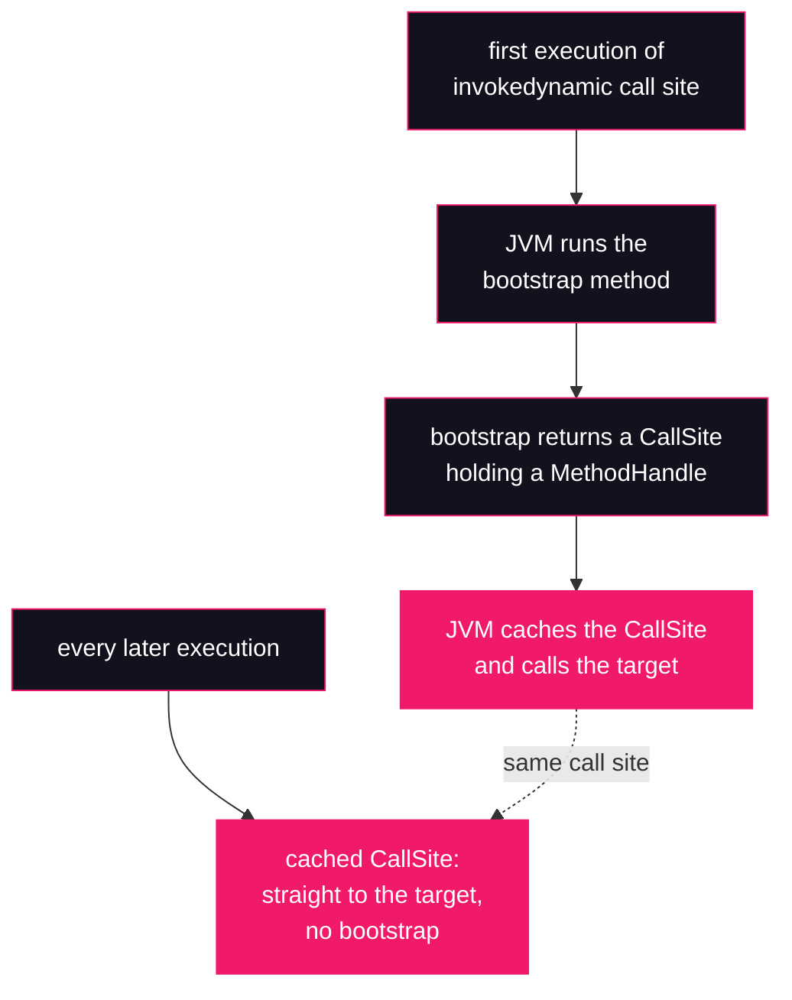

# Lesson 05: `invokedynamic`

## What you'll learn

- The problem the fifth invocation opcode solves: linkage that can't be decided when `javac` runs
- What a bootstrap method is, and what happens on the first versus every later execution of an `invokedynamic` call site
- Why lambdas are cheap: `LambdaMetafactory` spins the implementation class at runtime, not at compile time
- Why string `+` got fast in JDK 9 (JEP 280): `StringConcatFactory` and indified concatenation

---

## Why this matters

[Lesson 04](04-invocation-opcodes.md) gave you four invocation opcodes, and each one bakes in a fixed rule: `invokevirtual` dispatches on the receiver's class, `invokespecial` calls exactly this method, `invokestatic` calls exactly this static method, `invokeinterface` searches the receiver's interface table. In every case `javac` names a concrete method in a concrete class, and the JVM's job is to resolve that name.

Now look at a lambda:

```java
IntUnaryOperator op = x -> x + base;
```

Which class implements `IntUnaryOperator` here? **There isn't one.** No `.java` file declares it, and no `.class` file exists for `javac` to name. Somebody has to *create* that class — but who, and when? If `javac` writes an anonymous inner class per lambda, you pay for a class file on disk, a classload, and a frozen implementation for every `x -> ...` in your program, and the JVM can never swap in a better strategy later.

String concatenation has the same shape. Before JDK 9, `javac` compiled `"a" + x + "b"` into a hardcoded `StringBuilder` chain. That bytecode was frozen forever: when the JVM team later invented a faster way to concatenate, every already-compiled class in the world was stuck with the old code.

Both problems need the same thing: **an invocation whose target is decided by code that runs at runtime, the first time the call site executes.** That is `invokedynamic`.

---

## The concept

### The fifth invocation opcode

`invokedynamic` was added in JDK 7 (JSR 292), originally to support dynamic languages on the JVM. Unlike the four opcodes from [Lesson 04](04-invocation-opcodes.md), it does **not** name a method to call. It names a *bootstrap method*: an ordinary Java method that the JVM runs **once**, the first time execution reaches that call site. The bootstrap method decides what the call site should actually do and returns a `CallSite` object wrapping a `MethodHandle` — a directly callable reference to the real target.



The one-time bootstrap cost is paid once per call site; after that the call is as direct as any other, and the JIT can inline through it. The linkage decision is **deferred from compile time to runtime** — and made by ordinary Java code shipped in the JDK, which means a newer JDK can link the same old bytecode a better way.

In the constant pool you saw in [Lesson 02](02-anatomy-of-a-class-file.md), an `invokedynamic` instruction points at an `InvokeDynamic` entry, which points into a `BootstrapMethods` attribute at the end of the class file. You will read both below.

### Lambdas: `LambdaMetafactory`

For a lambda, `javac` does two things:

1. Moves the lambda body into a `private static` synthetic method on your class, named like `lambda$main$0`.
2. Emits `invokedynamic` at the place where the lambda appears, with `java.lang.invoke.LambdaMetafactory.metafactory` as the bootstrap method.

On first execution, `LambdaMetafactory` spins a small hidden class in memory that implements the functional interface and forwards to `lambda$main$0`. No class file on disk, no classloading from the filesystem, and the JDK is free to change the spinning strategy in any release. Captured variables (like `base`) become arguments passed into the generated class at the call site — you can see them in the call site's descriptor.

### String concatenation: `StringConcatFactory` (JEP 280)

Since JDK 9, `javac` compiles `"a" + x + "b"` into an `invokedynamic` whose bootstrap method is `java.lang.invoke.StringConcatFactory.makeConcatWithConstants`. The constant parts of the expression are stored as a **recipe** string in the constant pool, with `\u0001` placeholders where the dynamic values go. At runtime the JDK picks a concatenation strategy — sizing the result exactly, avoiding intermediate `StringBuilder` objects, emitting code the JIT can optimise — and it can switch strategies via a system property, without recompiling your code.

### What [Lesson 04](04-invocation-opcodes.md)'s opcodes would have required

| | With only the four classic opcodes | With `invokedynamic` |
|---|---|---|
| Lambda | `javac` emits a real (anonymous) class per lambda; `invokespecial` to construct it; the strategy is frozen in bytecode forever | One `invokedynamic`; the implementation class is spun at runtime and can improve with the JDK |
| `"a" + x + "b"` | `new StringBuilder` + `dup` + `invokespecial` + a chain of `invokevirtual append` calls, hardcoded by `javac` | One `invokedynamic` plus a recipe; the runtime picks (and can change) the strategy |
| Who decides the target | `javac`, once, forever | A bootstrap method, at first execution, cached afterwards |

---

## Hands-on

Part 1 lessons use explicitly declared classes compiled with `javac`, so the class declaration we're dissecting is visible in the source. `javap -v` was introduced in [Lesson 02](02-anatomy-of-a-class-file.md); you'll also need `-p` from the same lesson here, because `javac` compiles the lambda body into a `private` synthetic method that the default output hides.

### 1. A lambda's call site

`LambdaLinkage.java`:

```java
import java.util.function.IntUnaryOperator;

public class LambdaLinkage {

    static int applyTwice(IntUnaryOperator op, int value) {
        System.out.println(op.getClass());
        return op.applyAsInt(op.applyAsInt(value));
    }

    public static void main(String[] args) {
        int base = 10;
        int result = applyTwice(x -> x + base, 1);
        System.out.println(result);
    }
}
```

Compile and run:

```bash
javac LambdaLinkage.java
java LambdaLinkage
```

Running it twice (to show what varies):

```
class LambdaLinkage$$Lambda/0x0000000043040210
21

class LambdaLinkage$$Lambda/0x000000007b040210
21
```

*(The `0x...` address in the generated class name varies from run to run.)*

That printed class is the evidence: `LambdaLinkage$$Lambda/0x...` is not a class in any `.java` or `.class` file you have. `LambdaMetafactory` spun it in memory on first execution of the call site. `21` is `applyTwice` applying `x -> x + base` twice to `1`: `1 + 10 + 10 = 21`.

Now the bytecode:

```bash
javap -v -p LambdaLinkage
```

Inside `main`, the lambda is one instruction (constant pool and other methods omitted):

```
  public static void main(java.lang.String[]);
    descriptor: ([Ljava/lang/String;)V
    flags: (0x0009) ACC_PUBLIC, ACC_STATIC
    Code:
      stack=2, locals=3, args_size=1
         0: bipush        10
         2: istore_1
         3: iload_1
         4: invokedynamic #29,  0             // InvokeDynamic #0:applyAsInt:(I)Ljava/util/function/IntUnaryOperator;
         9: iconst_1
        10: invokestatic  #32                 // Method applyTwice:(Ljava/util/function/IntUnaryOperator;I)I
        13: istore_2
        14: getstatic     #7                  // Field java/lang/System.out:Ljava/io/PrintStream;
        17: iload_2
        18: invokevirtual #38                 // Method java/io/PrintStream.println:(I)V
        21: return
```

Read offset `4` carefully. The descriptor is `(I)Ljava/util/function/IntUnaryOperator;`: it takes one `int` and **returns an `IntUnaryOperator`**. This `invokedynamic` doesn't *run* the lambda — it *manufactures the object*. The `int` it consumes is `base`, pushed by `iload_1` just before: captured variables are passed into the generated class at the call site. The lambda is actually *invoked* later, inside `applyTwice`, by an ordinary `invokeinterface` on `applyAsInt` — [Lesson 04](04-invocation-opcodes.md)'s opcode, because by then `op` is just an object implementing an interface.

At the bottom of the output, the `BootstrapMethods` attribute says who manufactures the object *(details may differ across JDK 25 builds)*:

```
BootstrapMethods:
  0: #54 REF_invokeStatic java/lang/invoke/LambdaMetafactory.metafactory:(Ljava/lang/invoke/MethodHandles$Lookup;Ljava/lang/String;Ljava/lang/invoke/MethodType;Ljava/lang/invoke/MethodType;Ljava/lang/invoke/MethodHandle;Ljava/lang/invoke/MethodType;)Ljava/lang/invoke/CallSite;
    Method arguments:
      #50 (I)I
      #51 REF_invokeStatic LambdaLinkage.lambda$main$0:(II)I
      #50 (I)I
```

Three static arguments tell the metafactory what to build: the interface method's signature `(I)I`, a handle to the implementation method `lambda$main$0`, and the signature to expose `(I)I`. And thanks to `-p`, you can see that implementation method — the lambda body, compiled to an ordinary (synthetic) static method:

```
  private static int lambda$main$0(int, int);
    descriptor: (II)I
    flags: (0x100a) ACC_PRIVATE, ACC_STATIC, ACC_SYNTHETIC
    Code:
      stack=2, locals=2, args_size=2
         0: iload_1
         1: iload_0
         2: iadd
         3: ireturn
```

It takes two ints (the captured `base` and the lambda parameter `x`), adds them, returns. The generated `$$Lambda` class just forwards `applyAsInt` calls here. That's the whole trick: a lambda is a static method plus one runtime-linked call site.

### 2. Indified string concatenation

`StringConcat.java`:

```java
public class StringConcat {

    public static void main(String[] args) {
        StringBuilder result = new StringBuilder();
        for (int x = 0; x < 3; x++) {
            result.append("a" + x + "b");
        }
        System.out.println(result);
    }
}
```

```bash
javac StringConcat.java
java StringConcat
```

```
a0ba1ba2b
```

Now the bytecode:

```bash
javap -v StringConcat
```

```
  public static void main(java.lang.String[]);
    descriptor: ([Ljava/lang/String;)V
    flags: (0x0009) ACC_PUBLIC, ACC_STATIC
    Code:
      stack=2, locals=3, args_size=1
         0: new           #7                  // class java/lang/StringBuilder
         3: dup
         4: invokespecial #9                  // Method java/lang/StringBuilder."<init>":()V
         7: astore_1
         8: iconst_0
         9: istore_2
        10: iload_2
        11: iconst_3
        12: if_icmpge     32
        15: aload_1
        16: iload_2
        17: invokedynamic #10,  0             // InvokeDynamic #0:makeConcatWithConstants:(I)Ljava/lang/String;
        22: invokevirtual #14                 // Method java/lang/StringBuilder.append:(Ljava/lang/String;)Ljava/lang/StringBuilder;
        25: pop
        26: iinc          2, 1
        29: goto          10
        32: getstatic     #18                 // Field java/lang/System.out:Ljava/io/PrintStream;
        35: aload_1
        36: invokevirtual #24                 // Method java/io/PrintStream.println:(Ljava/lang/Object;)V
        39: return
```

This one method shows both eras side by side. The `StringBuilder` *you* wrote is compiled the old way — `new`, `dup`, `invokespecial`, `invokevirtual append` (offsets 0–7 and 22), straight out of [Lesson 04](04-invocation-opcodes.md). But the `"a" + x + "b"` *expression* is a single `invokedynamic` at offset 17: it takes the `int x` and returns a finished `String`. No `StringBuilder` is allocated for it at all.

The `BootstrapMethods` attribute *(details may differ across JDK 25 builds)*:

```
BootstrapMethods:
  0: #42 REF_invokeStatic java/lang/invoke/StringConcatFactory.makeConcatWithConstants:(Ljava/lang/invoke/MethodHandles$Lookup;Ljava/lang/String;Ljava/lang/invoke/MethodType;Ljava/lang/String;[Ljava/lang/Object;)Ljava/lang/invoke/CallSite;
    Method arguments:
      #40 a\u0001b
```

The recipe `a\u0001b` is the format string: the constant text `a` and `b`, with a `\u0001` placeholder (the byte U+0001, shown by `javap` as the escape `\u0001`) marking where the one dynamic argument (`x`) is inserted. Everything the runtime needs to build an exactly-sized concatenation is right there in the constant pool.

Because linkage happens at runtime, the strategy is a runtime choice. `-D` sets a system property on the command line, and `StringConcatFactory` reads one named `java.lang.invoke.stringConcat`:

```bash
java -Djava.lang.invoke.stringConcat=BC_SB StringConcat
java -Djava.lang.invoke.stringConcat=INLINE StringConcat
```

```
a0ba1ba2b
a0ba1ba2b
```

Same bytecode, same output, different linkage: `BC_SB` asks for the old-style `StringBuilder` strategy, `INLINE` (the default) asks for inlined, exactly-sized concatenation. That is the payoff of deferring linkage — code compiled years ago links against whatever strategy today's JDK considers best.

---

## Try it yourself

1. Change the lambda to capture nothing: `x -> x + 1`. Recompile and run `javap -v -p LambdaLinkage`. What happened to the call-site descriptor `(I)Ljava/util/function/IntUnaryOperator;`, and why?
2. Add a second, different lambda to `main` and re-run `javap -v -p LambdaLinkage` (you need `-v` for the `BootstrapMethods` attribute). How many entries does `BootstrapMethods` have now? How many `lambda$main$N` methods?
3. Write `s = s + x` inside the loop (accumulating into a `String`) instead of `result.append(...)`. Run `javap -c` and find the `makeConcatWithConstants` call site. It is still fast per iteration — so why is the loop as a whole still slow? (Hint: what is the recipe's input each time?)
4. Compile `public record Point(int x, int y) {}` and run `javap -v Point`. Which bootstrap method generates `toString`, `equals` and `hashCode`, and what does that tell you about how records avoid boilerplate *bytecode*?

---

## Common mistakes

- **"A lambda compiles to an anonymous inner class."** That was a pre-JDK-8 mental model. There is no `LambdaLinkage$1.class` on disk; `LambdaMetafactory` spins a hidden class at runtime. Print `op.getClass()` if you doubt it.
- **"Never use `+` on strings, always `StringBuilder`."** Outdated since JDK 9. For a single expression, `+` compiles to an `invokedynamic` that is typically faster than the `StringBuilder` chain you'd write by hand. The loop anti-pattern is different: `s = s + x` accumulating into a `String` is still quadratic, because each iteration copies the whole accumulated string — one concat per iteration is fine, re-concatenating the total every iteration is not.
- **"`invokedynamic` is the lambda opcode."** Lambdas are just its most famous user. String concatenation (JEP 280), records' `toString`/`equals`/`hashCode` (`java.lang.runtime.ObjectMethods`), and pattern-matching switches all link through `invokedynamic` too — and dynamic-language runtimes were the original motivation.
- **Reading the call-site descriptor as the lambda's own signature.** `(I)Ljava/util/function/IntUnaryOperator;` describes *manufacturing* the lambda object: the `int` parameter is the captured variable, the return is the functional interface. The lambda's own signature lives in the bootstrap arguments and in `lambda$main$0`.
- **"The bootstrap method runs on every call."** It runs once per call site. After that the cached `CallSite` goes straight to the target, which is why steady-state lambdas and concatenations have no linkage overhead.

---

## Check your understanding

**1. What happens the first time an `invokedynamic` call site executes, and what happens on every later execution?**

<details>
<summary>Reveal answer</summary>

On the first execution the JVM runs the call site's bootstrap method, an ordinary Java method that decides the real target and returns a `CallSite` holding a `MethodHandle`. The JVM caches that `CallSite`. Every later execution jumps straight to the cached target — the bootstrap method never runs again for that call site.

</details>

**2. In the `javap -v -p` output of `LambdaLinkage`, what is `lambda$main$0`, and why did you need `-p` to see it?**

<details>
<summary>Reveal answer</summary>

It is the lambda's body, compiled by `javac` into an ordinary `private static` method on the enclosing class (marked `ACC_SYNTHETIC` because no source line declares it). It is `private`, and `javap` hides private members unless you pass `-p`. The runtime-spun `$$Lambda` class implements the interface by forwarding to this method.

</details>

**3. The call site in `main` is `invokedynamic ... applyAsInt:(I)Ljava/util/function/IntUnaryOperator;`. Why does it take an `int` and return an `IntUnaryOperator` — doesn't the lambda take an int and return an int?**

<details>
<summary>Reveal answer</summary>

The call site doesn't invoke the lambda; it *manufactures the object that implements the interface*. The `int` argument is the captured variable `base`, handed to the generated class at creation time. The returned `IntUnaryOperator` is that generated object. The lambda's actual `(I)I` behaviour is invoked later via `invokeinterface` on `applyAsInt`, and its body is `lambda$main$0`.

</details>

**4. A library was compiled with `javac` from JDK 11 and uses `+` to build strings. You run it on JDK 25, which ships a better concatenation strategy. Does the library benefit? What if it had been compiled with `javac` from JDK 8?**

<details>
<summary>Reveal answer</summary>

The JDK 11 bytecode benefits: its concatenations are `invokedynamic` call sites, and linkage happens at runtime, so JDK 25's `StringConcatFactory` links them with its current best strategy — no recompilation needed. The JDK 8 bytecode does not: `javac` 8 hardcoded `StringBuilder` chains (JEP 280 arrived in JDK 9), and that bytecode is frozen. This is exactly the problem `invokedynamic` was designed to solve.

</details>

**5. In `StringConcat`'s `BootstrapMethods`, what does the recipe `a\u0001b` mean?**

<details>
<summary>Reveal answer</summary>

It is a format string for the concatenation `"a" + x + "b"`: the literal characters `a` and `b` are constants baked into the constant pool, and `\u0001` is the escape for the placeholder byte marking where the single dynamic argument — the `int x` — gets inserted. `StringConcatFactory` uses the recipe to link a call site that builds exactly that shape of string, sized exactly, with no intermediate `StringBuilder`.

</details>

---

## Recap

- `invokedynamic` is the fifth invocation opcode. It defers linkage to runtime: a **bootstrap method** runs once, returns a `CallSite` holding a `MethodHandle`, and that target is cached for every later call.
- Lambdas are a static synthetic method (`lambda$main$0`) plus one `invokedynamic` call site bootstrapped by `LambdaMetafactory.metafactory`, which spins the interface implementation at runtime. No class file per lambda; captured variables are passed in at the call site.
- Since JDK 9 (JEP 280), `"a" + x + "b"` is one `invokedynamic` bootstrapped by `StringConcatFactory.makeConcatWithConstants`, with the constants stored as a recipe (`a\u0001b`). The runtime picks the strategy — that's why `+` got fast, and why it keeps getting faster without recompiling.
- Compared with [Lesson 04](04-invocation-opcodes.md)'s four opcodes, the difference is *who decides the target and when*: `javac` once forever, versus a bootstrap method at first execution.
- `invokedynamic` is general machinery, not a lambda feature: records, pattern switches and dynamic-language runtimes link through it too.

**Previous:** [Lesson 04 — The invocation opcodes](04-invocation-opcodes.md) · **Next:** [Lesson 06 — Generating bytecode with ASM](06-generating-bytecode-with-asm.md)
