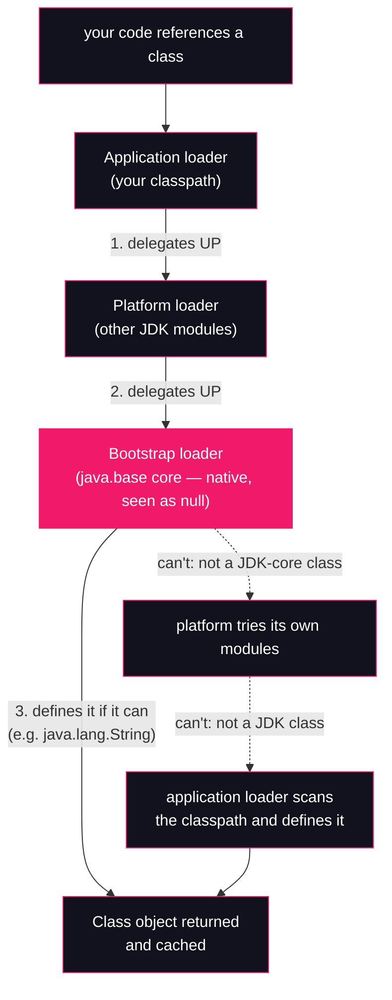

# Lesson 07: The delegation model

## What you'll learn

- The three built-in classloaders of a modern JDK — bootstrap, platform, application — and what happened to the extension classloader you read about in older material
- Parent-first delegation: how a class-load request actually travels, and the two reasons the model exists (security and consistency)
- The vocabulary lessons 08–11 are built on: *defining* vs *initiating* loader, and the class namespace — a class's identity is `(name, defining loader)`, not its name
- Reading `-verbose:class` output as a delegation trace
- Inside the Class Data Sharing archive that lessons 00 and 01 promised: `classes.jsa`, `-Xlog:cds`, `jcmd VM.cds`, and what `-Xshare:off` costs you

---

## Why this matters

Here are three production symptoms that all start in this lesson:

```
java.lang.ClassCastException: class com.acme.Foo cannot be cast to class com.acme.Foo
java.lang.NoClassDefFoundError: com/acme/PaymentService
"it works in my IDE, but not in the app server / the fat jar / the container"
```

The first is two classloaders loading the "same" class into two different namespaces (Lesson 09's demo). The second is a loader that found bytes earlier and can't find them now (Lesson 08 picks up the linking half). The third is a delegation assumption breaking: your IDE, your app server and your container each arrange classloaders differently, and code that implicitly assumed "the one true classpath" falls over.

There is also a startup story. [Lesson 01](../part-0-the-machine/01-jvm-jre-jdk-big-picture.md) showed ~2,500 classes loaded before a one-line program prints, nearly all stamped `source: shared objects file`, and promised this lesson would look inside that file. That promise is kept below — and it turns out the archive is the reason `java -version` answers in milliseconds instead of seconds.

Every classloader bug you will ever debug reduces to the questions this lesson answers: *who was asked, who actually defined the class, and which namespace did it land in?*

---

## The concept

### Three loaders, one chain

A classloader's job is to turn a class name into bytes and bytes into a `Class` object. A stock JDK 9+ JVM has three built-in loaders, arranged in a parent chain:

| Loader | Loads | Java object? |
|---|---|---|
| **Bootstrap** | The core of the platform — `java.base`'s heart: `java.lang.*`, `java.util.*`, the classes the JVM itself can't start without | **No.** It is C++ code inside HotSpot; Java sees it as `null` |
| **Platform** | Much of the rest of the JDK's modules: `java.sql`, `java.net.http`, `jdk.httpserver`, `jdk.zipfs`, ... — the platform, but not *your* code | Yes — `ClassLoader.getPlatformClassLoader()` |
| **Application** (a.k.a. *system*) | Your classpath: your classes and your dependencies | Yes — `ClassLoader.getSystemClassLoader()` |

The split is not as tidy as "core vs the rest": bootstrap keeps some non-core modules too (`java.xml`, for one), and the application loader picks up a few JDK tool modules like `jdk.jcmd`. (Verified on JDK 25 by printing `.getClassLoader()` for a class from each module above — the four platform examples all report `PlatformClassLoader`.) [Lesson 11](11-modules-and-classloading.md) maps the full picture of which module lands on which loader.

Two things in that table surprise people the first time:

1. **`null` is a real answer.** `String.class.getClassLoader()` returns `null` not because something is broken but because the bootstrap loader is native code with no Java object to hand back. Throughout the JDK, `null` classloader *means* bootstrap.
2. **There is no extension classloader anymore.** Pre-JDK 9, between bootstrap and application sat the *extension* loader, which loaded jars from `$JAVA_HOME/lib/ext`. JEP 220 removed the extension mechanism in JDK 9 (the directory is ignored), and JEP 261 replaced the loader with the **platform** classloader, whose job is the module system's: load the JDK's own non-core modules. If a tutorial mentions `sun.misc.Launcher$ExtClassLoader` or `lib/ext`, it is describing a museum.

### Parent-first delegation

The chain is not just an org chart — it is the *search order*. When a loader is asked to load a class, `ClassLoader.loadClass` does this:

1. Already loaded it? Return the cached `Class`.
2. Otherwise, **ask the parent first.** The parent does the same, recursively, up to the bootstrap loader.
3. Only if the parent (chain) could not find the class does the loader look in its **own** sources — the application loader scans the classpath, the platform loader scans its modules.

Requests travel *up*; definitions happen as *high* as possible. Your application loader is asked for `java.lang.String` constantly and has never once loaded it: the request delegates straight up to bootstrap, which has it cached since the first milliseconds of the JVM's life.



Why insist on this order? Two reasons:

- **Security.** If the application loader searched its own sources first, a jar on your classpath could ship a class named `java.lang.String` and intercept everything your program does with strings. Parent-first means the bootstrap definition *always wins* — the impostor never gets asked. (There is a second, harder guard underneath: the JVM refuses to let a non-bootstrap loader define any class in a `java.*` package at all, throwing `SecurityException: Prohibited package name`. Delegation is the polite wall; that check is the armed one.)
- **Consistency.** Every class in the runtime must agree on what `java.lang.String` *is*. Exactly one loader defines it, once, and everyone else receives that single definition. Without a canonical source, two parts of the program could hold two different `String`s and every assignment between them would be a type error.

One honest caveat, which Lesson 09 will exploit: parent-first is a **convention implemented in `ClassLoader.loadClass`**, not a law of the JVM. A custom loader can invert it ("child-first") or bypass it — servlet containers and plugin systems do exactly that, deliberately and carefully. The JVM only enforces the boundaries that matter for its own integrity, like the `java.*` reservation.

### Defining vs initiating loader

Because of delegation, the loader that is *asked* for a class is often not the loader that *produces* it. The JVM tracks both, and lessons 08–10 lean on the distinction:

- The **initiating loader** is the one the request was first handed to — typically the loader of the class containing the reference. When `WhoLoadsWhat` mentions `String`, the application loader *initiates* the load.
- The **defining loader** is the one that ultimately called `defineClass` and created the `Class` object. For `String`, that is the bootstrap loader — every time, no matter who asked.

### Namespaces: a class is `(name, defining loader)`

That distinction leads to the single most important sentence in Part 2:

> **A class's identity inside the JVM is the pair `(binary name, defining loader)` — not the name alone.** (*Binary name* is the JVMS term for what you've been calling the fully-qualified name.)

Each defining loader owns a **namespace**: the set of `(name)` mappings it has defined. Two loaders can load the same `.class` file and produce two *different* types that happen to share a name. Cast one to the other and you get the surreal `ClassCastException: Foo cannot be cast to Foo` from the top of this lesson. Lesson 09 produces that exception on purpose; Lesson 10 shows why those extra copies are how Metaspace leaks happen. For now, pin the vocabulary — everything else in Part 2 is a consequence of it.

### The CDS archive, as promised

[Lesson 00](../part-0-the-machine/00-setup-and-toolchain.md) read `mixed mode, sharing` out of `java -version` and deferred the second word here; [Lesson 01](../part-0-the-machine/01-jvm-jre-jdk-big-picture.md) showed thousands of classes stamped `source: shared objects file` and deferred the file here. Time to pay up.

**Class Data Sharing (CDS)** attacks a simple observation: every JVM on earth loads the same few thousand JDK classes at startup, parses the same bytes, runs the same verification, and builds the same internal metadata — then throws the work away at exit. So the JDK does the work **once, at build time**: the classes are loaded, linked, and their processed metadata serialized into a file, the **shared archive**, shipped at `$JAVA_HOME/lib/server/classes.jsa` (about 15 MB). At startup the JVM **memory-maps** that file instead of parsing class files: the metadata is already in near-final form, so loading an archived class is mostly a pointer fix-up.

Two wins fall out:

- **Startup time.** The expensive parts of classloading (finding bytes, parsing, verifying) are skipped for the archived majority.
- **Memory.** The mapped pages are read-only and shareable, so ten JVMs on one host can share one physical copy of that metadata.

The default archive contains **JDK classes only** — your classes are not in it (archiving application classes, *Application CDS*, is a separate feature you will touch in the hands-on). And `-Xshare:on|off|auto` is the HotSpot dial for the whole mechanism: `on` demands the archive, `off` ignores it, `auto` (the default) uses it when present and valid.

---

## Hands-on

Part 2 dissects classloading itself, so from here on samples are explicitly declared classes compiled with `javac` — the single-file source launcher from Part 0 would hide the very loading steps we want to watch. Work in an empty directory.

### 1. Asking the loaders who they are

`WhoLoadsWhat.java`:

```java
public class WhoLoadsWhat {

    public static void main(String[] args) {
        System.out.println("String.class.getClassLoader()        = "
                + String.class.getClassLoader());
        System.out.println("WhoLoadsWhat.class.getClassLoader()  = "
                + WhoLoadsWhat.class.getClassLoader());
        System.out.println("ClassLoader.getPlatformClassLoader() = "
                + ClassLoader.getPlatformClassLoader());

        System.out.println();
        System.out.println("Parent chain from my class loader:");
        ClassLoader loader = WhoLoadsWhat.class.getClassLoader();
        while (loader != null) {
            System.out.println("  " + loader + "  -> parent: " + loader.getParent());
            loader = loader.getParent();
        }
        System.out.println("  null = the bootstrap loader (native code, no Java object)");
    }
}
```

```bash
javac WhoLoadsWhat.java
java WhoLoadsWhat
```

```
String.class.getClassLoader()        = null
WhoLoadsWhat.class.getClassLoader()  = jdk.internal.loader.ClassLoaders$AppClassLoader@341d43cd
ClassLoader.getPlatformClassLoader() = jdk.internal.loader.ClassLoaders$PlatformClassLoader@1dbd16a6

Parent chain from my class loader:
  jdk.internal.loader.ClassLoaders$AppClassLoader@341d43cd  -> parent: jdk.internal.loader.ClassLoaders$PlatformClassLoader@1dbd16a6
  jdk.internal.loader.ClassLoaders$PlatformClassLoader@1dbd16a6  -> parent: null
  null = the bootstrap loader (native code, no Java object)
```

*(The `@...` identity hashes vary from run to run.)*

The whole concept section in seven lines: `String` reports `null` — bootstrap. Your class reports `AppClassLoader`, whose parent is `PlatformClassLoader`, whose parent is `null`. Three loaders, one chain, exactly as drawn above. Both built-in loaders live in `jdk.internal.loader.ClassLoaders` — they are ordinary JDK classes *implementing* the loaders; the bootstrap loader is the one that isn't a class at all.

### 2. Watching the loads happen

[Lesson 01](../part-0-the-machine/01-jvm-jre-jdk-big-picture.md) introduced `-verbose:class` (the legacy alias for `-Xlog:class+load`); now we read it as a delegation trace. First lines of a run *(timestamps and ordering vary)*:

```bash
java -verbose:class WhoLoadsWhat 2>&1 | head -5
```

```
[0.025s][info][class,load] java.lang.Object source: shared objects file
[0.025s][info][class,load] java.io.Serializable source: shared objects file
[0.025s][info][class,load] java.lang.Comparable source: shared objects file
[0.025s][info][class,load] java.lang.CharSequence source: shared objects file
[0.025s][info][class,load] java.lang.constant.Constable source: shared objects file
```

And your own class, near the end *(timestamp and path vary)*:

```bash
java -verbose:class WhoLoadsWhat 2>&1 | grep "WhoLoadsWhat source"
```

```
[0.063s][info][class,load] WhoLoadsWhat source: file:/home/champez/jvm-internals-samples/lesson07/
```

Two different `source:` values, two different worlds. `java.lang.Object` comes from the `shared objects file` — the CDS archive, defined by the bootstrap loader. `WhoLoadsWhat` comes from a `file:` URL on your classpath — found and defined by the application loader after delegation walked up and back down. (Between those extremes you will also see `source: jrt:/java.base` for JDK classes not in the archive — the `jrt:` filesystem is how the JDK exposes module contents — and `source: __JVM_LookupDefineClass__` for classes spun at runtime, like the `invokedynamic` products of [Lesson 05](../part-1-bytecode/05-invokedynamic.md).)

How much of the work does the archive do? Count *(exact counts vary between JDK builds and runs — treat them as rough magnitudes, not facts to memorize)*:

```bash
java -verbose:class WhoLoadsWhat 2>&1 | grep -c "class,load"
java -verbose:class WhoLoadsWhat 2>&1 | grep -c "shared objects file"
```

```
623
617
```

Of ~620 classes this program loads, ~617 come straight out of the archive. Only a handful — including your one class — are loaded the slow way.

One more grep, because it is oddly satisfying: the three classloaders are themselves classes, and they too come from the archive:

```bash
java -verbose:class WhoLoadsWhat 2>&1 | grep "ClassLoaders"
```

```
[0.032s][info][class,load] jdk.internal.loader.ClassLoaders source: shared objects file
[0.032s][info][class,load] jdk.internal.loader.ClassLoaders$AppClassLoader source: shared objects file
[0.032s][info][class,load] jdk.internal.loader.ClassLoaders$PlatformClassLoader source: shared objects file
[0.034s][info][class,load] jdk.internal.loader.ArchivedClassLoaders source: shared objects file
[0.034s][info][class,load] jdk.internal.loader.ClassLoaders$BootClassLoader source: shared objects file
```

### 3. Inside the archive

Look the promised file in the eye *(path and size vary by installation)*:

```bash
ls -lh "$JAVA_HOME/lib/server/classes.jsa"
```

```
-rw-r--r-- 1 champez champez 15M Sep  5  2025 /home/champez/.sdkman/candidates/java/current/lib/server/classes.jsa
```

Fifteen megabytes of pre-digested class metadata, built when this JDK was built. Now watch the JVM map it at startup. The `-Xlog` family is from [Lesson 00](../part-0-the-machine/00-setup-and-toolchain.md); `cds` is just another tag — first use here, so: `-Xlog:cds` switches on the CDS subsystem's own narration.

```bash
java -Xlog:cds WhoLoadsWhat 2>&1 | grep "\[cds\]" | head -12
```

```
[0.015s][info][cds] trying to map /home/champez/.sdkman/candidates/java/25-zulu/lib/server/classes.jsa
[0.015s][info][cds] Opened shared archive file /home/champez/.sdkman/candidates/java/25-zulu/lib/server/classes.jsa.
[0.015s][info][cds] The shared archive file was created with UseCompressedOops = 1, UseCompressedClassPointers = 1, UseCompactObjectHeaders = 0
[0.015s][info][cds] Core region alignment: 4096
[0.015s][info][cds] ArchiveRelocationMode: 1
[0.015s][info][cds] ArchiveRelocationMode == 1: always map archive(s) at an alternative address
[0.015s][info][cds] Try to map archive(s) at an alternative address
[0.015s][info][cds] Reserved archive_space_rs [0x0000000022000000 - 0x0000000023000000] (16777216) bytes (includes protection zone)
[0.015s][info][cds] Reserved class_space_rs   [0x0000000023000000 - 0x0000000063000000] (1073741824) bytes
[0.015s][info][cds] Mapped static  region #0 at base 0x0000000022001000 top 0x00000000224ab000 (ReadWrite)
[0.015s][info][cds] Mapped static  region #1 at base 0x00000000224ab000 top 0x0000000022d8c000 (ReadOnly)
[0.015s][info][cds] Mapped static  region #2 at base 0x000070fe1f77c000 top 0x000070fe1f7af000 (Bitmap)
```

*(Addresses vary; the sequence does not. Note the path: `ls` above showed the archive through the `current` symlink, but HotSpot canonicalizes it to the real `25-zulu` directory before mapping.)* Read it as a story: open the `.jsa`, sanity-check that it was built with a compatible object layout (`UseCompressedOops` and friends — Lesson 14 explains those), reserve address space, and map three regions — a read-write region, a read-only region, and a bitmap. All by 0.015s. *That* is what `source: shared objects file` means physically.

For the live-process view, `jcmd` from [Lesson 00](../part-0-the-machine/00-setup-and-toolchain.md) has a `VM.cds` command — you saw it listed in `jcmd <pid> help` there. One correction to expectations: `VM.cds` is a **dump** command, not a status command — it writes an archive of the shareable classes a running JVM has loaded. Start something that stays alive:

```java
public class HoldOpen {
    public static void main(String[] args) throws InterruptedException {
        System.out.println("Holding the JVM open for 30 seconds. PID-hunt me with jcmd.");
        Thread.sleep(30_000);
    }
}
```

```bash
javac HoldOpen.java
java HoldOpen &
jcmd -l
```

```
Holding the JVM open for 30 seconds. PID-hunt me with jcmd.
117819 HoldOpen
117843 jdk.jcmd/sun.tools.jcmd.JCmd -l
```

*(PIDs vary; `jcmd` lists itself, as lesson 00 warned.)* Now dump an archive out of the live process — `static_dump` means "all currently loaded, shareable classes":

```bash
jcmd 117819 VM.cds static_dump
```

```
117819:
Static dump: /home/champez/jvm-internals-samples/lesson07/java_pid117819_static.jsa
```

```bash
ls -lh java_pid117819_static.jsa
```

```
-rw-rw-r-- 1 champez champez 9.0M Oct  6 19:52 java_pid117819_static.jsa
```

*(PID, path, timestamp and size vary.)* A 9 MB archive, written by a running JVM about itself. The default `classes.jsa` is exactly this kind of file, produced at JDK build time with the full core-class set — which is why it is bigger.

You can also produce the build-time flavor yourself, into the current directory. `-Xshare:dump` is the companion to `on`/`off`, and `-XX:SharedArchiveFile=` redirects it away from the JDK's own `lib/server` (first use of both — `-XX:` flags are the HotSpot dials lesson 01 warned about):

```bash
java -XX:SharedArchiveFile=my-archive.jsa -Xshare:dump
ls -lh my-archive.jsa
```

```
-rw-rw-r-- 1 champez champez 15M Oct  6 18:53 my-archive.jsa
```

Same ~15 MB as the shipped archive, because it contains the same default class set. And a homemade archive maps just like the shipped one:

```bash
java -XX:SharedArchiveFile=my-archive.jsa -Xlog:cds WhoLoadsWhat 2>&1 | grep "\[cds\]" | head -2
```

```
[0.014s][info][cds] trying to map my-archive.jsa
[0.014s][info][cds] Opened shared archive file my-archive.jsa.
```

### 4. What sharing buys: the `-Xshare:off` control

Every claim above is testable: switch the archive off and watch the difference. `-Xshare:off` tells HotSpot to ignore CDS entirely (first use; it is the control knob for everything in this section).

```bash
java -Xshare:off -verbose:class WhoLoadsWhat 2>&1 | grep -c "class,load"
java -Xshare:off -verbose:class WhoLoadsWhat 2>&1 | grep "java.lang.Object source"
```

```
636
[0.019s][info][class,load] java.lang.Object source: jrt:/java.base
```

*(Count varies by build.)* Two changes, both predicted by the model. The count ticks *up* slightly (~636 vs ~623) — a few helper classes get loaded to do the work the archive was doing. And every `shared objects file` stamp is gone: `java.lang.Object` now comes from `jrt:/java.base`, parsed and linked the slow way like any other class.

And the startup bill, 30 runs back to back *(absolute numbers are this machine's; the ratio is the point — measure your own)*:

```bash
time (for i in $(seq 30); do java WhoLoadsWhat >/dev/null; done)
time (for i in $(seq 30); do java -Xshare:off WhoLoadsWhat >/dev/null; done)
```

```
real	0m3.867s

real	0m9.503s
```

*(user/sys omitted.)* Same bytecode, same output, roughly **2.5× slower** without the archive — for a program that does almost nothing. Scale that ratio to a Spring Boot app loading tens of thousands of classes and you see why `sharing` is the default, and why the CDS/AppCDS family keeps getting investment (AOT caches in newer JDKs are its direct descendants).

---

## Try it yourself

1. Add a line printing `ClassLoader.getSystemClassLoader() == WhoLoadsWhat.class.getClassLoader()`. Predict the result before you run it. Why is "system" and "application" the same object — and which name does the `AppClassLoader` class itself suggest the JDK prefers?
2. Run `java -Xshare:off -Xlog:cds WhoLoadsWhat`. How many `[cds]` lines appear, and what does that tell you about when the archive is even *touched*?
3. With sharing on, run `java -verbose:class WhoLoadsWhat 2>&1 | grep "jrt:/"`. Which JDK classes load the slow way even though they live in `java.base`? Hypothesize why they were left out of the archive — then consider what that implies: the archive is a *chosen subset*, not "all of the JDK".
4. Run `jcmd <pid> VM.cds static_dump my-backup.jsa` against `HoldOpen` with an explicit filename, then `ls -lh` it next to the JDK's `classes.jsa`. Yours is smaller — which classes does the build-time archive have that your running JVM never loaded?
5. Recreate the lesson 01 comparison from this lesson's machinery: run the count command from step 2 of the hands-on against the *source launcher* (`java -verbose:class WhoLoadsWhat.java`) instead of the compiled class. Where did the extra ~1,900 classes (varies) come from?

---

## Common mistakes

- **"`getClassLoader()` returned `null`, so the class has no loader / something is broken."** `null` *is* the bootstrap loader — native code with no Java object to return. For JDK core classes, `null` is the expected, healthy answer.
- **Cargo-culting pre-JDK 9 classloader lore.** The extension classloader is gone; `$JAVA_HOME/lib/ext` is ignored; `sun.misc.Launcher` internals were replaced by `jdk.internal.loader.ClassLoaders`. Three loaders: bootstrap, platform, application. Articles that say otherwise are describing Java 8.
- **Thinking delegation is enforced by the JVM.** Parent-first is the convention inside `ClassLoader.loadClass`; a custom loader can invert or skip it (Lesson 09 does). What the JVM *does* enforce is the `java.*` package reservation and, since modules, much of the visibility graph (Lesson 11).
- **"Two classes with the same fully-qualified name are the same class."** Identity is `(name, defining loader)`. Same name + different defining loader = two unrelated types, and the cast between them is the `Foo cannot be cast to Foo` riddle.
- **Reading `source: shared objects file` as "loaded from a file on disk" in the slow sense.** The archive is *memory-mapped* — the metadata arrives nearly ready-made, pageable and shareable between processes. That is the entire point; a plain file read would be no faster than parsing the `.class`.
- **"CDS caches my application classes."** Not in the default archive — it contains JDK classes chosen at build time. Application CDS exists (you dumped a live archive yourself above), but it is an opt-in you build, not a cache the JVM maintains for you.

---

## Check your understanding

**1. Why does `String.class.getClassLoader()` return `null`, and why is that the *correct* answer rather than an error?**

<details>
<summary>Reveal answer</summary>

`java.lang.String` is defined by the **bootstrap classloader**, which is implemented in native (C++) code inside HotSpot — there is no Java `ClassLoader` object to return, so the API uses `null` to mean "bootstrap". Every core `java.base` class reports the same.

</details>

**2. Your application class references `java.lang.String`. Walk the delegation: which loader *initiates* the load, which loader *defines* the class, and why does the split matter?**

<details>
<summary>Reveal answer</summary>

The **application loader** initiates the load (it is the loader of the class containing the reference, so the request lands on it first). By parent-first delegation it passes the request up: platform, then bootstrap. The **bootstrap loader defines** `String` — once — and every initiating loader in the JVM receives that single definition. The split is what guarantees consistency: no matter who asks, there is exactly one `java.lang.String` in the runtime.

</details>

**3. A colleague "patches" a JDK bug by putting a jar containing their own `java.lang.String` on the application classpath. What stops this — and how many independent guards are there?**

<details>
<summary>Reveal answer</summary>

Two guards. First, **parent-first delegation**: the application loader delegates the request for `java.lang.String` up to bootstrap, which already has the real one cached, so the impostor on the classpath is never even read. Second, even if the bytes are forced in through a custom loader that skips delegation, the JVM **refuses to define classes in `java.*` packages for any non-bootstrap loader**, throwing `SecurityException: Prohibited package name: java.lang`.

</details>

**4. In the `-Xshare:off` run, `java.lang.Object` shows `source: jrt:/java.base` instead of `source: shared objects file`. What physically changed at startup, and what two costs come back?**

<details>
<summary>Reveal answer</summary>

The JVM never mapped `classes.jsa`, so every class — including the core JDK set — must be **found, read, parsed, verified and linked** from the module filesystem (`jrt:`) at runtime. The costs that return are **startup time** (the work CDS precomputed at JDK build time) and **memory sharing** (archived pages are read-only and shareable across JVM processes; runtime-built metadata is per-process).

</details>

**5. A `ClassCastException` says `com.acme.Foo cannot be cast to com.acme.Foo`. Using only this lesson's vocabulary, what are the two `Foo`s, and which Part 2 lessons will make this concrete?**

<details>
<summary>Reveal answer</summary>

They are two classes with the same fully-qualified name but **different defining loaders** — two separate namespace entries `(com.acme.Foo, loaderA)` and `(com.acme.Foo, loaderB)`, hence two unrelated types as far as the JVM is concerned. Lesson 09 creates this exact exception with a custom classloader, and Lesson 10 shows how the duplicate definitions accumulate into a Metaspace leak.

</details>

---

## Recap

- Modern JDKs have **three built-in classloaders** — bootstrap (native, seen as `null`), platform (JDK 9+, replacing the old extension loader), application (your classpath) — chained parent-to-child.
- **Parent-first delegation**: a loader asks its parent before looking itself. It exists for **security** (your classpath can't shadow `java.lang.String`) and **consistency** (one definition of each class per runtime). It is a convention in `loadClass`, not a JVM law.
- The JVM distinguishes the **initiating** loader (who was asked) from the **defining** loader (who produced the `Class`), and a class's identity is the pair **`(name, defining loader)`** — the namespace rule behind Part 2's strangest bugs.
- `-verbose:class` (lesson 01) doubles as a delegation trace: `source: shared objects file` vs `file:` vs `jrt:` tells you which world each class came from.
- **CDS delivered**: `$JAVA_HOME/lib/server/classes.jsa` is a memory-mapped archive of pre-loaded, pre-linked JDK classes built at JDK build time. See it with `-Xlog:cds`, dump one from a live process with `jcmd <pid> VM.cds static_dump`, build your own with `-Xshare:dump`, and measure its value with `-Xshare:off` — here, ~2.5× startup on a trivial program.
- Next: what happens to a class *after* a loader finds it — verification, preparation, resolution and the exact moment `<clinit>` fires.

**Previous:** [Lesson 06 — Generating bytecode with ASM](../part-1-bytecode/06-generating-bytecode-with-asm.md) · **Next:** [Lesson 08 — Loading, linking, initialization](08-loading-linking-initialization.md)
