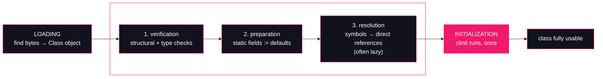

# Lesson 08: Loading, linking, initialization

## What you'll learn

- The three phases every class goes through — loading, linking, initialization — and exactly what each one does
- Linking's three sub-phases: verification, preparation, resolution — and which errors belong to which phase
- The six active-use triggers of JLS §12.4.1, **demonstrated**, plus the two lazy impostors that look like triggers but aren't
- Why reading a `static final` constant never initializes a class, and how `<clinit>` differs from `<init>`

---

## Why this matters

Open a production incident thread and you'll find these exceptions: `ClassNotFoundException`, `NoClassDefFoundError`, `VerifyError` after an instrumentation agent upgrade, `NoSuchMethodError` after a dependency bump, a `NullPointerException` from a static field that "definitely has an initializer". They look like one family — "class stuff broke" — but each is thrown by a **different phase** of a class's journey into the JVM, and each has a different root cause. `ClassNotFoundException` is *loading*: the bytes were never found. `NoClassDefFoundError` is usually *linking*: the class was there at compile time but is gone (or broken) when a reference to it is first used. `VerifyError` is *verification*: the bytes were found but are type-unsafe. `NoSuchMethodError` is *resolution*: the class loaded, but the method you compiled against isn't in it.

And then there's the subtler family: initialization order. A static field read "too early" returns `0`, `false` or `null` — not because the initializer is missing, but because **preparation** ran (setting defaults) and **initialization** hasn't yet. Until you can name the phase, you're debugging blind. After this lesson you won't be.

---

## The concept

A class is not "available" or "not available". It moves through a pipeline, and the JVM tracks exactly how far each class has gotten:



### Loading

[Lesson 07](07-the-delegation-model.md) covered this phase: a classloader finds the bytes of a `.class` file (from disk, a jar, the network, or memory), defines the class, and the JVM creates the `Class` object that represents it. Loading produces a class that *exists* but is not yet *usable* — like a program that has been read into memory but not yet checked or started.

### Linking: verification

The verifier re-reads the class file structures you met in [Lesson 02](../part-1-bytecode/02-anatomy-of-a-class-file.md) and proves them safe to execute: the file is structurally well-formed, every instruction's operands have the right types, the operand stack ([Lesson 03](../part-1-bytecode/03-the-operand-stack.md)) never underflows or holds the wrong type, every branch lands on an instruction boundary, every method returns what its descriptor promises. This is the JVM's security and stability foundation: because verification proves type safety *once, at link time*, the interpreter and JIT can execute bytecode without re-checking every single instruction. A class that fails verification is rejected with `VerifyError` — *before a single byte of it runs*.

### Linking: preparation

The JVM allocates storage for the class's `static` fields and sets each to its **default value**: `0`, `0L`, `0.0`, `false`, `null`. Note what does *not* happen here: your initializers. `static int x = 42;` leaves `x` at `0` after preparation — the `= 42` part is initialization, one phase later. This gap is observable, and the hands-on makes it visible.

### Linking: resolution

Bytecode never embeds targets directly; it embeds indexes into the constant pool ([Lesson 02](../part-1-bytecode/02-anatomy-of-a-class-file.md)) — symbolic names like `Method java/io/PrintStream.println`. Resolution turns those symbols into direct references: real classes, real fields, real methods. HotSpot resolves **lazily**, on first actual use of each entry, so resolving one method's references doesn't force every class it merely mentions to load. Resolution is where `invokedynamic`'s bootstrap method runs ([Lesson 05](../part-1-bytecode/05-invokedynamic.md) watched that happen), and it's where version-skew errors come from: `NoSuchMethodError`, `NoSuchFieldError` and `IncompatibleClassChangeError` mean a symbol that existed at compile time no longer resolves at runtime — a classic dependency-conflict symptom.

### Initialization: the six active-use triggers

Initialization runs the class's static initializers. The JVM is strictly lazy: a class is initialized **immediately before its first active use**, and JLS §12.4.1 enumerates what counts. The six everyday triggers:

1. An instance of the class is created (`new T()`)
2. A `static` method declared by the class is invoked
3. A `static` field declared by the class is **assigned**
4. A `static` field declared by the class is **read**, and the field is not a compile-time constant
5. Reflection actively requests it — `Class.forName("T")`, or reflective `Method`/`Field`/`Constructor` use
6. A **subclass** is initialized — superclasses initialize first

Plus two edge cases: resolving a method handle to a static member (`REF_getStatic` and friends) triggers it, and the JVM's initial class — the one with your `main` — is always initialized before `main` runs.

Two things that look like triggers but **aren't**: the `.class` literal and `ClassLoader.loadClass(...)`. Both produce a `Class` object; neither initializes. And one trigger with a hole in it: reading a `static final` **compile-time constant** — that isn't an active use at all, for reasons the hands-on will show in bytecode.

### `<clinit>`: the method nobody wrote

You never write an initialization method, but `javac` builds one. It takes every `static` field initializer and every `static {}` block, **in textual order**, and concatenates them into a single synthetic method named `<clinit>` — the static twin of `<init>`, which does the same job for instance initializers and constructors. The JVM guarantees `<clinit>` runs **at most once per class loader** (Lesson 09 explores what "per class loader" means once loaders multiply), and — JLS §12.4.2 — it runs while holding the class's **initialization lock**. Other threads that trigger initialization block until the first thread finishes; a recursive request from the *same* thread is allowed to proceed immediately. That lock is why lazy-initialized singletons are thread-safe for free — and why two classes that touch each other from static initializers on *different* threads can deadlock, a flavor of liveness failure the [concurrency course's liveness lesson](https://github.com/Dancan254/concurreny-multithreading/blob/master/lessons/part-2-shared-state/09-liveness.md) covers in general form.

### Why constants don't trigger

Trigger 4 has that "not a constant" carve-out because there is nothing to trigger *on*. `public static final String GREETING = "..."` is a **constant variable** (JLS §4.12.4): `javac` inlines its value into every class that uses it (JLS §13.1). The compiled caller contains the string itself, not a reference to the declaring class — so at runtime there is no field access to observe, and no class to initialize. You'll see the caller's bytecode below: the `getstatic` is simply gone.

---

## Hands-on

Part 2 dissects classloading, so — like Part 1 — we compile explicit classes with `javac` rather than using the source launcher. `javap -c` was introduced in [Lesson 03](../part-1-bytecode/03-the-operand-stack.md) and `-p` in [Lesson 02](../part-1-bytecode/02-anatomy-of-a-class-file.md); the class-load logging comes from [Lesson 01](../part-0-the-machine/01-jvm-jre-jdk-big-picture.md) and [Lesson 07](07-the-delegation-model.md).

### 1. A constant access initializes nothing — and loads nothing

`Lazy.java` — a class that announces its own initialization:

```java
public class Lazy {

    public static final String GREETING = "hello from a compile-time constant";

    public static int touched;

    static {
        System.out.println(">>> Lazy initialized (<clinit> ran)");
    }

    public static void report() {
        System.out.println("Lazy.report() called");
    }
}
```

`ConstantReader.java` — a caller that only touches the constant:

```java
public class ConstantReader {

    public static void main(String[] args) {
        System.out.println("before constant access");
        System.out.println(Lazy.GREETING);
        System.out.println("after constant access");
    }
}
```

Compile both, run the reader:

```bash
javac Lazy.java ConstantReader.java
java ConstantReader
```

```
before constant access
hello from a compile-time constant
after constant access
```

No `>>> Lazy initialized` line. `Lazy`'s `<clinit>` never ran, despite `Lazy.GREETING` appearing in the source. The reason is in `ConstantReader`'s own bytecode:

```bash
javap -c ConstantReader
```

```
  public static void main(java.lang.String[]);
    Code:
         0: getstatic     #7                  // Field java/lang/System.out:Ljava/io/PrintStream;
         3: ldc           #13                 // String before constant access
         5: invokevirtual #15                  // Method java/io/PrintStream.println:(Ljava/lang/String;)V
         8: getstatic     #7                  // Field java/lang/System.out:Ljava/io/PrintStream;
        11: ldc           #23                 // String hello from a compile-time constant
        13: invokevirtual #15                  // Method java/io/PrintStream.println:(Ljava/lang/String;)V
        16: getstatic     #7                  // Field java/lang/System.out:Ljava/io/PrintStream;
        19: ldc           #25                  // String after constant access
        21: invokevirtual #15                  // Method java/io/PrintStream.println:(Ljava/lang/String;)V
        24: return
```

*(Constructor omitted.)*

Offset `11` is the whole story: `ldc #23`, loading the string **directly from `ConstantReader`'s own constant pool**. There is no `getstatic` on `Lazy`, no `Fieldref` to `Lazy.GREETING` — `javac` copied the value across at compile time. Reading this class's bytecode, you cannot tell `Lazy` exists.

It goes further than "no initialization". Watch class loading itself (`-Xlog:class+load` is the unified-logging selector behind `-verbose:class`, introduced in [Lesson 01](../part-0-the-machine/01-jvm-jre-jdk-big-picture.md); [Lesson 07](07-the-delegation-model.md) uses it heavily):

```bash
java -Xlog:class+load=info ConstantReader 2>&1 | grep Lazy
```

```
(no output — Lazy is never even loaded)
```

Not initialized — *not loaded*. The constant's declaring class can vanish entirely between compile time and runtime and this program would never notice. (The flip side, and a real build-system gotcha: if `Lazy.GREETING`'s value *changes* and you recompile only `Lazy`, `ConstantReader` keeps the old inlined value until it too is recompiled.)

### 2. The six triggers, one JVM run each

`Triggers.java` takes a scenario name and brackets each candidate trigger with `before`/`after` prints, so the position of the `>>>` line tells us exactly when `<clinit>` fires. `Sub.java` is a trivial subclass used by the last scenario:

```java
public class Sub extends Lazy {

    static {
        System.out.println(">>> Sub initialized (<clinit> ran)");
    }
}
```

```java
public class Triggers {

    public static void main(String[] args) throws Exception {
        switch (args[0]) {
            case "class-literal" -> {
                System.out.println("before Lazy.class");
                Class<?> c = Lazy.class;
                System.out.println("after Lazy.class: " + c.getName());
            }
            case "loadClass" -> {
                System.out.println("before loadClass");
                Class<?> c = ClassLoader.getSystemClassLoader().loadClass("Lazy");
                System.out.println("after loadClass: " + c.getName());
            }
            case "forName" -> {
                System.out.println("before Class.forName");
                Class<?> c = Class.forName("Lazy");
                System.out.println("after Class.forName: " + c.getName());
            }
            case "new" -> {
                System.out.println("before new Lazy()");
                new Lazy();
                System.out.println("after first new Lazy()");
                new Lazy();
                System.out.println("after second new Lazy()");
            }
            case "static-method" -> {
                System.out.println("before Lazy.report()");
                Lazy.report();
                System.out.println("after Lazy.report()");
            }
            case "static-field" -> {
                System.out.println("before Lazy.touched");
                Lazy.touched = 1;
                System.out.println("after Lazy.touched = " + Lazy.touched);
            }
            case "subclass" -> {
                System.out.println("before new Sub()");
                new Sub();
                System.out.println("after new Sub()");
            }
            default -> System.out.println("unknown scenario: " + args[0]);
        }
    }
}
```

Compile everything, then run each scenario in its own JVM (initialization is once per class *per JVM run*, so each scenario needs a fresh process):

```bash
javac Lazy.java Sub.java Triggers.java
java Triggers class-literal
java Triggers loadClass
java Triggers forName
java Triggers new
java Triggers static-method
java Triggers static-field
java Triggers subclass
```

The two impostors first — both produce a `Class` object, neither initializes:

```
before Lazy.class
after Lazy.class: Lazy
```

```
before loadClass
after loadClass: Lazy
```

`ClassLoader.loadClass` does exactly what the phase diagram says: *loading* only. No linking, no initialization. `Class.forName`, by contrast, is an explicit request for an initialized class:

```
before Class.forName
>>> Lazy initialized (<clinit> ran)
after Class.forName: Lazy
```

Then the four everyday triggers — instance creation, static method, static field, and (via the subclass) superclass-before-subclass ordering:

```
before new Lazy()
>>> Lazy initialized (<clinit> ran)
after first new Lazy()
after second new Lazy()
```

```
before Lazy.report()
>>> Lazy initialized (<clinit> ran)
Lazy.report() called
after Lazy.report()
```

```
before Lazy.touched
>>> Lazy initialized (<clinit> ran)
after Lazy.touched = 1
```

```
before new Sub()
>>> Lazy initialized (<clinit> ran)
>>> Sub initialized (<clinit> ran)
after new Sub()
```

Three things to read out of these:

1. `<clinit>` fires **between** the `before` and `after` prints — immediately before the first active use, not at class-load time, not at JVM startup.
2. The `new` scenario creates two instances but prints `>>>` **once**. Initialization is a one-shot event per class loader.
3. Initializing `Sub` initializes `Lazy` **first** — trigger 6 recurses up the hierarchy before the subclass's own `<clinit>` runs.

The reflective asymmetry (`loadClass` lazy, `forName` eager) is not an accident: frameworks use the lazy form when they want to inspect a class without running its static initializers, and `Class.forName` has a three-argument overload — `forName(name, initialize, loader)` — that makes the choice explicit.

### 3. Preparation, visible: the static field that is temporarily zero

The claim was that preparation assigns defaults and initializers run later. `Circular.java` makes that gap observable by having two classes' initializers touch each other:

```java
public class Circular {

    public static void main(String[] args) {
        System.out.println("A.x = " + A.x);
        System.out.println("B.y = " + B.y);
    }
}

class A {

    static int x = B.y + 1;

    static {
        System.out.println(">>> A initialized: x=" + x);
    }
}

class B {

    static int y = A.x + 1;

    static {
        System.out.println(">>> B initialized: y=" + y);
    }
}
```

```bash
javac Circular.java
java Circular
```

```
>>> B initialized: y=1
>>> A initialized: x=2
A.x = 2
B.y = 1
```

Trace it against the phase rules. `main` reads `A.x` → trigger 4 → `A` starts initializing → `A.x`'s initializer reads `B.y` → trigger 4 → `B` starts initializing → `B.y`'s initializer reads `A.x`. But `A` is *already initializing, on this same thread* — the initialization-lock rule (JLS §12.4.2) treats a recursive same-thread request as complete and lets it proceed. So `B` reads `A.x` **as preparation left it: `0`**, computes `y = 0 + 1 = 1`, and finishes. Control returns to `A.x = B.y + 1 = 2`.

That `1` in `B.y` is preparation made visible: `A.x` was read *after* its storage existed (preparation) but *before* its initializer ran (initialization). In real code this is the static-initializer-order bug — a field observed at its default value because the read happened mid-initialization. Note also that the same cycle across **two threads** doesn't resolve this way: each thread waits on the other's initialization lock, and you have a deadlock.

### 4. `<clinit>` and `<init>` in the class file

Nothing about `<clinit>` is magic — it's a method in the class file, and `javap` shows it. Here's `A` from the previous section:

```bash
javap -c -p A
```

```
class A {
  static int x;

  A();
    Code:
         0: aload_0
         1: invokespecial #1                  // Method java/lang/Object."<init>":()V
         4: return

  static {};
    Code:
         0: getstatic     #7                  // Field B.y:I
         3: iconst_1
         4: iadd
         5: putstatic     #13                 // Field x:I
         8: getstatic     #18                 // Field java/lang/System.out:Ljava/io/PrintStream;
        11: getstatic     #13                 // Field x:I
        14: invokedynamic #24,  0             // InvokeDynamic #0:makeConcatWithConstants:(I)Ljava/lang/String;
        19: invokevirtual #28                 // Method java/io/PrintStream.println:(Ljava/lang/String;)V
        22: return
}
```

`javap` prints the constructor as `A();` and `<clinit>` as `static {};`, but look at what `static {};` *contains*: first the field initializer (`B.y + 1` computed and stored into `x`, offsets 0–5), then the static block (offsets 8–22), **in the textual order of the source**. One synthetic method, glued together from both. (And offset 14 is a cameo from [Lesson 05](../part-1-bytecode/05-invokedynamic.md): the `"x=" + x` concatenation inside the block is an indified `makeConcatWithConstants` call.)

The real method names live in the constant pool as `Utf8` entries:

```bash
javap -v Lazy | grep -E "Utf8 +<(cl)?init>"
```

```
   #5 = Utf8               <init>
  #35 = Utf8               <clinit>
```

`<init>` and `<clinit>` are deliberately illegal Java identifiers — you can never declare a method with either name in source, so the JVM's two lifecycle methods can never collide with yours. The differences that matter:

| | `<init>` | `<clinit>` |
|---|---|---|
| Glued from | instance field initializers, instance blocks, constructor body | `static` field initializers, `static {}` blocks |
| Runs when | every `new` (called by the `new`/`dup`/`invokespecial` sequence from [Lesson 04](../part-1-bytecode/04-invocation-opcodes.md)) | once per class loader, at first active use |
| Locking | none needed — the object isn't shared yet | the class initialization lock (JLS §12.4.2) |

### 5. Link-time failure: a `VerifyError` on purpose

Finally, proof that verification is a distinct phase — one that runs *after* loading and *before* execution. `BadMath.java` is deliberately boring:

```java
public class BadMath {

    public static int answer() {
        return 111;
    }
}
```

`Linking.java` separates the phases: it first *loads* `BadMath` lazily, then *actively uses* it:

```java
public class Linking {

    public static void main(String[] args) throws Exception {
        System.out.println("step 1: loadClass (loading only, no linking)");
        Class<?> c = ClassLoader.getSystemClassLoader().loadClass("BadMath");
        System.out.println("loaded OK: " + c.getName());

        System.out.println("step 2: first active use (linking must happen now)");
        System.out.println(BadMath.answer());
    }
}
```

Compile and run — everything is fine:

```bash
javac BadMath.java Linking.java
java Linking
```

```
step 1: loadClass (loading only, no linking)
loaded OK: BadMath
step 2: first active use (linking must happen now)
111
```

Now corrupt `BadMath.class` — not randomly, but surgically. `javap -c BadMath` shows `answer()` is three bytes of bytecode: `bipush 111` (`0x10 0x6f`) then `ireturn` (`0xac`). Find them near the end of the file with `xxd` (a hex dumper):

```bash
xxd BadMath.class
```

```
...
000000d0: 0100 0000 0000 0310 6fac 0000 0001 000a  ........o.......
...
```

*(Full dump omitted; the exact offsets shift if you edit the source — find the `10 6f ac` sequence in your own dump. Here it starts at offset `0xd7`.)*

The plan: flip `ireturn` (`0xac`, return an `int`) to `areturn` (`0xb0`, return a *reference*). The method will then push an `int` and try to return it as an object — type-incorrect bytecode that no `javac` would ever emit. `dd` overwrites a single byte in place (`seek` is the decimal offset: `0xd9` = 217):

```bash
printf '\xb0' | dd of=BadMath.class bs=1 seek=217 conv=notrunc
```

The file is still a structurally valid class file — `javap` reads it without complaint, because `javap` *disassembles*; it does not *verify*:

```bash
javap -c BadMath
```

```
  public static int answer();
    Code:
         0: bipush        111
         2: areturn
```

But the JVM's verifier is not `javap`. Run the program again:

```bash
java Linking
```

```
step 1: loadClass (loading only, no linking)
loaded OK: BadMath
step 2: first active use (linking must happen now)
Exception in thread "main" java.lang.VerifyError: Bad type on operand stack
Exception Details:
  Location:
    BadMath.answer()I @2: areturn
  Reason:
    Type integer (current frame, stack[0]) is not assignable to reference type
  Current Frame:
    bci: @2
    flags: { }
    locals: { }
    stack: { integer }
  Bytecode:
    0000000: 106f b0

	at Linking.main(Linking.java:9)
```

Read the ordering carefully — it's the whole lesson in one stack trace. **Step 1 still succeeds**: the corrupted class *loads* fine, because loading checks structure, not type safety. The `VerifyError` fires only when the first active use forces **linking**, and the verifier — walking the operand stack exactly as [Lesson 03](../part-1-bytecode/03-the-operand-stack.md) described — catches `areturn` trying to return an `int` (`stack: { integer }`) as a reference. The error names the phase (`VerifyError`), the instruction (`@2: areturn`), and the exact type violation. Not one byte of `BadMath` executed.

Corrupted class files in the wild come from truncated downloads, bad redeploys, or bytecode tools (weavers, agents, obfuscators) emitting something invalid — and now you know why the failure surfaces at first use rather than at startup. To restore sanity, recompile: `javac BadMath.java`.

---

## Try it yourself

1. Make the constant non-constant: change `Lazy.GREETING` to `public static final String GREETING = "hello".toUpperCase();` (a method call — no longer a constant variable). Recompile *both* files, re-run `java ConstantReader`, and re-check `javap -c ConstantReader`. What replaced the `ldc`, and why does `<clinit>` now run?
2. Add a scenario that reads `Sub.touched` (a field `Sub` *inherits* but does not declare). Predict which class(es) initialize, then run it. What does the result tell you about trigger 4 and the phrase "declared by"?
3. Run `java -Xlog:class+load=info Triggers new` and find the `Lazy` load line. What does the gap between it and the `>>>` line confirm about loading versus initialization?
4. Corrupt `BadMath.class` differently: overwrite its first four bytes instead of the `ireturn`. Which error do you get now, and which *phase* throws it? (Compare with [Lesson 02](../part-1-bytecode/02-anatomy-of-a-class-file.md)'s magic-number check.) Why is the timing of the failure different from the `VerifyError`?
5. Replace `Class.forName("Lazy")` with `Class.forName("Lazy", false, ClassLoader.getSystemClassLoader())` in the `forName` scenario. Predict the output, then run.

---

## Common mistakes

- **"The static block runs when the class loads."** It runs at *initialization*, which is after loading *and* linking, and only on first active use. The `loadClass` scenario proves the gap: class in hand, `<clinit>` not run. Code that assumes "loaded ⇒ initialized" breaks exactly when a framework switches from `forName` to the lazy forms.
- **"`static final` never triggers initialization."** Only *constant variables* — compile-time constants inlined by `javac` — get that exemption. `static final Random RANDOM = new Random();` is `final` but not a constant: reading it is a full active use and runs `<clinit>`. `final` is about reassignment, not about initialization.
- **"`ClassNotFoundException` and `NoClassDefFoundError` are interchangeable."** They're different phases. `ClassNotFoundException` is a *loading* failure: an explicit load (`forName`, `loadClass`, a custom loader) couldn't find the bytes — a classpath problem. `NoClassDefFoundError` is a *linking* failure: the class was present at compile time, some other class's constant pool refers to it, and it's missing or unloadable when that reference is first resolved — typically a dependency that vanished from the runtime classpath, or a class whose earlier initialization failed. The second one often arrives wrapped in `ExceptionInInitializerError` history.
- **"Verification happens when the class file is read."** Loading checks structure (magic number, layout); the type-safety proof is linking's job. That's why `javap` and `loadClass` both accepted the corrupted `BadMath` — and why bytecode-manipulation bugs in agents and weavers detonate at first use, far from their cause.
- **Reading a static field during circular initialization and trusting its value.** During initialization, a class's statics may hold only their prepared defaults (`0`/`false`/`null`). The `Circular` demo produced `B.y = 1` from an `A.x` that "equals 2". Static state that depends on another class's static state is an order dependency — treat it with the same suspicion as a data race.
- **Assuming initialization errors are retryable.** A class whose `<clinit>` throws is marked erroneous, and the JVM wraps the cause in `ExceptionInInitializerError`. Every later attempt to use that class in the same class loader gets `NoClassDefFoundError: Could not initialize class ...` — the original cause appears exactly once, so capture it when it happens.

---

## Check your understanding

**1. `ConstantReader` prints `Lazy.GREETING`, yet `Lazy` is never initialized — in fact never loaded. What two mechanisms produce this result?**

<details>
<summary>Reveal answer</summary>

Compile-time inlining and lazy loading. `GREETING` is a constant variable, so `javac` copies its value into `ConstantReader`'s own constant pool (JLS §13.1) — the bytecode holds `ldc "hello from a compile-time constant"` with no reference to `Lazy` at all. Since nothing in `ConstantReader`'s bytecode refers to `Lazy`, the JVM never has a reason to load it, let alone initialize it.

</details>

**2. `ClassLoader.loadClass("Lazy")` and `Class.forName("Lazy")` both return `Lazy`'s `Class` object. What differs, and when would a framework choose each?**

<details>
<summary>Reveal answer</summary>

`loadClass` performs loading only — the class is not linked and not initialized, so `<clinit>` does not run. `Class.forName` loads, links *and initializes* — it is an active use (trigger 5). A framework chooses `loadClass` when it wants to inspect a class (read annotations, check supertypes) without triggering the side effects of static initializers, and `forName` when it actually intends to use the class. `Class.forName(name, initialize, loader)` makes the decision explicit.

</details>

**3. In the `Circular` demo, `B.y` ended up `1` even though `A.x` is `2`. Which two phase rules make that the *correct* result?**

<details>
<summary>Reveal answer</summary>

Preparation and the recursive-initialization rule. Preparation gave `A.x` storage with the default value `0` before any initializer ran. Then, when `B`'s initializer read `A.x` while `A` was mid-initialization on the same thread, JLS §12.4.2 treated the recursive request as already satisfied and let the read proceed — so `B` saw the prepared `0` and computed `y = 0 + 1 = 1`. `A.x`'s own initializer ran only afterwards, producing `2`.

</details>

**4. The corrupted `BadMath.class` loaded successfully (`loadClass` printed `loaded OK`) and `javap` disassembled it happily — yet the JVM refused to run it. Why did the failure surface at `BadMath.answer()`'s first call rather than at load time?**

<details>
<summary>Reveal answer</summary>

Because type-safety checking is verification, and verification is part of *linking*, which HotSpot performs lazily — on first active use, not at load time. Loading only checks that the file is structurally a class file; `javap` only disassembles. The `ireturn`→`areturn` flip left the structure intact but made the bytecode type-incorrect (returning an `int` as a reference), which is precisely what the verifier exists to reject — with `VerifyError`, before any of the method's code executes.

</details>

**5. Both `<init>` and `<clinit>` are glue methods synthesized by `javac`. What goes into each, and why can `<clinit>` rely on the JVM where `<init>` cannot?**

<details>
<summary>Reveal answer</summary>

`<init>` glues instance field initializers, instance initializer blocks and the constructor body; it runs on every `new`. `<clinit>` glues `static` field initializers and `static {}` blocks in textual order; it runs at most once per class loader, at first active use. `<clinit>` runs under the class initialization lock (JLS §12.4.2), so concurrent first-use from many threads is made thread-safe by the JVM itself. `<init>` gets no such lock — it doesn't need one, because the object under construction isn't normally visible to other threads yet (unless the constructor lets `this` escape).

</details>

**6. A teammate initializes `Sub` and is surprised that `Lazy`'s `<clinit>` ran *before* `Sub`'s. Is that the specified order, and why?**

<details>
<summary>Reveal answer</summary>

Yes. Trigger 6 says initializing a class first initializes its direct superclass (recursively, up to `Object`). `Sub`'s static initializers may depend on `Lazy`'s static state, so the superclass must be fully initialized before the subclass's `<clinit>` runs — the captured output shows `>>> Lazy initialized` ahead of `>>> Sub initialized`. (Interfaces are different: initializing a class does *not* initialize the interfaces it implements, unless a default method is actually invoked.)

</details>

---

## Recap

- A class moves through **loading → linking (verification, preparation, resolution) → initialization**, and the JVM tracks each class's position; most "class weirdness" in production is a failure in exactly one of these phases.
- **Verification** proves bytecode type-safe before it runs (`VerifyError`); **preparation** zeroes static fields; **resolution** turns constant-pool symbols into direct references, lazily (`NoSuchMethodError` and friends).
- Initialization runs **`<clinit>`** — `javac`'s glue of static initializers and static blocks, in textual order — at most once per class loader, immediately before the first **active use**: instance creation, static method call, static field write, non-constant static field read, explicit reflection, or subclass initialization.
- `.class` literals and `ClassLoader.loadClass` are *not* active uses; `Class.forName` is. A `static final` compile-time **constant** isn't even a field access — `javac` inlines it, and the declaring class may never load.
- Initialization is serialized by a per-class **initialization lock**: thread-safe lazy singletons for free, and class-initialization deadlocks when two threads initialize mutually dependent classes.

**Previous:** [Lesson 07 — The delegation model](07-the-delegation-model.md) · **Next:** [Lesson 09 — Custom classloaders](09-custom-classloaders.md)
