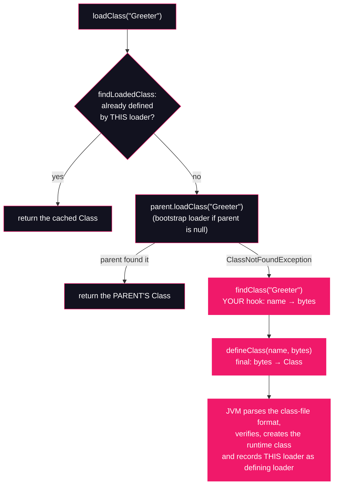

# Lesson 09: Custom classloaders

## What you'll learn

- How a `ClassLoader` turns a `byte[]` into a live class: the three jobs of `loadClass`, `findClass` and `defineClass`
- Why a class's identity is **(binary name, defining loader)** — and what a classloader *namespace* is
- The classic production error: `class Greeter cannot be cast to class Greeter`
- Parent-first versus child-first delegation, and when you would actually write a classloader: plugins, isolation, hot-reload

---

## Why this matters

Read this stack trace line, from a real deployment:

```
java.lang.ClassCastException: class com.acme.Plugin cannot be cast to class com.acme.Plugin
(com.acme.Plugin is in unnamed module of loader com.acme.PluginLoader @7e9e5f8a;
 com.acme.Plugin is in unnamed module of loader 'app')
```

A class being cast to *itself*, rejected. Nothing is wrong with the cast in the source code — the problem is that the JVM never believed the two `Plugin`s were the same class in the first place. Until you know what a classloader namespace is, this message is nonsense; after this lesson, it tells you exactly what happened and where to look.

[Lesson 06](../part-1-bytecode/06-generating-bytecode-with-asm.md) generated a class with ASM and loaded it with `MethodHandles.Lookup#defineClass`, which defines the bytes into the *same* loader, package and module as the lookup class — as if the class had been on the classpath all along. It promised the classic alternative: a custom `ClassLoader` that owns the loading itself. This lesson builds it, and the twist a custom loader adds is the whole point: it defines classes into a **new namespace**, separate from the application's.

That capability is not exotic. Every plugin system, every application server (Tomcat loads each webapp with its own loader), every hot-reload tool (Spring DevTools, JRebel) and every Java agent (lesson 30) is a consumer of the mechanics you will run by hand below.

---

## The concept

### Three methods, three jobs

`java.lang.ClassLoader` is designed as a template. Three methods matter, and they have strictly separate jobs:

| Method | Job | Your relationship to it |
|---|---|---|
| `loadClass(name)` | The **delegation algorithm**: decide *who* should load this class | The template method. Call it; override it only to change delegation itself (child-first, below) |
| `findClass(name)` | The **finding hook**: turn a name into bytes, then define them | The method you override in a normal custom loader |
| `defineClass(name, bytes, off, len)` | The **definition gate**: hand bytes to the JVM and get a `Class<?>` back | `protected final` — never overridden, never touches disk by itself |

`loadClass` implements the parent-first delegation model from [Lesson 07](07-the-delegation-model.md):



Read the two exits carefully: if the parent can define the class, **`findClass` never runs** — the custom loader is a bystander. `findClass` only gets its chance when the whole parent chain has thrown `ClassNotFoundException`.

`defineClass` is where the bytes cross into the JVM. It parses the class-file structures from [Lesson 02](../part-1-bytecode/02-anatomy-of-a-class-file.md), runs the verification [Lesson 08](08-loading-linking-initialization.md) dissects, creates the runtime class — and records the loader it was called on as the class's **defining loader**. That record is permanent, and it is what the next section is about.

### Namespaces: identity is (name, defining loader)

The JVM does not identify a class by its name, nor by its bytes. A runtime class's identity is the pair **(binary name, defining loader)**. Consequences:

- The *same* `Greeter.class` bytes, defined through two different loader instances, produce **two different classes** that happen to share a name. Each loader has its own **namespace** — its own set of name → class mappings.
- `instanceof`, casts, `==` on `Class<?>` objects, and static fields are all keyed on that pair. Two `Greeter`s from two namespaces are as unrelated as `Greeter` and `Zebra`, and each has its own copy of any static state.
- The defining loader also becomes the *initiating* loader for the class's own references: when a plugin-`Greeter` resolves its superclass `java.lang.Object`, it asks its own loader, which delegates to bootstrap — so both namespaces agree on the JDK's classes while disagreeing about `Greeter`.

This is exactly what the production `ClassCastException` was reporting: two classes, same name, different defining loaders.

### Parent-first versus child-first

Default `loadClass` is **parent-first**: the parent defines a class if it possibly can, and the child only defines what the parent cannot see. That gives you one consistent view of the platform — there is one `java.lang.Object`, and one `Greeter` if it's on the application classpath.

Some systems need the opposite. A servlet container wants each webapp to use *its own* copy of a library even when the container also has one, so webapp loaders like Tomcat's are **child-first** for webapp classes: try `findClass` before delegating. Child-first is powerful and dangerous in equal measure — every class the child defines for itself is a new namespace the rest of the application can't cast across — so real containers apply it selectively (webapp classes child-first, JDK and container classes still parent-first).

### When you'd actually write one

- **Plugins**: classes unknown at compile time, discovered in a directory or jar at runtime. (For the ready-made version, `URLClassLoader` finds bytes in jars and directories without you writing the I/O — Lesson 06's last exercise pointed at it.)
- **Isolation**: running two incompatible versions of a library in one JVM — each in its own namespace, so their classes never collide.
- **Hot-reload**: a class, once defined in a loader, can never be redefined there. "Reloading" means *discarding the loader* and defining the class fresh in a new instance — which is why two loader instances below produce two classes. Every discarded loader must also be collectable, or it leaks Metaspace; that failure mode is all of [Lesson 10](10-classloader-leaks.md).
- **Transformed or generated bytes**: Java agents rewrite bytecode between the filesystem and `defineClass` (lesson 30), and Lesson 06's ASM output could just as well feed a custom loader as `Lookup#defineClass`.

One concurrency footnote, where this course meets the [concurrency course](https://github.com/Dancan254/concurreny-multithreading/blob/master/lessons/part-2-shared-state/09-liveness.md): `loadClass` synchronizes during loading, and before JDK 7 that lock was the loader instance itself — cyclic delegation between loaders on multiple threads could deadlock. Since JDK 7 a loader can call `registerAsParallelCapable()` and lock per class *name* instead; `ClassLoader`'s built-in subclasses are parallel-capable. Loading is concurrent code, with the same liveness rules as everything else.

---

## Hands-on

Part 2 lessons use explicitly declared classes compiled with `javac`, because we are dissecting the loading itself and want the `.class` artifacts exactly where we put them. Work in an empty directory.

### 1. Loading a class from raw bytes

Two cooperating classes. The "plugin" — compiled into a `plugins/` directory, deliberately *off* the application classpath:

`Greeter.java`:

```java
public class Greeter {

    public String greet(String name) {
        return "Hello, " + name + "!";
    }
}
```

The loader — a `ClassLoader` subclass that overrides only `findClass`: read the bytes, hand them to `defineClass`:

`ByteLoader.java`:

```java
import java.io.IOException;
import java.nio.file.Files;
import java.nio.file.Path;

public class ByteLoader extends ClassLoader {

    private final Path classDir;

    public ByteLoader(Path classDir) {
        this.classDir = classDir;
    }

    public ByteLoader(Path classDir, ClassLoader parent) {
        super(parent);
        this.classDir = classDir;
    }

    @Override
    protected Class<?> findClass(String name) throws ClassNotFoundException {
        Path file = classDir.resolve(name + ".class");
        if (!Files.exists(file)) {
            throw new ClassNotFoundException(name);
        }
        try {
            byte[] bytes = Files.readAllBytes(file);
            return defineClass(name, bytes, 0, bytes.length);
        } catch (IOException e) {
            throw new ClassNotFoundException(name, e);
        }
    }

    public static void main(String[] args) throws Exception {
        ByteLoader loader = new ByteLoader(Path.of("plugins"));
        Class<?> greeterClass = loader.loadClass("Greeter");
        System.out.println("loaded: " + greeterClass);
        System.out.println("by:     " + greeterClass.getClassLoader());

        Object greeter = greeterClass.getDeclaredConstructor().newInstance();
        Object hello = greeterClass.getMethod("greet", String.class).invoke(greeter, "world");
        System.out.println("greet:  " + hello);
    }
}
```

Compile the plugin into `plugins/`, compile the loader, run:

```bash
javac -d plugins Greeter.java
javac ByteLoader.java
java ByteLoader
```

*(The identity hash after `@` varies from run to run.)*

```
loaded: class Greeter
by:     ByteLoader@7344699f
greet:  Hello, world!
```

Trace what happened against the flowchart. `loader.loadClass("Greeter")` delegated parent-first to the application loader — which could not find `Greeter`, because `plugins/` is not on the classpath. `ClassNotFoundException` fell through to `findClass`, which read `plugins/Greeter.class` and called `defineClass`. The defining loader of the resulting class is our `ByteLoader` instance — that is the `@7344699f` line. Note that `main` can't say `new Greeter()` or `(Greeter) greeter`: the class isn't visible to `ByteLoader`'s own compilation or loader, so instantiation and invocation go through reflection.

Watch the JVM confirm the unusual origin (`-verbose:class` is [Lesson 01](../part-0-the-machine/01-jvm-jre-jdk-big-picture.md)'s flag — the alias for `-Xlog:class+load`):

```bash
java -verbose:class ByteLoader 2>&1 | grep Greeter
```

*(Timestamp varies.)*

```
[0.122s][info][class,load] Greeter source: __JVM_DefineClass__
```

Not `source: file:...`, not `source: shared objects file` — `__JVM_DefineClass__` means these bytes entered the JVM through `defineClass`, from a place the classloading log doesn't consider a location. A class with no address.

### 2. Namespaces: three Greeters, one name

Now put `Greeter` back on the classpath *and* load it through two separate `ByteLoader` instances. `NamespaceDemo` references `Greeter` directly (so the application loader defines a copy), and creates two custom loaders — each given the **platform** classloader as parent, so delegation can't reach the application loader's copy. Real plugin systems get the same effect the other way around: the plugin classes simply aren't on the application classpath.

`NamespaceDemo.java`:

```java
import java.nio.file.Path;

public class NamespaceDemo {

    public static void main(String[] args) throws Exception {
        Greeter appGreeter = new Greeter();

        ClassLoader platform = ClassLoader.getPlatformClassLoader();
        ByteLoader one = new ByteLoader(Path.of("plugins"), platform);
        ByteLoader two = new ByteLoader(Path.of("plugins"), platform);

        Class<?> a = one.loadClass("Greeter");
        Class<?> b = two.loadClass("Greeter");

        System.out.println("app: " + appGreeter.getClass() + ", defined by " + appGreeter.getClass().getClassLoader());
        System.out.println("one: " + a + ", defined by " + a.getClassLoader());
        System.out.println("two: " + b + ", defined by " + b.getClassLoader());
        System.out.println("a == Greeter.class: " + (a == Greeter.class));
        System.out.println("a == b:             " + (a == b));

        Object fromTwo = b.getDeclaredConstructor().newInstance();
        System.out.println("fromTwo instanceof Greeter: " + (fromTwo instanceof Greeter));

        try {
            Greeter impossible = (Greeter) fromTwo;
        } catch (ClassCastException e) {
            System.out.println("ClassCastException: " + e.getMessage());
        }
    }
}
```

Compile it with the plugin directory on the classpath (so `javac` and the application loader can both see `Greeter`), and run:

```bash
javac -cp .:plugins NamespaceDemo.java
java -cp .:plugins NamespaceDemo
```

*(All identity hashes vary from run to run.)*

```
app: class Greeter, defined by jdk.internal.loader.ClassLoaders$AppClassLoader@341d43cd
one: class Greeter, defined by ByteLoader@7e9e5f8a
two: class Greeter, defined by ByteLoader@8bcc55f
a == Greeter.class: false
a == b:             false
fromTwo instanceof Greeter: false
ClassCastException: class Greeter cannot be cast to class Greeter (Greeter is in unnamed module of loader ByteLoader @8bcc55f; Greeter is in unnamed module of loader 'app')
```

Every line is the identity rule speaking. **Three runtime classes, one binary name, identical bytes.** `a == b` is `false` because the defining loaders differ. `fromTwo instanceof Greeter` is `false` because `instanceof` compares the object's runtime class — `(Greeter, ByteLoader@8bcc55f)` — against `(Greeter, app loader)`, and the pairs don't match. And the cast that `javac` happily compiled throws the `ClassCastException` from this lesson's opening: read the parenthetical as the JVM testifying, *"I know these two classes by different loaders, so as far as I'm concerned they're strangers."*

The practical fix, when you control the design: put a shared type (an interface like `Greeting`) in a namespace both sides delegate to — the application classpath — and have the plugin implement it. The plugin's `Greeter` and the app's `Greeting` then share exactly one defining loader for the type you cast to, and the cast works.

### 3. Child-first: overriding the delegation itself

Same classpath as demo 2 — the application loader *can* see `Greeter`. What does each kind of loader return?

`ChildFirstDemo.java`:

```java
import java.nio.file.Path;

public class ChildFirstDemo {

    static class ChildFirstLoader extends ByteLoader {

        ChildFirstLoader(Path classDir) {
            super(classDir);
        }

        @Override
        public Class<?> loadClass(String name) throws ClassNotFoundException {
            if (name.startsWith("java.")) {
                return super.loadClass(name);
            }
            Class<?> found = findLoadedClass(name);
            if (found == null) {
                try {
                    found = findClass(name);
                } catch (ClassNotFoundException e) {
                    found = super.loadClass(name);
                }
            }
            return found;
        }
    }

    public static void main(String[] args) throws Exception {
        ByteLoader parentFirst = new ByteLoader(Path.of("plugins"));
        ByteLoader childFirst = new ChildFirstLoader(Path.of("plugins"));

        Class<?> fromParentFirst = parentFirst.loadClass("Greeter");
        Class<?> fromChildFirst = childFirst.loadClass("Greeter");

        System.out.println("parent-first loader defined it: " + (fromParentFirst.getClassLoader() == parentFirst));
        System.out.println("child-first loader defined it:  " + (fromChildFirst.getClassLoader() == childFirst));
        System.out.println("parent-first == app class:      " + (fromParentFirst == Greeter.class));
        System.out.println("child-first == app class:       " + (fromChildFirst == Greeter.class));
    }
}
```

```bash
javac -cp .:plugins ChildFirstDemo.java
java -cp .:plugins ChildFirstDemo
```

```
parent-first loader defined it: false
child-first loader defined it:  true
parent-first == app class:      true
child-first == app class:       false
```

The split, in four booleans. The plain `ByteLoader` delegated parent-first, the application loader found `Greeter` on the classpath, and `findClass` **never ran** — the loader returned the app's class (`parent-first == app class: true`). The `ChildFirstLoader` overrode `loadClass` to try `findClass` *before* delegating, defined its own copy, and now disagrees with the application about what `Greeter` is. Same process, same classpath, same bytes on disk — the only difference is the delegation order, and it changed which namespace the program lives in.

Note the `java.*` guard: child-first must never apply to the JDK's own packages (defining your own `java.lang.Object` is both impossible — the JVM reserves `java.*` — and incoherent). Real containers apply the same idea selectively: webapp classes child-first, everything else parent-first.

---

## Try it yourself

1. Compile `Greeter` into the current directory as well (`javac Greeter.java`), then re-run `java ByteLoader`. Who defines `Greeter` now, and why did `findClass` stop being called? Delete `Greeter.class` from the current directory when you're done — the later demos depend on it being absent there.
2. In `NamespaceDemo`, use `one` twice instead of creating `two`. Predict `a == b` before you run it. What does the result tell you about where the (name → class) mapping is cached?
3. Run `java -verbose:class -cp .:plugins NamespaceDemo 2>&1 | grep Greeter`. How many times does `Greeter` load, and what `source:` does each occurrence report?
4. Compile a second plugin, `Farewell.java`, *only* into the current directory (not `plugins/`). Have `ChildFirstLoader` load it: which branch of the child-first `loadClass` handles it, and why does that fallback matter?
5. Give `Greeter` a `static int counter` and a method that increments it. Instantiate it from both `a` and `b` in `NamespaceDemo` and increment through each. What values do you observe, and why don't they interfere?

---

## Common mistakes

- **"Same `.class` file, same class."** Identity is (binary name, defining loader), not bytes. Demo 2 loaded one file into three namespaces and got three unrelated classes — with three independent copies of any static state.
- **Overriding `loadClass` when you meant `findClass`.** `loadClass` *is* the delegation algorithm; override it and you've replaced parent-first for every class, including the JDK's. The designed extension point for "find bytes differently" is `findClass`. Override `loadClass` only when you genuinely intend to change delegation (child-first), and even then, exempt at least `java.*`.
- **"My `findClass` is never called."** Then the parent found the class first — check whether the class is also on the application classpath. Parent-first delegation means `findClass` runs only for classes the entire parent chain *cannot* see. Try-it #1 demonstrates this on purpose.
- **Defining the same name twice in one loader.** A namespace maps each name to one class, permanently. Calling `defineClass("Greeter", ...)` twice on one instance fails at the second call:

  ```text
  java.lang.LinkageError: loader ByteLoader @6b95977 attempted duplicate class definition for Greeter. (Greeter is in unnamed module of loader ByteLoader @6b95977, parent loader 'app')
  ```

  There is no "redefine" escape hatch: to reload, discard the whole loader and define fresh in a new instance.
- **Storing the plugin object in a field typed by the app's class.** `Greeter g = (Greeter) pluginObject` compiles fine and throws the cross-namespace `ClassCastException` at runtime. Cast to a shared interface from a common ancestor namespace instead.
- **Losing track of the discarded loader.** Hot-reload works by abandoning loader instances, but a loader is collectable only when its classes, their `Class` objects, *and every instance* are unreachable. Keep one plugin object in a static field and the entire namespace — loader, classes, Metaspace metadata — stays pinned. [Lesson 10](10-classloader-leaks.md) makes that leak impossible to ignore.

---

## Check your understanding

**1. `ByteLoader` overrides only `findClass`. Walk through what `loadClass("Greeter")` does in demo 1, in order.**

<details>
<summary>Reveal answer</summary>

`loadClass` first checks `findLoadedClass` — this loader hasn't defined `Greeter` yet. It delegates to its parent (the application loader), which can't find `Greeter` because `plugins/` isn't on the classpath, so the parent throws `ClassNotFoundException`. `loadClass` catches that and calls `findClass("Greeter")`, which reads `plugins/Greeter.class` into a `byte[]` and calls `defineClass`, returning the new `Class<?>` — defined by the `ByteLoader` instance.

</details>

**2. In demo 2, `a` and `b` were defined from the *same file* by the *same* `ByteLoader` code. Why is `a == b` false?**

<details>
<summary>Reveal answer</summary>

Class identity is the pair (binary name, **defining loader**), and `a` and `b` have different defining loaders — `one` and `two` are distinct `ByteLoader` instances, each with its own namespace. The bytes are identical, but the pair isn't, so the runtime classes are unrelated. `javac` compiled `a == b` as a comparison of two `Class<?>` objects, and they are two different objects.

</details>

**3. Decode the error: `class Greeter cannot be cast to class Greeter (Greeter is in unnamed module of loader ByteLoader @8bcc55f; Greeter is in unnamed module of loader 'app')`.**

<details>
<summary>Reveal answer</summary>

The object's runtime class is `Greeter` defined by `ByteLoader @8bcc55f`; the cast target is `Greeter` defined by the application loader (`'app'`). Same name, different defining loaders → different runtime classes → the cast is illegal. The parenthetical is the JVM naming the two namespaces involved; whenever you see "cannot be cast to" with an identical class name, suspect duplicate loading across classloaders (typically a plugin framework, a container, or a hot-reload tool).

</details>

**4. In demo 3, the parent-first `ByteLoader` returned `false` for "loader defined it" — yet nothing failed. Where did the class come from, and which method of `ByteLoader` never ran?**

<details>
<summary>Reveal answer</summary>

The application loader defined it: `Greeter` was on the runtime classpath (`-cp .:plugins`), so parent-first delegation found it before the child was ever asked. `ByteLoader.findClass` never ran — delegation returned the parent's class, which is why `parent-first == app class` is `true`. This is the designed behavior of the delegation model: the child loads only what the parent cannot.

</details>

**5. Why does `ChildFirstLoader` exempt `java.*` from child-first loading? What would happen if it didn't?**

<details>
<summary>Reveal answer</summary>

If child-first applied to JDK classes, the loader would try to define its own `java.lang.Object`, `java.lang.String`, and so on — and every object in the JVM must agree on those classes. HotSpot prevents it outright: defining a class in a `java.*` package from non-bootstrap bytes is rejected at `defineClass` time (`SecurityException: Prohibited package name: java.lang`). Even for non-reserved packages, defining your own copy of a platform class would split types the whole program depends on into incompatible namespaces. Child-first must be selective.

</details>

**6. A hot-reload tool "reloads" a class by creating a fresh loader instance and defining the class again. Why is a *new* loader required, and what must the application release for the old generation to be garbage-collected?**

<details>
<summary>Reveal answer</summary>

A name can be defined only once per namespace, and a class can never be redefined in its loader — so reloading means defining the same name in a *new* loader's namespace (exactly the `a` vs `b` situation from demo 2). For the old loader to be collected, everything that roots it must go: every instance of every class it defined, every `Class<?>` object from its namespace, and the loader itself. One surviving reference — a static field, a cache, a thread local — pins the whole namespace and its Metaspace metadata. That leak is [Lesson 10](10-classloader-leaks.md)'s subject.

</details>

---

## Recap

- A custom classloader overrides **`findClass`** (name → bytes) and inherits `loadClass`'s parent-first delegation; **`defineClass`** (final) hands the bytes to the JVM, which verifies them, creates the runtime class, and records the calling loader as its **defining loader**.
- Class identity is **(binary name, defining loader)**. Same bytes + different loader instances = different classes: `==` fails, `instanceof` is `false`, casts throw `class Greeter cannot be cast to class Greeter`, and static state is duplicated per namespace.
- `-verbose:class` shows the origin: `source: __JVM_DefineClass__` marks a class that entered the JVM as raw bytes, not from any file location.
- **Child-first** inverts delegation by overriding `loadClass`; it's how containers isolate webapps, and it must exempt at least `java.*`. Use it deliberately — every self-defined class is a namespace the application can't cast across.
- Real reasons to write one: plugins, library-version isolation, hot-reload (new loader per generation — the discarded ones are [Lesson 10](10-classloader-leaks.md)'s problem), and byte transformation (agents, lesson 30).

**Previous:** [Lesson 08 — Loading, linking, initialization](08-loading-linking-initialization.md) · **Next:** [Lesson 10 — Classloader leaks](10-classloader-leaks.md)
