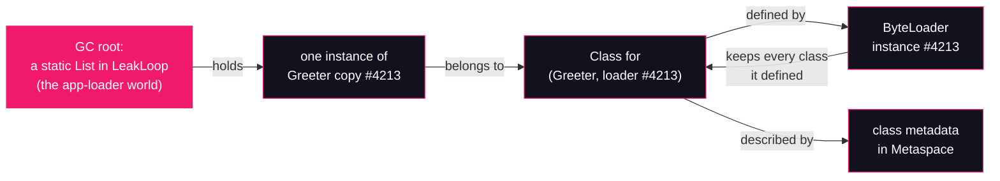

# Lesson 10: Classloader leaks

## What you'll learn

- The one rule that explains every classloader leak: **a class is only collectible together with its defining classloader**
- The reload-in-a-loop leak: how plugin and hot-reload architectures slowly fill Metaspace with identical bytes
- The classic production anchors: redeploy leaks, `ThreadLocal` pins, and registries that outlive the loader
- How to see a leak from the outside: `-Xlog:class+load,class+unload` and `jcmd GC.class_histogram`

---

## Why this matters

[Lesson 01](../part-0-the-machine/01-jvm-jre-jdk-big-picture.md) opened with a list of production error messages, and the first one was this:

```
java.lang.OutOfMemoryError: Metaspace
```

It promised that this lesson explains it. Here is the mystery that error wraps: the team's monitoring shows the heap at a comfortable 30%, GC is healthy, and the JVM dies anyway. Worse, the failure correlates with nothing in the application code — it correlates with *redeploys*. Every few deployments, the JVM rolls over. The workaround in a thousand production runbooks is "restart it nightly," which treats the symptom and leaves the cause untouched.

The cause is almost always the same shape. Something in the system *reloads* classes — an app server redeploying a webapp, a plugin system loading a new version, a scripting engine recompiling a template. Reloading is legitimate; [Lesson 09](09-custom-classloaders.md) showed it's how you get isolation and hot-swapping. But a reload only frees the old generation if the old classloader becomes unreachable. One surviving reference — one cached instance, one `ThreadLocal`, one registry entry — pins the old loader, which pins every class it ever defined, forever. Do that in a loop and you have a slow, relentless leak in a memory area most dashboards don't graph.

Today you'll build that leak on purpose, watch it kill a JVM in seconds, and then fix it with a one-line change.

---

## The concept

### The rule: a class lives and dies with its loader

Cast your mind back to the reachability chains. Every heap object points at its `Class`. Every `Class` object points at the `ClassLoader` that *defined* it. And every `ClassLoader` keeps a strong reference to **every class it has ever defined** — it has to, so that the next request for the same name returns the identical `Class` object rather than loading a duplicate.

Put those together and you get the rule:



The pink node is the whole story. One strong reference from a GC root (a static field is a root) to *any* instance keeps its `Class` alive; the `Class` keeps its loader alive; the loader keeps *all* of its classes alive; and each class's metadata sits in Metaspace, the runtime data area from the [lesson 01](../part-0-the-machine/01-jvm-jre-jdk-big-picture.md) map. Unloading is **all or nothing**: the collector can reclaim a class only when its defining loader is unreachable, which requires every class that loader defined *and every live instance of those classes* to be unreachable at the same time. There is no way to unload one class out of a loader's set.

### Reloading the same bytes always costs new memory

Why can't the JVM notice that copy #4213 has byte-for-byte the same content as copy #4212 and share the metadata? Because they are *different classes*. [Lesson 09](09-custom-classloaders.md) established class identity as the pair **(binary name, defining loader)**: `(Greeter, loader #4212)` and `(Greeter, loader #4213)` are as distinct to the runtime as `Greeter` and `Toast` — cast one to the other and you get the "same class" `ClassCastException`. Distinct classes get distinct constant pools, distinct method tables, distinct static fields — distinct Metaspace allocations. The deduplication you're imagining would collapse exactly the isolation that namespaces exist to provide.

So every reload cycle — new loader, same bytes — adds a fresh slice of Metaspace, and the old slice is reclaimable only if the old loader was fully dropped.

### Where the pin hides in production

In the demo below, the pin is obvious: a static `List` you can see with your eyes. In production it hides. The greatest hits:

- **The redeploy leak.** An app server keeps a pool of request-handling threads that live across redeploys. The webapp (loaded by a fresh `WebappClassLoader` per deploy) stores something in a `ThreadLocal`, or registers a JDBC driver, or adds a shutdown hook. Redeploy: new loader, new copy of every application class — but the old loader is still referenced by a container thread that never dies. Each redeploy adds one whole application's worth of class metadata.
- **`ThreadLocal` pins.** A `ThreadLocal` value is held by the *thread*, and in a pooled world threads are effectively immortal. If the value's class came from the reloadable loader, the loader is pinned for the life of the pool. The [concurrency course's lesson on `ThreadLocal`](https://github.com/Dancan254/concurreny-multithreading/blob/master/lessons/part-3-java-util-concurrent/16-immutability-threadlocal-scopedvalue.md) teaches `remove()` as hygiene; here you can see the JVM-level reason it's not optional.
- **Registries in longer-lived namespaces.** `java.sql.DriverManager` (loaded by the platform loader) holds registered `Driver` instances. A static cache in a shared library holds app objects. Any reference that flows *from* a long-lived namespace *into* a short-lived one welds the short-lived loader open.

The common pattern: the reference crosses from a loader that lives longer into classes from a loader that should have died. Finding a leak is finding that crossing reference.

---

## Hands-on

Part 2 uses explicitly declared classes compiled with `javac`, so the classloader machinery we're dissecting stays visible. The custom-loader mechanics below are exactly [Lesson 09](09-custom-classloaders.md)'s: read the `.class` file as bytes, hand them to `defineClass` on a fresh `ClassLoader` instance.

### 1. The payload and the leak

`Greeter.java` — the class we'll reload thousands of times:

```java
public class Greeter {

    public String greet() {
        return "hello from " + getClass().getClassLoader();
    }
}
```

`LeakLoop.java` — the reload loop with one deliberate pin:

```java
import java.nio.file.Files;
import java.nio.file.Path;
import java.util.ArrayList;
import java.util.List;

public class LeakLoop {

    // The pin: a static list, owned by the app loader's LeakLoop class,
    // holding every instance we ever create.
    static final List<Object> PINNED = new ArrayList<>();

    // One fresh loader per reload, exactly like lesson 09's ByteLoader.
    static class ByteLoader extends ClassLoader {
        Class<?> define(byte[] bytes) {
            return defineClass("Greeter", bytes, 0, bytes.length);
        }
    }

    public static void main(String[] args) throws Exception {
        byte[] bytes = Files.readAllBytes(Path.of("Greeter.class"));
        for (long i = 1; ; i++) {
            Class<?> copy = new ByteLoader().define(bytes);
            PINNED.add(copy.getDeclaredConstructor().newInstance());
            if (i % 1000 == 0) {
                System.out.println(i + " copies loaded and pinned");
            }
        }
    }
}
```

Each iteration manufactures a new `(Greeter, new loader)` class and instantiates it. The instance goes into `PINNED`, a static field of `LeakLoop` — which was loaded by the **application classloader** ([Lesson 07](07-the-delegation-model.md)) and lives as long as the JVM. That is the reference chain from the diagram, written in code.

Compile:

```bash
javac Greeter.java LeakLoop.java
```

Now run it with a cap on Metaspace:

```bash
time java -XX:MaxMetaspaceSize=64m LeakLoop
```

Two flags to unpack:

- `-XX:MaxMetaspaceSize=64m` — first use in this course, so full explanation. Metaspace is where class metadata lives, and unlike the heap it is **uncapped by default**: a classloader leak on an uncapped JVM keeps allocating native memory until the operating system itself runs out, which can take days and destabilises the whole machine. `-XX:MaxMetaspaceSize` puts a ceiling on the area; when the JVM cannot allocate metadata below the ceiling, it throws `OutOfMemoryError: Metaspace`. It is a HotSpot `-XX:` knob, not spec — [Lesson 01](../part-0-the-machine/01-jvm-jre-jdk-big-picture.md) warned you about this family. We set it to a small 64 MB purely to make the inevitable happen in seconds instead of days.
- `time` — the shell's builtin timer, so we can prove the failure is time-bounded.

```
1000 copies loaded and pinned
2000 copies loaded and pinned
3000 copies loaded and pinned
4000 copies loaded and pinned
5000 copies loaded and pinned
6000 copies loaded and pinned
7000 copies loaded and pinned
8000 copies loaded and pinned
9000 copies loaded and pinned
10000 copies loaded and pinned
Exception in thread "main" java.lang.OutOfMemoryError: Metaspace
	at java.base/java.lang.ClassLoader.defineClass1(Native Method)
	at java.base/java.lang.ClassLoader.defineClass(ClassLoader.java:962)
	at java.base/java.lang.ClassLoader.defineClass(ClassLoader.java:826)
	at LeakLoop$ByteLoader.define(LeakLoop.java:15)
	at LeakLoop.main(LeakLoop.java:22)

real	0m2.140s
user	0m5.112s
sys	0m0.495s
```

Dead in about two seconds, at roughly ten thousand copies *(the exact count varies with the JDK build and the run — never hardcode it)*. Read the stack trace: the JVM died **inside `defineClass1`, a native method**, while trying to register one more class's metadata. Not while allocating an object — while *describing a class*.

And it was not for lack of trying. Re-run with GC logging (`-Xlog:gc` is the flag family from [Lesson 00](../part-0-the-machine/00-setup-and-toolchain.md)) and watch the JVM's last moments:

```bash
java -XX:MaxMetaspaceSize=64m -Xlog:gc LeakLoop 2>&1 | grep -i metadata | tail -4
```

```
[2.382s][info][gc] GC(6) Pause Young (Concurrent Start) (Metadata GC Threshold) 19M->16M(56M) 47.508ms
[2.526s][info][gc] GC(8) Pause Young (Prepare Mixed) (Metadata GC Threshold) 17M->18M(56M) 46.978ms
[2.658s][info][gc] GC(9) Pause Full (Metadata GC Threshold) 18M->15M(56M) 131.930ms
[2.766s][info][gc] GC(10) Pause Full (Metadata GC Clear Soft References) 15M->12M(56M) 107.463ms
```

*(Timestamps, GC numbers and sizes vary.)* The reason string `(Metadata GC Threshold)` is the JVM saying "Metaspace wanted to grow, so I collected to make room." Look at the heap numbers on those lines: `18M->15M`. **The heap was almost empty the whole time.** Ten thousand pinned `Greeter` instances are 16 bytes each — a rounding error. The JVM ran Full GCs, reclaimed nothing that mattered, and died of metadata starvation with a healthy heap. This is why `-Xmx` cannot help you here; Part 5 teaches you to read every word of lines like these.

### 2. Loads with no matching unloads

Now the direct evidence. [Lesson 01](../part-0-the-machine/01-jvm-jre-jdk-big-picture.md) used `-Xlog:class+load` to watch classes arrive; the unified-logging framework ([Lesson 00](../part-0-the-machine/00-setup-and-toolchain.md)) has a matching tag for departures, `class+unload`, which logs each class the GC unloads. A comma selects both tag sets at once:

```bash
java -XX:MaxMetaspaceSize=64m -Xlog:class+load,class+unload LeakLoop 2>&1 | grep Greeter | head -4
```

```
[0.121s][info][class,load] Greeter source: __JVM_DefineClass__
[0.134s][info][class,load] Greeter source: __JVM_DefineClass__
[0.134s][info][class,load] Greeter source: __JVM_DefineClass__
[0.135s][info][class,load] Greeter source: __JVM_DefineClass__
```

*(Timestamps vary.)* Note the source: `__JVM_DefineClass__` — not a file path. These classes were defined from a byte array in memory, [Lesson 09](09-custom-classloaders.md)'s mechanism, so there is no `.class` file to name.

Now count both directions across the whole run *(counts vary per run — what matters is the shape)*:

```bash
java -XX:MaxMetaspaceSize=64m -Xlog:class+load,class+unload LeakLoop 2>&1 | grep -c "class,load.*Greeter"
```

```
10831
```

```bash
java -XX:MaxMetaspaceSize=64m -Xlog:class+load,class+unload LeakLoop 2>&1 | grep -c "class,unload.*Greeter"
```

```
0
```

Ten thousand loads, **zero unloads**. The GCs you saw in the previous section ran and ran, and could not unload a single `Greeter` copy — every one of them was pinned through the chain. This pair of counts is the fastest leak detector you have: when `class+load` for a name keeps climbing while `class+unload` stays at zero, something is reloading and pinning.

### 3. The histogram can't merge the copies

For the heap-side view, use `GC.class_histogram`, the `jcmd` command [Lesson 00](../part-0-the-machine/00-setup-and-toolchain.md) introduced. The leak loop dies too quickly to inspect, so here is a bounded variant that pins 20,000 copies and then waits:

`HoldThem.java`:

```java
import java.nio.file.Files;
import java.nio.file.Path;
import java.util.ArrayList;
import java.util.List;

public class HoldThem {

    static final List<Object> PINNED = new ArrayList<>();

    static class ByteLoader extends ClassLoader {
        Class<?> define(byte[] bytes) {
            return defineClass("Greeter", bytes, 0, bytes.length);
        }
    }

    public static void main(String[] args) throws Exception {
        byte[] bytes = Files.readAllBytes(Path.of("Greeter.class"));
        for (long i = 1; i <= 20_000; i++) {
            Class<?> copy = new ByteLoader().define(bytes);
            PINNED.add(copy.getDeclaredConstructor().newInstance());
        }
        System.out.println("20,000 copies pinned. Sleeping for 120 seconds.");
        Thread.sleep(120_000);
    }
}
```

Compile it, start it in the background, and find its PID (no Metaspace cap this time — we want it alive):

```bash
javac HoldThem.java
java HoldThem &
jcmd -l | grep HoldThem
```

```
96042 HoldThem
```

*(PID varies.)* Now ask for the histogram and count the `Greeter` rows:

```bash
jcmd 96042 GC.class_histogram | grep -c Greeter
```

```
20000
```

Not one row reading `20000 instances` — **20,000 separate rows**:

```bash
jcmd 96042 GC.class_histogram | grep Greeter | head -3
```

```
 248:             1             16  Greeter
 249:             1             16  Greeter
 250:             1             16  Greeter
```

*(Row numbers vary.)* The histogram groups instances by class, and each pinned copy **is a different class** — [Lesson 09](09-custom-classloaders.md)'s namespace identity, visible in a standard diagnostic tool. (`GC.class_histogram` forces a full GC before counting; the pinned copies sail through it, which is the point.) When you're done, kill the process:

```bash
kill 96042
```

In a real investigation you'd compare two histograms taken minutes apart: rows whose instance counts only ever grow are your suspects, and a name appearing in thousands of near-identical rows is the signature of exactly what you just built.

### 4. The fix: drop the pin

Here is the whole fix, as a runnable proof. `FixedLoop.java` is the same reload loop with the pin removed — each class, its instance and its loader go out of scope at the end of their iteration:

```java
import java.nio.file.Files;
import java.nio.file.Path;

public class FixedLoop {

    static class ByteLoader extends ClassLoader {
        Class<?> define(byte[] bytes) {
            return defineClass("Greeter", bytes, 0, bytes.length);
        }
    }

    public static void main(String[] args) throws Exception {
        byte[] bytes = Files.readAllBytes(Path.of("Greeter.class"));
        for (long i = 1; i <= 20_000; i++) {
            Class<?> copy = new ByteLoader().define(bytes);
            String greeting = (String) copy.getMethod("greet")
                    .invoke(copy.getDeclaredConstructor().newInstance());
            // copy, its instance and its loader all go out of scope here
        }
        System.out.println("20,000 reloads completed under the same Metaspace cap.");
    }
}
```

Compile and run it under **the same 64 MB cap that killed the leak**, with unloading logged:

```bash
javac FixedLoop.java
java -XX:MaxMetaspaceSize=64m -Xlog:class+unload FixedLoop 2>&1 | head -8
```

```
[4.322s][info][class,unload] unloading class Greeter 0x000000001bbb7800
[4.323s][info][class,unload] unloading class Greeter 0x000000001bbb7000
[4.323s][info][class,unload] unloading class Greeter 0x000000001bbb6800
[4.323s][info][class,unload] unloading class Greeter 0x000000001bbb6000
[4.323s][info][class,unload] unloading class Greeter 0x000000001bbb5800
[4.323s][info][class,unload] unloading class Greeter 0x000000001bbb5000
[4.323s][info][class,unload] unloading class Greeter 0x000000001bbb4800
[4.323s][info][class,unload] unloading class Greeter 0x000000001bbb4000
```

*(Timestamps and addresses vary.)* Two things to notice. First, unloading happens in **batches at GC time**, not the instant a loader becomes unreachable — all eight lines share a timestamp, because one collection reclaimed a whole generation of dead loaders at once. Class unloading is garbage collection, and it obeys the GC's schedule, not yours. Second, the run:

```bash
java -XX:MaxMetaspaceSize=64m -Xlog:class+unload FixedLoop 2>&1 | grep -c "class,unload"
```

```
15528
```

```bash
time java -XX:MaxMetaspaceSize=64m -Xlog:class+unload FixedLoop 2>&1 | tail -1
```

```
20,000 reloads completed under the same Metaspace cap.
```

*(The unload count varies per run — the copies still alive at loop's end die with the VM and are never logged.)* Twenty thousand reloads, double what killed the pinned version, in seconds, under the identical cap. Metaspace usage stayed flat because dead loaders' metadata went back. The leak was never "reloading is expensive." The leak was the pin.

---

## Try it yourself

1. Move the pin to a `ThreadLocal`: give `LeakLoop` a `static final List<ThreadLocal<Object>>` and add a *new* `ThreadLocal` holding each instance (the list keeps the `ThreadLocal` objects themselves reachable). Confirm the same `OutOfMemoryError: Metaspace`. Then clear the list every 1,000 iterations and watch `class+unload` lines return. This is the app-server redeploy leak in miniature: the `main` thread plays the role of an immortal pool thread.
2. Re-run `LeakLoop` with `-XX:MaxMetaspaceSize=128m`. Predict roughly how many copies it reaches before dying, then check. What does the scaling tell you about where the memory goes per copy?
3. In `FixedLoop`, pin only every 1,000th instance in a static list. Does it still complete 20,000 iterations under `-XX:MaxMetaspaceSize=64m`? Compare the `class+unload` count with the unpinned run and explain the difference.
4. Run `HoldThem` in the background again and try `jcmd <pid> VM.classloader_stats`. How many loaders exist, and how does the total `ChunkSz` (allocated metaspace chunks) relate to the 64 MB cap from the leak run? Then run `jcmd <pid> help` and look for other commands that mention classes or loaders.
5. Take two histograms of `HoldThem` a minute apart (`jcmd <pid> GC.class_histogram > first.txt`, wait, `second.txt`) and `diff` them. Besides the pinned `Greeter` rows, what moved, and why?

---

## Common mistakes

- **"`OutOfMemoryError` means the heap is full — raise `-Xmx`."** Read the flavor. `Metaspace` is class metadata in native memory, outside the heap entirely; the leak demo died with `15M` used of a `56M` heap. Raising `-Xmx` does nothing for it, and [Lesson 01](../part-0-the-machine/01-jvm-jre-jdk-big-picture.md)'s map is how you route each OOM flavor to its area. [Lesson 12](../part-3-memory/12-runtime-data-areas.md) gives every flavor its own deep dive.
- **"Same bytes means same class — the JVM will deduplicate."** It cannot. Class identity is (name, defining loader) from [Lesson 09](09-custom-classloaders.md); two copies loaded by different loaders are different classes with separate metadata, which is exactly what the 20,000 histogram rows showed. Deduplicating them would destroy namespace isolation.
- **"Unreferenced classes are unloaded immediately."** Unloading is GC work. It happens at collections, in batches (look at the shared timestamps in section 4), and only once the *loader* is unreachable. Between collections, dead classes sit in Metaspace — normal, and not a leak.
- **"Capping Metaspace fixes the leak."** `-XX:MaxMetaspaceSize` changes how you die, not whether: it converts a multi-day native-memory bleed that destabilises the host into a fast, explicit `OutOfMemoryError` with a Java stack trace. That conversion is genuinely useful — cap it in production — but the fix is always removing the pin.
- **"`ThreadLocal` values disappear when the code that set them returns."** Values are held by the thread, and pooled threads outlive every request and every redeploy. Without `remove()`, each value is a standing reference from an immortal object into your loader — the exact pink node in the diagram.

---

## Check your understanding

**1. In `LeakLoop`, trace the exact reference chain that keeps `Greeter` copy #4213's metadata in Metaspace.**

<details>
<summary>Reveal answer</summary>

The static field `LeakLoop.PINNED` (a GC root reachable for the JVM's lifetime) holds the copy's one instance. The instance references its `Class` object; the `Class` references its defining `ByteLoader`; the loader references every class it defined. Since every node in the chain is strongly reachable, neither the instance, the `Class`, the loader nor the Metaspace metadata is collectible — and unloading is all-or-nothing per loader, so the whole generation stays.

</details>

**2. Why does `GC.class_histogram` show 20,000 one-instance `Greeter` rows instead of one row with 20,000 instances?**

<details>
<summary>Reveal answer</summary>

Because the histogram groups by class, and the 20,000 copies are 20,000 *different classes*. Class identity is the pair (binary name, defining loader) — each copy was defined by a fresh `ByteLoader`, so each gets its own row with its own single instance. The rows are [Lesson 09](09-custom-classloaders.md)'s namespace model rendered by a diagnostic tool.

</details>

**3. The leak run shows several Full GCs in its final second, yet zero `class,unload` lines for `Greeter`. Why couldn't the collector unload anything?**

<details>
<summary>Reveal answer</summary>

Class unloading requires the defining classloader to be unreachable. Every `Greeter` copy's loader was kept alive through the `PINNED` list → instance → `Class` → loader chain, so during every GC — including the final Full GCs triggered by `Metadata GC Threshold` — every one of those loaders was still strongly reachable. The GCs could reclaim heap garbage, but no class metadata was eligible, so they changed nothing and the JVM threw `OutOfMemoryError: Metaspace`.

</details>

**4. A service dies with `OutOfMemoryError: Metaspace` every few redeploys while its heap stays under 40%. What is the likely mechanism, and which two commands from this lesson do you run first to confirm it?**

<details>
<summary>Reveal answer</summary>

The mechanism is a redeploy leak: each deploy creates a fresh classloader for the application, and something from a longer-lived namespace — typically a pooled thread's `ThreadLocal`, a `DriverManager` registration or a shared-library static cache — keeps a reference into the previous loader, so its entire class set is never unloaded and Metaspace grows by one application's metadata per deploy. To confirm: run with `-Xlog:class+load,class+unload` and check whether application classes load per redeploy but never unload, and take `jcmd <pid> GC.class_histogram` snapshots to find application class names appearing as many duplicate rows (or growing instance counts) across deploys.

</details>

**5. `FixedLoop` completed 20,000 reloads under the same 64 MB cap that killed `LeakLoop` near 10,000. What did the cap actually limit?**

<details>
<summary>Reveal answer</summary>

The cap limits *live* class metadata at any instant, not the total number of classes loaded over the process's lifetime. `FixedLoop` let each loader become unreachable, so GCs unloaded dead copies and returned their Metaspace to the pool; the amount of metadata alive at once stayed flat and far below 64 MB. `LeakLoop` kept every copy alive, so live metadata grew monotonically until it hit the ceiling. This is also why the leak run's death count is not a property of the loop but of the cap.

</details>

---

## Recap

- **A class is only collectible together with its defining classloader.** Every instance pins its `Class`; every `Class` pins its loader; every loader pins all of its classes and their Metaspace metadata. Unloading is all-or-nothing per loader.
- Reloading the *same bytes* through a *new loader* always allocates fresh metadata — namespaces ([Lesson 09](09-custom-classloaders.md)) make the copies distinct classes, and distinctness is the point.
- The leak is one surviving reference crossing from a long-lived namespace into a reloadable one: redeployed webapps, `ThreadLocal`s in immortal pool threads, registry entries. Remove the pin and the identical code runs forever under the same cap.
- Diagnose from the outside: `-Xlog:class+load,class+unload` (loads climbing, unloads flat) and `jcmd GC.class_histogram` (one name, thousands of rows). `-XX:MaxMetaspaceSize` bounds the blast radius; it is not the fix.
- Class unloading is GC work — batched, on the collector's schedule — which makes this lesson the bridge into Part 3's runtime data areas, starting with Metaspace itself in [lesson 12](../part-3-memory/12-runtime-data-areas.md).

**Previous:** [Lesson 09 — Custom classloaders](09-custom-classloaders.md) · **Next:** [Lesson 11 — Modules & classloading](11-modules-and-classloading.md)
