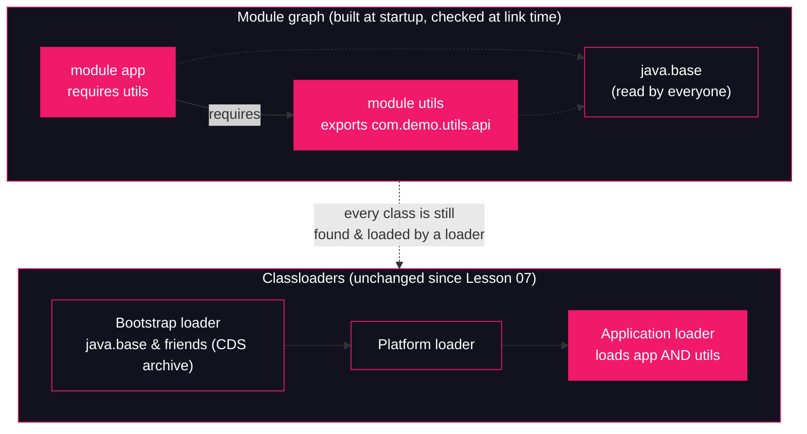

# Lesson 11: Modules & classloading

## What you'll learn

- What JPMS (the Java Platform Module System, JDK 9+) actually added: a readability graph (`requires`), explicit `exports`, and strong encapsulation of JDK internals
- What it did **not** change: the three classloaders from [Lesson 07](07-the-delegation-model.md) are still there, delegation is still parent-first, and a class's identity is still `(name, defining loader)`
- Why code compiled against a non-exported package fails at *compile* time, and how it can still fail at *runtime* with `IllegalAccessError` when the module graph shifts under it
- Why `IllegalAccessError` on JDK internals became the defining confusion of the JDK 9 migration era — the same way the "same class, different loader" `ClassCastException` from [Lesson 09](09-custom-classloaders.md) defines the custom-classloader confusion

---

## Why this matters

If you migrated anything to JDK 9 or later, you have met this error family:

```
java.lang.IllegalAccessError: class com.acme.Foo (in module app) cannot access class ...
java.lang.reflect.InaccessibleObjectException: Unable to make field ... accessible:
module java.base does not "opens java.lang" to unnamed module
error: package com.sun.something is not visible
```

These are not classloading failures in the [Lesson 07](07-the-delegation-model.md) sense. The class was *found* — the bytes are right there in the jar. The JVM refused to let you *link* to it, because a module said no. That is a new kind of failure, enforced by machinery that didn't exist before JDK 9, and debugging it with a classpath-era mental model ("it's on the classpath, why can't I see it?") leads nowhere.

The flip side is just as important, and it is the thesis of this lesson: **modules changed who is allowed to see what, not how classes are loaded.** Everything from lessons 07–10 — the three loaders, parent-first delegation, namespaces, loading-linking-initialization, leaks — is unchanged underneath. JPMS is a visibility layer bolted on top of the machine you already know. This lesson shows you both halves, from real runs.

---

## The concept

### What a module is

A module is a set of packages plus a declaration, `module-info.java`, compiled to `module-info.class` at the root of the module's classes:

```java
module utils {
    exports com.demo.utils.api;   // public API: readable by other modules
    // com.demo.utils.internal is NOT exported: invisible outside this module
}
```

Two directives matter for classloading:

- **`exports <package>`** — makes that package's public types *accessible* to other modules. A package that isn't exported is strongly encapsulated: `public` no longer means "public to everyone", it means "public inside this module".
- **`requires <module>`** — declares that this module *reads* another. You can only compile and link against a module's exported packages if you require it (or it is `java.base`, which every module reads implicitly).

The JVM builds a **module graph** from these declarations before your code runs: every module is a node, every `requires` is an edge. At link time — the resolution step from [Lesson 08](08-loading-linking-initialization.md) — every access is checked against the graph: *is the target's package exported, and exported to me?* If not, you get `IllegalAccessError`, exactly as if the class were package-private and you were in the wrong package.

### The JDK itself is modules now

The bigger change was inward. The JDK's own class library was carved into ~70 modules — `java.base` (the only mandatory one), `java.sql`, `java.xml`, `jdk.compiler`, and so on. `java.base` exports `java.lang`, `java.util`, `java.io`... but **not** `jdk.internal.*` or most `sun.*` packages. Decades of "don't touch these, they're internal, but nothing stops you" became "the JVM stops you."

That is why old libraries broke. A serialization framework reflecting into `java.lang` private fields, a tool importing `sun.misc.BASE64Encoder` — all of it ran on the honor system until JDK 9, and then the honor system acquired a police force. The `IllegalAccessError` / `InaccessibleObjectException` wave of the migration era was this enforcement arriving. There are deliberate escape hatches — `--add-exports <module>/<package>=<target>` grants export access and `--add-opens` grants reflective access from the command line — for code that genuinely needs internals while it migrates.

### What modules did NOT change

Here is the part most module tutorials skip, and the part this course cares about. Run a modular application and look at the classloaders:

| Question | Answer |
|---|---|
| Are the three loaders from [Lesson 07](07-the-delegation-model.md) gone? | No. Bootstrap, platform and application loaders all still exist. |
| Who loads a module's classes? | A module on the module path is still loaded by the **application class loader** — the same loader that loads classpath classes. |
| Is delegation still parent-first? | Yes. The loaders and their parent chain are untouched. |
| Is class identity still `(name, defining loader)`? | Yes. The namespace rules from [Lesson 09](09-custom-classloaders.md) are unchanged. |
| Do JDK classes still come from the CDS archive? | Yes. `java.base` classes still load from the shared archive [Lesson 07](07-the-delegation-model.md) dissected. |

JPMS adds a *mapping*: each module is assigned to a classloader (the JDK's built-in modules are spread across the three built-in loaders; your module-path modules go to the app loader). A class's runtime package stays exactly the JVMS pair `(package name, defining loader)` — the module is implied through the loader, since each module is loaded by exactly one loader, so the observable identity rules stay the same. The module graph is consulted **during resolution**, as an extra access check layered on top of the verifier and the loader's namespace. Modules decide *whether you may link*; classloaders still do the *finding and loading*.



Two consequences worth internalizing:

1. **Classpath and module path coexist.** Anything on the classpath lands in the **unnamed module**, which reads every module and is read by none. That is how pre-JPMS jars keep working — and why "it's on the classpath" stopped being a guarantee of access *into* a named module.
2. **The failure mode moved.** Classpath-era access problems surfaced as `ClassNotFoundException` / `NoClassDefFoundError` — *the bytes weren't found*. Module-era access problems surface as `IllegalAccessError` / `InaccessibleObjectException` — *the bytes were found, and you were refused*. Same subsystem, different checkpoint.

---

## Hands-on

Everything runs on JDK 25 from an empty directory, with explicitly declared classes compiled by `javac` — Part 2 dissects classloading mechanics, and compact source files would hide the two-module layout we're building.

### 1. Build and run a two-module application

Create this tree:

```
lesson11-modules/
└── src/
    ├── utils/
    │   ├── module-info.java
    │   └── com/demo/utils/
    │       ├── api/TextUtils.java          ← exported
    │       └── internal/SecretSauce.java   ← not exported
    └── app/
        ├── module-info.java
        └── com/demo/app/Main.java
```

`src/utils/module-info.java`:

```java
module utils {
    exports com.demo.utils.api;
}
```

`src/utils/com/demo/utils/api/TextUtils.java`:

```java
package com.demo.utils.api;

public class TextUtils {

    public static String shout(String text) {
        return text.toUpperCase() + "!";
    }
}
```

`src/utils/com/demo/utils/internal/SecretSauce.java` — note the package is **not** exported:

```java
package com.demo.utils.internal;

public class SecretSauce {

    public static String recipe() {
        return "11 herbs and spices";
    }
}
```

`src/app/module-info.java`:

```java
module app {
    requires utils;
}
```

`src/app/com/demo/app/Main.java`:

```java
package com.demo.app;

import com.demo.utils.api.TextUtils;

public class Main {

    public static void main(String[] args) {
        System.out.println(TextUtils.shout("modules are just jars with a bouncer"));
        System.out.println("Main class loaded by: " + Main.class.getClassLoader());
        System.out.println("TextUtils loaded by:  " + TextUtils.class.getClassLoader());
        System.out.println("Main lives in:        " + Main.class.getModule());
        System.out.println("TextUtils lives in:   " + TextUtils.class.getModule());
    }
}
```

Compile both modules at once. `--module-source-path <dir>` (first use in this course, so full explanation) tells `javac` where to find *module-organized* source: each immediate subdirectory is one module, holding its own `module-info.java`. With `-d out`, the output mirrors that shape — one directory per module:

```bash
javac --module-source-path src -d out $(find src -name "*.java")
find out -type f | sort
```

```
out/app/com/demo/app/Main.class
out/app/module-info.class
out/utils/com/demo/utils/api/TextUtils.class
out/utils/com/demo/utils/internal/SecretSauce.class
out/utils/module-info.class
```

Run it. Two more first-use launcher options: `--module-path <dir>` tells the JVM where to find *modules* (each entry holds one module per subdirectory, or modular jars) — the module-era counterpart of `-cp`; and `--module <module>/<main-class>` names the *initial module* to resolve and the main class inside it:

```bash
java --module-path out --module app/com.demo.app.Main
```

```
MODULES ARE JUST JARS WITH A BOUNCER!
Main class loaded by: jdk.internal.loader.ClassLoaders$AppClassLoader@1d44bcfa
TextUtils loaded by:  jdk.internal.loader.ClassLoaders$AppClassLoader@1d44bcfa
Main lives in:        module app
TextUtils lives in:   module utils
```

*(The `@1d44bcfa` identity hash varies from run to run.)*

Two facts in one output. The last two lines confirm the modules exist at runtime: `Main` is in module `app`, `TextUtils` in module `utils`, and the JVM knows it. But the first two `ClassLoader` lines are the thesis of this lesson: **both modules were loaded by the same application class loader instance** — the exact `ClassLoaders$AppClassLoader` from [Lesson 07](07-the-delegation-model.md). New visibility rules, same loaders.

### 2. Compile-time denial: the bouncer at `javac`

Now try to cheat. Edit `Main.java` to import the non-exported package:

```java
package com.demo.app;

import com.demo.utils.api.TextUtils;
import com.demo.utils.internal.SecretSauce;

public class Main {

    public static void main(String[] args) {
        System.out.println(TextUtils.shout("modules are just jars with a bouncer"));
        System.out.println(SecretSauce.recipe());
    }
}
```

Recompile:

```bash
javac --module-source-path src -d out $(find src -name "*.java")
```

```
src/app/com/demo/app/Main.java:4: error: package com.demo.utils.internal is not visible
import com.demo.utils.internal.SecretSauce;
                     ^
  (package com.demo.utils.internal is declared in module utils, which does not export it)
1 error
```

`SecretSauce` is `public`, the class file is right there, `app` even `requires utils` — and `javac` still refuses. Visibility is now a property of the *module graph*, not of the `public` keyword alone. This is the compile-time half of strong encapsulation.

### 3. Runtime denial: `IllegalAccessError`

"But `javac` checks that at compile time — how does anyone get a runtime `IllegalAccessError`?" By changing the module graph *after* compilation, which is exactly what happens in production when jars are upgraded independently. Reproduce it.

First, make `utils` export its internals **temporarily**, and recompile everything so `Main.class` is legally built against them. `src/utils/module-info.java` becomes:

```java
module utils {
    exports com.demo.utils.api;
    exports com.demo.utils.internal;   // temporary: the bouncer looks away
}
```

```bash
javac --module-source-path src -d out $(find src -name "*.java")
java --module-path out --module app/com.demo.app.Main
```

```
MODULES ARE JUST JARS WITH A BOUNCER!
11 herbs and spices
```

Compiles, runs, prints the secret recipe. Now the production scenario: the `utils` team ships a new build that re-seals the internal package. Restore `module-info.java` to its original form (only `exports com.demo.utils.api;`) and recompile **only** `utils`, leaving the already-compiled `app` untouched — single-module compile, no `--module-source-path` needed:

```bash
javac -d out/utils src/utils/module-info.java src/utils/com/demo/utils/api/TextUtils.java src/utils/com/demo/utils/internal/SecretSauce.java
java --module-path out --module app/com.demo.app.Main
```

```
MODULES ARE JUST JARS WITH A BOUNCER!
Exception in thread "main" java.lang.IllegalAccessError: class com.demo.app.Main (in module app) cannot access class com.demo.utils.internal.SecretSauce (in module utils) because module utils does not export com.demo.utils.internal to module app
	at app/com.demo.app.Main.main(Main.java:10)
```

Read that error the way lessons 07–10 taught you to. It is **not** `NoClassDefFoundError`: the classloader *found* `SecretSauce.class` — the bytes are in `out/utils`. The refusal happened at **resolution** ([Lesson 08](08-loading-linking-initialization.md)): when the JVM tried to link the `invokestatic` to `SecretSauce.recipe()`, it checked the module graph and denied access. And notice *when*: the first `println` already ran. Resolution is lazy — the link check fires at the first actual access, not when `Main` loads.

One more detail to file away: the stack frame reads `at app/com.demo.app.Main.main(...)` — the module name is now part of every stack trace. In a real incident, that prefix tells you which module the failing frame belongs to before you read a single class name.

### 4. Watching module-aware loading

Restore the original `Main.java` (the one from step 1, without the sneaky import) and rebuild clean:

```bash
rm -rf out
javac --module-source-path src -d out $(find src -name "*.java")
```

The launcher will show you the module graph it resolved at startup with `--show-module-resolution` (first use: a standard `java` launcher option that logs each module as it is resolved and bound). **Flag order matters** — everything after `--module app/com.demo.app.Main` is passed to *your program* as arguments, so launcher options go first:

```bash
java --show-module-resolution --module-path out --module app/com.demo.app.Main 2>&1 | grep -E "^(root app|app requires)"
```

```
root app file:///home/champez/jvm-internals-samples/lesson11-modules/out/app/
app requires utils file:///home/champez/jvm-internals-samples/lesson11-modules/out/utils/
```

*(Absolute paths vary.)*

The graph from the concept section, printed by the JVM itself: `app` is the **root** module, resolved from the module path, and its `requires utils` edge is bound to the concrete module found under `out/utils/`. (The full output goes on to bind JDK modules — `java.base binds java.logging jrt:/java.logging` and friends — where `jrt:/` is the JVM's internal filesystem URL scheme for the JDK's own modules.)

Now the classloader view, with `-verbose:class` from [Lesson 01](../part-0-the-machine/01-jvm-jre-jdk-big-picture.md):

```bash
java -verbose:class --module-path out --module app/com.demo.app.Main 2>&1 | head -4
java -verbose:class --module-path out --module app/com.demo.app.Main 2>&1 | grep -E "com\.demo"
```

```
[0.044s][info][class,load] java.lang.Object source: shared objects file
[0.045s][info][class,load] java.io.Serializable source: shared objects file
[0.045s][info][class,load] java.lang.Comparable source: shared objects file
[0.045s][info][class,load] java.lang.CharSequence source: shared objects file
[0.204s][info][class,load] com.demo.app.Main source: file:/home/champez/jvm-internals-samples/lesson11-modules/out/app/
[0.206s][info][class,load] com.demo.utils.api.TextUtils source: file:/home/champez/jvm-internals-samples/lesson11-modules/out/utils/
```

*(Timestamps and paths vary.)*

Everything from lessons 01 and 07 is still true under modules: `java.lang.Object` and the rest of `java.base` stream in from the CDS archive (`source: shared objects file`), and your two modules load from their module-path directories by the ordinary file mechanism. A full run loads on the order of a thousand classes here (the count is build- and program-sensitive — never assert it as fact). Modules rerouted the *permission checks*; the *loading machinery* never moved.

### 5. The JDK's own bouncer

The same enforcement guards the JDK itself — and you don't need modules to feel it. This plain classpath program tries to touch an internal API:

```java
public class ReachForInternals {

    public static void main(String[] args) {
        System.out.println(jdk.internal.misc.Unsafe.getUnsafe());
    }
}
```

```bash
javac ReachForInternals.java
```

```
ReachForInternals.java:4: error: package jdk.internal.misc is not visible
        System.out.println(jdk.internal.misc.Unsafe.getUnsafe());
                                       ^
  (package jdk.internal.misc is declared in module java.base, which does not export it to the unnamed module)
1 error
```

Classpath code lives in the **unnamed module**, and `java.base` does not export `jdk.internal.misc` to it. This exact refusal — arriving via `javac`, via `IllegalAccessError` at link time, or via `InaccessibleObjectException` when reflection is involved — is what a decade of "harmless" internal-API usage ran into on JDK 9. When you meet it in the wild, the answer is a supported API; the temporary bridge is `--add-exports` / `--add-opens` (or, for deep reflection into `java.base`, the explicit `--add-opens java.base/<package>=ALL-UNNAMED`), never a fork of the JDK.

---

## Try it yourself

1. In step 1's working program, take `utils` off the module path and put it on the classpath instead: `java -cp out/utils --module-path out/app --module app/com.demo.app.Main`. It fails during startup, before `main` runs — read the `FindException` and explain why the unnamed module can't satisfy `requires utils`. (This is the single most common real-world JPMS error.)
2. Run step 4 without the `grep`: `java --show-module-resolution --module-path out --module app/com.demo.app.Main`. Find the lines where `java.base` binds its service modules, and spot the `jrt:/` URLs. What does it mean that the JDK's own modules resolve through the same machinery as yours?
3. Repeat step 3's runtime-denial experiment, but this time recompile *both* modules after removing the export. Why does the failure move back to compile time? Which failure would you rather debug at 3 a.m., and why?
4. Add a second method to `SecretSauce` and call it via reflection from `Main` (`Class.forName("com.demo.utils.internal.SecretSauce")`, then `getDeclaredMethod(...).invoke(null)`), with internals not exported. What exception do you get, and how does it differ from step 3's `IllegalAccessError`? Then make it pass with `--add-opens utils/com.demo.utils.internal=app`.
5. Run `java --describe-module java.base | head -20`. Which packages does the most permissive module in the JDK export — and how many internal packages must it therefore be hiding?

---

## Common mistakes

- **"Modules replaced classloaders."** They didn't. Step 1 prints the same `AppClassLoader` instance for both modules. JPMS added access checks on top of the delegation model from [Lesson 07](07-the-delegation-model.md); the loaders, the parent chain and the namespaces from [Lesson 09](09-custom-classloaders.md) are all still there.
- **"`public` means accessible."** Not since JDK 9. `public` in a non-exported package means public *inside the module*. Accessibility is now `public` **and** exported **and** the reader `requires` the module.
- **Debugging a module error like a classpath error.** `IllegalAccessError ... does not export` means the class was *found* — searching for missing jars is wasted time. The fix lives in the module graph: an `exports`, a `requires`, or (temporarily) `--add-exports`.
- **Putting launcher flags after `--module`.** Everything after `--module app/com.demo.app.Main` becomes `args` to your `main` — `--show-module-resolution` placed there is silently swallowed by your program. Launcher options go before `--module`.
- **Assuming the classpath escaped all of this.** Classpath code sits in the unnamed module: it can still be *refused* (step 5), it just can't be *required*. A modular jar can no longer see a class that only exists on the classpath.
- **Treating `--add-opens` as a fix.** It is a migration bridge for code you don't control. Shipping it in production paperwork-over the real problem and can break with any JDK upgrade, since internals change without notice.

---

## Check your understanding

**1. A modular app and its dependency both load, and `getClassLoader()` returns the same `AppClassLoader` for both. What did the module system actually change, then?**

<details>
<summary>Reveal answer</summary>

It changed *visibility and linkage checks*, not loading. Both classes are still found and defined by the same application class loader through the same parent-first delegation from [Lesson 07](07-the-delegation-model.md). What JPMS added is a module graph that is consulted at resolution time: every cross-module access must target an exported package in a module the accessor reads. Loading is unchanged; the permission to link is new.

</details>

**2. In step 3, why did the first `println` run before the `IllegalAccessError` appeared — why didn't the program fail at startup?**

<details>
<summary>Reveal answer</summary>

Because resolution is lazy ([Lesson 08](08-loading-linking-initialization.md)). The JVM doesn't eagerly link every reference in a class when the class loads. The `invokestatic` to `SecretSauce.recipe()` was resolved — and the module-graph access check performed — only when execution first reached that call, which came after the first `println`.

</details>

**3. `NoClassDefFoundError` and step 3's `IllegalAccessError` both mean "a class wasn't usable". What is the crucial difference for debugging?**

<details>
<summary>Reveal answer</summary>

`NoClassDefFoundError` means the bytes were **not found**: a classpath/module-path problem — go look for missing jars or wrong paths. `IllegalAccessError` with a "does not export" message means the bytes **were found** and the JVM refused the link: a module-graph problem — the fix is an `exports`, a `requires`, or a temporary `--add-exports`, not more entries on the path.

</details>

**4. Classpath (unnamed-module) code and module-path code each have one thing they can't do to the other. What are they?**

<details>
<summary>Reveal answer</summary>

The unnamed module reads all modules but is read by none: a named module **cannot `requires` a classpath jar** (there is no module name to require), while classpath code **can be denied access** to any non-exported package of a named module or the JDK. Classpath code keeps working with other classpath code exactly as before; the wall only appears when one side is modular.

</details>

**5. Your colleague "fixes" a migration crash by adding `--add-opens java.base/java.lang=ALL-UNNAMED` to the production startup script. What is the honest assessment?**

<details>
<summary>Reveal answer</summary>

It is a legitimate *migration bridge* — it restores reflective access for a library that hasn't been updated, and sometimes that's the only way to ship today. But it is not a fix: the library is still coupled to JDK internals that can change in any release, the flag suppresses the warning that would tell you so, and the correct end state is moving that library to a supported API. Keep it documented, scoped as narrowly as possible, and tracked as debt.

</details>

---

## Recap

- JPMS added a **module graph**: `requires` (readability) and `exports` (visibility), declared in `module-info.java` and checked by `javac` at compile time and by the JVM at link time.
- It did **not** change the loaders: bootstrap/platform/application from [Lesson 07](07-the-delegation-model.md) are all still there, delegation is still parent-first, CDS still serves `java.base`, and class identity is still `(name, defining loader)`. Modules decide *who may link*; loaders still *find and load*.
- The JDK itself is modular: internal packages (`jdk.internal.*`, most `sun.*`) are strongly encapsulated, which is why the JDK 9 migration era was defined by `IllegalAccessError` and `InaccessibleObjectException` — found-but-refused, replacing found-or-not as the classloading failure to diagnose.
- Failure modes moved checkpoints: *not found* → `NoClassDefFoundError`; *found but refused* → `IllegalAccessError` (link time) or `InaccessibleObjectException` (reflection). Read the error class before reaching for the classpath.
- `--module-source-path` compiles module trees; `--module-path` + `--module` run them; `--show-module-resolution` prints the graph; `--add-exports` / `--add-opens` are migration bridges, not fixes.

**Previous:** [Lesson 10 — Classloader leaks](10-classloader-leaks.md) · **Next:** [Lesson 12 — Runtime data areas](../part-3-memory/12-runtime-data-areas.md)
