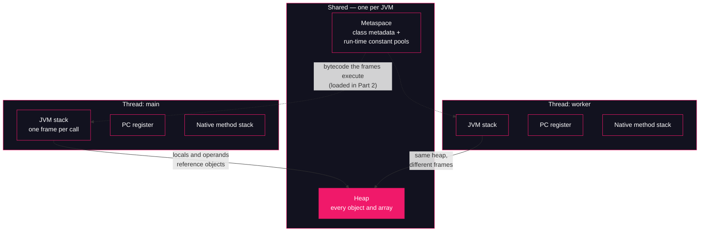

# Lesson 12: Runtime data areas

## What you'll learn

- The five runtime data areas from JVMS §2.5 — heap, JVM stacks, Metaspace, PC registers, native method stacks — and which are per-thread vs shared
- How to make each area observable from the outside: `-Xlog:gc+init`, `jcmd VM.flags`, a thread dump
- How to trigger `StackOverflowError` and `OutOfMemoryError: Java heap space` on purpose, bounded to fail in seconds
- The error-flavor → area routing table that lessons 13–17 keep referencing

---

## Why this matters

[Lesson 01](../part-0-the-machine/01-jvm-jre-jdk-big-picture.md) opened with a wall of production error messages and a promise: each one names a part of the machine. Eleven lessons and three parts later the course has already made good on two of them — `NoClassDefFoundError` was Part 2's classloader subsystem, and `OutOfMemoryError: Metaspace` was [Lesson 10](../part-2-classloading/10-classloader-leaks.md)'s classloader leak. This lesson finishes the map.

The practical skill is *routing*. When an on-call alert says a JVM died, the error text tells you which memory area ran out, and the area tells you which knob, which diagnostic, and which lesson of this course applies. `OutOfMemoryError: Java heap space` and `OutOfMemoryError: Metaspace` share nine words and have nothing else in common: one is objects in a GC-managed arena, the other is class metadata in native memory. Teams that can't tell them apart do the classic wrong thing — raise `-Xmx` and watch the JVM die again, slower. You've already seen the proof: Lesson 10's leak died with 15 MB used of a 56 MB heap.

There's a second reason this lesson comes first in Part 3. Every claim in the next five lessons — object headers in lesson 13, pointer compression in lesson 14, escape analysis in lesson 15, the string pool in lesson 16, direct buffers in lesson 17 — is a claim about *where a byte lives*. This lesson is the vocabulary of "where."

---

## The concept

### The spec's floor plan: JVMS §2.5

The [Java Virtual Machine Specification, §2.5](https://docs.oracle.com/javase/specs/jvms/se25/html/jvms-2.html#jvms-2.5) defines the runtime data areas — the memory a JVM carves out while running a program. The spec names six; the run-time constant pool lives inside the method area, which leaves five to hold in your head:

| Area | Per-thread or shared | What it holds |
|---|---|---|
| **Heap** | Shared — one per JVM | Every object and every array your program allocates |
| **Method area** — HotSpot's **Metaspace** | Shared | Class metadata: method bytecode, field and method tables, statics, and each class's **run-time constant pool** |
| **JVM stack** | Per thread | One frame per in-flight method call: local variables, the operand stack, return address |
| **PC register** | Per thread | The address of the bytecode instruction the thread is executing right now |
| **Native method stack** | Per thread | Frames for native (JNI) calls into C/C++ code |

The per-thread column is the map from [Lesson 01](../part-0-the-machine/01-jvm-jre-jdk-big-picture.md) made concrete. A thread, to the JVM, *is* a private JVM stack, a private PC register and a private native stack, walking over a heap it shares with every other thread:



The pink node is where the action is: the heap is the only area all threads contend on, which is why the [concurrency course's race conditions](https://github.com/Dancan254/concurreny-multithreading/blob/master/lessons/part-2-shared-state/05-race-conditions.md) are always about *object* state, never about some other thread's local variables — [Lesson 03](../part-1-bytecode/03-the-operand-stack.md)'s frames are private by construction.

Three of the five areas deserve one more paragraph each; two get entire lessons elsewhere and only a sentence here.

**JVM stack.** Each call pushes a frame holding the caller's local variables and the per-call operand stack you learned to read in `javap -c` output ([Lesson 03](../part-1-bytecode/03-the-operand-stack.md)); each return pops it. The spec allows this area to fail two ways: `StackOverflowError` when a thread's computation needs a bigger stack than permitted, and `OutOfMemoryError` when a stack cannot be grown at all. The first failure is the hands-on demo below.

**PC register.** The one area with no Java-level handle. Each thread's PC register holds where that thread currently is in the bytecode — which is exactly what a stack *trace* reconstructs: every line of a thread dump is a saved PC value for a frame on that thread's stack. You never read the register; you read its shadow.

**Native method stack.** Same idea as the JVM stack, but for calls that leave Java — JNI, and the JDK's own native methods like `Thread.sleep`. In a thread dump these frames show up as `(Native Method)` lines. Its overflow flavor is the one error in this lesson we deliberately do *not* trigger; more on that below.

**Metaspace** you already own from [Lesson 10](../part-2-classloading/10-classloader-leaks.md): class metadata, unloaded all-or-nothing with the defining classloader, capped with `-XX:MaxMetaspaceSize`. One spec-vs-implementation note belongs here: JVMS §2.5.4 calls the method area "logically part of the heap" — a statement about *semantics* (it's shared, GC-managed memory), not about *layout*. HotSpot implements it as Metaspace, in native memory outside the heap, which is why Lesson 10's JVM died of metadata starvation with a nearly empty heap. The **run-time constant pool** is the per-class slice of the method area — the runtime form of the constant pool table you parsed by eye in [Lesson 02](../part-1-bytecode/02-anatomy-of-a-class-file.md).

**The heap** gets the remaining four lessons of Part 3. Today you need three facts: it's shared, it's where `new` puts everything (lesson 15 shows the exceptions), and it's sized and capped — the demos below show the cap.

### The routing table

Here is the deliverable the rest of Part 3 consumes. Each error flavor maps to exactly one area, and each area has a bounded demo somewhere in the course:

| Error text | Area that ran out | Bounded demo |
|---|---|---|
| `java.lang.StackOverflowError` | JVM stack — one thread's | `StackBoom`, this lesson |
| `java.lang.OutOfMemoryError: Java heap space` | Heap | `HeapBoom`, this lesson |
| `java.lang.OutOfMemoryError: Metaspace` | Metaspace (class metadata) | `LeakLoop`, [Lesson 10](../part-2-classloading/10-classloader-leaks.md) |
| `java.lang.OutOfMemoryError: Direct buffer memory` | Off-heap direct buffers — outside all five areas | [Lesson 17](17-off-heap-memory.md) |
| `java.lang.OutOfMemoryError: unable to create native thread` | Native method stacks / OS threads | None — see below |

The direct-buffer row uses the traditional short name. On this JDK the real message is more verbose — `java.lang.OutOfMemoryError: Cannot reserve 8388608 bytes of direct buffer memory (allocated: 33554432, limit: 33554432)`, captured on this machine under `-XX:MaxDirectMemorySize=32m` while requesting 8 MB at once. The number is the failed request's size, so [Lesson 17](17-off-heap-memory.md)'s 1 MB buffers print `Cannot reserve 1048576 bytes...` instead — same error, smaller ask. Either way it still names direct buffer memory plainly, and lesson 17 produces the full line on purpose.

The last row is deliberate. Every failure demo in this course is *bounded*: pinned with a size flag so it dies in seconds, in the intended flavor, without stressing the machine. A thread-spam demo for `unable to create native thread` has no such pin — it fails by exhausting a host resource (memory for thread stacks, or a process limit), which can destabilize the machine it's demonstrating on. That story is told, not run.

---

## Hands-on

Part 3 keeps the Part 2 convention: explicitly declared classes, compiled with `javac`, so nothing about the samples is magic. Three programs today — one diagnostic, two deliberate crashes. All commands below were run from a fresh working directory (`mkdir -p ~/jvm-internals-samples/lesson12 && cd ~/jvm-internals-samples/lesson12`) — create the three files there and follow along.

### 1. `AreaHunt` — making the areas observable

`AreaHunt.java` ties the abstract areas to things you can see: the heap's size, the threads that own the per-thread areas, and a process `jcmd` can interrogate:

```java
public class AreaHunt {

    public static void main(String[] args) throws Exception {
        // The heap: one shared area, sized at startup.
        long maxHeapMb = Runtime.getRuntime().maxMemory() / (1024 * 1024);
        System.out.println("max heap (Runtime.maxMemory): " + maxHeapMb + " MB");

        // Per-thread areas: every live thread carries its own JVM stack
        // and PC register. Count them.
        System.out.println("live threads (Thread.getAllStackTraces): "
                + Thread.getAllStackTraces().size());

        // The worker shares the heap with main, but not a single stack frame.
        Thread worker = new Thread(() -> {
            System.out.println("worker thread, same JVM, same max heap: "
                    + Runtime.getRuntime().maxMemory() / (1024 * 1024) + " MB");
            System.out.println("worker's private stack, top frame: "
                    + Thread.currentThread().getStackTrace()[0]);
        });
        worker.start();
        worker.join();

        System.out.println("PID " + ProcessHandle.current().pid()
                + " — sleeping 120s; inspect me with jcmd");
        Thread.sleep(120_000);
    }
}
```

Compile all three samples now:

```bash
javac AreaHunt.java StackBoom.java HeapBoom.java
```

Run `AreaHunt` in the background so it stays alive for inspection:

```bash
java AreaHunt &
```

```
max heap (Runtime.maxMemory): 9960 MB
live threads (Thread.getAllStackTraces): 6
worker thread, same JVM, same max heap: 9960 MB
worker's private stack, top frame: java.base/java.lang.Thread.getStackTrace(Thread.java:2193)
PID 133023 — sleeping 120s; inspect me with jcmd
```

*(The PID, thread count and heap size vary with your machine.)* Read these five lines against the diagram. `9960 MB` is this machine's *default maximum heap*: 39,832 MB of physical RAM, and HotSpot's ergonomic default is one quarter of that — no flag was passed. The two threads (`main` and the worker) see the identical number, because the heap is shared. And a program that only ever started one worker already had **6 live threads** before the worker existed: `main` plus threads the JVM started for itself. You'll meet the full crew in a moment.

Now the outside view. Find the PID and ask the JVM what flags it is actually running with — `jcmd` is the diagnostic socket from [Lesson 00](../part-0-the-machine/00-setup-and-toolchain.md), and `VM.flags` (first use in this course) prints the complete flag set the process started with, including everything HotSpot chose ergonomically:

```bash
jcmd -l | grep AreaHunt
```

```
133023 AreaHunt
```

```bash
jcmd 133023 VM.flags
```

```
133023:
-XX:-AOTInvokeDynamicLinking -XX:-AOTRecordTraining -XX:-AOTReplayTraining -XX:CICompilerCount=4 -XX:ConcGCThreads=3 -XX:G1ConcRefinementThreads=10 -XX:G1EagerReclaimRemSetThreshold=64 -XX:G1HeapRegionSize=8388608 -XX:G1RemSetArrayOfCardsEntries=64 -XX:G1RemSetHowlMaxNumBuckets=8 -XX:G1RemSetHowlNumBuckets=8 -XX:InitialHeapSize=654311424 -XX:MarkStackSize=4194304 -XX:MarkStackSizeMax=536870912 -XX:MaxHeapSize=10443816960 -XX:MaxNewSize=6266290176 -XX:MinHeapDeltaBytes=8388608 -XX:MinHeapSize=8388608 -XX:NonNMethodCodeHeapSize=5836800 -XX:NonProfiledCodeHeapSize=122912768 -XX:ProfiledCodeHeapSize=122908672 -XX:ReservedCodeCacheSize=251658240 -XX:+SegmentedCodeCache -XX:SoftMaxHeapSize=10443816960 -XX:-THPStackMitigation -XX:+UseCompressedOops -XX:+UseG1GC -XX:X86ICacheSync=3
```

*(Values vary with your machine and JDK build.)* We typed `java AreaHunt` — not one of these flags came from us. HotSpot inspected the machine and derived all of it. Four are worth picking out today:

- `-XX:MaxHeapSize=10443816960` — the max heap, in bytes: 10,443,816,960 = 9,960 MiB, matching `Runtime.maxMemory()` exactly. Same area, seen from inside and outside.
- `-XX:InitialHeapSize=654311424` — 624 MiB at startup; the heap *grows toward* the max rather than grabbing it on day one. Part 5 covers the growing and shrinking.
- `-XX:G1HeapRegionSize=8388608` and `-XX:+UseG1GC` — G1 is the default collector and it manages the heap in 8 MiB regions, which the next section makes visible.
- `-XX:+UseCompressedOops` — object references are stored compressed, a 32-bit trick with a famous 32 GB boundary. That is [Lesson 14](14-compressed-oops.md)'s entire subject; file the flag away until then.

One more look inside, then clean up. `Thread.print` you know from the concurrency course; here it doubles as the way to *see* the per-thread areas:

```bash
jcmd 133023 Thread.print | head -8
```

```
133023:
2026-10-06 20:55:48
Full thread dump OpenJDK 64-Bit Server VM (25+36-LTS mixed mode, sharing):

Threads class SMR info:
_java_thread_list=0x000070d72c002280, length=11, elements={
0x000070d77c02a8e0, 0x000070d77c0e1660, 0x000070d77c0e2850, 0x000070d77c0e4290,
0x000070d77c0e5bb0, 0x000070d77c0e7430, 0x000070d77c0e9230, 0x000070d77c0eac20,
```

```bash
jcmd 133023 Thread.print | grep -A4 '"main"'
```

```
"main" #3 [133025] prio=5 os_prio=0 cpu=139.67ms elapsed=16.39s tid=0x000070d77c02a8e0 nid=133025 waiting on condition  [0x000070d782f15000]
   java.lang.Thread.State: TIMED_WAITING (sleeping)
	at java.lang.Thread.sleepNanos0(java.base@25/Native Method)
	at java.lang.Thread.sleepNanos(java.base@25/Thread.java:509)
	at java.lang.Thread.sleep(java.base@25/Thread.java:540)
	at AreaHunt.main(AreaHunt.java:25)
```

*(Timestamps, addresses and CPU times vary.)* That indented block **is** `main`'s private JVM stack: one line per frame, innermost call first, each line the saved PC value for that frame. The top three frames are marked `Native Method` — `Thread.sleep` drops into C++, and those frames live on `main`'s *native method stack*, the fifth area, visible in a tool you already knew. Note too that the dump's thread list holds 11 entries where `Thread.getAllStackTraces()` reported 6: the JVM runs compiler threads (Part 4), GC threads (Part 5) and an `Attach Listener` — the very thread answering these `jcmd` calls — that the Java thread API doesn't hand you.

```bash
kill 133023
```

### 2. The heap, sized and regioned: `-Xlog:gc+init`

The unified-logging framework from [Lesson 00](../part-0-the-machine/00-setup-and-toolchain.md) selects output by *tag*: `-Xlog:gc` is the tag you've been using since that lesson, and `+` composes a second tag into the same selector. First use of the `init` tag: `-Xlog:gc+init` prints the GC subsystem's startup decisions — how it sized the heap before your first line of code ran. No program needed; `-version` is enough of a run:

```bash
java -Xlog:gc+init -version 2>&1 | head -12
```

```
[0.008s][info][gc,init] CardTable entry size: 512
[0.014s][info][gc,init] Version: 25+36-LTS (release)
[0.014s][info][gc,init] CPUs: 12 total, 12 available
[0.014s][info][gc,init] Memory: 39832M
[0.014s][info][gc,init] Large Page Support: Disabled
[0.014s][info][gc,init] NUMA Support: Disabled
[0.014s][info][gc,init] Compressed Oops: Enabled (Zero based)
[0.014s][info][gc,init] Heap Region Size: 8M
[0.014s][info][gc,init] Heap Min Capacity: 8M
[0.014s][info][gc,init] Heap Initial Capacity: 624M
[0.014s][info][gc,init] Heap Max Capacity: 9960M
[0.014s][info][gc,init] Pre-touch: Disabled
```

*(Values vary with your machine.)* The same numbers `VM.flags` showed as bytes, in the collector's own words: 39,832 MB of RAM in, a 9,960 MB max heap out — one quarter, by the default `MaxRAMPercentage=25`. And the line that matters for the mental model: **Heap Region Size: 8M**. To G1, the heap is not one contiguous arena; at full size it's roughly 1,200 regions of 8 MB each, classified and collected independently. Regions, and everything else on these lines, are Part 5's subject — today, just register that the heap has *structure* and *bounds*, both chosen at startup.

### 3. `StackBoom` — dying on the JVM stack, on purpose

Now the bounded failures. `StackBoom.java` recurses without a base case and counts how deep it gets:

```java
public class StackBoom {

    static long depth;

    static void dive() {
        depth++;
        dive();
    }

    public static void main(String[] args) {
        try {
            dive();
        } catch (StackOverflowError e) {
            System.out.println("caught " + e + " at depth " + depth);
        }
    }
}
```

Each call to `dive` pushes one frame — a few slots of locals and an operand stack, [Lesson 03](../part-1-bytecode/03-the-operand-stack.md)'s machinery — onto `main`'s JVM stack. The stack has a fixed size, so eventually a `push` doesn't fit, and the JVM throws the first error from the routing table. Run it (already compiled):

```bash
java StackBoom
```

```
caught java.lang.StackOverflowError at depth 15680
```

*(The depth varies — runs on this machine ranged from about 14,500 to 16,000. Frame sizes change as the JIT recompiles `dive` mid-run; Part 4 owns that story.)* About fifteen thousand frames on the default stack. Note what's *not* a constant here: recursion depth is **stack size ÷ frame size**, two numbers that both move.

Make the first number smaller and watch the depth fall. First use of `-Xss`, so full explanation: it sets each thread's JVM stack size (HotSpot `-X` family, [Lesson 01](../part-0-the-machine/01-jvm-jre-jdk-big-picture.md)'s warning applies — not spec, not portable). Every thread created after startup gets this size, so it's a multiplier in real systems: a thousand threads at the default 1 MB reserve a gigabyte of address space for stacks alone.

```bash
java -Xss256k StackBoom
```

```
caught java.lang.StackOverflowError at depth 2676
```

*(Varies — roughly 1,800 to 2,700 across runs.)* A quarter of the stack, about a sixth of the depth. The ratio isn't exactly 4 because frame sizes vary and HotSpot reserves a slice of every stack for its own use, including the stack space it needs to throw the error itself.

What was the default? Ask, don't assume — this is the flags-only way to tell boundary stories, with zero allocation. First use of `-XX:+PrintFlagsFinal`: it prints every HotSpot flag and its *effective* value after ergonomics, annotated with where the value came from — `{default}`, `{ergonomic}` (chosen by the JVM) or `{command line}`. It's how you read boundaries you'd never want to hit:

```bash
java -XX:+PrintFlagsFinal -version 2>&1 | grep -wE "ThreadStackSize|MaxHeapSize|MaxRAMPercentage"
```

```
   size_t MaxHeapSize                              = 10443816960                               {product} {ergonomic}
   double MaxRAMPercentage                         = 25.000000                                 {product} {default}
     intx ThreadStackSize                          = 1024                                   {pd product} {default}
```

*(Values vary with your machine.)* The default stack is 1,024 KB — 1 MB per thread — which at ~15,680 frames works out to roughly 67 bytes per `dive` frame. And there is the one-quarter rule in writing: `MaxRAMPercentage = 25`, `{default}`, producing a `MaxHeapSize` marked `{ergonomic}`. Nothing on this machine ever allocated that heap; we read the boundary straight off the dial.

One per-thread consequence before moving on: a `StackOverflowError` belongs to **one thread's** stack. Uncaught, it kills that thread; every other thread's stack is untouched. You'll prove it in the exercises.

### 4. `HeapBoom` — `OutOfMemoryError: Java heap space`, in seconds

`HeapBoom.java` retains 1 MB arrays in a list, forever:

```java
import java.util.ArrayList;
import java.util.List;

public class HeapBoom {

    public static void main(String[] args) {
        List<byte[]> hog = new ArrayList<>();
        long mb = 0;
        while (true) {
            hog.add(new byte[1024 * 1024]);
            mb++;
            if (mb % 8 == 0) {
                System.out.println(mb + " MB held and reachable");
            }
        }
    }
}
```

Every chunk is strongly reachable from a GC root — the local variable `hog` on `main`'s stack — so no collector can help; this is a leak by construction. On this machine's default 9,960 MB heap it would hold several gigabytes before dying. We never run it that way. Pin the heap to 32 MB with `-Xmx` — mentioned in passing in [Lesson 10](../part-2-classloading/10-classloader-leaks.md), first full explanation here: it sets the **maximum heap size** — the cap on the one shared area — and the JVM throws `OutOfMemoryError: Java heap space` when it cannot satisfy an allocation below the cap even after collecting everything collectible. The default you just read off the flags (`MaxRAMPercentage=25`) is ergonomic and machine-relative; `-Xmx` is how you state the budget explicitly, and how this course keeps failure demos in the seconds-and-megabytes range. `time` proves the bound:

```bash
time java -Xmx32m HeapBoom
```

```
8 MB held and reachable
Exception in thread "main" java.lang.OutOfMemoryError: Java heap space
	at HeapBoom.main(HeapBoom.java:10)

real	0m0.564s
user	0m0.217s
sys	0m0.114s
```

*(Timings and the last progress line vary per run — a verify run died in 0.211s; the JVM always dies somewhere between the 8 MB and 16 MB lines on this machine.)*

Dead in just over half a second, in the exact intended flavor. Two honest observations. First, it died with the list holding somewhere between 8 and 16 MB — nowhere near 32. The cap is on the *whole heap*: the JVM needs room for its own objects, for the young generation to function, and for the `ArrayList`'s growth copy, and G1 refuses to let a heap sit 100% full. "Cannot allocate after a full collection" arrives well before "your data equals `-Xmx`." Second, look at the death site: `HeapBoom.java:10`, the `new byte[...]` line — an *allocation* failed, where Lesson 10's Metaspace death happened inside `defineClass`. The stack trace already tells you the area if you read it.

Now the routing table's payoff. Re-run with `-Xlog:gc` (the tag from [Lesson 00](../part-0-the-machine/00-setup-and-toolchain.md)) and watch the last collections:

```bash
java -Xmx32m -Xlog:gc HeapBoom 2>&1 | tail -6
```

```
[0.185s][info][gc] GC(11) Pause Full (G1 Compaction Pause) 31M->31M(32M) 7.000ms
[0.185s][info][gc] GC(8) Concurrent Mark Cycle 16.354ms
[0.187s][info][gc] GC(12) Pause Young (Normal) (G1 Evacuation Pause) 31M->31M(32M) 1.407ms
[0.193s][info][gc] GC(13) Pause Full (G1 Compaction Pause) 31M->1M(8M) 6.776ms
Exception in thread "main" java.lang.OutOfMemoryError: Java heap space
	at HeapBoom.main(HeapBoom.java:10)
```

*(Timestamps, GC numbers and sizes vary.)* Compare these lines with Lesson 10's Metaspace death. There, the heap read `18M->15M(56M)` — nearly empty — while the JVM died. Here it reads `31M->31M(32M)`: Full GC after Full GC, nothing reclaimed (every chunk is reachable), heap pinned against the cap. Same three-word exception class, opposite pictures in the log — and opposite fixes. Raising `-Xmx` would genuinely postpone this one; for Lesson 10's it changed nothing. *(One detail for Part 5: `GC(13)` shows the heap shrinking to `(8M)` after the error was already thrown — the dying JVM giving memory back. And a `G1 Humongous Allocation` line appears earlier in the full log because G1 shrinks its regions to fit a 32 MB heap, making 1 MB arrays giants. Humongous objects get their due in lesson 25.)*

### 5. The flavors we don't run today

The routing table's remaining rows need no new demos. `OutOfMemoryError: Metaspace` you triggered in [Lesson 10](../part-2-classloading/10-classloader-leaks.md) with `LeakLoop` under `-XX:MaxMetaspaceSize=64m` — class metadata, native memory, fixed by removing the pin, not by raising a heap flag. `OutOfMemoryError: Direct buffer memory` is memory `ByteBuffer.allocateDirect` allocates *outside* the heap and outside all five spec areas, bounded by its own flag — lesson 17 triggers it, capped with `-XX:MaxDirectMemorySize`, and shows it in native-memory tracking. And `unable to create native thread` stays a story: no flag makes thread-spam a bounded experiment.

---

## Try it yourself

1. Run `StackBoom` with `-Xss512k` and `-Xss2m`, collecting four depth data points including the two from the lesson. Plot stack size against depth. Is the line straight? Explain the intercept using what `Thread.print` showed about JVM-reserved frames.
2. Give `dive()` eight `long` local variables and re-run with the default stack. Predict the direction of the depth change before you run it — frame size is locals plus operand stack ([Lesson 03](../part-1-bytecode/03-the-operand-stack.md)) — then explain the size of the change using your ~67-bytes-per-frame estimate.
3. Prove the per-thread claim: change `StackBoom.main` to start a second thread that calls `dive()` while `main` sleeps, let the worker's `StackOverflowError` go **uncaught**, and have `main` print a line afterwards. Does `main` survive? Then catch the error in the worker instead and compare.
4. Run `HeapBoom` with `-Xmx64m` and then `-Xmx128m`. Does the "held and reachable" progress scale linearly with the cap? Use `-Xlog:gc+init` on the 32m and 128m runs to find the *region size* in each, and connect it to the `G1 Humongous Allocation` line from section 4.
5. Start `java -Xmx64m -Xss512k AreaHunt &` and run `jcmd <pid> VM.flags`. Find both values in the output and note the unit each flag uses there (bytes, kilobytes or neither). Then re-run the `PrintFlagsFinal` command from section 3 and find one flag marked `{command line}`-style — i.e., not `{default}` — on your own machine. *(Hint: pass a flag and look at its annotation.)*

---

## Common mistakes

- **"Any `OutOfMemoryError` means raise `-Xmx`."** Read the flavor against the routing table. `-Xmx` caps the heap only; Lesson 10's Metaspace leak died at 15 MB of a 56 MB heap, and `Direct buffer memory` (lesson 17) isn't in the heap at all. Raising `-Xmx` for the wrong flavor postpones nothing and misleads the next investigation.
- **"`StackOverflowError` means recursion is dangerous — use loops."** Fifteen thousand frames is routine, not a bug; the bug is *unbounded* recursion, which a loop merely expresses differently (see `HeapBoom`, same lesson). Depth is stack size ÷ frame size, and frame size is your locals and operands — deep-but-bounded recursion is fine, and [Lesson 03](../part-1-bytecode/03-the-operand-stack.md) showed exactly what each frame costs.
- **"The threads in my JVM are the threads my code started."** `AreaHunt` started one worker and had 6 live threads; the dump showed 11, including compiler threads, GC threads and the `Attach Listener` that exists only because `jcmd` knocked. Thread-count alerts and stack-sizing math (`-Xss` × count) must include the JVM's own crew.
- **"Default heap and stack sizes are constants I can build against."** They are ergonomic outputs of *this machine*: a quarter of RAM for the heap, 1 MB per stack here. The same binary on a bigger box gets a bigger heap silently. Read the dials with `-XX:+PrintFlagsFinal` or `jcmd VM.flags`; never hardcode what they say today.
- **"The spec says the method area is part of the heap, so Metaspace lives in the heap."** "Logically part of" is spec-speak for shared, GC-managed *semantics*. HotSpot's Metaspace is native memory outside the heap, which is why `-Xmx` can't see it and why Lesson 10's histogram showed a healthy heap on a dying JVM. Spec describes behavior; implementation decides layout.

---

## Check your understanding

**1. Which runtime data areas are per-thread, and why does that division make data races specifically a *heap* phenomenon?**

<details>
<summary>Reveal answer</summary>

The JVM stack, PC register and native method stack are per-thread; the heap and Metaspace are shared. A race requires two threads observing or mutating the *same* state. One thread's locals and operands live in frames no other thread can reach ([Lesson 03](../part-1-bytecode/03-the-operand-stack.md)), so per-thread areas can't host a race. Shared mutable state lives in objects, and objects live in the heap — which is why the [concurrency course's race conditions](https://github.com/Dancan254/concurreny-multithreading/blob/master/lessons/part-2-shared-state/05-race-conditions.md) are always about object fields.

</details>

**2. Two JVMs die with `OutOfMemoryError`. One's GC log ends with `31M->31M(32M)`, the other's with `18M->15M(56M)` (under a 64 MB Metaspace cap). Which flag would have helped each, and why does it help one but not the other?**

<details>
<summary>Reveal answer</summary>

The first died of `Java heap space`: the log shows the heap itself pinned at its cap with nothing reclaimable, so a larger `-Xmx` genuinely postpones (or, without the leak, prevents) it. The second died of `Metaspace`: its heap had 40 MB of headroom, because the exhausted area was class metadata in native memory. Only `-XX:MaxMetaspaceSize` raises that ceiling — and as [Lesson 10](../part-2-classloading/10-classloader-leaks.md) showed, for a true leak even that only changes *when* you die, not whether.

</details>

**3. `StackBoom` printed depths between ~14,500 and ~16,000 across identical runs, and nothing in the program changed. What moved?**

<details>
<summary>Reveal answer</summary>

The frame size moved. Depth is stack size ÷ bytes per frame, and the bytes per frame depend on which compiled form of `dive` is running. The JVM starts interpreting and switches to JIT-compiled code as the method gets hot (Part 4), and the two forms don't lay out frames identically. Runs differ in when that switch happens, so the depth at overflow differs too. The stack size (`-Xss`) was constant; the divisor wasn't.

</details>

**4. `Greeter`'s string constants and method references were constant-pool entries in Lesson 02's `javap -v` dump. At runtime, where do they live, and which error flavor could that area's exhaustion produce?**

<details>
<summary>Reveal answer</summary>

In `Greeter`'s **run-time constant pool**, the per-class slice of the method area — HotSpot's Metaspace — created when the class was loaded (Part 2). Exhausting that area produces `OutOfMemoryError: Metaspace`, the flavor [Lesson 10](../part-2-classloading/10-classloader-leaks.md) triggered by pinning thousands of classloader generations.

</details>

**5. A service dies with `OutOfMemoryError: unable to create native thread` minutes after a traffic spike. Which area is implicated, and why was there no demo of it in this lesson?**

<details>
<summary>Reveal answer</summary>

The native method stacks — together with the OS resources each thread needs — because creating a thread requires the operating system to commit memory for its stacks, and the JVM hit that wall (or a process thread limit) while the Java heap may have been fine. There's no demo by design: every failure demo in this course is pinned by a size flag to die in seconds without stressing the host, and no flag bounds thread-spam safely — it fails by exhausting a *host* resource, which is exactly the kind of unbounded experiment the course refuses to run.

</details>

---

## Recap

- JVMS §2.5 defines the areas: **heap** and **Metaspace** (shared), **JVM stack**, **PC register** and **native method stack** (per thread). A thread *is* three private areas walking one shared heap.
- Every area is observable: `-Xlog:gc+init` for heap sizing and regions, `jcmd VM.flags` for the ergonomic flag set, `Thread.print` for the stacks themselves, `-XX:+PrintFlagsFinal` for boundaries you read instead of hitting.
- Trigger failures on purpose, bounded: `-Xss256k` shrinks a stack into a fast `StackOverflowError`; `-Xmx32m` produces `OutOfMemoryError: Java heap space` in half a second. Route every error by flavor — the routing table is the lesson.
- Metaspace's OOM was [Lesson 10](../part-2-classloading/10-classloader-leaks.md); direct buffers are lesson 17; `unable to create native thread` is told, not run. Bounded failures only.
- Next, zoom into the heap itself: lesson 13 opens an object with JOL and reads its header word by word — the vocabulary lessons 14 and 16 then reuse.

**Previous:** [Lesson 11 — Modules & classloading](../part-2-classloading/11-modules-and-classloading.md) · **Next:** [Lesson 13 — Object layout with JOL](13-object-layout-jol.md)
