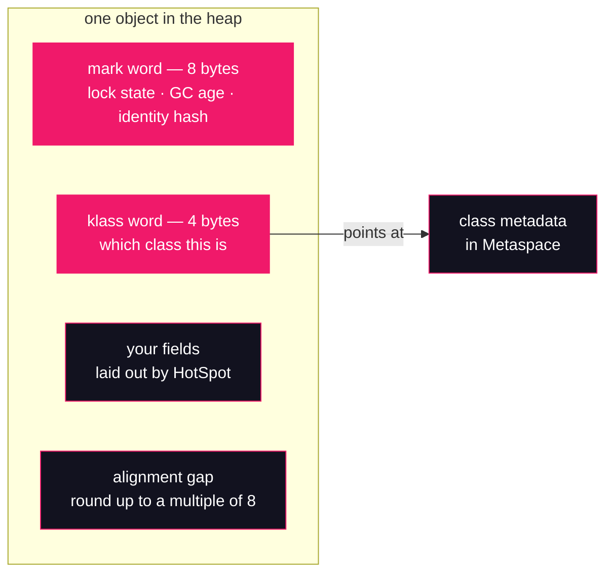

# Lesson 13: Object layout with JOL

## What you'll learn

- What every object pays before its first field: the 12-byte header — an 8-byte **mark word** and a 4-byte **klass word**
- Padding and alignment: why an object holding one `boolean` costs 24 bytes of heap, not 1
- How to read JOL (Java Object Layout) output fluently: offsets, sizes, gaps, and the "space losses" summary
- Why field declaration *order* matters less than the field size *mix* — HotSpot re-lays your fields, and we will watch it do so

---

## Why this matters

[Lesson 12](12-runtime-data-areas.md) put every object you allocate into one shared area: the heap. Here is the question that lesson could not answer yet: **how much heap does one object actually take?**

Ask a colleague to estimate the footprint of a cache holding ten million small entries — say a key wrapped in an object with an `int` and a `boolean`. The honest field arithmetic is 4 + 1 = 5 bytes of data, so 50 MB for ten million. The measured heap growth will be closer to 240 MB. The missing 190 MB is the subject of this lesson: every object carries a fixed header, and every object is padded up to an alignment boundary, and both costs are *per instance*. Nothing in your source code shows them. `sizeof` does not exist in Java, so most engineers simply never learn the arithmetic — until a capacity review, a heap-dump triage, or a "why did adding one `boolean` flag to this hot DTO grow our heap by 12%?" incident forces the issue.

The fix is not a rule of thumb; it is a measuring tool. JOL is OpenJDK's own object-layout inspector, and by the end of this lesson you will read its output the way you already read `javap` — fluently, and with suspicion toward any number you have not measured yourself. The header vocabulary you pick up here is load-bearing for the rest of Part 3: the klass word is the entry point to [Lesson 14](14-compressed-oops.md)'s compressed oops, and the field-level view of `String` is where [Lesson 16](16-string-internals.md) begins.

---

## The concept

### Twelve bytes before your first field

Zoom in on a single object sitting in the heap. Before any field you declared, the JVM has already spent twelve bytes on itself:



The **mark word** is eight bytes of mutable bookkeeping. It packs, among other things:

- **Lock state.** When a thread enters `synchronized (obj)`, the fact is recorded here — the intrinsic-lock machinery the [concurrency course's `synchronized` lesson](https://github.com/Dancan254/concurreny-multithreading/blob/master/lessons/part-2-shared-state/06-synchronized.md) describes from the Java side stores its state in this word.
- **GC age.** How many collections the object has survived — the number that drives promotion, which Part 5 covers in detail.
- **Identity hash.** The value `System.identityHashCode(obj)` returns, materialised on demand. You will watch this field appear in the hands-on.

The **klass word** is the object's answer to "what are you?": a pointer to the class metadata — the same Metaspace structures [Lesson 10](../part-2-classloading/10-classloader-leaks.md) watched accumulate and [Lesson 08](../part-2-classloading/08-loading-linking-initialization.md) watched get built. Every `instanceof` check, every virtual dispatch, every reflection call goes through this word. One thing should bother you immediately: it is **4 bytes**, on a 64-bit JVM where a pointer needs 8. That compression is deliberate, it is one of the most consequential optimizations in HotSpot, and it is [Lesson 14](14-compressed-oops.md)'s entire subject. For now, just register that JOL confirms it on every layout you print.

### Padding, alignment, and "space losses"

After the header come the fields, and after the fields comes silence: HotSpot rounds every instance size up to a multiple of **8 bytes**. Aligned addresses are what the hardware and the GC walk cheaply, so the JVM pays a few slack bytes per object to keep every object aligned. JOL reports the rounding as `(object alignment gap)`, and it separates two kinds of waste in its summary line:

- **internal** losses — gaps *between* fields, inserted so each field sits at an offset its size divides;
- **external** losses — the trailing gap that rounds the whole instance up to the 8-byte boundary.

### Arrays carry a third header word

An array is an object with one extra header field: its **length**, 4 bytes sitting right after the klass word. That is where `array.length` is read from. It also means an array's header alone is 16 bytes — already the 8-aligned minimum instance size, which is why an empty `int[0]` ends up the same 16 bytes as an empty `Object`, with the length word hiding in what was the `Object`'s alignment gap. You will see both in the tour.

### What JOL is (and what its warnings are not)

JOL — `org.openjdk.jol:jol-core`, an OpenJDK project — reconstructs an object's true layout by reading raw memory through `Unsafe`. When it starts, it tries three introspection strategies in order — the `Instrumentation` API, the Serviceability Agent, and finally `Unsafe` — and prints a `# WARNING` line for each strategy that was unavailable. On a normal developer machine the first two fail (self-attach is restricted; the SA is not attached) and JOL silently settles on `Unsafe`. **Those two warnings are JOL narrating its fallback, not a misconfiguration.** The run below needs no `--add-opens` and no other flags on JDK 25 — that is an empirical claim, verified on the pinned Zulu 25.28 build, not an assumption. (Older documentation suggests otherwise; trust the run, not the folklore. [Lesson 11](../part-2-classloading/11-modules-and-classloading.md)'s escape hatch stays in its box.)

---

## Hands-on

### 1. JOL joins `labs/`

JOL is a third-party library, so by the course rule from [Lesson 06](../part-1-bytecode/06-generating-bytecode-with-asm.md) it lives in the single Maven module, `labs/`. The `pom.xml` gains one dependency, and the exec plugin's main class is now routed through a property so either demo can be selected from the command line:

```xml
    <properties>
        <maven.compiler.release>25</maven.compiler.release>
        <project.build.sourceEncoding>UTF-8</project.build.sourceEncoding>
        <exec.mainClass>org.javaguy.labs.jol.LayoutTour</exec.mainClass>
    </properties>

    <dependencies>
        <dependency>
            <groupId>org.ow2.asm</groupId>
            <artifactId>asm</artifactId>
            <version>9.8</version>
        </dependency>
        <dependency>
            <groupId>org.openjdk.jol</groupId>
            <artifactId>jol-core</artifactId>
            <version>0.17</version>
        </dependency>
    </dependencies>

    <build>
        <plugins>
            <plugin>
                <groupId>org.codehaus.mojo</groupId>
                <artifactId>exec-maven-plugin</artifactId>
                <version>3.5.0</version>
                <configuration>
                    <mainClass>${exec.mainClass}</mainClass>
                </configuration>
            </plugin>
        </plugins>
    </build>
```

`jol-core` 0.17 is the latest published release, and the run below is the proof it works on JDK 25. The `${exec.mainClass}` indirection matters: a literal `<mainClass>` in the POM beats the `-Dexec.mainClass` command-line property, which would lock us into one demo forever. With the property, plain `mvn -q compile exec:java` runs this lesson's tour (the new default), and lesson 06's ASM demo still runs with an explicit override:

```bash
mvn -q compile exec:java -Dexec.mainClass=org.javaguy.labs.asm.GeneratedGreeter
```

```text
Wrote Greet.class (406 bytes)
Loaded org.javaguy.labs.asm.Greet with org.codehaus.mojo.exec.URLClassLoaderBuilder$ExecJavaClassLoader@34d4860f
Hello from Greet — a class that did not exist a second ago!
```

*(Maven's own `sun.misc.Unsafe` warnings precede this — [Lesson 06](../part-1-bytecode/06-generating-bytecode-with-asm.md) already established they are Maven's guts, not ours. The classloader identity hash varies.)*

### 2. The tour

`labs/src/main/java/org/javaguy/labs/jol/LayoutTour.java`:

```java
package org.javaguy.labs.jol;

import org.openjdk.jol.info.ClassLayout;

public class LayoutTour {

    static class IntAndBoolean {
        int count;
        boolean flag;
    }

    public static void main(String[] args) {
        print("an empty object", new Object());
        print("an int and a boolean", new IntAndBoolean());
        print("an int[7]", new int[7]);
        print("a String", "layout");
    }

    static void print(String title, Object instance) {
        IO.println("=== " + title + " ===");
        IO.println(ClassLayout.parseInstance(instance).toPrintable());
    }
}
```

One API call does all the work: `ClassLayout.parseInstance(x).toPrintable()` walks the live object and prints its offset table. Four exhibits, chosen to isolate one concept each: the header alone, padding between fields, the array length word, and a real JDK class with a reference field.

### 3. Run it and read every line

```bash
cd labs && mvn -q compile exec:java
```

```text
=== an empty object ===
# WARNING: Unable to get Instrumentation. Dynamic Attach failed. You may add this JAR as -javaagent manually, or supply -Djdk.attach.allowAttachSelf
# WARNING: Unable to attach Serviceability Agent. Unable to attach even with module exceptions: [org.openjdk.jol.vm.sa.SASupportException: Sense failed., org.openjdk.jol.vm.sa.SASupportException: Sense failed., org.openjdk.jol.vm.sa.SASupportException: Sense failed.]
java.lang.Object object internals:
OFF  SZ   TYPE DESCRIPTION               VALUE
  0   8        (object header: mark)     0x0000000000000001 (non-biasable; age: 0)
  8   4        (object header: class)    0x00171bf8
 12   4        (object alignment gap)    
Instance size: 16 bytes
Space losses: 0 bytes internal + 4 bytes external = 4 bytes total

=== an int and a boolean ===
org.javaguy.labs.jol.LayoutTour$IntAndBoolean object internals:
OFF  SZ      TYPE DESCRIPTION               VALUE
  0   8           (object header: mark)     0x0000000000000001 (non-biasable; age: 0)
  8   4           (object header: class)    0x01304e70
 12   4       int IntAndBoolean.count       0
 16   1   boolean IntAndBoolean.flag        false
 17   7           (object alignment gap)    
Instance size: 24 bytes
Space losses: 0 bytes internal + 7 bytes external = 7 bytes total

=== an int[7] ===
[I object internals:
OFF  SZ   TYPE DESCRIPTION               VALUE
  0   8        (object header: mark)     0x0000000000000001 (non-biasable; age: 0)
  8   4        (object header: class)    0x00173470
 12   4        (array length)            7
 16  28    int [I.<elements>             N/A
 44   4        (object alignment gap)    
Instance size: 48 bytes
Space losses: 0 bytes internal + 4 bytes external = 4 bytes total

=== a String ===
java.lang.String object internals:
OFF  SZ      TYPE DESCRIPTION               VALUE
  0   8           (object header: mark)     0x0000000000000001 (non-biasable; age: 0)
  8   4           (object header: class)    0x00176040
 12   4       int String.hash               -1109722326
 16   1      byte String.coder              0
 17   1   boolean String.hashIsZero         false
 18   2           (alignment/padding gap)   
 20   4    byte[] String.value              [108, 97, 121, 111, 117, 116]
Instance size: 24 bytes
Space losses: 2 bytes internal + 0 bytes external = 2 bytes total
```

*(The two `# WARNING` lines are JOL's strategy fallback from the concept section. Mark-word and klass-word hex values vary from run to run; whether the `String`'s `hash` field is already filled depends on what the JVM did before your line ran — under Maven, classloading had already interned and hashed the literal.)*

Read the table the way it is printed — column by column: `OFF` is the byte offset from the object's start, `SZ` the field's size in bytes, then the type and name, then the live value. Line by line:

- **The empty object: 16 bytes for zero bytes of data.** Offsets 0–7 are the mark word — its value `0x...01` ends in tag bits `01`, HotSpot's encoding of "unlocked, no hash yet", which JOL annotates as `non-biasable; age: 0`. Offsets 8–11 are the 4-byte klass word. The instance so far is 12 bytes, which is not a multiple of 8, so a 4-byte alignment gap takes it to **16**. This is the minimum price of objecthood on this JVM.
- **`IntAndBoolean`: 24 bytes for 5 bytes of data.** The `int` lands at offset 12 — the first slot after the header, conveniently 4-aligned. The `boolean` takes one byte at 16. Twelve plus five is 17, which rounds up to **24**, leaving 7 bytes of external loss. Nearly a third of this object's footprint is alignment slack.
- **`int[7]`: the array's third header word.** The klass word is followed at offset 12 by `(array length) = 7` — that is where `arr.length` reads from. Elements start at 16: 7 × 4 = 28 bytes, taking the object to 44, rounded to **48**. Note the klass word's value differs from `java.lang.Object`'s — the array's class is `[I`, the same internal name [Lesson 02](../part-1-bytecode/02-anatomy-of-a-class-file.md) met in descriptors.
- **`String`: a 24-byte shell.** Four fields, and only one of them is the text: `hash` (cached hash code, [Lesson 16](16-string-internals.md) explains `hashIsZero`), `coder` (one byte selecting the compact-string encoding — again lesson 16's story), and `value`, a **4-byte reference** to a `byte[]` that lives in a *separate* object. The characters `[108, 97, 121, 111, 117, 116]` — `l`, `a`, `y`, `o`, `u`, `t` — are not inside the `String`; JOL prints them by following the reference. Two details worth lingering on: the reference field is 4 bytes wide (compressed — lesson 14), and the 2-byte gap at offset 18 is an *internal* loss, padding so the 4-byte `value` lands on a 4-aligned offset.

That is the whole reading protocol: header words first, then fields at their offsets, then the gap, then the size and loss summary. Every JOL table you will ever meet is these five lines of arithmetic.

### 4. The mark word is not a constant

The tour showed every mark word as `0x...01`. That is a newborn object's value, not a permanent one — the word is *state*, and it changes as the JVM uses the object. Prove it with a standalone sample. First the setup, once per shell (the jar reached your local repository when Maven resolved it in section 1):

```bash
cd ~/jvm-internals-samples/lesson13
JAR=~/.m2/repository/org/openjdk/jol/jol-core/0.17/jol-core-0.17.jar
```

`MarkWord.java`:

```java
import org.openjdk.jol.info.ClassLayout;

public class MarkWord {

    public static void main(String[] args) {
        Object o = new Object();
        System.out.println(ClassLayout.parseInstance(o).toPrintable());
        System.identityHashCode(o);
        System.out.println(ClassLayout.parseInstance(o).toPrintable());
    }
}
```

```bash
javac -cp "$JAR" MarkWord.java
java -cp ".:$JAR" MarkWord
```

```text
java.lang.Object object internals:
OFF  SZ   TYPE DESCRIPTION               VALUE
  0   8        (object header: mark)     0x0000000000000001 (non-biasable; age: 0)
  8   4        (object header: class)    0x00171bf8
 12   4        (object alignment gap)    
Instance size: 16 bytes
Space losses: 0 bytes internal + 4 bytes external = 4 bytes total

java.lang.Object object internals:
OFF  SZ   TYPE DESCRIPTION               VALUE
  0   8        (object header: mark)     0x00000313aa8fd801 (hash: 0x13aa8fd8; age: 0)
  8   4        (object header: class)    0x00171bf8
 12   4        (object alignment gap)    
Instance size: 16 bytes
Space losses: 0 bytes internal + 4 bytes external = 4 bytes total
```

*(All hex values vary per run.)* One `identityHashCode` call — which the program never even prints — rewrote the word: the tag bits still read `01` (unlocked), but a hash now occupies the upper bits and JOL's annotation changed to `hash: 0x13aa8fd8`. The JVM never stores the hash until something asks for it, because most objects are never hashed and the bits are needed for other duties (locking, age). Same word, new meaning, one call later.

One honesty note for the truly observant: if you print the `int` that `identityHashCode` *returns* and compare it with the hash JOL decodes from the mark word, the two numbers do not match on this JDK build. JOL 0.17 predates JDK 25 by more than two years, and the mark word's bit packing is HotSpot's private format, free to shift under it. The offsets and sizes — everything this lesson teaches — are read from raw memory and do not depend on that decode; treat JOL's parenthesised annotations as its best interpretation, and the offset table as ground truth.

### 5. Field order is not layout order

The `String` layout ended with a hint — `value` was padded into place. Who decided that order? Not you. HotSpot re-lays instance fields to minimise padding, so the declaration sequence in your `.java` file is *not* the memory sequence. Watch it happen. `FieldOrder.java`:

```java
import org.openjdk.jol.info.ClassLayout;

public class FieldOrder {

    static class ByteIntByte {
        byte a;
        int b;
        byte c;
    }

    static class IntByteByte {
        int b;
        byte a;
        byte c;
    }

    static class LongIntLongInt {
        long l1;
        int i1;
        long l2;
        int i2;
    }

    public static void main(String[] args) {
        System.out.println(ClassLayout.parseInstance(new ByteIntByte()).toPrintable());
        System.out.println(ClassLayout.parseInstance(new IntByteByte()).toPrintable());
        System.out.println(ClassLayout.parseInstance(new LongIntLongInt()).toPrintable());
    }
}
```

```bash
javac -cp "$JAR" FieldOrder.java
java -cp ".:$JAR" FieldOrder
```

```text
FieldOrder$ByteIntByte object internals:
OFF  SZ   TYPE DESCRIPTION               VALUE
  0   8        (object header: mark)     0x0000000000000001 (non-biasable; age: 0)
  8   4        (object header: class)    0x01040210
 12   4    int ByteIntByte.b             0
 16   1   byte ByteIntByte.a             0
 17   1   byte ByteIntByte.c             0
 18   6        (object alignment gap)    
Instance size: 24 bytes
Space losses: 0 bytes internal + 6 bytes external = 6 bytes total

FieldOrder$IntByteByte object internals:
OFF  SZ   TYPE DESCRIPTION               VALUE
  0   8        (object header: mark)     0x0000000000000001 (non-biasable; age: 0)
  8   4        (object header: class)    0x01052f80
 12   4    int IntByteByte.b             0
 16   1   byte IntByteByte.a             0
 17   1   byte IntByteByte.c             0
 18   6        (object alignment gap)    
Instance size: 24 bytes
Space losses: 0 bytes internal + 6 bytes external = 6 bytes total

FieldOrder$LongIntLongInt object internals:
OFF  SZ   TYPE DESCRIPTION               VALUE
  0   8        (object header: mark)     0x0000000000000001 (non-biasable; age: 0)
  8   4        (object header: class)    0x01053190
 12   4    int LongIntLongInt.i1         0
 16   8   long LongIntLongInt.l1         0
 24   8   long LongIntLongInt.l2         0
 32   4    int LongIntLongInt.i2         0
 36   4        (object alignment gap)    
Instance size: 40 bytes
Space losses: 0 bytes internal + 4 bytes external = 4 bytes total
```

*(Klass-word hex varies.)* Two findings:

1. **`ByteIntByte` and `IntByteByte` print the same layout.** Different declaration orders, identical memory: `int` at 12, the two `byte`s at 16 and 17, 24 bytes total. HotSpot grouped the fields by size and did not care which order you wrote them in.
2. **`LongIntLongInt` shows *why*.** Declared as long-int-long-int, it is laid out as int-long-long-int: `i1` grabs offset 12, the 4-byte slot between the header and the first 8-aligned `long`. Had the fields been placed in declaration order, `l1` at offset 16 would have forced 4 bytes of padding after the header, and the two `int`s would have left another hole at the end. The re-layout packs the same 20 bytes of fields into 40 bytes total with only the mandatory trailing gap.

So the honest version of "field order matters for size": **the order you write does not matter; the multiset of field sizes does.** A class with two `long`s and two `int`s costs 40 bytes no matter how you permute the declarations. If you want to shrink an object, change the field *types* — fewer fields, smaller fields — because the layout engine has already taken all the slack reordering can recover.

---

## Try it yourself

1. Add a second `int` to `IntAndBoolean` in `LayoutTour` and predict the instance size before re-running (hint: it does not grow). Then add a `long` and predict again — this time it does. Run and check both.
2. Print the layout of `new int[0]`. How big is an empty array, and which header word makes it different from the empty `Object`? Now `new byte[7]`, `new byte[8]` and `new byte[9]`: find the exact element count where the size jumps, and explain it with the 8-byte rule.
3. Write a class with eight `boolean` fields and predict its size from the header-plus-fields arithmetic before you run JOL on it. Then try a class holding a single `Object` reference — how wide is the slot, and which lesson explains why it is not 8 bytes?
4. In `MarkWord`, print the layouts of an object *before, inside, and after* a `synchronized (o) { }` block. Does the mark word change while the lock is held on this JDK, and is it restored afterwards? Then look up what "thin lock" and "inflated lock" mean for the word's contents.
5. Run the tour under `-XX:-UseCompressedOops` — wait, that is next lesson's flag. Instead: print the layout of `"a much longer string than layout"` and of `new byte[100]`, and sketch the two-object picture (shell + payload) for each. What stays constant as the content grows?

---

## Common mistakes

- **"The fields sum to the object's size."** They sum to the *payload*. Add 12 bytes of header, internal gaps between fields, and the external gap to the next multiple of 8 — the `IntAndBoolean` tour exhibit carries 5 bytes of data in a 24-byte object. Per-instance overhead is invisible in source and dominant in collections of small objects.
- **"Reordering my field declarations shrinks the object."** HotSpot re-lays fields by size, as the `ByteIntByte`/`IntByteByte` pair proved byte-for-byte. What you can change is the field *mix*: drop a field, narrow an `int` that holds a byte's worth of range, or split a cold field into a separate object. Reordering declarations changes nothing but readability.
- **"JOL's warnings mean it needs `--add-opens` (or sudo)."** The `# WARNING: Unable to get Instrumentation` / `Unable to attach Serviceability Agent` lines are JOL's first two introspection strategies failing their probe so it can fall back to `Unsafe`, which works. On JDK 25 the tour above runs with no flags at all — verified, not assumed. The `sun.misc.Unsafe` deprecation warnings are the same family [Lesson 06](../part-1-bytecode/06-generating-bytecode-with-asm.md) told you to ignore from Maven; JOL merely joins in.
- **"These sizes are part of the Java specification."** They are this JVM's implementation detail. The JVMS does not fix header sizes, field order, or alignment — HotSpot on your machine, with your flags, produced every number in this lesson. Change the flags (lesson 14 turns 4-byte references into 8-byte ones) or the JVM, and re-measure. Measuring is exactly what JOL is for.
- **"A long `String` is a large object."** The `String` shell is 24 bytes whether it holds 6 characters or 6,000 — the characters live in a separate `byte[]` that must be sized on its own. [Lesson 16](16-string-internals.md) takes that array apart; for footprint arithmetic, always count both objects.

---

## Check your understanding

**1. An empty `Object` occupies 16 bytes. The header is only 12 — where did the other 4 go, and what rule put them there?**

<details>
<summary>Reveal answer</summary>

The trailing `(object alignment gap)`. HotSpot rounds every instance size up to a multiple of 8 bytes so every object starts at an 8-aligned address. A 12-byte header-only instance rounds to 16, and JOL reports those 4 bytes as external loss in the "space losses" line.

</details>

**2. In the `int[7]` layout, which header component distinguishes an array from a scalar object, what does it cost, and where does `arr.length` read from?**

<details>
<summary>Reveal answer</summary>

The 4-byte `(array length)` word at offset 12, immediately after the klass word. Scalar objects do not have it; arrays pay 4 bytes for it. `arr.length` is a read of exactly that field — which is why length access needs no method call, and why even an empty `int[0]` pays for the word (its header is 16 bytes against a scalar's 12).

</details>

**3. The `String` layout reports `Space losses: 2 bytes internal + 0 bytes external`. What does each term mean, and which specific bytes are the 2 internal ones here?**

<details>
<summary>Reveal answer</summary>

Internal losses are gaps *between* fields, inserted so each field sits at an offset its size divides; external losses are the trailing gap rounding the whole instance to a multiple of 8. The 2 internal bytes are the `(alignment/padding gap)` at offsets 18–19: after the 1-byte `coder` and `hashIsZero` fields, two slack bytes push the 4-byte `value` reference to the 4-aligned offset 20. External loss is zero because the fields end exactly on the 24-byte boundary.

</details>

**4. `LongIntLongInt` was declared as `long, int, long, int` but laid out as `int, long, long, int`. Why did HotSpot move `i1` to offset 12, and what does that tell you about trying to optimise object size by reordering declarations?**

<details>
<summary>Reveal answer</summary>

The 4-byte slot at offset 12 sits between the 12-byte header and the first offset that can hold an 8-byte `long` (offset 16). Placing an `int` there uses space that declaration-order layout would have wasted as padding, so the JVM packs fields by size rather than by source order. The consequence: reordering fields in source cannot, in practice, change the instance size at all — HotSpot already normalises the order. Only changing the field mix (fewer or narrower fields) shrinks the object.

</details>

**5. The klass word is 4 bytes wide on this 64-bit JVM, and so is the `String.value` reference. What is being compressed, what does it cost, and where do you go to find out?**

<details>
<summary>Reveal answer</summary>

Both are compressed pointers: the klass word is a compressed pointer to class metadata in Metaspace, and `value` is a compressed *oop* (ordinary object pointer) into the heap. Compression halves the per-reference cost at the price of an encode/decode on every access, and it only works below a certain heap size — the mechanism and its famous boundary are [Lesson 14](14-compressed-oops.md)'s subject.

</details>

---

## Recap

- Every object starts with a **12-byte header**: an 8-byte **mark word** (lock state, GC age, identity hash — mutable, packed on demand) and a 4-byte **klass word** pointing at the class metadata in Metaspace.
- Fields follow the header, and the instance is rounded up to a multiple of **8 bytes**. JOL's "space losses" line splits the waste into *internal* gaps between fields and the *external* trailing gap.
- Arrays add a third header word — the 4-byte **length** — between the klass word and the elements.
- HotSpot lays fields out **by size, not declaration order**, filling the post-header slot first. The field *mix* determines the size; the order you write does not.
- JOL (`org.openjdk.jol:jol-core`, now the second citizen of `labs/`) measures all of this on the live JVM. Its warnings are strategy fallbacks, not errors, and on JDK 25 it needs no flags. Its offset table is ground truth; its parenthesised annotations are interpretation.
- The 4-byte klass word and the 4-byte `String.value` reference are both compressed pointers — the thread [Lesson 14](14-compressed-oops.md) pulls on next.

**Previous:** [Lesson 12 — Runtime data areas](12-runtime-data-areas.md) · **Next:** [Lesson 14 — Compressed oops](14-compressed-oops.md)
