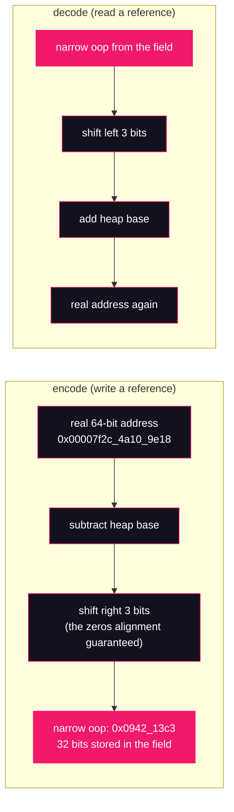

# Lesson 14: Compressed oops

## What you'll learn

- What an oop actually is, and why the move to 64-bit handed the JVM a pointer problem
- The encoding trick: how a 32-bit word addresses 35 bits of heap by spending the alignment
- The ~32 GB boundary — where it really is on a live JDK, why it isn't exactly 32, and how to find it yourself in seconds
- Why there are **two** compressions, not one — heap references versus the klass word — and what JDK 25 changed about the second
- The heap-sizing dead zone: why a 33 GB heap can hold fewer objects than a 31 GB one

---

## Why this matters

[Lesson 13](13-object-layout-jol.md) left a loose thread. JOL showed every object header carrying a 4-byte slot labelled `class` — a pointer to the object's class metadata. Four bytes, on a 64-bit machine whose native addresses are eight. How does a 4-byte slot point anywhere in a multi-gigabyte process?

That slot is the visible tip of one of the most important optimizations in HotSpot. When the JVM went 64-bit, every reference in every heap doubled in width. A reference-heavy heap — entity graphs, caches, JSON trees, ORM sessions — *is* mostly pointers, so the 64-bit transition threatened to nearly double the memory footprint of exactly the applications that needed big heaps in the first place. Compressed oops is the fix: encode every heap reference in 32 bits again, and pay one shift instruction to decode it. It is on by default, it is why 64-bit JVMs are memory-competitive with their 32-bit ancestors, and it silently stops working above a heap size that production teams cross all the time.

That crossing has a real cost, and it shows up as a classic sizing mistake: a service running tight at 28 GB gets "more headroom" at 33 GB — and gets *worse*, because every reference in the heap just doubled. Today you'll measure where the boundary really is, watch JOL prove what changes when you cross it, and learn the flags that let you explore a 40 GB heap on a machine that doesn't have one.

It also settles a debt from [Lesson 07](../part-2-classloading/07-the-delegation-model.md): the CDS archive log line that announced it was "created with `UseCompressedOops = 1, UseCompressedClassPointers = 1`" and promised this lesson would explain those. By the end of the hands-on, it will.

---

## The concept

### An oop is a pointer, not an object

"Oop" is HotSpot source-code vocabulary: **ordinary object pointer**, the C++ struct the JVM uses for a managed reference. Everywhere Java has a reference — a local variable, a field, an array element, a method argument, a return value — the JVM is storing an oop. On a 64-bit machine, a native address is 8 bytes, so every one of those slots costs 8 bytes.

Do a little arithmetic on a reference-dense design. A cache entry holding a key, a value, `next`/`prev` links, an expiry timestamp wrapper and an owner reference carries six references: 48 bytes of pure pointer at 8 bytes each, before a single byte of payload. Multiply by millions of entries. The heap didn't get more useful when it went 64-bit — it got wider.

And it isn't only your references. [Lesson 13](13-object-layout-jol.md)'s header anatomy showed the **klass word**: every object header carries a pointer to its class's metadata. One pointer per object, millions of objects. That pointer had the same problem.

### Spend the alignment: 35 bits in a 32-bit word

Here is the trick. [Lesson 13](13-object-layout-jol.md) showed objects padded to a multiple of 8 bytes — on this JDK, `ObjectAlignmentInBytes = 8`. If every object starts at a multiple of 8, then every object address ends in three zero bits. Always. Storing those three bits wastes 9% of every pointer storing guaranteed zeros.

So don't store them. A **compressed oop** (a *narrow oop*, in HotSpot's dialect) is the object's byte offset from a heap base, shifted right by 3:



Count the reach: 32 bits distinguish 2³² slots, each slot is 2³ bytes, so the encodable range is 2³² × 2³ = **2³⁵ bytes = 32 GiB**. That is the lesson title's whole trick — 35 bits of address carried in a 32-bit word, paid for with alignment you were already spending. The decode costs one shift and one add, and on x86 that folds into the addressing hardware of the load instruction itself; in exchange, reference-dense data structures stay small enough to fit the caches they had on a 32-bit JVM. Two narrow-oops edge cases worth knowing: the value `0` is reserved for `null` (so `null` needs no decoding and never aliases a real object), and the GC maintains these encodings too — every reference the collector scans, moves and rewrites is narrow. Part 5 will cash that in.

### The boundary is real, and it is not exactly 32

If the encoding reaches 2³⁵ bytes, compression must stop working at 32 GiB of heap — and ergonomics (the JVM's auto-tuning layer) must flip the scheme off there. Two refinements, both measured below:

1. **The real cutoff is just *under* 32 GiB.** The JVM needs the entire heap reservation to fit inside the encoding's reach, with margin; it doesn't ride the theoretical edge. On this build the flip lands between `-Xmx32736m` and `-Xmx32738m` — a few dozen megabytes shy of 32 GiB. The practical consequence: **`-Xmx32g` is already over the boundary.** Don't memorize a number — measure it on your JDK, the way you'll do in the hands-on.
2. **The boundary moves with alignment.** The 3-bit shift comes from 8-byte alignment. Set `ObjectAlignmentInBytes=16` and objects gain a fourth guaranteed zero bit: shift by 4, reach 2³² × 2⁴ = 2³⁶ = 64 GiB. Wider alignment buys encoding range at the price of rounding every object up to a 16-byte multiple — a trade you'll see HotSpot make (and you can make) in the flags below.

### Two compressions, not one

Everything so far is about references *in the heap*: fields, array elements. But the klass word from [Lesson 13](13-object-layout-jol.md) is also a pointer — into class metadata, which lives in Metaspace (the runtime data area from [Lesson 01](../part-0-the-machine/01-jvm-jre-jdk-big-picture.md)'s map, toured in lesson 12). HotSpot compresses it with the same shift trick, into a dedicated region of Metaspace called the **compressed class space**. Two pointers, two flags:

| Flag | What it compresses | Where the compressed values live |
|---|---|---|
| `UseCompressedOops` | References between heap objects: fields, array elements | Object fields and array bodies in the heap |
| `UseCompressedClassPointers` | The klass word: each object header's pointer to its class metadata | Every object header, pointing into the compressed class space in Metaspace |

They were born coupled, but on modern JDKs they are **independent**: you'll prove below that `-XX:-UseCompressedOops` leaves the klass word compressed (still 4 bytes), because class metadata sits in a small, known region whose reach never approaches the boundary even when the heap does.

One more JDK 25 fact you'll capture live: `UseCompressedClassPointers` is **deprecated** in this release — the JVM prints a warning when you touch it. The direction of travel is "class pointers are always compressed," with [Lesson 13](13-object-layout-jol.md)'s header getting smaller still: JDK 25 also ships compact object headers (`UseCompactObjectHeaders`, off by default), which fold a compressed klass into the mark word and shrink the header to one word. That's a footnote here; the two-flag model above is what your diagnostics will show for years.

### When disabling compression makes sense

Above the boundary you have no choice — ergonomics decides, and as you'll see, it overrules even an explicit `+UseCompressedOops`. Below the boundary, disabling by hand makes sense essentially never: you would be paying up to double on every reference slot to save a shift that the hardware absorbs anyway.

The decision that *does* matter is heap sizing **across** the boundary. Cross it by a little and every reference in the heap doubles while the heap barely grew — effective object capacity can drop below what a slightly smaller, compressed heap held. The folk rule: either stay under the boundary or go meaningfully past it (break-even is often quoted near 1.5× the boundary, ~48 GB), and treat the folk rule as a hypothesis, not data — your object's mix decides, and you now own JOL and `GC.class_histogram`, the tools that measure it.

One collector footnote, verified below: selecting ZGC turns compressed oops *off* ergonomically on this JDK — ZGC spends the full 64-bit word on its colored pointers, which is Part 5's story.

---

## Hands-on

Every demo here is diagnostics-driven: no big heaps, nothing unbounded. The boundary exploration runs **flags-only** — we ask the JVM how it *would* configure itself for a 40 GB heap on this 38 GB machine, without ever allocating one. All commands run from the usual samples directory:

```bash
cd ~/jvm-internals-samples/lesson14
```

### 1. Flags only: watching ergonomics decide

[Lesson 12](12-runtime-data-areas.md) owns this flag's introduction: `-XX:+PrintFlagsFinal` prints every HotSpot flag with its final resolved value and a `{default}`/`{ergonomic}`/`{command line}` tag for where the value came from. What we lean on here is that pairing for every boundary probe: add `-version` and the JVM prints its banner and **exits before any application code (or heap) exists** — the combination means "show me your configuration for this command line, without running anything." It is the safest instrument in this course: all the power of a 40 GB JVM, none of the RAM.

`-Xmx` caps the heap — lesson 12's heap OOM demo uses it to bound the heap small; here we use it to *ask* about big heaps. (`-version` goes to stderr; the `2>/dev/null` just keeps the banner out of our grep.)

```bash
java -Xmx256m -XX:+PrintFlagsFinal -version 2>/dev/null | grep -iE "UseCompressedOops |UseCompressedClassPointers "
```

```
     bool UseCompressedClassPointers               = true                           {product lp64_product} {default}
     bool UseCompressedOops                        = true                           {product lp64_product} {ergonomic}
```

A small heap: both compressions on. Note the tags — `UseCompressedOops` says `{ergonomic}`: **the JVM chose this**; it's not the compiled-in default, it's a decision made at startup based on your heap. Now ask about 40 GB — flags only, nothing allocated:

```bash
java -Xmx40g -XX:+PrintFlagsFinal -version 2>/dev/null | grep -iE "UseCompressedOops |UseCompressedClassPointers "
```

```
     bool UseCompressedClassPointers               = true                           {product lp64_product} {default}
     bool UseCompressedOops                        = false                          {product lp64_product} {default}
```

The flip, captured. And notice what did **not** flip: `UseCompressedClassPointers` stays `true`. The klass word keeps its compression because class metadata doesn't live in your 40 GB heap — the independence of the two flags, visible in one grep.

Where exactly is the edge? Binary-search it (each probe is another flags-only run; this takes seconds):

```bash
java -Xmx32736m -XX:+PrintFlagsFinal -version 2>/dev/null | grep "UseCompressedOops "
```

```
     bool UseCompressedOops                        = true                           {product lp64_product} {ergonomic}
```

```bash
java -Xmx32738m -XX:+PrintFlagsFinal -version 2>/dev/null | grep "UseCompressedOops "
```

```
     bool UseCompressedOops                        = false                          {product lp64_product} {default}
```

On this build (Zulu 25.28, G1 defaults): compressed oops survive up to **32,736 MiB** and are gone by **32,738 MiB** — a hair under 32 GiB, not at it. *(The exact cutoff varies with JDK build and collector; the gap of a few dozen MiB is the JVM keeping its reservation inside the encoding's reach. Re-measure, never memorize.)*

Can you force it? Ask for compression explicitly at 40 GB:

```bash
java -Xmx40g -XX:+UseCompressedOops -version
```

```
OpenJDK 64-Bit Server VM warning: Max heap size too large for Compressed Oops
openjdk version "25" 2025-09-16 LTS
OpenJDK Runtime Environment Zulu25.28+85-CA (build 25+36-LTS)
OpenJDK 64-Bit Server VM Zulu25.28+85-CA (build 25+36-LTS, mixed mode, sharing)
```

A warning, and the JVM overrules you — the flag comes back `false` tagged `{command line}` if you check. Physics is not a command-line option: a 40 GB heap cannot be reached by a 35-bit encoding.

Now the alignment lever. `-XX:ObjectAlignmentInBytes` — first use, so: it sets the granularity objects are padded to ([Lesson 13](13-object-layout-jol.md)'s alignment gap), default 8. Set it to 16 and objects gain a fourth zero bit — shift by 4, and the encoding's reach doubles:

```bash
java -XX:ObjectAlignmentInBytes=16 -Xmx40g -XX:+PrintFlagsFinal -version 2>/dev/null | grep -iE "ObjectAlignmentInBytes |UseCompressedOops "
```

```
      int ObjectAlignmentInBytes                   = 16                             {product lp64_product} {command line}
     bool UseCompressedOops                        = true                           {product lp64_product} {ergonomic}
```

The same 40 GB heap that killed compression a minute ago is compressed again — the boundary moved to just under 64 GiB (measured: on at `63g`, off at `64g`). This is why the lesson says "~32 GB": the boundary is a function of alignment, not a constant of nature. Whether 16-byte alignment is a *good* trade for you depends on how much padding your object mix absorbs — JOL answers that, and it's next.

### 2. JOL: watch the slots change size

Same JOL library [Lesson 13](13-object-layout-jol.md) introduced, here as a plain jar on the classpath so we can drive it with explicit flags. Fetch it once (0.17 from Maven Central):

```bash
curl -sL -o jol-core.jar https://repo1.maven.org/maven2/org/openjdk/jol/jol-core/0.17/jol-core-0.17.jar
```

The specimen is built to isolate the question: one field of each kind whose size can't change, and one reference — whose size is the entire question.

`LayoutDemo.java`:

```java
import org.openjdk.jol.info.ClassLayout;

public class LayoutDemo {

    static class Box {
        long id;      // 8 bytes no matter what
        int count;    // 4 bytes no matter what
        Object next;  // a reference: the size of this field is the whole question
    }

    public static void main(String[] args) {
        System.out.println(ClassLayout.parseClass(Box.class).toPrintable());
        System.out.println(ClassLayout.parseInstance(new Object[10]).toPrintable());
        System.out.println("Box instance size:        "
                + ClassLayout.parseClass(Box.class).instanceSize());
        System.out.println("Object[10] instance size: "
                + ClassLayout.parseInstance(new Object[10]).instanceSize());
    }
}
```

Compile it against the jar:

```bash
javac -cp jol-core.jar LayoutDemo.java
```

**Run 1 — defaults.** One more new flag first: `--sun-misc-unsafe-memory-access=allow`. JOL 0.17 reads VM internals through `sun.misc.Unsafe`, and JDK 25 prints a four-line deprecation nag about it; this flag (new in JDK 24) tells the runtime "I allow Unsafe memory access from the classpath" and silences the nag. It changes nothing about layouts — it keeps our output readable:

```bash
java --sun-misc-unsafe-memory-access=allow -cp .:jol-core.jar LayoutDemo
```

```
# WARNING: Unable to get Instrumentation. Dynamic Attach failed. You may add this JAR as -javaagent manually, or supply -Djdk.attach.allowAttachSelf
# WARNING: Unable to attach Serviceability Agent. You can try again with escalated privileges. Two options: a) use -Djol.tryWithSudo=true to try with sudo; b) echo 0 | sudo tee /proc/sys/kernel/yama/ptrace_scope
LayoutDemo$Box object internals:
OFF  SZ               TYPE DESCRIPTION               VALUE
  0   8                    (object header: mark)     N/A
  8   4                    (object header: class)    N/A
 12   4                int Box.count                 N/A
 16   8               long Box.id                    N/A
 24   4   java.lang.Object Box.next                  N/A
 28   4                    (object alignment gap)    
Instance size: 32 bytes
Space losses: 0 bytes internal + 4 bytes external = 4 bytes total

[Ljava.lang.Object; object internals:
OFF  SZ               TYPE DESCRIPTION               VALUE
  0   8                    (object header: mark)     0x0000000000000001 (non-biasable; age: 0)
  8   4                    (object header: class)    0x00171fe0
 12   4                    (array length)            10
 16  40   java.lang.Object Object;.<elements>        N/A
Instance size: 56 bytes
Space losses: 0 bytes internal + 0 bytes external = 0 bytes total

Box instance size:        32
Object[10] instance size: 56
```

The two `# WARNING` lines are JOL's, not the JVM's: it would prefer to attach the Serviceability Agent to read VM details, the kernel's `ptrace_scope` says no, so it falls back to its `Unsafe`-based reader — which is all a layout dump needs. The layouts are unaffected; the warnings are trimmed from here on.

Read the compressed world. The klass word is 4 bytes at offset 8, exactly as [Lesson 13](13-object-layout-jol.md) promised — and on the array you can even see its *value*: `0x00171fe0`, a 21-bit number. That is a compressed class pointer in the wild. `Box.next` is **4 bytes** at offset 24. The `Object[10]` body is **40 bytes** — ten 4-byte slots.

**Run 2 — compression off.** `-XX:-UseCompressedOops` is the first explicit use of this flag pair in the course, so: `+`/`-` on a boolean `-XX:` flag forces it on or off, overriding ergonomics. No heap flag needed — the default heap on this machine is ~10 GB, comfortably inside the encoding either way, so only the flag differs between runs:

```bash
java -XX:-UseCompressedOops --sun-misc-unsafe-memory-access=allow -cp .:jol-core.jar LayoutDemo
```

```
LayoutDemo$Box object internals:
OFF  SZ               TYPE DESCRIPTION               VALUE
  0   8                    (object header: mark)     N/A
  8   4                    (object header: class)    N/A
 12   4                int Box.count                 N/A
 16   8               long Box.id                    N/A
 24   8   java.lang.Object Box.next                  N/A
Instance size: 32 bytes
Space losses: 0 bytes internal + 0 bytes external = 0 bytes total

[Ljava.lang.Object; object internals:
OFF  SZ               TYPE DESCRIPTION               VALUE
  0   8                    (object header: mark)     0x0000000000000001 (non-biasable; age: 0)
  8   4                    (object header: class)    0x00171fe0
 12   4                    (array length)            10
 16  80   java.lang.Object Object;.<elements>        N/A
Instance size: 96 bytes
Space losses: 0 bytes internal + 0 bytes external = 0 bytes total

Box instance size:        32
Object[10] instance size: 96
```

Three observations, in increasing order of importance. First, the klass word is **still 4 bytes** — `UseCompressedClassPointers` never flipped, the two-flag independence in a layout dump. Second, `Box` is *still 32 bytes*: `next` doubled to 8, but the compressed run's 4-byte alignment gap absorbed the growth. Compression's payoff is not uniform — it shows up where references are dense. Third, the dense case: `Object[10]` went from **56 to 96 bytes, +71%**, and the payload is the same ten `null`s. Reference-heavy structures are where compression earns its keep — and where crossing the boundary costs you.

**Run 3 — un-compress the klass word too.** For completeness, force the second flag off:

```bash
java -XX:+UseCompressedOops -XX:-UseCompressedClassPointers --sun-misc-unsafe-memory-access=allow -cp .:jol-core.jar LayoutDemo
```

```
OpenJDK 64-Bit Server VM warning: Option UseCompressedClassPointers was deprecated in version 25.0 and will likely be removed in a future release.
[0.013s][warning][cds] Unable to use shared archive file.
[                    ] The saved state of UseCompressedOops and UseCompressedClassPointers is different from runtime, CDS will be disabled.
LayoutDemo$Box object internals:
OFF  SZ               TYPE DESCRIPTION               VALUE
  0   8                    (object header: mark)     N/A
  8   8                    (object header: class)    N/A
 16   8               long Box.id                    N/A
 24   4                int Box.count                 N/A
 28   4   java.lang.Object Box.next                  N/A
Instance size: 32 bytes
Space losses: 0 bytes internal + 0 bytes external = 0 bytes total

[Ljava.lang.Object; object internals:
OFF  SZ               TYPE DESCRIPTION               VALUE
  0   8                    (object header: mark)     0x0000000000000001 (non-biasable; age: 0)
  8   8                    (object header: class)    0x000076726c171a18
 16   4                    (array length)            10
 20  40   java.lang.Object Object;.<elements>        N/A
 60   4                    (object alignment gap)    
Instance size: 64 bytes
Space losses: 0 bytes internal + 4 bytes external = 4 bytes total

Box instance size:        32
Object[10] instance size: 64
```

*(Addresses vary; the sizes don't.)* Three captures in one run. The klass word is now **8 bytes**, and the array's VALUE column shows why compression matters visually: `0x000076726c171a18` — a raw 47-bit native address — versus run 1's tidy `0x00171fe0`. The header grew 12→16 bytes, pushing the array's elements off their slot and costing an alignment gap: 56→64 bytes with **zero references uncompressed**. And the first two lines close [Lesson 07](../part-2-classloading/07-the-delegation-model.md)'s loop: the flag is deprecated in JDK 25, and changing the compression regime invalidates the CDS archive — "The saved state of UseCompressedOops and UseCompressedClassPointers is different from runtime." That is the sentence lesson 07's archive map promised this lesson would decode.

### 3. The arithmetic, and a parting look at CDS

Collect the three runs *(JOL warnings trimmed)*:

| Configuration | Header (mark + klass) | Reference slot | `Object[10]` total |
|---|---|---|---|
| Defaults | 8 + 4 = 12 | 4 bytes | 56 bytes |
| `-XX:-UseCompressedOops` | 8 + 4 = 12 | 8 bytes | 96 bytes |
| `-XX:-UseCompressedClassPointers` | 8 + 8 = 16 | 4 bytes | 64 bytes |

Now scale the middle row with pure arithmetic. A heap holding 100 million live references — modest for a large cache or object graph — spends 400 MB on reference *slots* compressed, 800 MB uncompressed. That's 400 MB of heap bought back before any object shrinks, and it also means 400 MB fewer bytes for the GC to scan and the CPU to cache. This is the number the 33-GB-sizing mistake pays in reverse.

Last, the CDS coda. [Lesson 07](../part-2-classloading/07-the-delegation-model.md) watched the JVM map `classes.jsa`; the archive's object layout must match the runtime's, so this Zulu build ships one archive per regime, and `-Xlog:cds` (the tag lesson 07 used) shows the selection happen:

```bash
java -Xlog:cds -version 2>&1 | grep "Opened shared archive"
```

```
[0.012s][info][cds] Opened shared archive file /home/champez/.sdkman/candidates/java/25-zulu/lib/server/classes.jsa.
```

```bash
java -XX:-UseCompressedOops -Xlog:cds -version 2>&1 | grep "Opened shared archive"
```

```
[0.013s][info][cds] Opened shared archive file /home/champez/.sdkman/candidates/java/25-zulu/lib/server/classes_nocoops.jsa.
```

*(Timestamps vary; your JDK's path will differ.)* `classes.jsa` for the compressed world, `classes_nocoops.jsa` for the wide-pointer one — and, as run 3 showed, a regime with no matching archive means CDS quietly disabled. Object layout isn't an implementation detail; it's a compatibility contract the JVM checks at startup.

---

## Try it yourself

1. **Measure the boundary on your own JDK.** Binary-search with flags-only probes (`-Xmx` + `-XX:+PrintFlagsFinal -version`) until you bracket the flip to a single MiB. Does it match this machine's 32,736–32,738 MiB window? Try it with `-XX:+UseSerialGC` and see if the cutoff moves — what does that tell you about who owns the margin?
2. **Predict, then verify.** Add a second reference (`Object prev;`) to `Box`. Predict both instance sizes before running: with compression, and with `-XX:-UseCompressedOops`. Where does the alignment gap land in each? (The answer hinges on [Lesson 13](13-object-layout-jol.md)'s field-ordering rules.)
3. **Pay for alignment.** Re-run `LayoutDemo` with `-XX:ObjectAlignmentInBytes=16`. Predict `Object[10]`'s size first — remember the header and the rounding. Is the doubled encoding reach worth the padding on *this* class mix?
4. **Count your own references.** Change the program to print `ClassLayout.parseInstance(new Object[1_000_000]).instanceSize()` in both modes, and compute the per-references cost of a real cache you're running. How many live references would your service need before the difference paid for a gigabyte of heap?
5. **Watch ZGC decide.** Run the flags-only probe with `-XX:+UseZGC` and both grep targets. What happens to `UseCompressedOops`, and why can't you argue it back on? (Part 5 will explain what ZGC spends the bits on.)

---

## Common mistakes

- **"Compressed oops are a different kind of reference, or a GC thing."** They're an *encoding* of the same references, invisible to the Java language: same semantics, same identity comparisons, same `null`. Nothing about your code changes; only the bits in the slot do.
- **"The boundary is 32 GB."** It is *near* 32 GiB with default alignment, and empirically a few dozen MiB under it — measured here between `-Xmx32736m` and `-Xmx32738m`. `-Xmx32g` is already over. It also moves with `ObjectAlignmentInBytes` and can differ by collector and build. Measure with `-XX:+PrintFlagsFinal`; never hardcode.
- **"More heap is more heap."** Across the boundary, every reference slot doubles. A service raised from 31 GB to 33 GB can fit *fewer* objects than before. Stay just under the boundary or go well past it — and verify the trade with your own object mix, not folklore.
- **"Turning off compressed oops un-compresses the klass word too."** The flags are independent on modern JDKs: run 2's layouts show 8-byte references alongside a 4-byte klass word. (`UseCompressedClassPointers` is deprecated in JDK 25 precisely because "always compressed" is the intended future.)
- **"Compression costs CPU, so disable it for latency."** Decode is a shift-and-add that folds into the x86 addressing unit; the cache and memory-bandwidth win from halved pointer footprint dwarfs it in any reference-dense workload. This is a measurable claim, not a law — but measure before reaching for the flag, because the default is almost always right.
- **"`null` is address zero, so compression must special-case it."** The narrow value `0` is *reserved* for `null` — no decoding is ever attempted on it, so it can never collide with a real object's encoding, wherever the heap base sits.

---

## Check your understanding

**1. Why does 8-byte object alignment let a 32-bit word address 32 GiB? Walk the bit math.**

<details>
<summary>Reveal answer</summary>

Because alignment guarantees every object address ends in three zero bits, those bits carry no information and don't need storing. A compressed oop stores the address right-shifted by 3 (equivalently: which 8-byte *slot* the object starts at, as an offset from the heap base). 2³² distinguishable slots × 2³ bytes per slot = 2³⁵ bytes = 32 GiB of reach. Decoding is `base + (narrow << 3)`. With 16-byte alignment you'd get a fourth free bit and 2³⁶ = 64 GiB of reach — which is exactly what the `ObjectAlignmentInBytes=16` run showed.

</details>

**2. With `-XX:-UseCompressedOops`, `Box` stayed 32 bytes but `Object[10]` grew from 56 to 96 bytes. Why did only one of them grow?**

<details>
<summary>Reveal answer</summary>

`Box` had exactly one reference, and the compressed layout already contained a 4-byte alignment gap at offset 28 — the widened 8-byte `next` field absorbed the gap, so the total stayed 32. The array's body is *ten* reference slots back to back: 40 bytes became 80 bytes with no slack anywhere to absorb it, so the total grew 56→96 (+71%). Compression's benefit is proportional to reference density; padding accidents can hide it on sparse objects but never on dense ones.

</details>

**3. A colleague proposes raising a service from `-Xmx31g` to `-Xmx34g` "for headroom." What do you tell them, and which single command proves the mechanism?**

<details>
<summary>Reveal answer</summary>

That change silently disables compressed oops — the boundary on this class of JDK is just under 32 GiB — so every reference slot in the heap doubles; the service may fit fewer live objects at 34 GB than it did at 31. Either stay just under the boundary or jump well past it (break-even folklore says ~1.5×, but measure with the real workload's object mix). The proof is flags-only and safe to run anywhere: `java -Xmx34g -XX:+PrintFlagsFinal -version 2>/dev/null | grep "UseCompressedOops "` → `false`.

</details>

**4. At `-Xmx40g`, `UseCompressedOops` flips to `false` but `UseCompressedClassPointers` stays `true`. Why can the klass word stay compressed when heap references can't?**

<details>
<summary>Reveal answer</summary>

The klass word points at class metadata, which lives in the compressed class space — a bounded region of Metaspace (1 GB by default), not in the heap. That region's reach never approaches the encoding's limit no matter how large `-Xmx` gets, so its shift-based compression remains valid. The two flags control two independent pointers, which is why run 2 showed a 4-byte klass word alongside 8-byte references, and why a 40 GB heap still carries compressed class pointers in every header.

</details>

**5. Run 3's log said "The saved state of UseCompressedOops and UseCompressedClassPointers is different from runtime, CDS will be disabled." What is the saved state, and why does a mismatch cost you CDS?**

<details>
<summary>Reveal answer</summary>

The CDS archive ([Lesson 07](../part-2-classloading/07-the-delegation-model.md)) contains pre-mapped Java objects from the classes it stores, and those objects were laid out with a specific compression regime — recorded in the archive header as `UseCompressedOops = 1, UseCompressedClassPointers = 1`. At startup the JVM compares that saved state to the runtime flags; if they differ, the archived objects' headers and references would decode wrongly, so the archive is unusable and sharing is disabled. It's why this Zulu build ships both `classes.jsa` and `classes_nocoops.jsa`: object layout is a startup compatibility contract.

</details>

---

## Recap

- **An oop is a pointer** — every reference slot in the heap — and on a 64-bit JVM it wants to be 8 bytes. Compressed oops store it in 4 by spending the three zero bits that 8-byte alignment guarantees: **2³² slots × 2³ bytes = 32 GiB of reach, 35 bits in a 32-bit word.**
- The boundary is **just under 32 GiB**, not at it (measured: on at `-Xmx32736m`, off at `-Xmx32738m`), it moves with `ObjectAlignmentInBytes`, and ergonomics — not you — owns the decision. Explore it flags-only: `-XX:+PrintFlagsFinal -version` allocates nothing.
- There are **two compressions**: oops (heap references) and class pointers (the klass word into Metaspace's compressed class space). Independent flags — `-XX:-UseCompressedOops` leaves a 4-byte klass word — and JDK 25 deprecates the second on the road to always-compressed, with compact object headers waiting in the wings.
- Compression's payoff scales with **reference density**: JOL showed `Box` unchanged (padding absorbed the growth) but `Object[10]` growing 56→96 bytes. The sizing dead zone is the production consequence: just over the boundary can mean effectively less heap than just under it.
- Layout is a **contract**: CDS archives record the compression regime and refuse to load across a mismatch. When Part 5 walks collectors through the heap, every reference they touch will be one of these narrow values — you now know how to decode them.

**Previous:** [Lesson 13 — Object layout (JOL)](13-object-layout-jol.md) · **Next:** [Lesson 15 — Escape analysis & scalar replacement](15-escape-analysis.md)
