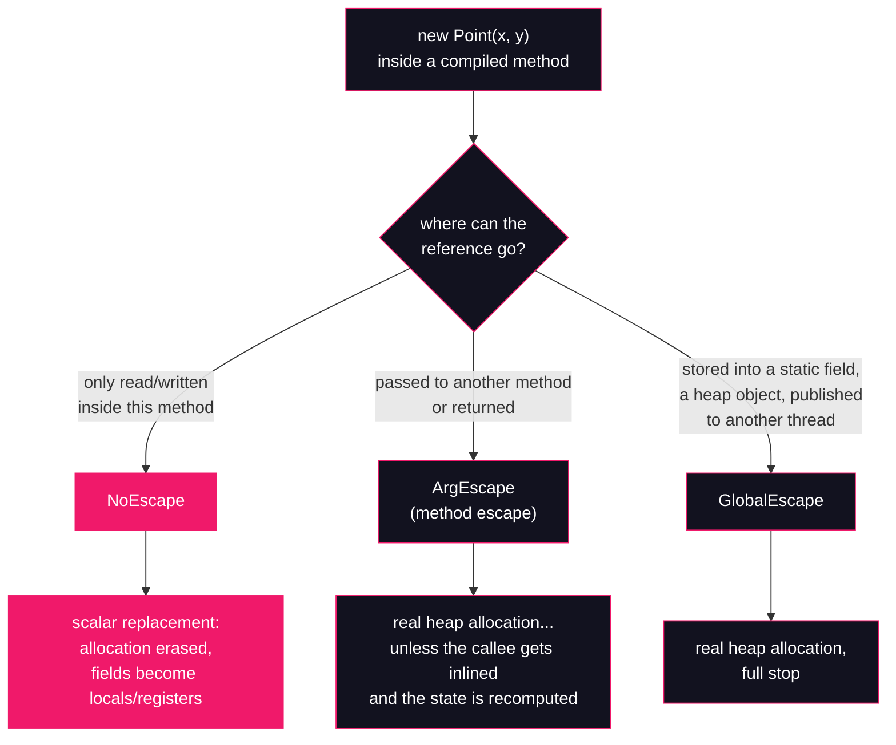

# Lesson 15: Escape analysis & scalar replacement

## What you'll learn

- Why "every `new` allocates on the heap" has been wrong since the 2000s
- The three escape states HotSpot assigns to every allocation: no escape, method escape, global escape
- Scalar replacement: the object's fields are promoted to registers and locals, and the allocation vanishes entirely
- Why escape analysis runs *after* inlining, and what lock elision does with a lock nobody else can see
- How to observe all of this on a production JDK, where the pretty diagnostic flags don't exist

---

## Why this matters

Ask a room of Java engineers where objects live and most will answer "the heap." It was in the study guide, it was in the interview prep, and for the first decade of Java it was simply true. Then HotSpot shipped escape analysis in the Java 6 era, and a quiet revolution happened: for a huge class of objects — small, short-lived, never shared — the allocation you wrote is an allocation the JVM *never performs*. No header, no heap write, no GC work. The object dissolves into its fields.

Engineers who don't know this contort their code against an enemy that died in the 2000s: object pools for tiny value objects, reusable buffers threaded through five parameters, a phobia of allocating inside a loop. Engineers who do know it get a sharper superpower — they can look at an allocation and predict whether it costs anything at all.

There is a second, sneakier reason this lesson exists, and lesson 22 (benchmarking with JMH) will lean on it hard: **a benchmark that allocates a dead object measures nothing.** If the object never escapes, the JIT deletes the very work you thought you were timing. Understanding escape analysis is the difference between a benchmark and a placebo.

Here is the corrected mental model, the one this lesson produces: `new` in bytecode is a *request*. Whether an object materializes on the heap is a *decision* — made by the C2 JIT compiler, per call site, after inlining, based on where the reference provably goes.

---

## The concept

### Bytecode promises; machine code decides

[Lesson 12](12-runtime-data-areas.md) split the JVM's memory into the heap (shared, GC-managed) and the per-thread stack (frames, locals, references). The folklore maps `new` to the heap by definition. But look at the pipeline: `javac` compiles `new Point(x, y)` to the `new` / `dup` / `invokespecial <init>` trio you met in [Lesson 04](../part-1-bytecode/04-invocation-opcodes.md) — and there it stops. Bytecode *must* contain the allocation; it describes the program's semantics, and semantics say an object comes into being.

The JIT has no such obligation. When C2 compiles a hot method, it is free to produce any machine code with the same observable behaviour. If it can *prove* the new object is never observed from outside the method, the cheapest correct implementation of "an object comes into being" is **nothing at all**. The proof is escape analysis; the rewriting is scalar replacement.

### The three escape states

For every allocation in code it compiles, C2 asks one question: where can a reference to this object be when the method returns? HotSpot sorts the answers into three states:



- **NoEscape** — the reference is born, read, and dies inside one compiled method. The object is invisible to the rest of the world, so the rest of the world cannot tell whether it ever existed.
- **ArgEscape** (method escape) — the reference travels to another method, as an argument or a return value. Conservative by necessity: C2 can't see inside a call it hasn't inlined, so it must assume the worst.
- **GlobalEscape** — the reference is stored somewhere that outlives the call: a static field, a field of another heap object, a `ThreadLocal`, anything another thread could observe. The object is genuinely shared; it must really exist.

### Scalar replacement: the object that never was

For a NoEscape allocation, C2 performs **scalar replacement**. It takes the object's fields — scalars — and rebinds every field read and write to ordinary local variables, which the register allocator then places in CPU registers. The `new` is deleted. The constructor body is inlined as plain arithmetic. No mark word or klass word (the header from [Lesson 13](13-object-layout-jol.md)) is ever written, because there is no object to head.

Notice what this is **not**: it is not "stack allocation." HotSpot does not emit a stack-resident struct with a header and a pointer to it. There is no object anywhere — on the heap, on the stack, or in a register. Two `int` fields become two registers; the aggregate evaporates. Java-the-language still has an object (identity, `getClass()`, `synchronized` all have defined semantics, and the JIT preserves them); Java-the-machine-code often does not.

### Why this only works after inlining

Escape analysis is exactly as strong as its visibility. `Point p = new Point(...)` followed by `return p` is a method escape — today. But [Lesson 04](../part-1-bytecode/04-invocation-opcodes.md) noted that C2 inlines hot call sites, and inlining *changes the evidence*: once the caller and callee are one compilation unit, a reference that "escaped to another method" may turn out never to leave the fused method at all. So C2 runs escape analysis **after** its inlining pass, on the largest view of the code it can get. An allocation that escapes at bytecode level is routinely reclassified as NoEscape once the surrounding calls are inlined away. (The inlining machinery itself — call-site profiling, guards, deoptimization — is Part 4's subject.)

This also explains the analysis's fundamental conservatism. One path where the reference reaches a static field — even a path never taken at runtime — can force the allocation to be real on *every* path, unless C2 can prove that path dead.

### Lock elision, in passing

The same proof buys a second optimization. A `synchronized` block's cost is the intrinsic lock — the monitor the [concurrency course's `synchronized` lesson](https://github.com/Dancan254/concurreny-multithreading/blob/master/lessons/part-2-shared-state/06-synchronized.md) is all about. But a lock's entire purpose is mutual exclusion *between threads*, and a NoEscape object cannot be reached by another thread. Locking it is theatre. When escape analysis proves the lock object never escapes, C2 **elides the lock**: the monitorenter/monitorexit vanish along with the allocation. This is why the ancient advice "use `StringBuilder`, not thread-safe `StringBuffer`" matters less than it used to inside a single method — a `StringBuffer` that never escapes gets its `synchronized` erased anyway. (Across method boundaries it still matters; escape analysis is not magic.)

---

## Hands-on

We'll build the two cases side by side in one program: one hot loop where the allocated `Point` never escapes, and one where a single extra line — storing it into a static field — forces GlobalEscape. Then a control run with the analysis switched off, to prove the difference is escape analysis and nothing else. All commands run from the usual samples directory:

```bash
cd ~/jvm-internals-samples/lesson15
```

### 1. The benchmark

`EscapeBench.java`:

```java
public class EscapeBench {

    static final class Point {
        final int x;
        final int y;

        Point(int x, int y) {
            this.x = x;
            this.y = y;
        }
    }

    // A one-slot static sink. Storing a Point here makes it escape.
    static final Point[] SINK = new Point[1];

    static long sum(boolean escape, int n) {
        long total = 0;
        for (int i = 0; i < n; i++) {
            Point p = new Point(i, i + 1);
            if (escape) {
                SINK[0] = p;
            }
            total += p.x * (long) p.y;
        }
        return total;
    }

    public static void main(String[] args) {
        boolean escape = args.length > 0 && args[0].equals("escape");
        int n = 200_000_000;

        for (int w = 0; w < 3; w++) {
            sum(escape, n / 10);
        }

        long start = System.nanoTime();
        long result = sum(escape, n);
        long elapsedMs = (System.nanoTime() - start) / 1_000_000;

        System.out.println("mode=" + (escape ? "escape" : "noescape")
                + " result=" + result + " elapsed=" + elapsedMs + "ms");
    }
}
```

Read `sum` as escape analysis sees it. In both modes a `Point` is born per iteration and its fields feed `total`. In `noescape` mode nothing else happens to it — the reference dies at the loop's back-edge. In `escape` mode, `SINK[0] = p` stores the reference into a static field: reachable from a GC root after the method returns, so GlobalEscape, so a real allocation. (Only the *last* `Point` survives — the sink is one slot — which keeps the live set tiny and the demo bounded: 200 million iterations, a fixed count, over in seconds.)

The warmup matters. Escape analysis lives in C2, and C2 only compiles *hot* code; the three warmup calls push `sum` through the tiers so the timed run executes fully compiled. The result is accumulated and printed so the loop is not dead code — lesson 22 explores what happens when you forget that.

Compile, then look at the bytecode with `javap -c` (`javap` is [Lesson 02](../part-1-bytecode/02-anatomy-of-a-class-file.md)'s tool):

```bash
javac EscapeBench.java
javap -c EscapeBench
```

```
  static long sum(boolean, int);
    Code:
         0: lconst_0
         1: lstore_2
         2: iconst_0
         3: istore        4
         5: iload         4
         7: iload_1
         8: if_icmpge     59
        11: new           #7                  // class EscapeBench$Point
        14: dup
        15: iload         4
        17: iload         4
        19: iconst_1
        20: iadd
        21: invokespecial #9                  // Method EscapeBench$Point."<init>":(II)V
        24: astore        5
        26: iload_0
        27: ifeq          37
        30: getstatic     #12                 // Field SINK:[LEscapeBench$Point;
        33: iconst_0
        34: aload         5
        36: aastore
        37: lload_2
        38: aload         5
        40: getfield      #18                 // Field EscapeBench$Point.x:I
        43: i2l
        44: aload         5
        46: getfield      #22                 // Field EscapeBench$Point.y:I
        49: i2l
        50: lmul
        51: ladd
        52: lstore_2
        53: iinc          4, 1
        56: goto          5
        59: lload_2
        60: lreturn
```

There it is at offset 11: `new #7 // class EscapeBench$Point`, followed by `dup`, `invokespecial <init>` — exactly the trio from [Lesson 04](../part-1-bytecode/04-invocation-opcodes.md). Both modes execute this same bytecode; the `ifeq 37` at offset 27 merely skips the `aastore` when `escape` is false. Whatever happens next happens **in machine code, not bytecode**. If you take one sentence from this lesson, take that one: escape analysis never touches your class file; it rewrites what the CPU runs.

### 2. The NoEscape run: the GC goes silent

Run with GC logging (the `-Xlog:gc` family from [Lesson 00](../part-0-the-machine/00-setup-and-toolchain.md)) and a deliberately small heap — `-Xmx`, the maximum-heap flag from [Lesson 12](12-runtime-data-areas.md), set to 64 MB so that any real allocation rate shows up as young-generation pauses within seconds:

```bash
java -Xmx64m -Xlog:gc EscapeBench
```

```
[0.005s][info][gc] Using G1
mode=noescape result=5343371213818391040 elapsed=229ms
```

*(Timestamps and elapsed times vary.)* One line of GC output — `Using G1`, printed at startup — and then **silence**. Two hundred million `Point` allocations in the source, plus 60 million more in warmup, and not a single young collection fired. There was nothing to collect: after inlining the constructor, C2 classified every `Point` as NoEscape, scalar-replaced it, and ran the loop as register arithmetic on two integers.

### 3. The GlobalEscape run: the storm returns

Add one argument, which adds one `aastore` per iteration:

```bash
java -Xmx64m -Xlog:gc EscapeBench escape
```

```
[0.005s][info][gc] Using G1
[0.144s][info][gc] GC(0) Pause Young (Normal) (G1 Evacuation Pause) 35M->1M(64M) 4.347ms
[0.156s][info][gc] GC(1) Pause Young (Normal) (G1 Evacuation Pause) 30M->1M(64M) 1.913ms
[0.181s][info][gc] GC(2) Pause Young (Normal) (G1 Evacuation Pause) 37M->1M(64M) 1.852ms
```

and at the end *(timestamps, GC numbers, sizes and elapsed times vary)*:

```
[7.691s][info][gc] GC(158) Pause Young (Normal) (G1 Evacuation Pause) 38M->1M(64M) 0.902ms
[7.748s][info][gc] GC(159) Pause Young (Normal) (G1 Evacuation Pause) 38M->1M(64M) 0.828ms
[7.804s][info][gc] GC(160) Pause Young (Normal) (G1 Evacuation Pause) 38M->1M(64M) 1.538ms
mode=escape result=5343371213818391040 elapsed=6300ms
```

Same bytecode, same result — `5343371213818391040` in both modes, because escape analysis must preserve observable behaviour — and now ~160 young pauses. Each `Point` is about 24 bytes on this JVM (the [Lesson 13](13-object-layout-jol.md) math: 12-byte header, two 4-byte `int` fields, 4 bytes of alignment padding), so 200 million of them is several gigabytes of churn. Look at the GC lines: every pause goes from ~35–39 MB used down to ~1 MB. The live set is one slot of `SINK` — the garbage is *everything else*, dying one iteration after birth. This is textbook high-churn allocation, and it is exactly what the NoEscape run avoided by never allocating.

One honest caution about the `elapsed=` numbers: this is a teaching demo, not a benchmark. Timings here are polluted by warmup, GC pauses and everything else on the machine; the GC *counts* are the signal. Rigorous microbenchmarking — including how escape analysis and dead-code elimination conspire to fake your results — is lesson 22's job.

### 4. The control: switch the analysis off

Same source, same run as section 2, one flag added — first use in this course, so full explanation. `-XX:-DoEscapeAnalysis` disables HotSpot's escape analysis; the `+`/`-` boolean-flag convention itself is [Lesson 14](14-compressed-oops.md)'s, introduced there with `-XX:-UseCompressedOops`. These flags are HotSpot implementation details rather than anything the JVM specification promises — the same warning [Lesson 01](../part-0-the-machine/01-jvm-jre-jdk-big-picture.md) gave for this family. Escape analysis has been on by default for so long that the flag exists almost purely for experiments like this one:

```bash
java -Xmx64m -Xlog:gc -XX:-DoEscapeAnalysis EscapeBench
```

```
[3.307s][info][gc] GC(154) Pause Young (Normal) (G1 Evacuation Pause) 39M->1M(64M) 0.929ms
[3.320s][info][gc] GC(155) Pause Young (Normal) (G1 Evacuation Pause) 39M->1M(64M) 1.336ms
[3.341s][info][gc] GC(156) Pause Young (Normal) (G1 Evacuation Pause) 39M->1M(64M) 0.842ms
mode=noescape result=5343371213818391040 elapsed=2275ms
```

*(Timestamps, GC numbers, sizes and elapsed times vary.)* The `noescape` code — the run that was completely GC-silent in section 2 — now churns through young collections just like the escaping one. With the analysis off, C2 must honour every `new` in the bytecode, sink or no sink. This A/B pair is the whole argument: same class file, same flags except one, and the only thing that changed is whether the JIT is allowed to prove the object unobservable.

Count the pauses in all three configurations *(counts vary a little per run — the shape is what matters)*:

```bash
java -Xmx64m -Xlog:gc EscapeBench 2>&1 | grep -c "Pause Young"
```

```
0
```

```bash
java -Xmx64m -Xlog:gc EscapeBench escape 2>&1 | grep -c "Pause Young"
```

```
161
```

```bash
java -Xmx64m -Xlog:gc -XX:-DoEscapeAnalysis EscapeBench 2>&1 | grep -c "Pause Young"
```

```
157
```

Zero, ~160, ~157. Read that table as: eliminated, forced by the sink, forced by the flag. "Allocation ≠ heap" is no longer a claim; it's a measurement.

### 5. Where did the pretty diagnostic flags go?

If you search the web for this topic you'll meet `-XX:+PrintEscapeAnalysis` and `-XX:+PrintEliminateAllocations`, which dump C2's per-allocation escape classifications. Try one on this JDK and the JVM refuses to start:

```bash
java -XX:+UnlockDiagnosticVMOptions -XX:+PrintEscapeAnalysis EscapeBench
```

```
Error: VM option 'PrintEscapeAnalysis' is develop and is available only in debug version of VM.
Improperly specified VM option 'PrintEscapeAnalysis'
Error: Could not create the Java Virtual Machine.
Error: A fatal exception has occurred. Program will exit.
```

Two new things to unpack here. `-XX:+UnlockDiagnosticVMOptions` — first use in this course — is the gate for HotSpot's *diagnostic* flag tier: flags meant for JVM engineers and support work, which HotSpot rejects unless you unlock them first. But the error message reveals a third tier beyond *product* flags (like `-XX:-DoEscapeAnalysis`, always accepted) and *diagnostic* flags (accepted once unlocked): **develop** flags, compiled into debug/fastdebug JVM builds only. Zulu 25.28 is a production build, so no amount of unlocking will give you these two flags — and that's the honest state of play on any production JDK you'd deploy.

So how do you observe escape analysis in production? Exactly the way this lesson did it: by its *effects*. GC silence under `-Xlog:gc` where the bytecode provably allocates; and the `-XX:-DoEscapeAnalysis` A/B pair to confirm the credit belongs to the analysis. Indirect evidence is the normal mode of JVM detective work — lesson 22 uses the same trick from the benchmark side.

---

## Try it yourself

1. Make the escape go through a method instead of a static field: extract `static Point make(int i) { return new Point(i, i + 1); }` and call it from the loop, printing the last result. Count the young GCs. Now explain, in escape-state terms, why inlining makes this cheaper than it looks. (This is ArgEscape being reclassified after inlining — the case the concept section promised.)
2. Delete the warmup loop and re-run section 2. Do you see a young GC or two before C2 finishes compiling `sum`? Why does elimination only appear once the code is hot?
3. Add a third field (`int z`) to `Point` and re-run all three configurations. Does the NoEscape run stay silent? What changes in the escape run's GC line sizes, and how does that connect to [Lesson 13](13-object-layout-jol.md)'s layout math?
4. Re-run the escape mode with `-Xmx256m`. The allocation rate is identical — what happens to the GC *count*, and why? (Hint: the flag changed the heap, not the analysis.)
5. In `escape` mode, replace `SINK[0] = p` with `if (i == -1) SINK[0] = p;` — a store that can never execute. Predict the GC count before you run it. What does the result tell you about how conservative C2 must be about *paths* it cannot prove dead?

---

## Common mistakes

- **"Every `new` allocates on the heap."** The folklore this lesson exists to kill. `new` is bytecode semantics; the heap allocation is a JIT decision, per call site, after inlining. The NoEscape run allocated two hundred million objects in the source and zero in the machine.
- **"Escape analysis removes the `new` from my class file."** It never touches the class file — section 1's `javap -c` output has `new #7` at offset 11 in both modes. The elimination happens in C2's generated machine code, per compilation, and can be undone by deoptimization if the JVM's assumptions break (Part 4).
- **"So the object is allocated on the stack instead."** No — HotSpot does not do general stack allocation of objects. Scalar replacement dissolves the object entirely: its fields become registers and locals, and no header, pointer, or object-shaped memory exists anywhere. "Stack allocation" is a comforting wrong picture; "the object never existed" is the right one.
- **"Escape analysis makes allocation free, so I should/shouldn't pool objects."** Both halves are overreach. EA is a best-effort, per-compilation proof — it depends on inlining succeeding, on no escaping path existing, on C2 being reached at all. Write clear code and measure (lesson 22); don't contort designs around an optimization with no contractual guarantees, and don't pool tiny short-lived objects out of habit.
- **"`-XX:-DoEscapeAnalysis` changed nothing, so my objects were being eliminated."** Or the method never got hot enough for C2 to compile it — EA only runs in C2, never in the interpreter or C1. Confirm compilation happened (the warmup pattern in `EscapeBench` exists for exactly this reason) before concluding anything from a null result.

---

## Check your understanding

**1. The NoEscape run prints zero `Pause Young` lines, yet `javap -c` clearly shows `new #7 // class EscapeBench$Point` in `sum`. Reconcile the two facts.**

<details>
<summary>Reveal answer</summary>

Bytecode and machine code are different artifacts. `javac` must emit the `new` — bytecode specifies program semantics, and semantically an object comes into being. Escape analysis runs later, in C2, on the hot loop: it proves the `Point` is never observable outside the method, scalar-replaces it into register-held fields, and emits machine code with no allocation at all. The class file is unchanged; what the CPU executes contains no `new`. Nothing was allocated, so the collector had nothing to do.

</details>

**2. Both modes print `result=5343371213818391040`. Is the identical result a coincidence of this program, or a requirement?**

<details>
<summary>Reveal answer</summary>

A requirement. Escape analysis is an optimization: it may only change *how* the program computes, never *what* it observably computes. If scalar-replacing the `Point` could change the result, C2 could not legally perform it. Every optimization in this family — scalar replacement, lock elision, dead-code elimination — is constrained by "same observable behaviour," which is why the result is the natural control to print in a demo like this (and why omitting the result invites the JIT to delete your whole loop).

</details>

**3. Name the three escape states and classify: (a) a `Point` read only inside the loop that made it; (b) a `Point` stored into a static array; (c) a `Point` returned from a small helper that C2 then inlines.**

<details>
<summary>Reveal answer</summary>

(a) NoEscape — eligible for scalar replacement. (b) GlobalEscape — the reference is stored where it outlives the method and is reachable from a GC root; real heap allocation, full stop. (c) ArgEscape (method escape) at the bytecode level — the reference crosses a method boundary as a return value — but escape analysis runs *after* inlining, so once the helper is inlined into the caller the state is recomputed; if nothing else lets it escape, it becomes NoEscape and the allocation is eliminated. This is why EA's results depend so heavily on inlining.

</details>

**4. Why does escape analysis run after inlining rather than before?**

<details>
<summary>Reveal answer</summary>

Because EA is only as strong as its visibility into how a reference is used. Before inlining, every call is opaque: pass an object to a method C2 can't see into and the analysis must conservatively assume it escapes. Inlining fuses caller and callee into one compilation unit, turning "escaped to another method" into "used on these specific lines" — which very often proves the reference never leaves the fused method at all. Running EA on the post-inlining graph maximizes the number of allocations it can eliminate.

</details>

**5. You ran `-XX:+UnlockDiagnosticVMOptions -XX:+PrintEscapeAnalysis` on your production JDK 25 and the VM refused to start. Why, and what do you do instead?**

<details>
<summary>Reveal answer</summary>

`PrintEscapeAnalysis` (like `PrintEliminateAllocations`) is a *develop* flag, compiled only into debug/fastdebug JVM builds. `-XX:+UnlockDiagnosticVMOptions` opens the *diagnostic* tier, but no unlock makes a develop flag exist in a production build like Zulu 25.28. Instead you observe escape analysis by its effects: run the hot allocating loop under `-Xlog:gc` and look for young-collection silence where the bytecode provably allocates, then re-run with `-XX:-DoEscapeAnalysis` as the control to confirm the analysis — not heap size, not dead code — caused the silence.

</details>

---

## Recap

- `new` in bytecode is a request; allocation on the heap is a C2 decision, per call site, after inlining. The class file always contains the allocation — the machine code may not.
- Every allocation gets an escape state: **NoEscape** (dies inside the method), **ArgEscape** (crosses a method boundary), **GlobalEscape** (stored where it outlives the call). Only NoEscape allocations are eliminated.
- **Scalar replacement** dissolves a NoEscape object into register-held fields — no header, no heap write, no GC. It is not "stack allocation"; the object never exists in memory at all.
- The same proof enables **lock elision**: a lock no other thread can observe is removed. Both optimizations preserve observable behaviour — same result, less machinery.
- "Objects always live on the heap" died in the 2000s. The new rule: **allocation ≠ heap** — and remember it in lesson 22, where escape analysis is exactly what makes naive benchmarks lie.
- On production JDKs the tracing flags (`PrintEscapeAnalysis`, `PrintEliminateAllocations`) are develop-only. Observe EA by its effects: GC silence under `-Xlog:gc`, with `-XX:-DoEscapeAnalysis` as the control.

**Previous:** [Lesson 14 — Compressed oops](14-compressed-oops.md) · **Next:** [Lesson 16 — String internals](16-string-internals.md)
