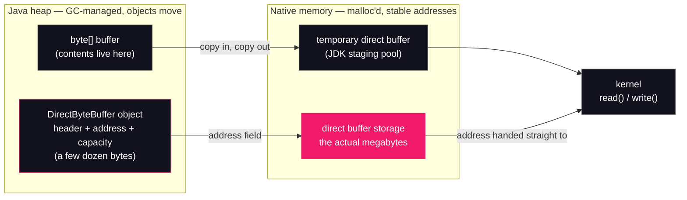

# Lesson 17: Off-heap memory & NMT

## What you'll learn

- What a direct `ByteBuffer` actually is: a tiny heap object pointing at storage the GC doesn't manage — and why I/O wants exactly that
- The budget on direct memory: `-XX:MaxDirectMemorySize`, its heap-derived default, and the `OutOfMemoryError` flavor you get when it's spent
- Why freeing direct memory is GC-pressure-sensitive: cleaners, phantom references, and the `System.gc()` retry dance inside `java.nio.Bits`
- Native Memory Tracking end to end: `-XX:NativeMemoryTracking`, reading `jcmd VM.native_memory` summaries, and the baseline → diff leak-hunting workflow

---

## Why this matters

Two production stories, one root cause.

**Story one.** A Netty-based service dies overnight with `java.lang.OutOfMemoryError` mentioning direct buffer memory. The on-call opens the dashboards: heap at 35%, GC healthy, Metaspace flat. Everything [Lesson 12](12-runtime-data-areas.md) taught you to graph is green, and the JVM is dead anyway — because the memory that ran out was never in any of those graphs.

**Story two is worse: no error at all.** A container gets OOM-killed by the kernel. The JVM wrote no log, threw no exception — from its point of view everything was fine. But the process's resident memory had been climbing for days, past the cgroup limit, because direct buffers, thread stacks, code cache and GC internals all live *outside* the heap, and the team's memory math was "`Xmx` plus a little headroom."

Lesson 12 mapped the five runtime data areas the JVM specification defines. This lesson completes the picture: the memory a JVM process uses is larger than every spec area combined, and the largest untracked-by-default slice your code controls is direct buffers. You'll spend them until the JVM says no, watch the GC fight to get them back, and then switch on the one tool — Native Memory Tracking — that accounts for the whole process, category by category. Part 6 builds on this vocabulary when it takes `jcmd` apart for real.

---

## The concept

### The copy direct buffers exist to avoid

A `byte[]` lives on the heap, and the heap moves. Any GC can relocate any object, so when your code calls `socket.write(byte[])`, the JVM cannot hand the kernel the array's address — the kernel might write to (or read from) that address *during* the syscall, and a concurrent collection would turn it into a pointer to nowhere. The JVM's options are to pin the array (stop the world for that region) or copy the data into native memory with a stable address. HotSpot copies: NIO stages heap-buffer I/O through a pool of temporary direct buffers.

A **direct buffer** skips the dance. `ByteBuffer.allocateDirect(n)` allocates the storage with `malloc` — native memory, outside the heap, at an address that never moves — and wraps it in a small heap object that carries the address, position and limit. The I/O path hands that address straight to `read(2)`/`write(2)`. No copy, no pinning. That's the whole reason direct buffers exist, and why Netty, gRPC and every high-throughput I/O framework default to them.



Note what lives where. The *storage* is native; the *object* is a heap shell a few dozen bytes in size — lessons 13 and 14 gave you the tools (JOL layouts, compressed oops) to measure such shells yourself. This split is why everything below behaves the way it does: the expensive part of a direct buffer is invisible to every heap tool you own.

### Off the map

Flip back to [Lesson 12](12-runtime-data-areas.md)'s routing table: direct buffers are the row that reads "outside all five areas." They're not heap (no GC management of the storage), not Metaspace (that's class metadata, [Lesson 10](../part-2-classloading/10-classloader-leaks.md)'s territory), not any thread's stack. A JVM process's memory is the heap **plus** Metaspace **plus** thread stacks **plus** code cache **plus** GC bookkeeping **plus** direct buffers **plus** more — and `-Xmx` caps exactly one of those. The spec doesn't even name this memory; it's pure HotSpot implementation, which is why the tools for it are HotSpot flags and `jcmd`, not JVMS chapters.

### The budget: `-XX:MaxDirectMemorySize`

[Lesson 12](12-runtime-data-areas.md) named this flag in passing; first full explanation here. `-XX:MaxDirectMemorySize=<size>` is a HotSpot product flag that caps the total **capacity** of direct buffers reserved through `java.nio`. The bookkeeping lives in `java.nio.Bits.reserveMemory`: every `allocateDirect` adds the new buffer's capacity to a counter, and if the counter would exceed the limit, the reservation is refused and you get an `OutOfMemoryError`. The default is `0`, which doesn't mean "no direct buffers" — it means *derive the limit from the maximum heap size* (`-Xmx`). So an uncapped JVM effectively budgets direct memory at the same size as its heap. You'll verify both halves of that empirically below: the flag prints as `0`, and a `-Xmx48m` run dies with `limit: 50331648` — 48 MiB to the byte.

[Lesson 12](12-runtime-data-areas.md)'s routing table files this flavor as `OutOfMemoryError: Direct buffer memory` — that's the substring worth grepping for. On this JDK the actual message is more helpful:

```text
java.lang.OutOfMemoryError: Cannot reserve 1048576 bytes of direct buffer memory (allocated: 33554432, limit: 33554432)
```

Same flavor, more digits: what you asked for, what's already spent, and the budget. Older docs show the short form; the substring `direct buffer memory` catches both.

One subtlety from the `Bits` source: the counter tracks **reserved capacity**, not bytes actually touched — and the JVM's own direct-buffer use at startup is effectively zero, which is why the demos below die at exactly the round number you set.

### Who frees a direct buffer?

The storage is `malloc`'d, so something must call `free` — and that something is not you. Each `DirectByteBuffer` registers a **cleaner** (a `jdk.internal.ref.Cleaner`, built on phantom references — lesson 23 in Part 5 gives the whole reference family its due). The chain:

1. Your code drops the last strong reference to the buffer object.
2. At some **later GC**, the collector discovers the heap shell is phantom-reachable and enqueues it.
3. A background cleaner thread runs the buffer's deallocator: `unsafe.freeMemory(address)` for the storage, and the reservation counter in `Bits` drops by the buffer's capacity.

Read step 2 again. **Freeing native memory is GC-timed.** The collector decides when step 2 happens, and the collector feels *heap* pressure only — it cannot see native pressure at all. A process with a tiny live heap can churn through gigabytes of direct storage while the GC happily idles, right up until the reservation counter hits the limit.

The allocation path knows this, and it fights back before throwing. When a reservation fails, `Bits.reserveMemory` first waits for any in-flight reference processing, retries, then **calls `System.gc()` explicitly**, then retries in an exponential backoff loop — the source comment budgets "1, 2, 4, 8, 16, 32, 64, 128, 256 (total 511 ms ~ 0.5 s)" of sleeps — and only then throws. Two practical consequences, both demoed below:

- A *churning* program usually survives: every reservation failure triggers the full-GC-and-clean dance, which frees the dead buffers.
- Anything that disables explicit GC (`-XX:+DisableExplicitGC`, common on latency-sensitive services) defangs the retry dance — and direct-buffer OOMs get dramatically more likely. This is why the flavor is called **GC-pressure-sensitive**, and why Part 5 keeps pointing back here.

### NMT: accounting for everything else

`jcmd VM.native_memory` has been sitting in the command list since [Lesson 00](../part-0-the-machine/00-setup-and-toolchain.md), where it was promised for Part 3. It reads **Native Memory Tracking** (NMT), and NMT needs its own flag, first use here:

`-XX:NativeMemoryTracking=summary|detail` — a HotSpot product flag, **startup-only**, that makes the JVM tag every native allocation *it* makes with a category and keep running totals. `summary` keeps per-category counters; `detail` additionally records every call site. You can't switch it on for a running JVM — ask a JVM started without it and you get a flat `Native memory tracking is not enabled` (captured below), so production JVMs you intend to diagnose should carry the flag from boot. It's off by default because it isn't free: every `malloc`/`free` the JVM makes gets accounted, the JVM team quotes the throughput cost in the 5–10% range, and `jcmd`'s own help rates the impact "Medium."

Reading the output takes three ideas:

- **reserved vs committed.** *Reserved* is address space the JVM laid claim to; *committed* is memory actually backed. The gap is normal — the Java Heap line routinely reserves gigabytes it hasn't touched.
- **The categories.** `Java Heap`, `Class` (Metaspace's native side), `Thread` (stacks), `Code` (the JIT's code cache), `GC`, `Compiler`, `Internal`, `Symbol`, `Other`, and more. This is the off-the-map inventory from the previous section, with numbers.
- **Where direct buffers land.** Empirically, on this JDK: **`Other`**. You'll watch 64 MB of `allocateDirect` appear as `Other +64MB`, `malloc ... #64 +64` — 64 allocations of 1 MB each. (Older write-ups say `Internal`; believe your own JVM's output, not the write-ups. This is exactly the habit this course keeps drilling.)

For leak hunting, the workflow is **baseline → diff**: `jcmd <pid> VM.native_memory baseline` snapshots the counters; later, `summary.diff` prints each category with a `+/-` delta against that baseline. "What grew, and by how much, between then and now" is the whole question a memory investigation asks, and this is the tool that answers it natively.

Two limits to respect. NMT counts only allocations that pass through the JVM's own bookkeeping — a native library leaking through its own `malloc` is invisible to NMT (but very visible to the OOM killer). And NMT's total is not RSS: the kernel's view of your process includes things NMT doesn't track and counts shared pages differently. Use NMT to attribute growth *inside* the JVM, OS tools (`ps`, `pmap`, cgroup files) for the total.

One related diagnostic flag: `-XX:+PrintNMTStatistics` prints the NMT summary when the VM exits. It sits in HotSpot's diagnostic tier, so it needs the unlock flag from lesson 15 in front of it: `-XX:+UnlockDiagnosticVMOptions -XX:+PrintNMTStatistics`.

---

## Hands-on

Part 3 keeps using explicitly declared classes compiled with `javac`, so every allocation is a line of code you can point at. Three programs today: one that pins, one that churns, one that holds still for inspection.

### 1. Pin every buffer: `DirectBoom.java`

```java
import java.nio.ByteBuffer;
import java.util.ArrayList;
import java.util.List;

public class DirectBoom {

    // The pin: every buffer we allocate stays strongly reachable,
    // so no cleaner can ever free the native memory behind it.
    static final List<ByteBuffer> PINNED = new ArrayList<>();

    public static void main(String[] args) {
        Runtime rt = Runtime.getRuntime();
        for (int mb = 1; ; mb++) {
            PINNED.add(ByteBuffer.allocateDirect(1024 * 1024));
            long heapUsed = (rt.totalMemory() - rt.freeMemory()) / (1024 * 1024);
            System.out.println(mb + " MB of direct buffers held | heap used: " + heapUsed + " MB");
        }
    }
}
```

One megabyte of native storage per iteration, every buffer pinned in a static list — the same trick [Lesson 10](../part-2-classloading/10-classloader-leaks.md) used to pin classloaders. Each iteration also prints live heap usage, so the two memories race side by side. Compile, then run with a 32 MB direct-memory budget and the shell's timer:

```bash
javac DirectBoom.java
time java -XX:MaxDirectMemorySize=32m DirectBoom
```

```text
1 MB of direct buffers held | heap used: 3 MB
2 MB of direct buffers held | heap used: 3 MB
3 MB of direct buffers held | heap used: 3 MB
... (26 more lines; heap used never leaves 3 MB) ...
30 MB of direct buffers held | heap used: 3 MB
31 MB of direct buffers held | heap used: 3 MB
32 MB of direct buffers held | heap used: 3 MB
Exception in thread "main" java.lang.OutOfMemoryError: Cannot reserve 1048576 bytes of direct buffer memory (allocated: 33554432, limit: 33554432)
	at java.base/java.nio.Bits.reserveMemory(Bits.java:178)
	at java.base/java.nio.DirectByteBuffer.<init>(DirectByteBuffer.java:108)
	at java.base/java.nio.ByteBuffer.allocateDirect(ByteBuffer.java:367)
	at DirectBoom.main(DirectBoom.java:14)

real	0m0.704s
user	0m0.140s
sys	0m0.110s
```

*(Timings vary per run; the death count and the flat heap do not. `heap used` read 2 MB on some runs — small and flat is the point, not the digit.)*

Dead in 0.7 seconds, at exactly 32 MB held — the reservation counter is that precise. And look at the two columns: **native memory grew 32 MB while the heap sat at 3 MB the entire run.** Thirty-two heap shells — a list node and a small buffer object per megabyte — are a rounding error; the storage they point at killed the process. This is story one from the intro, reproduced on demand: every heap graph green, JVM dead.

The stack trace is worth reading bottom-up: `allocateDirect` → `DirectByteBuffer.<init>` → `Bits.reserveMemory` — the death happens while *bookkeeping a reservation*, not while copying a single byte.

Now watch the JVM fight back before throwing. Re-run with GC logging (`-Xlog:gc`, the flag family from [Lesson 00](../part-0-the-machine/00-setup-and-toolchain.md)):

```bash
java -XX:MaxDirectMemorySize=32m -Xlog:gc DirectBoom 2>&1 | grep -E "^\[|OutOfMemory"
```

```text
[0.008s][info][gc] Using G1
[0.221s][info][gc] GC(0) Pause Full (System.gc()) 3M->1M(56M) 24.066ms
Exception in thread "main" java.lang.OutOfMemoryError: Cannot reserve 1048576 bytes of direct buffer memory (allocated: 33554432, limit: 33554432)
```

*(Timestamps, GC numbers and pause times vary.)* There it is: `Pause Full (System.gc())` — the retry dance from the concept section, caught in the log. Reservation failed, the JVM forced a full GC hoping a cleaner would free something, found nothing (every buffer is pinned), backed off, retried, and threw. Most of the 0.7 s wall-clock is that dance; the allocation work itself is milliseconds.

### 2. The default budget is your heap size

What limits direct memory when you set nothing? Ask the flags — `-XX:+PrintFlagsFinal`, the read-a-boundary-don't-hit-it instrument from [Lesson 12](12-runtime-data-areas.md):

```bash
java -XX:+PrintFlagsFinal -version 2>/dev/null | grep MaxDirectMemorySize
```

```text
 uint64_t MaxDirectMemorySize                      = 0                                         {product} {default}
```

`0`, marked `{default}`. As the concept section said, zero means *derive it from the maximum heap size*. Prove it with a boundary run — `DirectBoom` again, no direct-memory flag, just a 48 MB heap (`-Xmx`, [Lesson 12](12-runtime-data-areas.md)'s heap cap):

```bash
time java -Xmx48m DirectBoom 2>&1 | tail -6
```

```text
48 MB of direct buffers held | heap used: 2 MB
Exception in thread "main" java.lang.OutOfMemoryError: Cannot reserve 1048576 bytes of direct buffer memory (allocated: 50331648, limit: 50331648)
	at java.base/java.nio.Bits.reserveMemory(Bits.java:178)
	at java.base/java.nio.DirectByteBuffer.<init>(DirectByteBuffer.java:108)
	at java.base/java.nio.ByteBuffer.allocateDirect(ByteBuffer.java:367)
	at DirectBoom.main(DirectBoom.java:14)

real	0m0.756s
```

`limit: 50331648` — 48 × 1024 × 1024, to the byte. The default direct budget tracked `-Xmx` exactly. Two consequences for production math: raising `-Xmx` *silently raises your direct budget too* (which can mask a direct-buffer leak while growing the heap it doesn't live in), and a JVM's true worst-case footprint is roughly heap **plus** heap-sized direct budget **plus** everything else — size containers accordingly.

### 3. Unpinned: the cleaner saves you — if the GC is allowed to run

`DirectChurn.java` allocates the same 1 MB buffers but drops each one immediately:

```java
import java.nio.ByteBuffer;

public class DirectChurn {

    public static void main(String[] args) {
        for (int i = 1; i <= 256; i++) {
            ByteBuffer.allocateDirect(1024 * 1024);
            // each buffer goes out of scope immediately: only the
            // GC + cleaner can free the native memory behind it
        }
        System.out.println("256 x 1 MB churned under the same 32 MB cap. Still alive.");
    }
}
```

256 MB of direct storage through a 32 MB budget — eight times over. Compile and run under the *same cap that killed `DirectBoom`*:

```bash
javac DirectChurn.java
time java -XX:MaxDirectMemorySize=32m DirectChurn
```

```text
256 x 1 MB churned under the same 32 MB cap. Still alive.

real	0m0.422s
user	0m0.226s
sys	0m0.249s
```

*(Timings vary; survival doesn't.)* It lives. Every time the reservation counter hit 32 MB, the retry dance ran: `System.gc()`, dead buffer shells discovered phantom-reachable, cleaner thread freed the storage, counter dropped, allocation proceeded. How many times did the dance run?

```bash
java -XX:MaxDirectMemorySize=32m -Xlog:gc DirectChurn 2>&1 | grep -c "System.gc()"
```

```text
7
```

```bash
java -XX:MaxDirectMemorySize=32m -Xlog:gc DirectChurn 2>&1 | tail -5
```

```text
[0.301s][info][gc] GC(3) Pause Full (System.gc()) 1M->1M(32M) 8.591ms
[0.319s][info][gc] GC(4) Pause Full (System.gc()) 1M->1M(32M) 9.063ms
[0.341s][info][gc] GC(5) Pause Full (System.gc()) 1M->1M(32M) 9.496ms
[0.363s][info][gc] GC(6) Pause Full (System.gc()) 1M->1M(32M) 9.280ms
256 x 1 MB churned under the same 32 MB cap. Still alive.
```

*(Count, timestamps and pause times vary per run.)* Seven full GCs in 0.4 seconds, each one `1M->1M` — nothing to collect on the heap, everything to collect off it. This is the cost model of direct-buffer churn in miniature: the allocations are cheap, but the *cleanup* is full garbage collections. Part 5 will make you fluent in what those pause lines cost; for now, file the shape away.

Now the scalpel. `-XX:+DisableExplicitGC` — first use in this course — is a HotSpot product flag that turns `System.gc()` into a no-op. It exists for latency-sensitive services that don't want library code triggering pauses, and it's exactly what many of those services run in production. Run the identical program with it:

```bash
time java -XX:MaxDirectMemorySize=32m -XX:+DisableExplicitGC DirectChurn
```

```text
Exception in thread "main" java.lang.OutOfMemoryError: Cannot reserve 1048576 bytes of direct buffer memory (allocated: 33554432, limit: 33554432)
	at java.base/java.nio.Bits.reserveMemory(Bits.java:178)
	at java.base/java.nio.DirectByteBuffer.<init>(DirectByteBuffer.java:108)
	at java.base/java.nio.ByteBuffer.allocateDirect(ByteBuffer.java:367)
	at DirectChurn.main(DirectChurn.java:7)

real	0m0.658s
```

Same code, same budget, same flavor as the *pinned* program — dead at 32 MB. The retry dance called `System.gc()`, nothing happened, no cleaner ever ran, the backoff expired, throw. **The same program lives or dies on whether the GC is allowed to run on demand.** That is "GC-pressure-sensitive" made concrete, and it's why `-XX:+DisableExplicitGC` plus heavy direct-buffer use is a combination to approach with care.

### 4. Watching it from the outside: NMT

Everything so far was inference from error messages and GC logs. Now the accounting view. `DirectHold.java` holds still in two phases so you can inspect it — nothing for 20 seconds (your window to take a baseline), then 64 pinned 1 MB buffers and a long sleep:

```java
import java.nio.ByteBuffer;
import java.util.ArrayList;
import java.util.List;

public class DirectHold {

    static final List<ByteBuffer> HELD = new ArrayList<>();

    public static void main(String[] args) throws Exception {
        System.out.println("phase 0: holding nothing. pid "
                + ProcessHandle.current().pid());
        Thread.sleep(20_000);
        for (int i = 0; i < 64; i++) {
            HELD.add(ByteBuffer.allocateDirect(1024 * 1024));
        }
        Runtime rt = Runtime.getRuntime();
        long heapUsed = (rt.totalMemory() - rt.freeMemory()) / (1024 * 1024);
        System.out.println("phase 1: holding 64 MB of direct buffers | heap used: "
                + heapUsed + " MB");
        Thread.sleep(120_000);
    }
}
```

Compile it, start it **with NMT switched on** in the background, and find its PID the [Lesson 00](../part-0-the-machine/00-setup-and-toolchain.md) way:

```bash
javac DirectHold.java
java -XX:NativeMemoryTracking=summary DirectHold &
jcmd -l | grep DirectHold
```

```text
168931 DirectHold
```

*(PID varies.)* While it's still in phase 0 (you have 20 seconds), take the baseline:

```bash
jcmd 168931 VM.native_memory baseline
```

```text
168931:
Baseline taken
```

Wait for the `phase 1: holding 64 MB of direct buffers | heap used: 4 MB` line, then ask what changed — the `scale=MB` option keeps the numbers readable (the default is KB):

```bash
jcmd 168931 VM.native_memory summary.diff scale=MB
```

```text
Native Memory Tracking:

(Omitting categories weighting less than 1MB)

Total: reserved=11638MB +64MB, committed=787MB +64MB

malloc=88MB +64MB #6238 +119

mmap: reserved=11551MB, committed=699MB

-                 Java Heap (reserved=9960MB, committed=632MB)
                            (mmap: reserved=9960MB, committed=632MB)

-                     Class (reserved=1024MB, committed=0MB)
                            (classes #822 +8)
                            (  instance classes #685 +8, array classes #137)
                            (mmap: reserved=1024MB, committed=0MB)
                            (  Metadata)
                            (    reserved=64MB, committed=0MB)
                            (    used=0MB)
                            (    waste=0MB =23.16%)
                            (  Class space)
                            (    reserved=1024MB, committed=0MB)
                            (    used=0MB)
                            (    waste=0MB =84.08%)

-                    Thread (reserved=18MB, committed=1MB)
                            (threads #18)
                            (stack: reserved=18MB, committed=1MB)

-                      Code (reserved=242MB, committed=7MB)
                            (mmap: reserved=242MB, committed=7MB)

-                        GC (reserved=248MB, committed=66MB)
                            (malloc=21MB #603)
                            (mmap: reserved=227MB, committed=45MB)

-                  Internal (reserved=1MB, committed=1MB)
                            (malloc=1MB #1023 +1)

-                     Other (reserved=64MB +64MB, committed=64MB +64MB)
                            (malloc=64MB +64MB #64 +64)

-                    Symbol (reserved=1MB, committed=1MB)
                            (malloc=1MB #123 +2)

-        Shared class space (reserved=16MB, committed=14MB)
                            (mmap: reserved=16MB, committed=14MB)

-                 Metaspace (reserved=64MB, committed=0MB)
                            (mmap: reserved=64MB, committed=0MB)
```

*(Absolute numbers — reserved totals, class counts, thread counts — vary with machine and run. The `+64MB` deltas under load do not.)*

Read it like a detective. The **Total** line: `+64MB` reserved and committed since baseline — something allocated 64 MB. Which category? Scan the deltas: **`Other (reserved=64MB +64MB, committed=64MB +64MB)`, `(malloc=64MB +64MB #64 +64)`** — 64 megabytes in 64 `malloc`s. That's `DirectHold`'s 64 buffers, to the byte and to the call. Meanwhile **Java Heap carries no delta at all** — the heap-vs-native divergence from `DirectBoom`'s two columns, now in the JVM's own accounting. And the small honest noise: `Class` shows `+8` classes even though the program "did nothing" — that's `jcmd` itself, whose attach loads a few classes into the target. Real diffs always have weather like this; you hunt the *big* delta.

Note the category names as you scan: `Java Heap`, `Class`, `Thread`, `Code`, `GC`, `Compiler`, `Internal`, `Symbol`, `Metaspace`… — this is the off-the-map inventory from the concept section with price tags, and it's the vocabulary Part 6's observability lessons will assume.

Two guardrails to finish. First, `detail` mode must be chosen at startup — ask a `summary`-mode JVM for it and you're told no:

```bash
jcmd 168931 VM.native_memory detail
```

```text
168931:
Detail tracking is not enabled
```

Second, the whole tool is absent without the startup flag — here's a `DirectHold` launched with plain `java`, no NMT, and the same question put to it:

```bash
java DirectHold &
jcmd 170447 VM.native_memory summary
```

```text
170447:
Native memory tracking is not enabled
```

No retrofit, no negotiation. If there's any chance you'll need native-memory answers from a production JVM, the flag goes in the launch script *before* the incident.

Kill the background process when you're done:

```bash
kill 168931
```

---

## Try it yourself

1. In `DirectBoom`, pin only every sixteenth buffer (`if (mb % 16 == 0) PINNED.add(...)`), and bound the loop at 256 iterations like `DirectChurn`. Predict — die or survive under `-XX:MaxDirectMemorySize=32m`? Run it, then explain precisely who freed the other fifteen sixteenths, and why that mechanism couldn't help the fully pinned version. Then try every *fourth* buffer instead — why does that one die, and at which iteration?
2. Run `DirectChurn` with `-Xmx16m` and no direct-memory flag. Predict the effective direct budget before you run (what does the `0` default derive from?), then confirm with the GC log whether the retry dance still saves the program.
3. Start `DirectHold` with `-XX:NativeMemoryTracking=summary`, wait for phase 1, take a *baseline*, then run `jcmd <pid> GC.run` followed by `summary.diff`. Nothing your code owns changed — so what moved, in which categories, and why? (Check `Java Heap` committed and the `GC` category especially.)
4. Restart `DirectHold` with `-XX:NativeMemoryTracking=detail`, wait for phase 1, and run `jcmd <pid> VM.native_memory detail | grep -B1 "tag=Other"` (the full output is ~1800 lines — hence the grep). You'll find the 64 MB attributed to a bare address like `[0x00007f...]` with no symbol. Why can't NMT name the allocating frame here? *(Hint: what language is the frame written in, and how was it compiled?)*
5. Run `java -XX:+UnlockDiagnosticVMOptions -XX:+PrintNMTStatistics -XX:NativeMemoryTracking=summary DirectChurn` and read the exit-time report. `Other` should show exactly 256 MB across 256 mallocs — all freed by the end, yet the *peak* was tracked. Why does a leak hunter care about peaks, not just endpoints?

---

## Common mistakes

- **"`OutOfMemoryError` — raise `-Xmx`."** Route the flavor first ([Lesson 12](12-runtime-data-areas.md)'s table). This one isn't in the heap at all; `DirectBoom` died with 3 MB used. The twist: with the flag at its `0` default, raising `-Xmx` *does* raise the direct budget — which masks the leak while bloating the heap. You've changed the question from "who holds these buffers?" to "how big can the bill get?"
- **"Dropped direct buffers free themselves."** Dropped buffers free *eventually*: a GC must discover the shell is phantom-reachable, then a cleaner thread frees the storage. Between those events the native memory is spent but unaccounted-for on any heap graph. Under fast allocation with a small live heap you can absolutely out-allocate the cleaner — that's what the retry dance is for, and what `-XX:+DisableExplicitGC` breaks.
- **"I'll just `jcmd VM.native_memory` the production box when it happens."** Only if the JVM was started with `-XX:NativeMemoryTracking`. The captured answer is `Native memory tracking is not enabled`, there is no runtime retrofit, and the restart to add the flag wipes the evidence. Decide at deploy time.
- **"NMT's Total is my process's memory."** NMT counts allocations through the JVM's own bookkeeping. A JNI library or native driver leaking through its private `malloc` never appears in any category — but the kernel's OOM killer counts it fine. Correlate NMT (attribution inside the JVM) with OS-level RSS (the total), and expect them to disagree by design.
- **"Direct buffers are faster, so allocate everything direct."** Each one costs a `malloc` plus zeroing up front, and its storage is freed only on the GC's schedule via the cleaner — the churn demo ran seven full GCs in 0.4 s to keep up. Direct buffers pay off large, long-lived and I/O-facing; small short-lived ones are pure overhead, which is why Netty *pools* them rather than allocating per request.

---

## Check your understanding

**1. Why does writing a heap `byte[]` to a socket involve a copy that a direct buffer avoids?**

<details>
<summary>Reveal answer</summary>

The kernel reads from (or writes to) the buffer's memory address *during* the syscall, so that address must stay valid for the duration — but a heap object can be relocated by any GC, including one triggered by another thread mid-syscall. The JVM must therefore either pin the array (constraining the collector) or stage the data through native memory with a stable address; HotSpot stages through temporary direct buffers. A direct buffer's storage is `malloc`'d native memory that never moves, so its address goes straight to the syscall with no copy and no pinning.

</details>

**2. The `-Xmx48m` run printed `limit: 50331648`, yet no `-XX:MaxDirectMemorySize` was passed. Where did the limit come from?**

<details>
<summary>Reveal answer</summary>

The flag's default is `0`, which means "derive the limit from the maximum heap size." With `-Xmx48m`, the derived budget is 48 MiB = 48 × 1024 × 1024 = 50,331,648 bytes — exactly the printed limit, and exactly where the reservation counter stopped. The same derivation means any `-Xmx` change silently rescales the direct budget when the flag is left at default.

</details>

**3. `DirectChurn` survived the cap that killed `DirectBoom`. Trace the chain from "buffer goes out of scope" to "reservation counter drops."**

<details>
<summary>Reveal answer</summary>

The buffer object becomes unreachable, but its native storage stays allocated and counted. When a later reservation fails, `Bits.reserveMemory` calls `System.gc()`; the full GC discovers the dead shells are phantom-reachable and enqueues their cleaners; the cleaner thread runs each buffer's deallocator, which calls `unsafe.freeMemory` on the native storage and decrements the `Bits` reservation counter by the buffer's capacity. The retried reservation now succeeds. In `DirectBoom` the chain breaks at the first link — every shell is strongly reachable through `PINNED`, so no GC can ever enqueue a cleaner.

</details>

**4. Why does `-XX:+DisableExplicitGC` flip `DirectChurn` from surviving to dying — and why doesn't it change `DirectBoom`'s fate at all?**

<details>
<summary>Reveal answer</summary>

`DirectChurn`'s survival depends on the retry dance: the failed reservation path's explicit `System.gc()` is what triggers reference discovery and cleaner runs in time. `-XX:+DisableExplicitGC` makes that call a no-op, so no collection happens, no cleaner runs, the backoff retries exhaust, and the OOM is thrown at 32 MB. `DirectBoom`'s buffers are all strongly pinned — a full GC, explicit or not, could never free a single one — so disabling explicit GC merely skips a futile step; it was always going to die.

</details>

**5. Your `summary.diff` over one hour shows `Other +200MB`, `Java Heap` flat, and process RSS climbing in step. Heap dashboards are green. What do you suspect, and what's the next move?**

<details>
<summary>Reveal answer</summary>

Growing `Other` with a flat heap is the direct-buffer signature (on this JDK, direct storage is booked under `Other`). Suspect direct-buffer accumulation — classically a pooled allocator (Netty-style) whose buffers aren't being released back, or unbounded per-request `allocateDirect` calls with references held somewhere. Next moves: confirm with a second baseline/diff to establish the rate, correlate with traffic, inspect the framework's buffer metrics and release paths, and — at the next planned restart — add `-XX:NativeMemoryTracking=detail` if you need call sites. Raising `-Xmx` or the direct cap treats the meter, not the leak.

</details>

---

## Recap

- A direct buffer is a small heap shell pointing at `malloc`'d native storage with a stable address — which is exactly what zero-copy I/O needs, since the GC can relocate anything on the heap.
- `-XX:MaxDirectMemorySize` budgets total direct capacity; the `0` default derives the budget from `-Xmx`. Exceeding it throws `OutOfMemoryError` with `direct buffer memory` in the message — the flavor [Lesson 12](12-runtime-data-areas.md)'s routing table parks *outside* all five spec areas.
- Freeing is phantom-reference cleaner work, and cleaners run only after a GC notices the dead shell — so the allocation path retries with an explicit `System.gc()` and half a second of backoff before throwing. Pin the buffers and nothing can save you; disable explicit GC and nothing saves the churner either.
- NMT (`-XX:NativeMemoryTracking=summary`, startup-only) plus `jcmd VM.native_memory` is the accounting view: categories, reserved vs committed, and the baseline → `summary.diff` workflow that answers "what grew." Direct buffers land in `Other` on this JDK — verify on yours.
- The process's memory is bigger than every heap graph: `-Xmx` caps one area of many, and Part 6's observability lessons assume you can read the rest.

**Previous:** [Lesson 16 — String internals](16-string-internals.md) · **Next:** Lesson 18 — Tiered compilation
