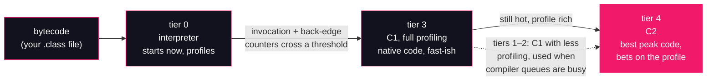

# Lesson 18: Tiered compilation

## What you'll learn

- The three ways HotSpot executes your bytecode: the interpreter, the C1 compiler, and the C2 compiler — and why all three exist
- The tiered pipeline: how a method climbs from tier 0 (interpreted) through tier 3 (C1, fully profiled) to tier 4 (C2), and what tiers 1–2 are for
- How to read `-XX:+PrintCompilation` line by line: timestamps, compile IDs, the `%`/`s`/`b`/`n`/`!` markers, and `made not entrant`
- Why the tier thresholds are ergonomics, not gospel — and how to read them off your own JDK
- Two control runs that isolate the JIT: `-Xint` (no compilation at all) and `-XX:-TieredCompilation` (the old two-mode world)

---

## Why this matters

[Lesson 01](../part-0-the-machine/01-jvm-jre-jdk-big-picture.md) listed four production symptoms, and one of them was *"slow, then fine."* Its one-line explanation was: the execution engine's JIT compiler warming up. This lesson is where that box on the architecture map finally opens.

The symptom is everywhere once you can see it. A freshly deployed service takes its first requests at 40 ms and settles to 4 ms a minute later. A load test run against a cold JVM reports latencies that vanish on the second run and never come back. A `System.nanoTime()` loop in a scratch file "proves" that `LinkedList` beats `ArrayList` — until you warm the JVM properly and the result inverts (lesson 22 is built on exactly this trap). None of these are bugs. They are the signature of a runtime that deliberately starts slow — interpreting bytecode — and spends its first seconds *learning your program* before it commits to fast machine code.

Engineers who can't read this signature burn days on phantom regressions and write benchmarks that measure the JIT instead of their code. Engineers who can read it do something better: they open the JIT's own log and watch the warmup happen. That log — `-XX:+PrintCompilation` — is the core skill this lesson produces, and lessons 19 through 22 lean on it continuously.

---

## The concept

### One method, three ways to run it

The JVM specification says nothing about how bytecode gets executed — only what it must observably do. HotSpot's answer is *it depends how hot the code is*, and it keeps three execution engines in the house:

**The interpreter (tier 0)** runs bytecode the way [Part 1](../part-1-bytecode/02-anatomy-of-a-class-file.md) describes: fetch an opcode, dispatch, update the operand stack, repeat. It starts *immediately* — no compile step, no waiting — which is why `java HelloWorld` prints in milliseconds instead of pausing while a compiler grinds. But per operation it is slow: every bytecode goes through the dispatch loop, every time. Crucially, while it interprets, it **profiles**: it counts invocations, counts loop back-edges, records which branch was taken and which types actually showed up at each call site. The interpreter is slow *and observant*.

**C1 (the client compiler, tiers 1–3)** compiles a method to native code quickly, with modest optimizations. The code it produces is several times faster than interpreted — not the best the machine can do, but available *now*, in milliseconds. At tier 3, C1 also emits code that **keeps profiling**: the instrumented native code feeds the interpreter's observations forward, building the profile the next tier will consume.

**C2 (the server compiler, tier 4)** is the heavy artillery: slow, expensive, aggressive compilation that produces the fastest code HotSpot knows how to make. This is where the big optimizations live — inlining (lesson 20), escape analysis and scalar replacement ([Lesson 15](../part-3-memory/15-escape-analysis.md) showed a C2 pass erasing an allocation entirely), loop unrolling and hoisting (lesson 21), range-check elimination, and more. C2's secret ingredient is the profile gathered at tiers 0 and 3: it *bets* on observed behavior — "this branch was never taken," "only `ArrayList` ever arrived here" — compiles the optimistic fast path, and plants a trap that falls back to correct-but-slower code if the bet ever breaks. That fallback machinery is deoptimization, and it's lesson 20's subject.

### Why three modes: startup vs peak

One compiler cannot win both races. Paying C2's compile cost for a method that runs twice would make every JVM slow to start and every short-lived tool sluggish. Interpreting forever would leave 10–100× of peak throughput on the table for a server that runs the same code millions of times. HotSpot's compromise is **tiered compilation**, the default since JDK 8: start in the interpreter, promote hot methods to C1 so they're native quickly, and promote the *really* hot ones to C2 once the profile is rich enough to make the expensive compile worthwhile.



Promotion is **per method**, driven by counters. Every method carries an *invocation counter* and a *back-edge counter* (how many times its loops have jumped back to the top). When a counter crosses a threshold — modulated by how busy the compiler queues are — the method is queued for compilation at the next tier, and a background compiler thread picks it up. Your code keeps running in the old mode until the new code is ready, then the JVM slips it in.

### The thresholds are ergonomics, not gospel

You'll see the actual numbers in the hands-on, but the attitude matters more than the digits: thresholds like "tier 4 after 5,000 invocations" are HotSpot's *tuning knobs for this build on this machine*, annotated `{default}` or `{ergonomic}` in the flag dump — the same vocabulary [Lesson 12](../part-3-memory/12-runtime-data-areas.md) taught for `-XX:+PrintFlagsFinal`. They are not promises, they differ across JDK versions and vendors, and the JVM adds queue-load heuristics on top (a method can jump the queue if the C2 queue is idle, or linger if it's swamped). Read them to build intuition; never write code that depends on them.

---

## Hands-on

We'll build one program with one clearly hot method, run it under the JIT's log, and learn to read every column. Then two control runs: the JIT switched off entirely, and tiered compilation switched off, so each tier's contribution is visible by its absence. All commands run from the usual samples directory:

```bash
cd ~/jvm-internals-samples/lesson18
```

### 1. The program

`HotMethod.java`:

```java
public class HotMethod {

    static long counter;

    // The hot method: tiny, called many times per round.
    static long squarePlus(int x) {
        return (long) x * x + 1;
    }

    // synchronized -> should show the 's' marker in PrintCompilation.
    static synchronized void bump() {
        counter++;
    }

    // Has an exception handler -> should show the '!' marker.
    static long safeDivide(int x, int y) {
        try {
            return x / y;
        } catch (ArithmeticException e) {
            return -1;
        }
    }

    public static void main(String[] args) {
        int rounds = 30;
        int iterations = 200_000;
        long total = 0;
        long start = System.nanoTime();
        for (int r = 0; r < rounds; r++) {
            for (int i = 0; i < iterations; i++) {
                total += squarePlus(i % 1000);
                bump();
                total += safeDivide(i, 7);
            }
        }
        long elapsedMs = (System.nanoTime() - start) / 1_000_000;
        System.out.println("total=" + total + " counter=" + counter
                + " elapsed=" + elapsedMs + "ms");
    }
}
```

The design is deliberate. The inner loop runs a fixed 200,000 iterations — bounded, like every loop in this course — and the outer loop runs a fixed 30 rounds, so each method is called 6 million times: comfortably past every tier threshold, and the whole run still finishes in about half a second. Three called methods, chosen to surface three of the log's marker letters: a plain one, a `synchronized` one, and one with a `try`/`catch`. And `total` and `counter` are printed at the end — [Lesson 15](../part-3-memory/15-escape-analysis.md)'s rule applies doubly here, since tiered compilation *is* the subject: results the program never uses are results the JIT is allowed to delete, and lesson 22 will show how far that deletion can go.

Compile it:

```bash
javac HotMethod.java
```

### 2. First run: `-XX:+PrintCompilation`

First use of this flag in the course, so the full explanation: `-XX:+PrintCompilation` tells HotSpot to log one line for every method compilation it performs — the method, the tier it was compiled at, and what later happened to that compiled version. It's a *product* flag: no unlocking needed, present on every production JDK (contrast [Lesson 15](../part-3-memory/15-escape-analysis.md), where the pretty diagnostic flags turned out to be compiled into debug builds only). This makes it the most portable window into the JIT there is.

```bash
java -XX:+PrintCompilation HotMethod
```

```
48    1       3       java.lang.Object::<init> (1 bytes)
51    2       3       java.lang.Byte::toUnsignedInt (6 bytes)
51    3       3       java.lang.String::hashCode (60 bytes)
55    4     n 0       jdk.internal.misc.Unsafe::getReferenceVolatile (native)   
55    5     n 0       jdk.internal.vm.Continuation::enterSpecial (native)   (static)
55    6     n 0       jdk.internal.vm.Continuation::doYield (native)   (static)
58    7       3       java.lang.String::coder (15 bytes)
...
496   71       3       jdk.internal.util.ReferencedKeyMap::removeStaleReferences (30 bytes)
497   63   !   3       java.lang.ref.ReferenceQueue::poll (44 bytes)
total=2082718285740 counter=6000000 elapsed=400ms
```

*(80 lines total on this run. Every number varies — timestamps, compile IDs, ordering, even which methods appear and at which tiers. The shape is the signal; never expect a byte-for-byte match with anyone else's run, including your own second run.)*

First observation: the JIT was busy long before your code mattered. `Object::<init>`, `String::hashCode`, `Unsafe::getReferenceVolatile` — the JDK's own classes are bytecode too, and the hottest of them get compiled on the same tiered escalator as yours. Your program never rides a private JIT.

Now the lines we came for. Filter to our class:

```bash
java -XX:+PrintCompilation HotMethod 2>&1 | grep HotMethod
```

```
64    8       3       HotMethod::squarePlus (8 bytes)
64    9  s    3       HotMethod::bump (9 bytes)
64   11       4       HotMethod::squarePlus (8 bytes)
64   10   !   3       HotMethod::safeDivide (10 bytes)
65    8       3       HotMethod::squarePlus (8 bytes)   made not entrant: not used
65   12  s    4       HotMethod::bump (9 bytes)
67    9  s    3       HotMethod::bump (9 bytes)   made not entrant: not used
67   13   !   4       HotMethod::safeDivide (10 bytes)
68   10   !   3       HotMethod::safeDivide (10 bytes)   made not entrant: not used
82   14 %     3       HotMethod::main @ 25 (98 bytes)
84   15       3       HotMethod::main (98 bytes)
86   16 %     4       HotMethod::main @ 25 (98 bytes)
92   14 %     3       HotMethod::main @ 25 (98 bytes)   made not entrant: OSR invalidation of lower levels
105   16 %     4       HotMethod::main @ 25 (98 bytes)   made not entrant: uncommon trap
105   17 %     3       HotMethod::main @ 25 (98 bytes)
110   18 %     4       HotMethod::main @ 25 (98 bytes)
118   17 %     3       HotMethod::main @ 25 (98 bytes)   made not entrant: OSR invalidation of lower levels
426   18 %     4       HotMethod::main @ 25 (98 bytes)   made not entrant: uncommon trap
```

*(This excerpt varies in every column on every run — but the tier-3-then-tier-4 progression for each hot method is the stable shape you're learning to see.)*

### 3. Reading the log, line by line

Take the first line:

```
64    8       3       HotMethod::squarePlus (8 bytes)
```

Column by column:

- **`64`** — milliseconds since JVM start. The whole tier climb above happened inside the first tenth of a second.
- **`8`** — the *compilation ID*, a sequence number for this compilation task. Notice it appears twice: once when `squarePlus` is compiled at tier 3, and again lower down when that same tier-3 version is `made not entrant`. The ID is how you match a compilation's birth to its retirement.
- **`s` / `!` / `%`** — the attribute column. Marker letters, decoded below. This line has none.
- **`3`** — the **tier**. This is C1 with full profiling. Follow `squarePlus` down the log and you watch the escalator: compiled at tier 3 at 64 ms, compiled again at **tier 4** (C2) within the same millisecond, under a new ID (`11`), and then the tier-3 version — ID `8` again — is `made not entrant`. The profile said the method was hot; C2 rebuilt it better; the JVM redirected new calls to the C2 version and retired the C1 one. Same story for `bump` (IDs 9 → 12) and `safeDivide` (IDs 10 → 13).
- **`HotMethod::squarePlus (8 bytes)`** — the method and its *bytecode* size. Eight bytes: two multiplies and an add, roughly. Small hot methods are compiled early and inlined eagerly; both lessons 20 and 21 build on that.

The markers in the attribute column, all visible in this one run except `b`:

| Marker | Meaning | Where you saw it |
|:-:|---|---|
| `%` | **On-stack replacement**: a hot *loop* compiled while still running, and the interpreter switched to native code mid-loop | `HotMethod::main @ 25` — the `@ 25` is the bytecode offset of the loop head |
| `s` | Method is `synchronized` | `HotMethod::bump` |
| `!` | Method has exception handlers | `HotMethod::safeDivide` |
| `n` | A wrapper for a **native** method (no bytecode to compile; level shown as 0 or blank) | `jdk.internal.misc.Unsafe::getReferenceVolatile (native)` |
| `b` | Compilation ran **blocking**: the application thread waited for the compiler | none here — compilation is asynchronous by default; section 7 forces it |

Two of these deserve an honest forwarding address. `%` (OSR) is how long-running loops escape the interpreter without waiting for the method to return and be re-entered — `main`'s inner loop is exactly such a loop, and lesson 21 teaches OSR properly; here, just know the marker. And `made not entrant` means *this compiled version is retired — new calls go elsewhere*; it is sometimes routine tiered housekeeping (`not used`, after C2 replaced C1) and sometimes the scar of a broken speculation (`uncommon trap` — a C2 bet that failed, the raw material of lesson 20's deoptimization story). It is never an error message.

One last detail ties the log back to Part 1. The OSR lines say `main @ 25`. Ask `javap` ([Lesson 02](../part-1-bytecode/02-anatomy-of-a-class-file.md)'s tool) what's at bytecode offset 25:

```bash
javap -c HotMethod
```

```
        25: iload         8
        27: iload_2
        28: if_icmpge     62
        ...
        56: iinc          8, 1
        59: goto          25
```

Offset 25 is the *top of the inner loop* — the target of the `goto` back-edge at offset 59. OSR compiled precisely that loop and re-entered `main` at offset 25 with the loop counter's live value carried over. The numbers in the JIT log are real bytecode coordinates, not decoration.

### 4. Control one: `-Xint`, the interpreter-only world

First use: `-Xint` tells HotSpot to run *everything* in the interpreter — no C1, no C2, no tiered anything. It exists for exactly the kind of experiment we're about to do (and for debugging JITs, not for production):

```bash
time java -Xint -XX:+PrintCompilation HotMethod
```

```
41    1     n       jdk.internal.vm.Continuation::enterSpecial (native)   (static)
41    2     n       jdk.internal.vm.Continuation::doYield (native)   (static)
total=2082718285740 counter=6000000 elapsed=1234ms

real	0m1.323s
user	0m1.290s
sys	0m0.047s
```

*(Timings vary; the ~3× gap against the tiered run is the signal.)* Same program, same 6 million calls per method, and the compilation log is **empty** — the tier escalator is gone. (The two `n` lines are pre-generated wrappers for native methods, not JIT compilations of bytecode; they exist in every mode.) The result `total=2082718285740 counter=6000000` is identical to the tiered run — execution strategy changes *how fast*, never *what*. Compare against the default run:

```bash
time java -XX:+PrintCompilation HotMethod
```

```
real	0m0.458s
user	0m0.478s
sys	0m0.052s
```

*(Varies per run.)* 0.46 s against 1.32 s — on a trivial arithmetic loop, with the tiered number *including* the cost of doing all that compiling. On hot code that runs for minutes rather than half a second the gap widens dramatically. This is the entire economic case for the JIT, measured.

### 5. Control two: `-XX:-TieredCompilation`, the two-mode world

First use: `-XX:-TieredCompilation` switches the tiered pipeline off (the `+`/`-` boolean convention is [Lesson 14](../part-3-memory/14-compressed-oops.md)'s). What's left is the pre-JDK-8 world: the interpreter, plus C2 when a method gets hot enough — no C1, no intermediate tiers, no full-profiling tier:

```bash
java -XX:-TieredCompilation -XX:+PrintCompilation HotMethod 2>&1 | grep HotMethod
```

```
47    4             HotMethod::squarePlus (8 bytes)
48    7 %           HotMethod::main @ 25 (98 bytes)
54    5  s          HotMethod::bump (9 bytes)
55    8             HotMethod::main (98 bytes)
62    6   !         HotMethod::safeDivide (10 bytes)
62    7 %           HotMethod::main @ 25 (98 bytes)   made not entrant: uncommon trap
66    9 %           HotMethod::main @ 25 (98 bytes)
394    9 %           HotMethod::main @ 25 (98 bytes)   made not entrant: uncommon trap
```

*(Varies per run, same as every JIT log.)* Look at the tier column: **it's empty.** There are no tiers to report — a method is interpreted until C2 compiles it, full stop. The markers (`%`, `s`, `!`) still apply, but the 3-then-4 escalator from section 3 has collapsed to a single step.

And the timing? On this run, `elapsed=371ms` — essentially the same as the tiered run. That's honest and expected: this program is a few small methods that stay hot for its whole (half-second) life, so paying C2's price directly costs little. Tiered compilation's payoff shows up in *long-running* JVMs, where thousands of methods need to be native-fast *now* while C2 — which is expensive and has a queue — gets to the truly hot ones in its own time. The lesson of this control is in the log's shape, not the stopwatch: tiering is a strategy for *when* code gets fast, not for *whether*.

### 6. The thresholds, read off your own JDK

Section "The concept" promised real numbers. Ask, don't assume — with `-XX:+PrintFlagsFinal`, [Lesson 12](../part-3-memory/12-runtime-data-areas.md)'s flag, which prints every HotSpot flag's effective value with `{default}` / `{ergonomic}` / `{command line}` annotations:

```bash
java -XX:+PrintFlagsFinal -version 2>/dev/null | grep -E "Tier[34](Invocation|BackEdge|Compile)Threshold|CICompilerCount "
```

```
     intx CICompilerCount                          = 4                                         {product} {ergonomic}
     intx Tier3BackEdgeThreshold                   = 60000                                     {product} {default}
     intx Tier3CompileThreshold                    = 2000                                      {product} {default}
     intx Tier3InvocationThreshold                 = 200                                       {product} {default}
     intx Tier4BackEdgeThreshold                   = 40000                                     {product} {default}
     intx Tier4CompileThreshold                    = 15000                                     {product} {default}
     intx Tier4InvocationThreshold                 = 5000                                      {product} {default}
```

*(Values vary by JDK vendor, version, and machine — this is Zulu 25.28.)* Read it in the vocabulary you already own: every threshold here is `{default}`, and `CICompilerCount` — the number of background compiler threads working the queue — is `{ergonomic}`, chosen from this machine's CPU count. Six million calls per method sails past `Tier4InvocationThreshold = 5000` in the first round, which is why our log showed the full 3 → 4 climb. These numbers explain the *typical* shape of a warmup; they are tuning dials for the JVM team and for very specialized performance work, not an API. Ergonomics, not gospel.

### 7. Catching the `b` marker (optional)

The marker table has one letter no normal run shows: `b`, a *blocking* compilation, where the calling thread waits for the compiler instead of continuing interpreted. Compilation is asynchronous by default precisely so your threads never wait. You can flip that — first use of `-XX:-BackgroundCompilation`, which makes every compilation synchronous:

```bash
java -XX:-BackgroundCompilation -XX:+PrintCompilation HotMethod 2>&1 | grep HotMethod | head -4
```

```
47    8    b  3       HotMethod::squarePlus (8 bytes)
47    9  s b  3       HotMethod::bump (9 bytes)
48   10   !b  3       HotMethod::safeDivide (10 bytes)
48   11    b  4       HotMethod::squarePlus (8 bytes)
```

*(Varies per run.)* Every compilation now carries `b`, and note that markers compose: `s b` is a synchronized method compiled blocking, `!b` has exception handlers and blocked. This mode is a debugging and determinism tool — nothing to ship — but it proves the attribute column is a set of flags, not a single letter.

---

## Try it yourself

1. Change `rounds` from 30 to 1 and re-run section 2's `grep HotMethod`. Does `squarePlus` still reach tier 4 before the program exits? What does the result tell you about the race between a short-lived program and a background compiler queue?
2. Run with `-XX:TieredStopAtLevel=1` (first use: caps the tier escalator at C1-no-profiling — C2 never compiles anything). Predict the tier numbers in the log before you look, then check. Compare `elapsed=` against the default run.
3. Count the retirements: `java -XX:+PrintCompilation HotMethod 2>&1 | grep -c "made not entrant"`. Split them by reason (`not used` vs `uncommon trap`) with two more greps. Which ones are routine tiered housekeeping, and which are failed speculations? Hold that thought for lesson 20.
4. Set `rounds` to 100 and watch the `main @ 25` OSR lines. Do the tier-4 OSR versions appear earlier in wall-clock terms, later, or the same? Why might a longer run give the C2 queue *more* time, not less pressure?
5. Re-run section 4 (`-Xint`) with `rounds` at 100. Extrapolate: at what workload size does "we don't need the JIT" stop being a survivable position?

---

## Common mistakes

- **"The JIT compiles my program to native code."** Per *method*, per *heat*, and usually well after startup — most methods in a large application are never compiled at all, and the JDK's own classes compete for the same compiler queue. Compilation is a continuously revised set of per-method decisions, not a build step.
- **"`made not entrant` means something went wrong."** Usually it's the opposite: the tier-3 version retiring because the tier-4 version is ready (`not used`) is the pipeline working as designed. The `uncommon trap` flavor *is* a failed speculation — and even that is a designed-in recovery mechanism, lesson 20's subject, not a bug.
- **"I can rely on the thresholds."** `Tier4InvocationThreshold = 5000` is a `{default}` on this build of this JDK; vendors tune differently, versions change, and queue-load heuristics modulate the trigger regardless. Build intuition from the numbers; build nothing on top of them.
- **"Interpreted mode is waste; just compile everything up front."** Then hello-world pays C2 compile cost for code it runs once, and every JVM is slow to start. The interpreter's instant start and free profiling are why tiering wins; startup and peak are different races with different winners. (GraalVM's ahead-of-time route makes the opposite trade deliberately — that's a product choice, not a refutation.)
- **"My run will match the book's run."** The single most unreliable expectation in this course. Timestamps, compile IDs, ordering, tier choices, and deopt timing all vary run to run on the *same machine*. Read JIT logs for shape — 3 before 4, compile then retire — never for exact values.

---

## Check your understanding

**1. `squarePlus` appears in the log at tier 3 with ID 8, then at tier 4 with ID 11, then ID 8 reappears with `made not entrant: not used`. Narrate what happened.**

<details>
<summary>Reveal answer</summary>

The method crossed the tier-3 threshold, so C1 compiled it with full profiling (ID 8) and calls started running native. It kept being called, crossed the tier-4 threshold, and C2 recompiled it with the collected profile into a better version (ID 11). Once the C2 code was installed, the C1 version was retired: `made not entrant` means new calls are routed away from it (to the tier-4 code), and `not used` records the routine reason — superseded, not failed. One method, three lifecycles, all inside a few milliseconds.

</details>

**2. Why does HotSpot bother with the interpreter and C1 at all, given that C2 produces the fastest code?**

<details>
<summary>Reveal answer</summary>

Because C2 is slow and expensive, and most code doesn't deserve it. A method that runs a handful of times would cost more to C2-compile than it could ever pay back; the interpreter runs it *now* with zero compile latency and collects profiling data while doing so. C1 exists because "native soon, pretty fast, still profiling" fills the gap while C2 — behind its queue, doing costly analysis — gets to the genuinely hot methods. Startup responsiveness and peak throughput are different races; the three modes let HotSpot win both.

</details>

**3. In the `-XX:-TieredCompilation` run, the tier column is empty. Why, and what does that tell you about what the column means?**

<details>
<summary>Reveal answer</summary>

With tiering disabled there are no tiers: a method is interpreted until C2 compiles it, in one step. The empty column confirms the number isn't "how optimized is this code" in the abstract — it specifically reports *which stage of the tiered pipeline* produced this compilation (1–3 for the C1 variants, 4 for C2). No pipeline, no number. (The markers still print, because `%`, `s`, `!` describe the compilation and the method, not the pipeline.)

</details>

**4. Your colleague reads `Tier4InvocationThreshold = 5000` off `PrintFlagsFinal` and writes a warmup script that calls every endpoint exactly 5,000 times "to trigger C2." Identify three problems.**

<details>
<summary>Reveal answer</summary>

(1) The threshold is a `{default}` for this JDK build — it can differ across vendors, versions, and flags, so hardcoding it is fragile. (2) The trigger isn't a simple counter comparison: queue-load heuristics modulate it, so crossing 5,000 queues the method for C2 but doesn't guarantee when (or whether, if load changes) it compiles. (3) Invocations aren't the only heat source: loops promote via back-edge counts and OSR (`%`), which per-request calls barely exercise — realistic request volume with real loop bodies warms what a counter-fudging script misses. Warm up with representative traffic; read the log to see what actually compiled.

</details>

**5. The `-Xint` run prints two lines marked `n` even though no JIT compilation can happen. What are they, and why do they survive the interpreter-only mode?**

<details>
<summary>Reveal answer</summary>

They're generated wrappers around *native* methods (`Continuation::enterSpecial`, `doYield`) — methods with no Java bytecode, so there is nothing to interpret or tier-compile; the JVM still needs a small adapter to call from Java frames into the native implementation. That wrapper exists independently of the JIT pipeline, so it shows up even with compilation disabled. The `n` marker is precisely "this entry is not a bytecode compilation," which is why it can appear in a run whose defining feature is that no bytecode gets compiled.

</details>

---

## Recap

- HotSpot runs one method three ways: the **interpreter** (tier 0 — instant start, profiles everything), **C1** (tiers 1–3 — fast compile, good code, full profiling at tier 3), and **C2** (tier 4 — slow compile, best code, bets on the profile). Tiered compilation, the default since JDK 8, climbs methods up that escalator as their invocation and back-edge counters cross thresholds.
- **Startup vs peak** is the whole design: interpreting forever throws away 10–100× on hot servers; C2-compiling everything makes every JVM sluggish. Three modes win both races.
- `-XX:+PrintCompilation` is the portable window in — a product flag, no unlock. A line is *timestamp, compile ID, markers, tier, method*; markers are `%` (OSR — lesson 21's subject), `s` (synchronized), `!` (exception handlers), `n` (native wrapper), `b` (blocking). `made not entrant` is retirement, sometimes routine (`not used`), sometimes a failed bet (`uncommon trap` — lesson 20's subject).
- The thresholds are `{default}` and `{ergonomic}` tuning knobs, modulated by compiler-queue load — read them with `-XX:+PrintFlagsFinal`, depend on none of them.
- Controls isolate the JIT: `-Xint` removes it (~3× slower here, log empty), `-XX:-TieredCompilation` removes the middle (empty tier column, the two-mode world). Same `total` in every mode — execution strategy changes speed, never semantics.
- Every number in every JIT log varies run to run. Read for shape: 3 before 4, compile then retire, profile then bet.

**Previous:** [Lesson 17 — Off-heap memory & NMT](../part-3-memory/17-off-heap-memory.md) · **Next:** [Lesson 19 — Watching the JIT work](19-watching-the-jit.md)
