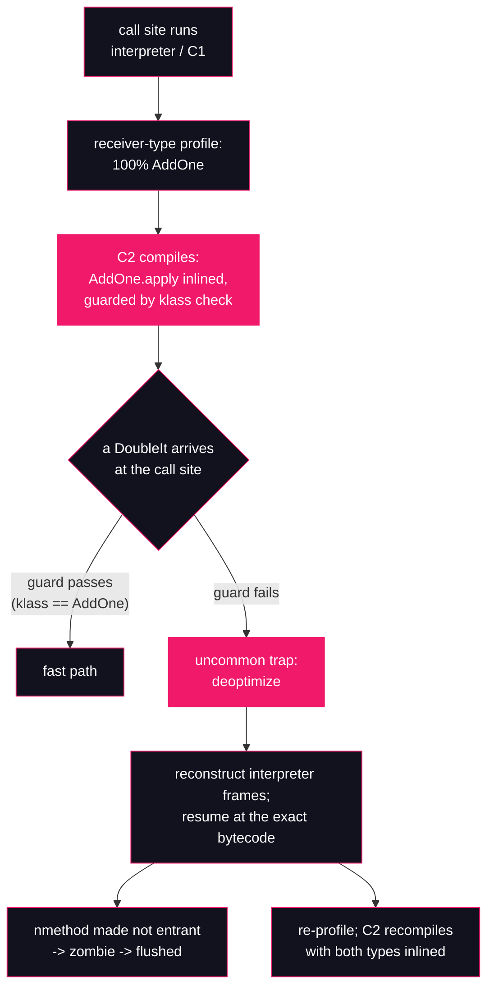

# Lesson 20: Inlining & deoptimization

## What you'll learn

- Why inlining is the *master optimization* — the one that makes lesson 15's escape analysis and lesson 21's loop optimizations possible
- How a hot call site becomes "monomorphic," and how C2 speculates on that profile with a guarded inline
- The deoptimization contract: maximally speculative machine code, with a correctness-preserving escape hatch
- Reading `made not entrant` lines — including the ones that are *not* deopts — and the not-entrant → zombie → flushed lifecycle of dead machine code

---

## Why this matters

Two production stories, both common enough that you'll meet them within a year.

**Story one.** A deploy rolls out. Nothing in the diff touches the hot path — but it adds a second implementation of an interface that the hot path calls. For a few seconds after the first requests arrive, CPU spikes and latency wobbles, then everything settles. No bug, no leak. What happened is the subject of this lesson: the JIT had compiled the call site on the assumption that only one implementation exists, the new implementation broke that assumption, and the JVM threw the speculative machine code away and recompiled. That throw-away is a **deoptimization**, and on a busy service a deploy can trigger thousands of them at once.

**Story two.** A teammate with a C++ background refuses interfaces on a hot path because "virtual calls are slow." On HotSpot that fear is years out of date. A call site that only ever sees one or two receiver types doesn't dispatch through a table at all — the JIT *inlines* the target, exactly as if it had been a static call. Below you'll watch that happen live, then watch the JVM react when you betray it.

The deeper reason this lesson exists is the contract underneath both stories. Every optimization in Part 3 and Part 4 — scalar replacement, lock elision, range-check elimination, loop unrolling — is a *bet* on how the program behaves. Deoptimization is what makes betting safe: the JVM can speculate aggressively because losing a bet is cheap and can never, ever change what your program computes. Keep that framing; Part 5's safepoints (lesson 27) and lesson 22's benchmarking both lean on it.

---

## The concept

### Inlining: the master optimization

Inlining copies the callee's body into the caller at the call site. The direct win is small: no call instruction, no argument shuffling, no return. The real win is **context**. Once caller and callee are fused into one compilation unit:

- constants and types flow across the old boundary, so whole branches fold away;
- escape analysis gets its evidence — [Lesson 15](../part-3-memory/15-escape-analysis.md) ran EA *after* inlining precisely because a reference that "escaped into a callee" often provably never leaves the fused method;
- the callee's loops become the caller's loops, visible to unrolling and hoisting — lesson 21's subject.

This is why inlining is called the master optimization: it doesn't just remove call overhead, it manufactures the opportunities every other optimization feeds on.

Which calls can be inlined? [Lesson 04](../part-1-bytecode/04-invocation-opcodes.md) split the four invocation opcodes into static (`invokestatic`, `invokespecial` — target known from the class file) and dynamic (`invokevirtual`, `invokeinterface` — target depends on the receiver's runtime class, found via the vtable or itable). Static-target calls inline trivially. Dynamic calls need a *proof* of the target, and HotSpot has two:

1. **The receiver-type profile.** The interpreter and C1 record, per call site, the class of every receiver that passes through. If 100% of them were `AddOne`, the site is **monomorphic**, and C2 inlines `AddOne.apply` guarded by a cheap check: compare the receiver's klass word (the header field from [Lesson 13](../part-3-memory/13-object-layout-jol.md)) against `AddOne`. Two receiver types is **bimorphic** — C2 will inline both, each behind its own guard. Three or more is **megamorphic** — no inlining, a real vtable/itable dispatch.
2. **Class hierarchy analysis (CHA).** Sometimes the hierarchy itself proves a single possible target — the method isn't overridden anywhere, or the implementing class is `final`. Then no profile is needed; C2 records a *dependency* on the hierarchy staying that way.

Either way, the compiled code embodies an **assumption** about the future.

### Speculation and the deopt contract

Assumptions are enforced in two ways:

- **Guards and predicates** — real instructions in the compiled code, like the klass check above. When one fails, control jumps to a builtin routine called an **uncommon trap**.
- **Uncommon traps for cold paths.** If the profile says a branch has *never* fired, C2 may not compile real code for it at all — it plants an uncommon trap where the branch would go. A branch that "never" fires and then does is the classic `unstable_if` deopt you'll force below.

When a trap fires, the JVM **deoptimizes**: it walks the compiled frame, reconstructs the equivalent *interpreter* frames — local variables, operand stack contents, bytecode index — and resumes execution in the interpreter at exactly the right bytecode, as if the compiled code had never existed. From the program's point of view nothing happened except lost time. **Deoptimization preserves observable behavior by construction** — it is the safety net, not a failure. The method then re-profiles, and typically recompiles within milliseconds, this time with knowledge of the case that broke the last compilation.

And the old machine code? Its retirement has three stages:

- **made not entrant** — the nmethod (a compiled method body in the code cache; lesson 19 tours that cache) is marked so no *new* caller enters it. Activations already inside either trap out immediately or run to completion.
- **zombie** — once no activation remains, the nmethod is dead weight: unreachable, awaiting reclaim.
- **flushed** — the sweeper frees the memory back to the code cache, lazily, when the cache needs room.

One honest change from what older articles describe: those articles show a `made zombie` line in `-XX:+PrintCompilation` output. On this JDK that line no longer exists — the string isn't in the Zulu 25.28 binary at all (we checked). The zombie state still exists internally; what you can actually observe is the flush, via `-Xlog:codecache=debug`, and only when the cache is under pressure. Section 5 shows it.

### Not every `made not entrant` is a deopt

This trips up everyone the first time they read JIT logs. Tiered compilation itself retires code: when C2's version of a method arrives, the C1 version is made not entrant (`not used`), and an OSR compilation supersedes lower-level ones (`OSR invalidation of lower levels`). Those are *promotions*. A real deopt is annotated `uncommon trap`. Reading the reason is the whole game.



---

## Hands-on

All commands run from the usual samples directory:

```bash
cd ~/jvm-internals-samples/lesson20
```

### 1. A call site we can betray

`DeoptDemo.java` — an interface, two implementations, and a hot loop that only meets the first one during warmup:

```java
public class DeoptDemo {

    interface Op {
        int apply(int x);
    }

    static final class AddOne implements Op {
        public int apply(int x) {
            return x + 1;
        }
    }

    static final class DoubleIt implements Op {
        public int apply(int x) {
            return x * 2;
        }
    }

    static long work(Op op, int n) {
        long total = 0;
        for (int i = 0; i < n; i++) {
            total += op.apply(i);
        }
        return total;
    }

    public static void main(String[] args) {
        long checksum = 0;

        // Phase 1: the call site in work() only ever sees AddOne.
        Op current = new AddOne();
        for (int w = 0; w < 2_000; w++) {
            checksum += work(current, 10_000);
        }
        System.out.println("phase 1 done, checksum=" + checksum);

        // Phase 2: betray the call site with a second implementation.
        current = new DoubleIt();
        for (int w = 0; w < 2_000; w++) {
            checksum += work(current, 10_000);
        }
        System.out.println("phase 2 done, checksum=" + checksum);
    }
}
```

Phase 1 runs twenty million calls where the receiver is always `AddOne` — enough for the call site inside `work` to go hot with a perfectly monomorphic profile. Phase 2 feeds the same compiled call site a `DoubleIt`. Everything is bounded: fixed iteration counts, over in a second or two.

Compile, then look at `work`'s bytecode with `javap -c` ([Lesson 02](../part-1-bytecode/02-anatomy-of-a-class-file.md)'s tool):

```bash
javac DeoptDemo.java
javap -c DeoptDemo
```

```
  static long work(DeoptDemo$Op, int);
    Code:
         0: lconst_0
         1: lstore_2
         2: iconst_0
         3: istore        4
         5: iload         4
         7: iload_1
         8: if_icmpge     29
        11: lload_2
        12: aload_0
        13: iload         4
        15: invokeinterface #7,  2            // InterfaceMethod DeoptDemo$Op.apply:(I)I
        20: i2l
        21: ladd
        22: lstore_2
        23: iinc          4, 1
        26: goto          5
        29: lload_2
        30: lreturn
```

Bytecode index 15 is the call: `invokeinterface`, because the static type of `op` is the interface — [Lesson 04](../part-1-bytecode/04-invocation-opcodes.md)'s rule, down to the `, 2` count byte. Nothing in this bytecode says `AddOne`. The specialization happens later, in machine code. Remember the number 15; the JIT's own logs will use it.

### 2. Watch it inline, then watch it deopt

Run with `-XX:+PrintCompilation` — the flag lesson 18 reads line by line; its columns (timestamp, compilation id, tier, method) and marker characters are lesson 18's table, and the `%` marking on-stack replacement gets its due in lesson 21. Filter to the lines that matter:

```bash
java -XX:+PrintCompilation DeoptDemo 2>&1 | grep -E "DeoptDemo|phase"
```

```
38   10       3       DeoptDemo$AddOne::apply (4 bytes)
39   11       4       DeoptDemo$AddOne::apply (4 bytes)
39   10       3       DeoptDemo$AddOne::apply (4 bytes)   made not entrant: not used
43   12 %     3       DeoptDemo::work @ 5 (31 bytes)
44   13       3       DeoptDemo::work (31 bytes)
44   14 %     4       DeoptDemo::work @ 5 (31 bytes)
51   12 %     3       DeoptDemo::work @ 5 (31 bytes)   made not entrant: OSR invalidation of lower levels
52   15       4       DeoptDemo::work (31 bytes)
56   13       3       DeoptDemo::work (31 bytes)   made not entrant: not used
phase 1 done, checksum=100010000000
91   15       4       DeoptDemo::work (31 bytes)   made not entrant: uncommon trap
91   47       3       DeoptDemo$DoubleIt::apply (4 bytes)
91   48       4       DeoptDemo::work (31 bytes)
91   14 %     4       DeoptDemo::work @ 5 (31 bytes)   made not entrant: uncommon trap
103   49       4       DeoptDemo$DoubleIt::apply (4 bytes)
103   47       3       DeoptDemo$DoubleIt::apply (4 bytes)   made not entrant: not used
103   50 %     4       DeoptDemo::work @ 5 (31 bytes)
phase 2 done, checksum=299990000000
```

*(Timestamps, compilation ids, and the exact set of tier lines vary run to run — sometimes considerably. The shape is stable: warmup compiles, one `uncommon trap` deopt right after `phase 1 done`, then recompiles.)*

Read it in three acts:

**Act 1 — warmup (before `phase 1 done`).** `AddOne::apply` compiles at tier 3 then tier 4, and the tier-3 copy is made not entrant with reason `not used` — a promotion, not a deopt. `work` gets both an ordinary compile and `%`-marked OSR compiles (the JVM compiles just the hot loop while it's still running). By the end, compilation id 15 is `work` at tier 4 with `AddOne.apply` inlined behind a guard — section 3 proves the inline.

**Act 2 — the betrayal.** Right after `phase 1 done` prints, the first `DoubleIt` reaches the guarded call site, the klass check fails, and both tier-4 nmethods for `work` — id 15 and the OSR variant id 14 — are `made not entrant: uncommon trap`. **That** is a live deoptimization you forced: an assumption baked into machine code met reality, and reality won.

**Act 3 — recovery.** `DoubleIt::apply` compiles, and `work` recompiles at tier 4 (ids 48, 50) within a dozen milliseconds — now knowing about both implementations. Total cost of the broken bet: one detour through the interpreter and a recompile. The program never stopped, and every call returned exactly what its receiver's `apply` computes — the checksum keeps accumulating correctly across both phases (phase 2's total grows faster because doubling out-grows adding one, not because anything was corrupted).

Note what is *absent*: no `made zombie` lines, even though two nmethods died. Retirement is lazy — that's section 5.

### 3. Read the inlining decisions themselves

`-XX:+PrintCompilation` tells you *that* `work` compiled; it doesn't tell you what got inlined into it. The flag that shows the decisions is `-XX:+PrintInlining` — first use in this course. It prints, per compilation, each call site as `@ <bci> <method> (<size>)` followed by the verdict: `inline`, `inline (hot)`, or `failed to inline: <reason>`. Try it bare first:

```bash
java -XX:+PrintInlining DeoptDemo
```

```
Error: VM option 'PrintInlining' is diagnostic and must be enabled via -XX:+UnlockDiagnosticVMOptions.
Error: The unlock option must precede 'PrintInlining'.
Improperly specified VM option 'PrintInlining'
Error: Could not create the Java Virtual Machine.
Error: A fatal exception has occurred. Program will exit.
```

`PrintInlining` sits in HotSpot's *diagnostic* tier — the same tier [Lesson 15](../part-3-memory/15-escape-analysis.md) unlocked with `-XX:+UnlockDiagnosticVMOptions` — and unlike lesson 15's develop flags, this one exists in a production build once unlocked:

```bash
java -XX:+UnlockDiagnosticVMOptions -XX:+PrintInlining DeoptDemo 2>&1 | grep DeoptDemo
```

```
                              @ 15   DeoptDemo$AddOne::apply (4 bytes)   inline
                              @ 15   DeoptDemo$AddOne::apply (4 bytes)   inline
                              @ 15   DeoptDemo$AddOne::apply (4 bytes)   inline (hot)   callee changed to  DeoptDemo::work (31 bytes)    \-> TypeProfile (80680/80680 counts) = DeoptDemo$AddOne
                              @ 15   DeoptDemo$AddOne::apply (4 bytes)   inline (hot)   callee changed to  DeoptDemo::work (31 bytes)    \-> TypeProfile (1737166/1737166 counts) = DeoptDemo$AddOne
                              @ 15   DeoptDemo$AddOne::apply (4 bytes)   inline (hot)   callee changed to  DeoptDemo$DoubleIt::apply (4 bytes)   inline (hot)   callee changed to  DeoptDemo::work (31 bytes)    \-> TypeProfile (2469/2002448 counts) = DeoptDemo$DoubleIt   callee changed to  DeoptDemo::work (31 bytes)    \-> TypeProfile (1999979/2002448 counts) = DeoptDemo$AddOne
                              @ 15   DeoptDemo$AddOne::apply (4 bytes)   inline (hot)   callee changed to  DeoptDemo$DoubleIt::apply (4 bytes)   inline (hot)   callee changed to  DeoptDemo::work (31 bytes)    \-> TypeProfile (160000/2159979 counts) = DeoptDemo$DoubleIt   callee changed to  DeoptDemo::work (31 bytes)    \-> TypeProfile (1999979/2159979 counts) = DeoptDemo$AddOne
```

*(Counts, and how many compilations print, vary.)* This build runs the annotations together on one line — read each wide-spaced group separately. Three things to see:

- **`@ 15`** — the bytecode index of the call site, the same `15: invokeinterface` from the `javap` dump. The JIT's view of your method and the class file's view line up exactly.
- **The monomorphic proof.** `TypeProfile (1737166/1737166 counts) = DeoptDemo$AddOne`: of ~1.7 million profiled receivers, 100% were `AddOne`. That's the evidence the guard bets on. `inline (hot)` is the verdict.
- **The bimorphic recovery.** The last lines are the post-deopt recompiles: *both* `AddOne::apply` and `DoubleIt::apply` are `inline (hot)`, with a split profile — `(160000/2159979 counts) = DoubleIt` versus `(1999979/2159979) = AddOne`. The recompiled `work` handles both types behind two guards. This is why "virtual calls are slow" is folklore: even a *two*-implementation site never pays for table dispatch here.

### 4. The other kind of broken bet: a branch that never fires

`UncommonTrapDemo.java`:

```java
import java.util.Arrays;

public class UncommonTrapDemo {

    static long sumNonNegative(int[] data) {
        long total = 0;
        for (int v : data) {
            if (v < 0) {
                // Cold path: never taken while the profile is being collected.
                total += 1_000_000_000L * (-v);
            } else {
                total += v;
            }
        }
        return total;
    }

    public static void main(String[] args) {
        int[] data = new int[10_000];
        Arrays.fill(data, 7);
        long checksum = 0;

        // Phase 1: the v < 0 branch never fires.
        for (int w = 0; w < 5_000; w++) {
            checksum += sumNonNegative(data);
        }
        System.out.println("phase 1 done, checksum=" + checksum);

        // Phase 2: one negative value makes the never-taken branch fire.
        data[42] = -3;
        for (int w = 0; w < 5_000; w++) {
            checksum += sumNonNegative(data);
        }
        System.out.println("phase 2 done, checksum=" + checksum);
    }
}
```

Fifty million phase-1 iterations, every value positive. The branch profile says `v < 0` *never* happens, so C2 compiles the negative path as an uncommon trap instead of real code. Then `data[42] = -3` springs it. This time add a second flag: `-Xlog:deoptimization=debug`. The `-Xlog` syntax is [Lesson 00](../part-0-the-machine/00-setup-and-toolchain.md)'s; the `deoptimization` tag is new here, and at `debug` level it prints one line per trap with the reason:

```bash
javac UncommonTrapDemo.java
java -Xlog:deoptimization=debug UncommonTrapDemo
```

```
phase 1 done, checksum=350000000
[0.127s][debug][deoptimization] cid=  11     level=4 UncommonTrapDemo.sumNonNegative([I)J trap_bci=26 unstable_if reinterpret pc=0x0000765b53ec912c relative_pc=0x00000000000001ac
phase 2 done, checksum=15000699965000
```

*(Timestamp, cid, and the `pc` addresses vary.)* One trap, exactly one. Read the fields: `cid=11` is the doomed nmethod's compilation id; `level=4` says it was C2 code; `trap_bci=26` is the bytecode index that trapped; `unstable_if` is the reason — a branch the profile called impossible fired; `reinterpret` is the action — continue in the interpreter.

That `trap_bci=26` is worth cross-checking. `javap -c UncommonTrapDemo` shows, inside `sumNonNegative`:

```
        24: iload         6
        26: ifge          43
        29: lload_1
```

Bytecode index 26 is `ifge` — the `v < 0` test itself. The log is telling you precisely which source-level `if` broke the assumption. And the recovery, visible with `-XX:+PrintCompilation`:

```bash
java -XX:+PrintCompilation UncommonTrapDemo 2>&1 | grep -E "UncommonTrapDemo|phase"
```

```
41    8 %     3       UncommonTrapDemo::sumNonNegative @ 11 (57 bytes)
42    9       3       UncommonTrapDemo::sumNonNegative (57 bytes)
42   10 %     4       UncommonTrapDemo::sumNonNegative @ 11 (57 bytes)
56    8 %     3       UncommonTrapDemo::sumNonNegative @ 11 (57 bytes)   made not entrant: OSR invalidation of lower levels
57   11       4       UncommonTrapDemo::sumNonNegative (57 bytes)
69    9       3       UncommonTrapDemo::sumNonNegative (57 bytes)   made not entrant: not used
phase 1 done, checksum=350000000
120   11       4       UncommonTrapDemo::sumNonNegative (57 bytes)   made not entrant: uncommon trap
120   44       3       UncommonTrapDemo::sumNonNegative (57 bytes)
122   45       4       UncommonTrapDemo::sumNonNegative (57 bytes)
130   44       3       UncommonTrapDemo::sumNonNegative (57 bytes)   made not entrant: not used
phase 2 done, checksum=15000699965000
```

*(Ids, timestamps, and how many warmup lines print vary.)* Id 11 dies right after `phase 1 done`; the method recompiles at tier 3 (id 44) and then tier 4 (id 45) *within two milliseconds*, this time with real code for the negative path — which is why there is exactly one trap even though the branch fires 5,000 more times. Deopt is a detour, not a demotion.

### 5. Where dead code goes: zombie and flushed

Sections 2 and 4 left several nmethods `made not entrant`, and no further sign of them. Retirement finishes in the background: once no thread is inside a not-entrant nmethod it becomes a **zombie**, and the sweeper eventually **flushes** it to reclaim code-cache space — lazily, only when the cache is pressured. With the default multi-hundred-megabyte cache, a toy program never pressures anything, which is why you saw no retirement.

To watch it in a bounded run, shrink the cache and generate a crowd of throwaway compiled methods. `-XX:ReservedCodeCacheSize` caps the code cache (lesson 19 owns the cache tour; here the flag is just a pressure valve). The throwaway methods come from [Lesson 09](../part-2-classloading/09-custom-classloaders.md)'s mechanics: define the same tiny class under 1,200 fresh loaders — distinct classes per the (name, loader) identity rule — and call each copy's method enough times to get it compiled.

`Tiny.java`:

```java
public class Tiny {

    public long spin(int n) {
        long total = 0;
        for (int i = 0; i < 64; i++) {
            total += (n * 31L + i) ^ (total >>> 5);
        }
        return total;
    }
}
```

`FlushProbe.java`:

```java
import java.lang.invoke.MethodHandles;
import java.nio.file.Files;
import java.nio.file.Path;

// Fill the code cache until the sweeper flushes dead nmethods.
public class FlushProbe {

    public static void main(String[] args) throws Throwable {
        byte[] bytes = Files.readAllBytes(Path.of("Tiny.class"));
        long checksum = 0;
        for (int i = 0; i < 1_200; i++) {
            Class<?> copy = new ByteLoader().define(bytes);
            Object instance = copy.getDeclaredConstructor().newInstance();
            var mh = MethodHandles.publicLookup().findVirtual(copy, "spin", java.lang.invoke.MethodType.methodType(long.class, int.class));
            for (int k = 0; k < 12_000; k++) {
                checksum += (long) mh.invoke(instance, k);
            }
            if (i % 400 == 0) {
                System.out.println("loaded " + i + " copies, checksum=" + checksum);
            }
        }
        System.out.println("done, checksum=" + checksum);
    }

    static class ByteLoader extends ClassLoader {
        Class<?> define(byte[] bytes) {
            return defineClass("Tiny", bytes, 0, bytes.length);
        }
    }
}
```

Each copy's `spin` compiles; each copy becomes unreachable at the next loop iteration, so its nmethods go cold and become flush candidates. Bounded: 1,200 copies, about fifteen seconds. Capture the whole run, then interrogate the log — the `codecache` tag at `debug` level prints one line per flush:

```bash
javac Tiny.java FlushProbe.java
java -XX:ReservedCodeCacheSize=6m -Xlog:codecache=debug FlushProbe > flushrun.log 2>&1
grep -E "loaded|done" flushrun.log
```

```
loaded 0 copies, checksum=69878746155
loaded 400 copies, checksum=28021377208155
loaded 800 copies, checksum=55972875670155
done, checksum=83854495386000
```

```bash
grep "Flushing nmethod" flushrun.log | head -3
```

```
[0.877s][debug][codecache] Flushing nmethod      1/0x000072f078d22a08, level=3, osr=0, cold=1, epoch=4, cold_count=2. Cache capacity: 2496Kb, free space: 3761Kb. method <init> (c1)
[0.878s][debug][codecache] Flushing nmethod     84/0x000072f078d58088, level=2, osr=0, cold=1, epoch=4, cold_count=2. Cache capacity: 2496Kb, free space: 3761Kb. method checkGenericType (c1)
[0.878s][debug][codecache] Flushing nmethod     87/0x000072f078d58388, level=2, osr=0, cold=1, epoch=4, cold_count=2. Cache capacity: 2496Kb, free space: 3761Kb. method invokeVirtual (c1)
```

```bash
grep -c "Flushing nmethod" flushrun.log
```

```
5061
```

*(Addresses, timestamps, which methods flush when, and the total count all vary — the count is in the thousands every run.)* Read a line: the nmethod's compile id and address, its tier (`level=`), whether it was an OSR compile, `cold=1` meaning it was already dead weight (not entrant / unused), sweeper bookkeeping (`epoch`, `cold_count`), cache occupancy at flush time, and the method. Most of what flushes here is *cold* code — copies nobody calls anymore — but this is the same retirement path a deopted nmethod travels: not entrant, zombie, flushed. The only difference is why it died.

And the honest footnote from the concept section, now with evidence: nowhere in any of these runs — not in `PrintCompilation`, not in the logs — does a `made zombie` line appear. On older JDKs it did; on this one, `Flushing nmethod` is the observable end of the lifecycle.

---

## Try it yourself

1. Add a third implementation (`SquareIt`) and rotate all three through `work` from the start. Re-run section 3 and look for `@ 15   DeoptDemo$Op::apply (0 bytes)   failed to inline: virtual call` — the megamorphic verdict, no inlining at all. How does that change your answer to the teammate from story two: how many implementations can a hot call site absorb before the table dispatch comes back?
2. Re-run section 2 with `-Xlog:deoptimization=debug` added. You'll see `predicate` / `profile_predicate` as the trap reasons rather than a bare "wrong klass" — on this JDK the receiver-type guard is compiled as a profile predicate. Match `trap_bci` values against the `javap` dump of `work`.
3. Shrink phase 1 of `DeoptDemo` to `w < 50` — well under the C2 compilation threshold. Predict, then run: does the betrayal in phase 2 still produce a deopt? What does the outcome tell you about *when* an assumption exists to be broken?
4. In `UncommonTrapDemo`, move `data[42] = -3` to before phase 1 so the branch fires from the very first call. Predict the deopt count, then run section 4's command. Why is it zero?
5. Re-run section 5 without `-XX:ReservedCodeCacheSize=6m` and count the `Flushing nmethod` lines. What does the result tell you about when the sweeper bothers to reclaim dead code?

---

## Common mistakes

- **"A deoptimization means something failed."** The opposite: it means the safety net worked. The JVM bet, lost, paid a few microseconds, and kept the program correct. Only a *storm* — the same method deopting over and over, or thousands of deopts after a deploy — is a performance signal worth chasing.
- **"Interface calls are slow; hot code should use statics or finals."** Section 3 showed a monomorphic and a bimorphic site both fully inlined — no dispatch at all. The megamorphic cliff is real (try-it 1), but the fix for that is design, not superstition, and lesson 22 is where you learn to measure before contorting anything.
- **"`made not entrant` means the method fell back to slow interpretation for good."** It means one nmethod died. The replacement was already compiling — in both demos the tier-4 recompile lands within a millisecond or two of the trap.
- **"Every `made not entrant` line is a deopt."** `not used` and `OSR invalidation of lower levels` are tiered-compilation housekeeping — promotions, not broken assumptions. Only `uncommon trap` is a deopt. Read the reason, not just the event.
- **"I never see `made zombie`, so dead code isn't being reclaimed."** That line is gone from modern JDKs (it isn't in the Zulu 25.28 binary). Retirement still happens, lazily; the observable evidence is `Flushing nmethod` under `-Xlog:codecache=debug`, and only under cache pressure — section 5 had to shrink the cache to force it.
- **"My JIT output doesn't match the lesson, so my run is wrong."** Compilation ids, timestamps, tier sequences, profile counts, even which variant compiles first — all vary between runs, sometimes between two runs of the same command. Compare shapes: warmup, one trap after the betrayal, recompile. If your shape matches, your run is fine.

---

## Check your understanding

**1. Inlining removes a call instruction worth a nanosecond or two. Why is it called the *master* optimization anyway?**

<details>
<summary>Reveal answer</summary>

Because the call overhead is the small prize. The big prize is context: once the callee's body is fused into the caller, C2 sees across the old boundary. Constants fold, types sharpen, escape analysis ([Lesson 15](../part-3-memory/15-escape-analysis.md)) can prove references never leave the fused method, and loops become visible for unrolling and hoisting (lesson 21). Most other optimizations in this course are downstream of inlining creating the opportunity.

</details>

**2. In section 2, which `made not entrant` lines are real deoptimizations, and what are the others?**

<details>
<summary>Reveal answer</summary>

Only the two annotated `uncommon trap` — compilation ids 15 and 14 (the tier-4 `work` and its OSR variant), right after phase 1 — are deopts: the monomorphic-receiver assumption broke. The `not used` lines (`AddOne::apply` tier 3, `work` tier 3) and `OSR invalidation of lower levels` are tiered-compilation housekeeping: a better compilation arrived, so the older one retired. Same event, opposite meaning — a promotion versus a broken bet.

</details>

**3. Walk through what happens, in order, the first time a `DoubleIt` reaches the compiled call site in `work`.**

<details>
<summary>Reveal answer</summary>

The inlined `AddOne.apply` is guarded by a check comparing the receiver's klass word against `AddOne`. The `DoubleIt` fails that check, so control jumps to the uncommon trap. The JVM deoptimizes: it reconstructs the interpreter frame for `work` — locals, operand stack, bytecode index — and resumes in the interpreter exactly at the `invokeinterface`, which now dispatches to `DoubleIt.apply` normally. Meanwhile the nmethod is made not entrant (later zombie, later flushed), the call site re-profiles as bimorphic, and C2 recompiles `work` with both implementations inlined behind their own guards — which is what section 3's split `TypeProfile` shows.

</details>

**4. Both demos end in `made not entrant: uncommon trap`, but the broken assumptions differ. Name each, and which `-Xlog:deoptimization=debug` reason it produced.**

<details>
<summary>Reveal answer</summary>

`DeoptDemo` broke a *type* assumption: the call site's profile was 100% `AddOne`, and the guard/predicate enforcing it failed — logged as `predicate` / `profile_predicate` on this JDK. `UncommonTrapDemo` broke a *branch* assumption: the profile said `v < 0` never fires, so C2 planted an uncommon trap instead of compiling the path — logged as `unstable_if`, at `trap_bci=26`, the exact `ifge` bytecode of the test. Type bets and branch bets are the two everyday shapes of speculative compilation.

</details>

**5. Phase 2 of `UncommonTrapDemo` takes the negative branch 5,000 times, yet the log shows exactly one deopt. Why not 5,000?**

<details>
<summary>Reveal answer</summary>

Because the deopt fixes the problem it revealed. The first negative value springs the trap; the method falls back to the interpreter, re-profiles with the branch now taken, and recompiles — tier 3 within the same millisecond, tier 4 right after — this time with real code for the negative path. Calls 2 through 5,000 run against code that expects them. A deopt is a one-time correction per broken assumption, not a per-occurrence penalty.

</details>

---

## Recap

- **Inlining is the master optimization**: it fuses caller and callee so escape analysis, constant folding, and loop optimizations have something to work on. Dynamic calls inline behind proofs — the receiver-type profile (monomorphic, bimorphic) or class hierarchy analysis.
- C2 compiles **assumptions**: this site is monomorphic, this branch never fires, this hierarchy stays closed. Guards and uncommon traps enforce them.
- A broken assumption triggers **deoptimization**: interpreter frames are reconstructed and execution resumes at the exact bytecode. Correctness is never at stake — only speed, and only briefly; recompilation lands in milliseconds.
- Read `made not entrant` by its **reason**: `uncommon trap` is a deopt; `not used` and `OSR invalidation of lower levels` are tier promotions. Dead nmethods retire not entrant → zombie → flushed; on this JDK the observable end is `Flushing nmethod` under `-Xlog:codecache=debug`, and only under cache pressure.
- JIT logs are the least deterministic output in this course — ids, timestamps, counts all vary. Read shapes, not exact numbers.
- The mental model to carry forward: **speculative optimization plus a deopt safety net.** Lesson 21 uses it for on-stack replacement and loop work, lesson 22 for benchmarks that don't lie, and lesson 27 for the safepoints where global invalidations get applied.

**Previous:** [Lesson 19 — Watching the JIT work](19-watching-the-jit.md) · **Next:** [Lesson 21 — OSR & loop optimizations](21-osr-and-loop-optimizations.md)
