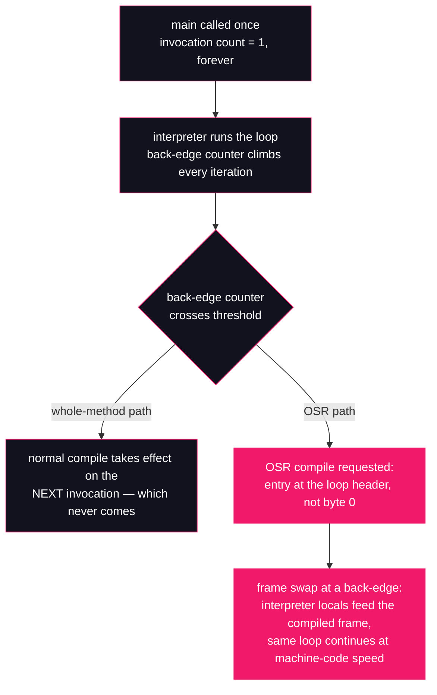

# Lesson 21: OSR & loop optimizations

## What you'll learn

- On-stack replacement: how HotSpot swaps compiled code into a frame that is **already running**, mid-loop
- Why OSR exists: the call-count threshold from [Lesson 18](18-tiered-compilation.md) misses the hottest code shape of all — one long loop inside a method that is only ever called once
- How to read `%`-marked OSR entries in `-XX:+PrintCompilation` output, including the `@` bytecode index, and how to verify it against `javap`
- What C2 does to your hot loops once it has them: unrolling and loop-invariant hoisting, observed by their effects on a production JDK

---

## Why this matters

Think about the shape of a batch job, a data pipeline, a simulation, a one-off analysis script: `main` is called **once**, and inside it sits a single loop that runs for minutes. [Lesson 18](18-tiered-compilation.md) taught that the JIT compiles *hot methods* — methods whose invocation count crosses a threshold. But `main`'s invocation count is 1, forever. If invocation counts were the whole story, the most expensive code in this entire class of programs would run interpreted from start to finish, at a tenth of compiled speed or worse.

HotSpot's answer is on-stack replacement, and once you know it exists you start seeing it everywhere: the `%` markers scrolling past in compilation logs, the batch job that is slow for its first two seconds and then suddenly isn't, the benchmark loop someone wrote in `main` that *did* get fast despite `main` never being called twice (lesson 22 takes that thread and runs with it).

The second half of the lesson is about what happens to a loop *after* the JIT claims it. Two loops that look identical in source can run at wildly different speeds because C2 unrolls one and hoists an invariant computation out of the other — and one innocent keyword, `volatile`, can quietly switch both optimizations off. If you have ever wondered why "the same loop" got 4× slower after a seemingly unrelated change, this lesson is where that mystery ends.

---

## The concept

### The threshold gap, and the frame swap that closes it

[Lesson 18](18-tiered-compilation.md) showed the interpreter keeping per-method counters to decide what deserves compilation. What it didn't dwell on is that there are **two** counters. One counts *invocations* — how often the method was entered. The other counts *back-edges* — every jump from the bottom of a loop back to its top. The back-edge counter exists precisely for the `main`-with-a-giant-loop shape: a method can be ice-cold by invocation count while one of its loops is the hottest code in the process.

When a back-edge counter crosses its threshold, HotSpot requests an **on-stack replacement** compilation: compile this method, but arrange the compiled code to be entered *at the loop*, not at the method's first bytecode. When the compile finishes, the interpreter — currently parked somewhere inside that loop, in a live frame on the thread's stack — hands over: the frame's local variables become the inputs to the OSR-compiled code, and execution resumes at the loop header, now in machine code. The method invocation never restarted. The loop never restarted. The code underneath a *running* frame was replaced while the frame sat on the stack — hence the name.



A few consequences fall out of the mechanism:

- **OSR compiles tier up like normal ones.** The first OSR compile is usually level 3 (C1 with full profiling), replaced by level 4 (C2) once C2 finishes — the same tiers [Lesson 18](18-tiered-compilation.md) introduced, just entered through the loop instead of the method prologue.
- **OSR compilations can be invalidated too.** When a higher tier arrives, the lower-tier OSR code is made not entrant — and an OSR compile can deoptimize mid-loop just like any compiled code ([Lesson 20](20-inlining-and-deoptimization.md) owns that machinery). The frame swap works in both directions.
- **OSR is per-loop, not per-method.** A method with three loops can collect three separate OSR compiles at three different bytecode offsets as each loop gets hot.

### What C2 does with a loop once it has one

OSR is how C2 *gets* your loop. What it does next is a pipeline of loop-specific transformations, two of which this lesson makes visible:

- **Loop unrolling.** C2 duplicates the loop body — by default up to 16 copies on this JDK — so each pass through the generated code does several iterations' worth of work. That amortizes the back-edge test and branch, lets range checks be eliminated or shared across the copies, exposes independent instructions the CPU can overlap, and produces the wide straight-line body that C2's auto-vectorizer (SuperWord) then chews into SIMD instructions. Your class file is untouched — `javap` will always show exactly one copy of the body. Unrolling exists only in the generated machine code.
- **Loop-invariant code motion (hoisting).** If C2 can *prove* an expression inside the loop produces the same value on every iteration — its inputs never change in the loop and it has no side effects — it computes the value once, before the loop, and reuses it. The source-level equivalent is you lifting the expression out by hand; the point of this lesson's demo is that **you don't have to**, and that a `volatile` read is precisely the kind of input C2 cannot prove invariant.

On a production JDK you cannot watch these transformations directly — the flags that dump C2's loop work are develop-only, the same flag-tier wall [Lesson 15](../part-3-memory/15-escape-analysis.md) hit with `PrintEscapeAnalysis`. So, exactly as in that lesson, we observe by effect: controlled A/B runs where one flag or one keyword changes, and the timing moves.

---

## Hands-on

All commands run from the usual samples directory:

```bash
cd ~/jvm-internals-samples/lesson21
```

### 1. The OSR case: one loop, entered once

`LongLoop.java` — a method called exactly once, containing one two-billion-iteration loop:

```java
public class LongLoop {

    public static void main(String[] args) {
        long iterations = args.length > 0 ? Long.parseLong(args[0]) : 2_000_000_000L;
        long sum = 0;
        for (long i = 0; i < iterations; i++) {
            sum += i % 3;
        }
        System.out.println("sum=" + sum);
    }
}
```

Two billion iterations, an explicit fixed bound — over in seconds. By invocation count, `main` will never be hot: it is called once. Compile it and run with `-XX:+PrintCompilation`, the compilation-logging flag [Lesson 18](18-tiered-compilation.md) explained line by line, filtering to our class:

```bash
javac LongLoop.java
java -XX:+PrintCompilation LongLoop 2>&1 | grep -E "LongLoop|sum="
```

```
69    8 %     3       LongLoop::main @ 23 (61 bytes)
71    9       3       LongLoop::main (61 bytes)
72   10 %     4       LongLoop::main @ 23 (61 bytes)
75    8 %     3       LongLoop::main @ 23 (61 bytes)   made not entrant: OSR invalidation of lower levels
6546   10 %     4       LongLoop::main @ 23 (61 bytes)   made not entrant: uncommon trap
sum=1999999999
```

*(Timestamps, compile IDs, ordering and the invalidation lines vary per run — sometimes the last `made not entrant` line doesn't appear at all. The `%` lines and the `@ 23` are the constants.)* [Lesson 18](18-tiered-compilation.md) owns the general column layout and marker table; here is what these specific lines say:

- **Line 1 — `8 % 3 LongLoop::main @ 23`.** The `%` is the marker this lesson exists for: **this is an OSR compilation**. `main`'s back-edge counter crossed its threshold about 69 ms in, and C1 produced a level-3 OSR compile with its entry point at bytecode index 23 — not at byte 0. The running interpreted loop swapped into this code mid-iteration.
- **Line 2 — `9 3 LongLoop::main`, no `%`, no `@`.** A *normal* whole-method compile of `main`, queued off the same hotness. Normal compiles take effect on the **next** invocation — and `main` has no next invocation, so this code never executes a single iteration of our loop. Keep it in mind as the contrast case: with OSR disabled, this is the best the JVM could do, and it would be worthless here.
- **Line 3 — `10 % 4 ... @ 23`.** The C2 (level 4) OSR compile arrives, again entered at bytecode 23. The loop, still running, swaps upward a second time.
- **Line 4 — `made not entrant: OSR invalidation of lower levels`.** With the level-4 OSR code installed, the level-3 OSR code from line 1 is retired — the tier ladder from [Lesson 18](18-tiered-compilation.md), climbed via frame swaps instead of fresh calls.
- **Line 5 — `made not entrant: uncommon trap`, six seconds in.** The C2 OSR code itself was invalidated when the running loop hit a path C2 had compiled as unreachable — [Lesson 20](20-inlining-and-deoptimization.md)'s deoptimization machinery, arriving through an OSR frame. With the loop nearly finished, the interpreter simply walked it out; `sum=` still printed.

The `@ 23` is a promise you can check. `javap -c` ([Lesson 02](../part-1-bytecode/02-anatomy-of-a-class-file.md)'s tool) disassembles `main`:

```bash
javap -c LongLoop
```

```
  public static void main(java.lang.String[]);
    Code:
         0: aload_0
         1: arraylength
         2: ifle          14
         5: aload_0
         6: iconst_0
         7: aaload
         8: invokestatic  #7                  // Method java/lang/Long.parseLong:(Ljava/lang/String;)J
        11: goto          17
        14: ldc2_w        #13                 // long 2000000000l
        17: lstore_1
        18: lconst_0
        19: lstore_3
        20: lconst_0
        21: lstore        5
        23: lload         5
        25: lload_1
        26: lcmp
        27: ifge          48
        30: lload_3
        31: lload         5
        33: ldc2_w        #15                 // long 3l
        36: lrem
        37: ladd
        38: lstore_3
        39: lload         5
        41: lconst_1
        42: ladd
        43: lstore        5
        45: goto          23
        48: getstatic     #17                 // Field java/lang/System.out:Ljava/io/PrintStream;
        ...
```

Bytecode index 23 is `lload 5` — the first instruction of the loop-condition check, i.e. **the loop header**, the target of the `goto 23` back-edge at index 45. The `@` number in an OSR log line is not a line number or an offset into machine code; it is the bytecode index where the compiled code expects to be entered, and you can always correlate it with `javap` exactly like this.

### 2. The other markers, live

[Lesson 18](18-tiered-compilation.md)'s marker table lists `%`, `s`, `b`, `n`, `!`. Two of them are easy to force into the open, and forcing them doubles as a second lesson about *when* compilation happens. `LongLoopEH.java` is the same loop with a `try`/`catch` around the body — a method with an exception handler:

```java
public class LongLoopEH {

    public static void main(String[] args) {
        long sum = 0;
        for (long i = 0; i < 2_000_000_000L; i++) {
            try {
                sum += i % 3;
            } catch (RuntimeException e) {
                sum = -1;
            }
        }
        System.out.println("sum=" + sum);
    }
}
```

Run it with `-XX:-BackgroundCompilation` — first use in this course, so full explanation. By default (`BackgroundCompilation` is on) HotSpot queues compilation requests and executes them on dedicated compiler threads while your application keeps running interpreted or OSR code; the log lines you saw in section 1 appeared *after the fact*. `-XX:-BackgroundCompilation` makes compilation **synchronous**: the thread that triggered the request blocks until the compile finishes. That is terrible for startup and throughput, but it makes logs deterministic, and it stamps every queued compile with the `b` (blocking) marker:

```bash
javac LongLoopEH.java
java -XX:-BackgroundCompilation -XX:+PrintCompilation LongLoopEH 2>&1 | grep -E "LongLoopEH|sum="
```

```
61    8 % !b  3       LongLoopEH::main @ 4 (49 bytes)
63    9   !b  3       LongLoopEH::main (49 bytes)
65   10 % !b  4       LongLoopEH::main @ 4 (49 bytes)
68    8 % !   3       LongLoopEH::main @ 4 (49 bytes)   made not entrant: OSR invalidation of lower levels
4352   10 % !   4       LongLoopEH::main @ 4 (49 bytes)   made not entrant: uncommon trap
sum=1999999999
```

*(Timestamps, compile IDs and the invalidation lines vary.)* Three markers decoded from this one capture: `%` OSR (entry at `@ 4`, this method's loop header); `!` the method has exception handlers — the `try`/`catch`, there in every compilation of `main` and in none of the section 1 lines; `b` the compile ran blocking — on every *compile* line, and gone from the last two lines because invalidations are events, not compilations. The same run's unfiltered log also shows `n 0` lines for JDK-native methods like `jdk.internal.misc.Unsafe::getReferenceVolatile` — marker `n`, tier 0, no bytecode size, because there is no bytecode to compile; the JVM is just wrapping a native entry point.

### 3. The control: what OSR is worth

Now the A/B. `-XX:-UseOnStackReplacement` — first use in this course, full explanation — disables on-stack replacement entirely (it is on by default; like the other `-XX:` switches in this course it is a HotSpot knob, not anything the JVM specification promises, and it exists essentially for experiments and support work). With OSR off, the *only* way a loop gets compiled code is the whole-method path — which, as section 1 established, only helps the **next** invocation:

```bash
java -XX:-UseOnStackReplacement -XX:+PrintCompilation LongLoop 100000000 2>&1 | grep -E "LongLoop|sum="
```

```
sum=99999999
```

*(Timing varies; the emptiness does not.)* A hundred million iterations, and **not one compilation line for `LongLoop::main`** — no `%`, and this time not even the normal level-3 compile from section 1, which the OSR machinery had queued as a side effect. The entire loop ran interpreted. Compare that silence with the five `LongLoop` lines the identical program produced with the flag at its default.

The log tells you *that* it matters; the clock tells you how much. Same program, same two-hundred-million-iteration bound, one flag different *(absolute times vary with your machine — the ratio is the signal)*:

```bash
time java -XX:-UseOnStackReplacement LongLoop 200000000
```

```
sum=199999999

real	0m10.241s
user	0m10.224s
sys	0m0.048s
```

```bash
time java LongLoop 200000000
```

```
sum=199999999

real	0m0.472s
user	0m0.461s
sys	0m0.042s
```

Same bytecode, same result, **~20× the wall time**. Ten seconds of that first run is what "the hottest code in the program runs interpreted" costs. This is the answer to keep in your pocket for the interview question and the production incident alike: *what is OSR for?* It is for making sure a long loop in a cold method is not an interpreter life sentence.

### 4. Loop-invariant hoisting: the work you never wrote

`HoistBench.java` times three versions of the same loop over a million doubles. `inLoop` computes `Math.sqrt(factor)` inside the loop, where `factor` is a parameter the loop never modifies — a loop invariant. `handHoisted` is the same loop with the `sqrt` lifted out by hand. `viaVolatile` reads its factor from a `volatile` field instead:

```java
import java.util.function.Supplier;

public class HoistBench {

    static volatile double volatileFactor = 2.0;

    static double inLoop(double[] a, double factor) {
        double s = 0;
        for (int i = 0; i < a.length; i++) {
            s += a[i] * Math.sqrt(factor);   // sqrt of a loop-invariant value
        }
        return s;
    }

    static double handHoisted(double[] a, double factor) {
        double root = Math.sqrt(factor);     // hoisted by hand
        double s = 0;
        for (int i = 0; i < a.length; i++) {
            s += a[i] * root;
        }
        return s;
    }

    static double viaVolatile(double[] a) {
        double s = 0;
        for (int i = 0; i < a.length; i++) {
            s += a[i] * Math.sqrt(volatileFactor);  // volatile read: cannot be hoisted
        }
        return s;
    }

    static void time(String name, Supplier<Double> work) {
        for (int w = 0; w < 30; w++) work.get();     // warmup: push the method through C2
        long start = System.nanoTime();
        double result = 0;
        for (int r = 0; r < 200; r++) result += work.get();
        long ms = (System.nanoTime() - start) / 1_000_000;
        System.out.println(name + " result=" + result + " elapsed=" + ms + "ms");
    }

    public static void main(String[] args) {
        double[] a = new double[1_000_000];
        for (int i = 0; i < a.length; i++) a[i] = i * 0.5;
        time("inLoop     ", () -> inLoop(a, 2.0));
        time("handHoisted", () -> handHoisted(a, 2.0));
        time("viaVolatile", () -> viaVolatile(a));
    }
}
```

Everything is bounded: 30 warmup calls to push each method through C2, then 200 timed calls, and every result is accumulated and printed so no loop is dead code. Run it:

```bash
javac HoistBench.java
java HoistBench
```

```
inLoop      result=7.071060740797658E13 elapsed=315ms
handHoisted result=7.071060740797658E13 elapsed=328ms
viaVolatile result=7.071060740797658E13 elapsed=2016ms
```

*(Absolute times vary run to run and machine to machine — re-run it a few times. What is stable is the relationship: `inLoop` and `handHoisted` land in the same band, and `viaVolatile` is several times slower.)*

Read the three rows as one argument. `inLoop` contains a `sqrt` per iteration in the *source*; `handHoisted` provably executes one `sqrt` per call. They tie — so C2's compiled code for `inLoop` also executes one `sqrt` per call. It proved `factor` invariant (a parameter, never written in the loop) and `Math.sqrt` pure (it is a HotSpot intrinsic with no side effects), then hoisted the computation out of the loop for you. **Hand-hoisting buys nothing** — the JIT already did it.

`viaVolatile` is the same computation fed by a `volatile` field, and it costs ~6× as much. A `volatile` read is not allowed to assume the world stands still: the memory semantics ([the concurrency course's `volatile` lesson](https://github.com/Dancan254/concurreny-multithreading/blob/master/lessons/part-2-shared-state/07-visibility-and-volatile.md) has the full model) require each read to observe the latest write, so the value is *not provably invariant*, so the `sqrt` — and the volatile load itself — stay inside the loop, two hundred million times. One keyword, and an entire optimization family quietly switches off. This is why "I made the field `volatile` to be safe" is not a free decision in hot code.

### 5. Loop unrolling: same bytecode, less loop

`UnrollBench.java` — the simplest possible hot loop, summing four million ints, 500 timed passes after warmup:

```java
public class UnrollBench {

    static long sum(int[] a) {
        long s = 0;
        for (int i = 0; i < a.length; i++) {
            s += a[i];
        }
        return s;
    }

    public static void main(String[] args) {
        int[] a = new int[4_000_000];
        for (int i = 0; i < a.length; i++) a[i] = i % 7;

        for (int w = 0; w < 30; w++) sum(a);

        long start = System.nanoTime();
        long result = 0;
        for (int r = 0; r < 500; r++) result += sum(a);
        long ms = (System.nanoTime() - start) / 1_000_000;
        System.out.println("result=" + result + " elapsed=" + ms + "ms");
    }
}
```

The control knob is `-XX:LoopMaxUnroll=1` — first use in this course, full explanation. `LoopMaxUnroll` caps how many copies of a loop body C2 may generate when it unrolls; on this JDK the default is 16 (check yours with [Lesson 12](../part-3-memory/12-runtime-data-areas.md)'s `java -XX:+PrintFlagsFinal -version | grep LoopMaxUnroll`). Setting it to 1 caps the unroll factor at one copy — i.e. switches unrolling off — while leaving every other optimization in place:

```bash
javac UnrollBench.java
java UnrollBench
```

```
result=5999997000 elapsed=1068ms
```

```bash
java -XX:LoopMaxUnroll=1 UnrollBench
```

```
result=5999997000 elapsed=2158ms
```

*(Absolute times vary; the gap is stable across runs.)* Identical bytecode in both runs — unrolling never touches the class file — and identical results, because like every optimization in Part 4 it must preserve observable behaviour. The default run is ~2× faster. Where the speed comes from: fewer back-edge tests and branches per element, range checks shared across unrolled copies, independent loads the CPU can overlap — and, honestly, more than that. A wide unrolled body is the raw material C2's SuperWord auto-vectorizer turns into SIMD instructions, so capping unrolling also takes vectorization down with it. The 2× you just measured is the *loop-optimization pipeline*, not unrolling in isolation (the Try-it-yourself section has you split the credit with `-XX:-UseSuperWord`).

Two flag-honesty notes, both verified on this JDK just now. First, the flag older material tells you to reach for is gone:

```bash
java -XX:-LoopUnrolling UnrollBench
```

```
Unrecognized VM option 'LoopUnrolling'
Did you mean 'LoopUnrollMin=<value>'?
Error: Could not create the Java Virtual Machine.
Error: A fatal exception has occurred. Program will exit.
```

`-XX:-LoopUnrolling` existed in older HotSpot versions and litters blog posts and slide decks to this day; on JDK 25 the VM refuses to start. JIT flags are undocumented implementation details with no compatibility promise — [Lesson 01](../part-0-the-machine/01-jvm-jre-jdk-big-picture.md)'s warning about the `-XX:` family — so the discipline is: **run the flag before you trust the blog**. Second, if you go looking for a flag that *prints* C2's unrolling and hoisting decisions, you hit the same wall [Lesson 15](../part-3-memory/15-escape-analysis.md) hit: even with [Lesson 15](../part-3-memory/15-escape-analysis.md)'s `-XX:+UnlockDiagnosticVMOptions`, the tracing flags are develop-only and absent from every production build:

```bash
java -XX:+UnlockDiagnosticVMOptions -XX:+TraceLoopOpts UnrollBench
```

```
Error: VM option 'TraceLoopOpts' is develop and is available only in debug version of VM.
Improperly specified VM option 'TraceLoopOpts'
Error: Could not create the Java Virtual Machine.
Error: A fatal exception has occurred. Program will exit.
```

Which is why this lesson, like lesson 15, teaches you to read these optimizations by their effects: it is the mode of observation you will actually have in production.

---

## Try it yourself

1. Shrink `LongLoop`'s bound to `50000000` and re-run section 1 a few times. Does the `%` line still appear before the loop finishes? What does the answer tell you about the race between the back-edge threshold and the total trip count — and about how long a loop must run for OSR to matter at all?
2. Restructure `LongLoop` so the loop body lives in `static long work(long n)` called **once** from `main`, and confirm the `%` marker moves to `LongLoop::work`. Then change the shape: give `work` a tiny loop and call it two million times from `main`'s loop. The `%` lines vanish and ordinary compile lines appear. Which counter fired in each shape, and why does the second shape not need OSR?
3. Split the credit in section 5: run `java -XX:-UseSuperWord UnrollBench` (first use — it disables C2's SuperWord auto-vectorizer, leaving unrolling on). Where does the time land relative to the default run and the `LoopMaxUnroll=1` run? What does that tell you about how much of the 2× was unrolling and how much was vectorization riding on it?
4. In `HoistBench`, change `volatileFactor` to a plain non-`volatile` static field and re-run. Predict `viaVolatile`'s time before you run it. What does the result tell you about which reads C2 treats as provably invariant?
5. Find this JDK's default unroll cap with [Lesson 12](../part-3-memory/12-runtime-data-areas.md)'s `java -XX:+PrintFlagsFinal -version | grep LoopMaxUnroll`, then run `java -XX:LoopMaxUnroll=4 UnrollBench`. Where does it land between the two section-5 numbers, and what does the scaling suggest about when unrolling stops paying?

---

## Common mistakes

- **"The JIT compiles hot *methods*."** Half the story. Hot *loops* are compilation targets in their own right, via the back-edge counter and OSR — otherwise every batch job, simulation and `main`-driven benchmark would run interpreted forever. When you reason about whether code will be compiled, ask about both counters.
- **"`%` lines in the compilation log mean something went wrong."** They mean something went right: a long loop in a cold method was rescued mid-flight. A `%` entry is the log working as designed, not an anomaly to hunt down.
- **"The `@` number is a source line number."** It is a bytecode index — the OSR entry point, almost always a loop header. Verify with `javap -c` exactly as section 1 did: the `@ 23` there was `lload 5`, the target of the loop's `goto`.
- **Copy-pasting JIT flags from old material.** `-XX:-LoopUnrolling` is all over the web and does not exist on JDK 25 — the VM refuses to start (section 5's real error). JIT flags are HotSpot internals with no compatibility contract; run every flag on *your* JDK before it goes into a script, a runbook or a lesson.
- **"A `volatile` read in a hot loop is just a slightly slower read."** The `viaVolatile` row paid ~6×, not because one load is expensive, but because an unprovably-invariant input keeps the `sqrt` — and every optimization that depends on invariance — inside the loop. The cost of `volatile` in hot code is the optimizations it forbids, not the instruction itself.
- **"`javac` unrolls loops / hoists invariants."** `javac` emits the loop exactly as written — one body copy, the invariant expression inside it; sections 1 and 5's `javap` output shows it plainly. Unrolling and hoisting happen exclusively in C2's generated machine code, after OSR or a normal compile hands the loop over. Which is also why a loop that never gets hot never gets either.

---

## Check your understanding

**1. `LongLoop::main` is called exactly once, so its invocation counter can never reach the compilation threshold. Yet section 1's loop ran compiled within the first hundred milliseconds. Explain the mechanism, naming the counter and the log marker involved.**

<details>
<summary>Reveal answer</summary>

The interpreter maintains a *back-edge counter* per method in addition to the invocation counter, incremented on every jump from the bottom of a loop back to its top. When that counter crosses its threshold, HotSpot requests an on-stack replacement compilation: the method is compiled with its entry point at the loop header rather than at bytecode 0, and the currently-running interpreted frame is swapped into the compiled code at a back-edge, mid-loop. In the log these entries carry the `%` marker and an `@` bytecode index — section 1's `% 3 LongLoop::main @ 23` — distinguishing them from normal whole-method compiles, which would only take effect on a next invocation that never comes.

</details>

**2. Section 1's log shows `@ 23` on the OSR lines. What exactly is 23, and how did the lesson prove it?**

<details>
<summary>Reveal answer</summary>

It is the bytecode index of the OSR entry point — where inside `main`'s bytecode the compiled code expects execution to resume. `javap -c LongLoop` shows index 23 is `lload 5`, the first instruction of the loop-condition check: the loop header, and the target of the `goto 23` back-edge at index 45. The `@` number is neither a source line number nor a machine-code offset; it always correlates with `javap` output this way, and for an OSR compile it is virtually always a loop header.

</details>

**3. With `-XX:-UseOnStackReplacement`, section 3 shows *zero* compilation lines for `LongLoop::main` across a hundred million iterations, and a ~20× slowdown. Explain both observations.**

<details>
<summary>Reveal answer</summary>

With OSR disabled, the only route to compiled code is the whole-method path, which fires off the invocation counter (or as a side effect of an OSR request that now never happens). `main` is invoked once, so no compilation is ever requested — hence the empty log — and even if a whole-method compile had fired, its code would only apply to the *next* invocation. The loop therefore executed entirely in the interpreter: two hundred million interpreted iterations took ~10 seconds against ~0.5 seconds for the OSR-compiled run — the measured cost of "hottest loop in the program, no way to reach compiled code."

</details>

**4. `inLoop` (with `Math.sqrt(factor)` inside the loop) and `handHoisted` (sqrt lifted out by hand) tie, while `viaVolatile` costs ~6×. What did C2 do to `inLoop`, and why can't it do the same for `viaVolatile`?**

<details>
<summary>Reveal answer</summary>

Loop-invariant code motion: C2 proved `factor` is never modified in the loop and `Math.sqrt` is a pure intrinsic, so it computed the square root once before the loop and reused the result — making its generated code equivalent to the hand-hoisted version, which is why the two tie. For `viaVolatile` the factor comes from a `volatile` field, whose memory semantics require every read to observe the latest write by any thread; the value is therefore not provably invariant across iterations, hoisting is illegal, and the volatile load plus the `sqrt` stay inside the loop for all two hundred million iterations.

</details>

**5. `-XX:LoopMaxUnroll=1` slowed `UnrollBench` by ~2×, yet `javap -c` on the class shows one single copy of the loop body regardless of the flag. Reconcile the two facts.**

<details>
<summary>Reveal answer</summary>

Unrolling is a machine-code transformation, not a bytecode one. `javac` always emits exactly one copy of the loop body, which is all `javap` can ever show. C2 unrolls when it compiles the hot loop, generating multiple body copies per pass through the generated code; `LoopMaxUnroll` caps how many copies it may produce, and `1` forbids unrolling entirely. Same class file, different generated code — and since a wide unrolled body is also what the SuperWord vectorizer consumes, the measured 2× reflects the whole unrolling-and-vectorization pipeline, not unrolling alone.

</details>

---

## Recap

- HotSpot tracks **two** hotness counters: invocations and back-edges. The back-edge counter exists so that a long loop in a rarely-called method — the shape of every batch job and `main`-driven computation — still reaches compiled code.
- **On-stack replacement** compiles the method with its entry at the loop header and swaps the *running* interpreted frame into compiled code mid-loop. In `-XX:+PrintCompilation`, OSR entries carry the `%` marker and an `@` bytecode index you can verify against `javap -c`.
- OSR compiles tier up (3 → 4), get invalidated, and deoptimize exactly like normal compiles — [Lesson 18](18-tiered-compilation.md)'s tiers and [Lesson 20](20-inlining-and-deoptimization.md)'s machinery, entered through the loop.
- Disable OSR (`-XX:-UseOnStackReplacement`) and a single-invocation method's loop runs interpreted to the end: same bytecode, same result, ~20× slower. That experiment is the entire case for OSR's existence.
- Once C2 owns a loop it rewrites it: **unrolling** (`LoopMaxUnroll`, default 16 here — bytecode untouched) and **invariant hoisting** (hand-hoisting ties the JIT; a `volatile` input defeats it at ~6× cost). On production JDKs the tracing flags are develop-only, so you read these optimizations by A/B effect — and you verify every flag on your own JDK, because removed ones like `-XX:-LoopUnrolling` kill the VM at startup.
- Everything you timed here was warmup-then-measure with accumulated results — the shape lesson 22 turns into a discipline, because the same machinery (OSR timing, hoisting, dead-code elimination) is exactly what makes naive benchmarks lie.

**Previous:** [Lesson 20 — Inlining & deoptimization](20-inlining-and-deoptimization.md) · **Next:** [Lesson 22 — Honest benchmarking with JMH](22-honest-benchmarking-jmh.md)
